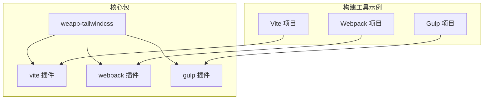
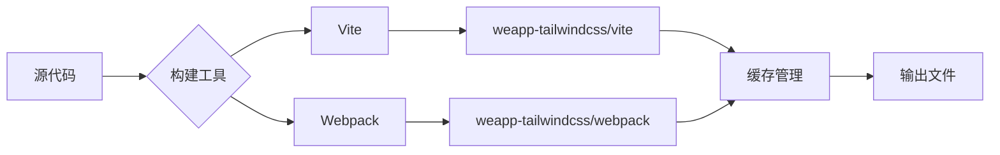
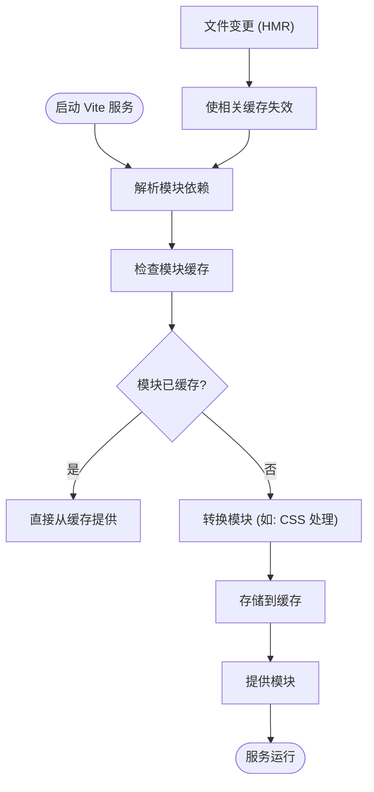
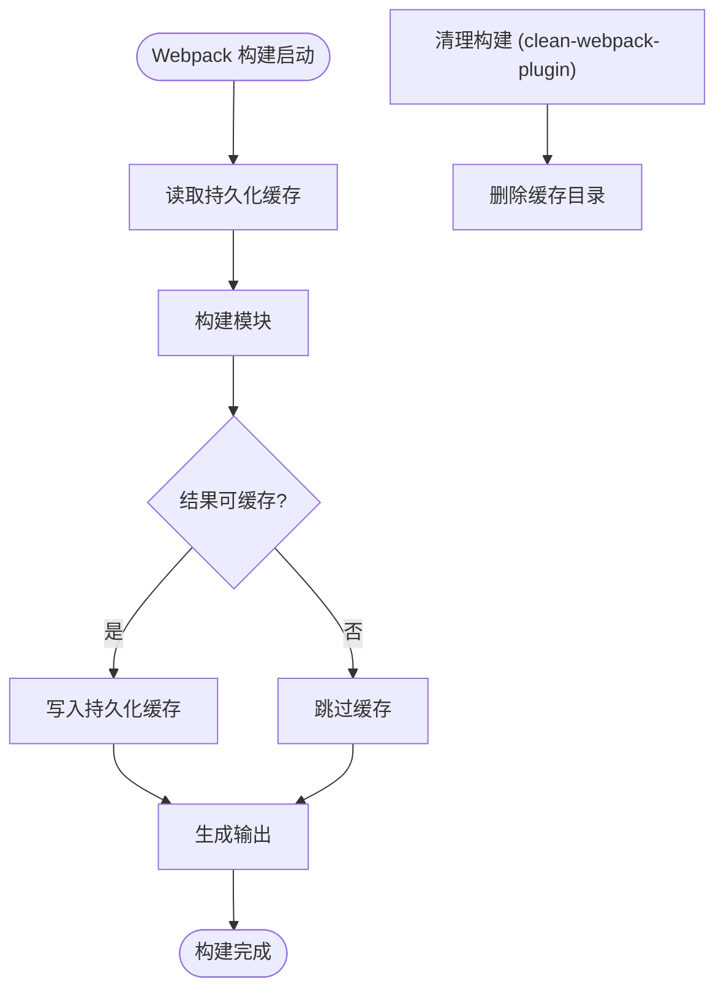

# 缓存问题

<cite>
**本文档中引用的文件**  
- [vite.config.ts](file://apps/vite-native/vite.config.ts)
- [webpack.config.js](file://demo/native-mina/webpack.config.js)
- [postcss.config.js](file://apps/vite-native/postcss.config.js)
- [package.json](file://packages/weapp-tailwindcss/package.json)
- [index.ts](file://packages/weapp-tailwindcss/src/index.ts)
</cite>

## 目录
1. [简介](#简介)
2. [项目结构](#项目结构)
3. [核心组件](#核心组件)
4. [架构概述](#架构概述)
5. [详细组件分析](#详细组件分析)
6. [依赖分析](#依赖分析)
7. [性能考虑](#性能考虑)
8. [故障排除指南](#故障排除指南)
9. [结论](#结论)

## 简介
本文档旨在为 `weapp-tailwindcss` 构建过程中的缓存相关问题提供全面的故障排除指南。涵盖增量构建异常、缓存失效、文件监听不准确等问题，详细说明缓存机制的工作原理，如何清理和重置构建缓存，以及如何配置缓存策略以优化构建性能。同时提供针对 Vite、Webpack 等不同构建工具的具体解决方案，并指导如何调试缓存命中与失效情况。

## 项目结构
`weapp-tailwindcss` 是一个支持多种小程序框架（如 Taro、Uni-app、原生小程序等）的 Tailwind CSS 集成工具，支持 Vite、Webpack、Gulp 等多种构建系统。项目采用 monorepo 结构，核心功能模块位于 `packages/weapp-tailwindcss`，而多个示例应用分布在 `apps/` 和 `demo/` 目录下，用于测试不同构建工具和配置下的行为。



**Diagram sources**
- [package.json](file://packages/weapp-tailwindcss/package.json#L42-L128)
- [index.ts](file://packages/weapp-tailwindcss/src/index.ts#L1-L5)

**Section sources**
- [package.json](file://packages/weapp-tailwindcss/package.json#L1-L215)

## 核心组件
`weapp-tailwindcss` 的核心是其为不同构建工具提供的插件，包括 Vite 插件、Webpack 插件和 Gulp 插件。这些插件负责在构建过程中处理 Tailwind CSS 的原子类生成、样式注入、rem 转 rpx 等功能。缓存机制主要由底层构建工具（Vite 或 Webpack）管理，但 `weapp-tailwindcss` 插件通过配置和钩子函数与之交互，确保样式处理的高效性。

**Section sources**
- [index.ts](file://packages/weapp-tailwindcss/src/index.ts#L1-L5)
- [vite.config.ts](file://apps/vite-native/vite.config.ts#L1-L41)

## 架构概述
`weapp-tailwindcss` 的架构围绕插件化设计，允许无缝集成到不同的构建流程中。在 Vite 环境中，它作为 Vite 插件运行，利用 Vite 的模块热重载（HMR）和依赖追踪机制。在 Webpack 环境中，它作为 Webpack 插件，通过 loader 和 plugin 钩子介入构建流程。缓存机制是这些构建工具的核心特性，用于加速重复构建。



**Diagram sources**
- [vite.config.ts](file://apps/vite-native/vite.config.ts#L1-L41)
- [webpack.config.js](file://demo/native-mina/webpack.config.js#L1-L113)

## 详细组件分析

### Vite 缓存机制分析
Vite 利用其基于 ES 模块的开发服务器和 Rollup 的构建系统，实现了高效的缓存机制。在开发模式下，Vite 会缓存已转换的模块，只有当文件内容或依赖关系发生变化时才重新处理。`weapp-tailwindcss` 的 Vite 插件通过 `uvwt` 配置项介入此流程，其 `cssEntries` 配置指定了需要处理的 CSS 入口文件。



**Diagram sources**
- [vite.config.ts](file://apps/vite-native/vite.config.ts#L19-L26)
- [postcss.config.js](file://apps/vite-native/postcss.config.js#L1-L12)

**Section sources**
- [vite.config.ts](file://apps/vite-native/vite.config.ts#L1-L41)
- [postcss.config.js](file://apps/vite-native/postcss.config.js#L1-L12)

### Webpack 缓存机制分析
Webpack 5 引入了持久化缓存（Persistent Caching），可以将模块和 chunk 的构建结果存储到磁盘，显著提升后续构建速度。`weapp-tailwindcss` 的 Webpack 插件通过 `UnifiedWebpackPluginV5` 集成到 Webpack 流程中。插件的 `onStart` 和 `onEnd` 钩子可用于性能分析，但不影响 Webpack 自身的缓存逻辑。



**Diagram sources**
- [webpack.config.js](file://demo/native-mina/webpack.config.js#L57-L63)
- [webpack.config.js](file://demo/native-mina/webpack.config.js#L84-L97)

**Section sources**
- [webpack.config.js](file://demo/native-mina/webpack.config.js#L1-L113)

## 依赖分析
`weapp-tailwindcss` 的核心依赖包括 `@tailwindcss/postcss` 用于 PostCSS 处理，`lru-cache` 用于内存中的 LRU 缓存管理，以及针对不同构建工具的适配器（如 `weapp-vite`）。这些依赖共同构成了其缓存和构建能力的基础。

```mermaid
graph TD
A[weapp-tailwindcss] --> B[@tailwindcss/postcss]
A --> C[lru-cache]
A --> D[weapp-vite]
A --> E[weapp-tailwindcss/webpack]
D --> F[Vite]
E --> G[Webpack]
B --> H[Tailwind CSS]
C --> I[内存缓存]
```

**Diagram sources**
- [package.json](file://packages/weapp-tailwindcss/package.json#L189-L212)

**Section sources**
- [package.json](file://packages/weapp-tailwindcss/package.json#L189-L212)

## 性能考虑
为了优化构建性能，应充分利用构建工具的缓存机制。对于 Vite，确保 `node_modules` 和构建输出目录被正确排除在不必要的监听之外。对于 Webpack，启用持久化缓存并合理配置 `splitChunks`。避免在插件配置中进行耗时的同步操作，以免阻塞构建流程。

## 故障排除指南

### 增量构建异常
当修改代码后，增量构建未能正确反映变更时，可能是缓存未正确失效。首先检查文件监听是否正常，确认编辑器保存文件时触发了文件系统事件。对于 Vite，尝试重启开发服务器。对于 Webpack，检查 `watchOptions` 配置。

**Section sources**
- [vite.config.ts](file://apps/vite-native/vite.config.ts#L6-L41)
- [webpack.config.js](file://demo/native-mina/webpack.config.js#L110-L112)

### 缓存失效问题
如果怀疑缓存已损坏，最直接的方法是清理缓存。对于 Vite，删除 `node_modules/.vite` 目录。对于 Webpack，`clean-webpack-plugin` 会在每次构建前清理输出目录，但持久化缓存（通常在 `node_modules/.cache/webpack`）需要手动删除或通过配置清理。

**Section sources**
- [webpack.config.js](file://demo/native-mina/webpack.config.js#L57-L63)

### 文件监听不准确
在某些环境下（如 Docker 容器或网络文件系统），文件监听可能不可靠。可以尝试调整 Vite 或 Webpack 的 `watchOptions`，增加 `polling` 机制。例如，在 Vite 中可配置 `server.watch.usePolling = true`。

### 调试缓存命中与失效
- **Vite**: 启动时会显示缓存状态，可通过 `--debug` 模式获取更详细信息。
- **Webpack**: 启用 `cache: { type: 'filesystem' }` 并使用 `stats` 选项查看模块构建时间，长时间构建的模块可能未命中缓存。
- **通用方法**: 使用构建性能分析工具（如 `bench.cjs`）对比清理缓存前后的构建时间。

**Section sources**
- [webpack.config.js](file://demo/native-mina/webpack.config.js#L9-L11)
- [webpack.config.js](file://demo/native-mina/webpack.config.js#L86-L92)

## 结论
`weapp-tailwindcss` 本身不直接管理复杂的构建缓存，而是依赖于 Vite、Webpack 等底层构建工具的缓存机制。解决缓存问题的关键在于理解这些构建工具的工作原理，并正确配置 `weapp-tailwindcss` 插件。当遇到问题时，应优先考虑清理构建工具的缓存目录，并检查文件监听配置。通过合理利用缓存，可以显著提升 `weapp-tailwindcss` 项目的开发和构建效率。