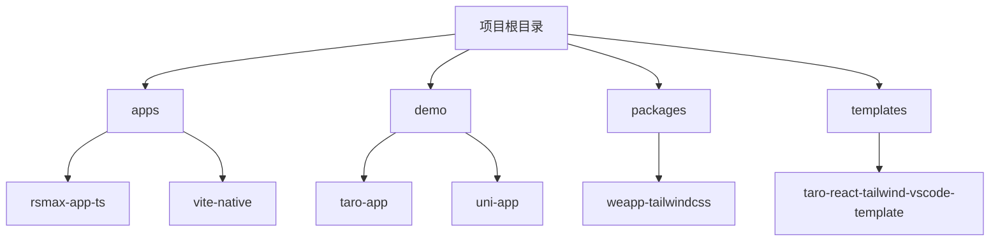
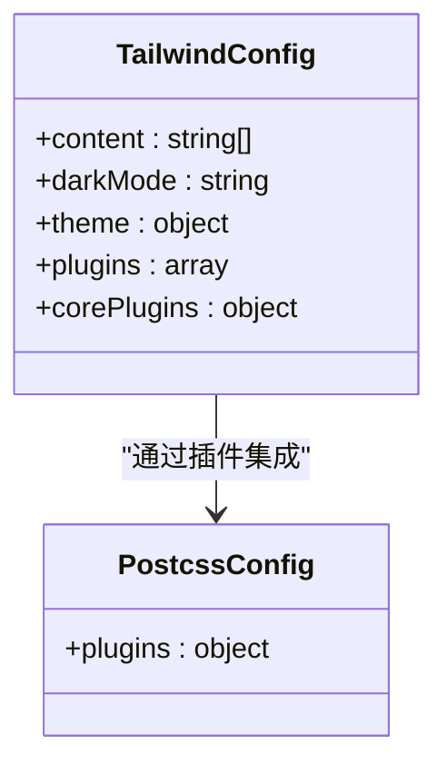
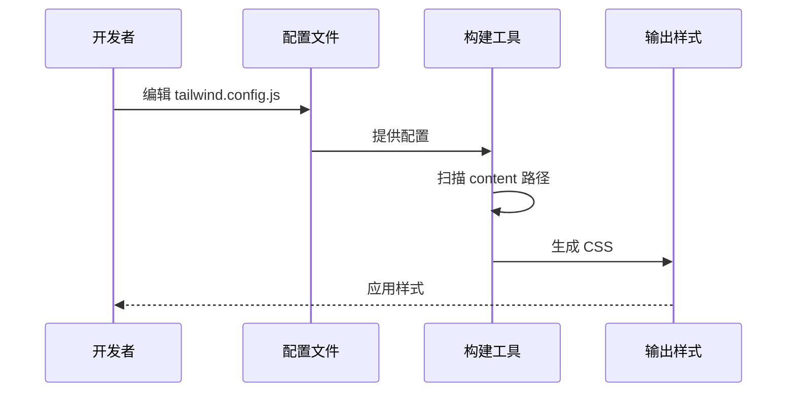
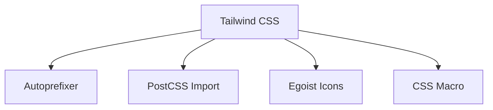

# 配置错误

<cite>
**本文档中引用的文件**  
- [tailwind.config.js](file://demo/taro-app/tailwind.config.js)
- [postcss.config.js](file://demo/taro-app/postcss.config.js)
- [tailwind.config.js](file://demo/uni-app/tailwind.config.js)
- [postcss.config.js](file://demo/uni-app/postcss.config.js)
- [tailwind.config.js](file://apps/vite-native/tailwind.config.js)
- [postcss.config.js](file://apps/vite-native/postcss.config.js)
- [tailwind.config.js](file://apps/rsmax-app-ts/tailwind.config.js)
- [postcss.config.js](file://apps/rsmax-app-ts/postcss.config.js)
- [tailwind.config.js](file://demo/native-mina/tailwind.config.js)
- [postcss.config.js](file://demo/native-mina/postcss.config.js)
</cite>

## 目录
1. [简介](#简介)
2. [项目结构](#项目结构)
3. [核心组件](#核心组件)
4. [架构概述](#架构概述)
5. [详细组件分析](#详细组件分析)
6. [依赖分析](#依赖分析)
7. [性能考虑](#性能考虑)
8. [故障排除指南](#故障排除指南)
9. [结论](#结论)

## 简介
本文档旨在为 `weapp-tailwindcss` 项目提供详细的配置错误故障排除指南。重点涵盖 `tailwind.config.js` 和 `postcss.config.js` 文件中常见的配置问题，包括格式错误、选项配置不当、插件加载失败等。同时，详细说明如何验证配置文件的正确性，处理 JIT 模式下的配置限制，以及调试配置解析过程。通过提供正确示例与常见错误模式的对比，帮助开发者快速识别并解决配置问题。

## 项目结构
本项目包含多个应用示例和演示项目，每个项目都配置了 Tailwind CSS 以适应不同的构建工具和框架。主要结构包括 `apps` 目录下的各种应用模板，如 `rsmax-app-ts`、`vite-native` 等，以及 `demo` 目录下的具体实现案例，如 `taro-app`、`uni-app` 等。这些示例展示了如何在不同环境下正确配置 Tailwind CSS。

**图示来源**
- [apps/rsmax-app-ts](file://apps/rsmax-app-ts)
- [demo/taro-app](file://demo/taro-app)
- [packages/weapp-tailwindcss](file://packages/weapp-tailwindcss)

**章节来源**
- [apps](file://apps)
- [demo](file://demo)

## 核心组件
核心组件主要包括 `tailwind.config.js` 和 `postcss.config.js` 文件，它们分别用于配置 Tailwind CSS 的设计系统和 PostCSS 的处理流程。这些文件的正确配置对于确保样式能够正确生成至关重要。

**章节来源**
- [tailwind.config.js](file://demo/taro-app/tailwind.config.js)
- [postcss.config.js](file://demo/taro-app/postcss.config.js)

## 架构概述
整个项目的架构围绕着多个独立的应用和演示项目展开，每个项目都有自己的配置文件来适配特定的开发环境。通过这种方式，项目能够支持多种前端框架和技术栈，同时保持一致的样式规范。

**图示来源**
- [tailwind.config.js](file://demo/taro-app/tailwind.config.js)
- [postcss.config.js](file://demo/taro-app/postcss.config.js)

## 详细组件分析
### Taro 应用配置分析
Taro 应用的配置文件展示了如何在多端开发环境中使用 Tailwind CSS。`tailwind.config.js` 中的 `content` 字段指定了需要扫描的文件路径，确保所有相关的类名都能被正确识别。`postcss.config.js` 则定义了 PostCSS 插件的使用方式，包括 Tailwind CSS 和 Autoprefixer。

#### 对象导向组件

**图示来源**
- [tailwind.config.js](file://demo/taro-app/tailwind.config.js)
- [postcss.config.js](file://demo/taro-app/postcss.config.js)

#### API/服务组件

**图示来源**
- [tailwind.config.js](file://demo/taro-app/tailwind.config.js)
- [postcss.config.js](file://demo/taro-app/postcss.config.js)

**章节来源**
- [tailwind.config.js](file://demo/taro-app/tailwind.config.js)
- [postcss.config.js](file://demo/taro-app/postcss.config.js)

### Uni-app 配置分析
Uni-app 的配置文件展示了如何在跨平台开发中使用 Tailwind CSS。`tailwind.config.js` 中引入了 `@egoist/tailwindcss-icons` 插件以支持图标集合，并通过 `cssMacro` 插件实现条件编译。`postcss.config.js` 中则集成了 `postcss-import` 和 `weapp-tailwindcss/css-macro/postcss` 插件，以支持更复杂的样式处理需求。

**章节来源**
- [tailwind.config.js](file://demo/uni-app/tailwind.config.js)
- [postcss.config.js](file://demo/uni-app/postcss.config.js)

## 依赖分析
项目依赖主要通过 `package.json` 文件管理，其中包含了 Tailwind CSS 及其相关插件的版本信息。此外，`postcss.config.js` 文件中的插件列表也反映了项目对 PostCSS 生态系统的依赖。

**图示来源**
- [postcss.config.js](file://demo/uni-app/postcss.config.js)
- [package.json](file://demo/uni-app/package.json)

**章节来源**
- [postcss.config.js](file://demo/uni-app/postcss.config.js)
- [package.json](file://demo/uni-app/package.json)

## 性能考虑
在配置 Tailwind CSS 时，应尽量减少不必要的插件和复杂的配置，以提高构建速度。例如，禁用 `preflight` 和 `container` 核心插件可以显著减少生成的 CSS 文件大小，特别是在小程序等资源受限的环境中。

## 故障排除指南
### 常见配置错误
1. **格式错误**：确保 `tailwind.config.js` 和 `postcss.config.js` 文件遵循正确的 JavaScript 语法。
2. **选项配置不当**：检查 `content` 字段是否正确指向了所有需要扫描的文件。
3. **插件加载失败**：确认所有使用的插件都已正确安装并且在 `package.json` 中有相应的依赖声明。

### 验证配置文件
使用 `npx tailwindcss init` 命令初始化一个新的配置文件，然后逐步添加自定义设置，可以帮助识别配置中的问题。

### 处理 JIT 模式限制
JIT 模式下，某些动态生成的类名可能无法被正确识别。确保 `content` 字段包含了所有可能包含类名的文件路径。

### 调试配置解析
启用详细的日志输出，查看构建过程中 Tailwind CSS 的解析情况，有助于定位配置问题。

**章节来源**
- [tailwind.config.js](file://demo/taro-app/tailwind.config.js)
- [postcss.config.js](file://demo/taro-app/postcss.config.js)
- [tailwind.config.js](file://demo/uni-app/tailwind.config.js)
- [postcss.config.js](file://demo/uni-app/postcss.config.js)

## 结论
通过遵循上述指南，开发者可以有效地避免和解决 `weapp-tailwindcss` 项目中的常见配置问题。正确配置 `tailwind.config.js` 和 `postcss.config.js` 文件是确保样式正确生成的关键。希望本文档能帮助您更好地理解和使用 Tailwind CSS 在多端开发中的应用。