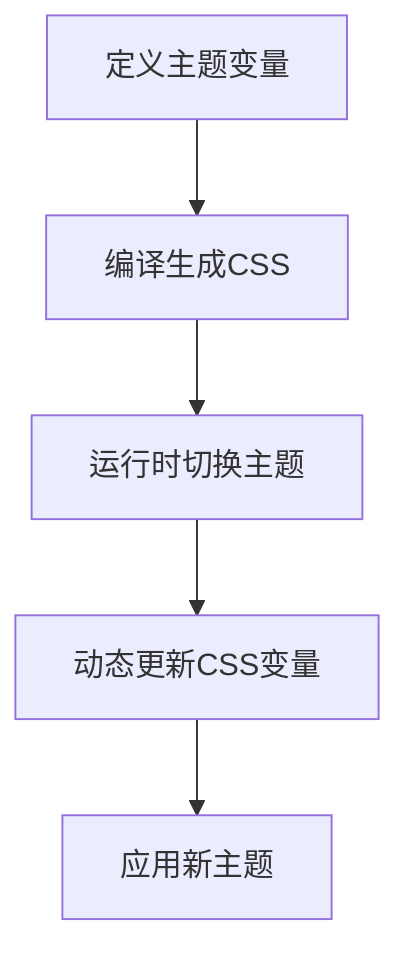
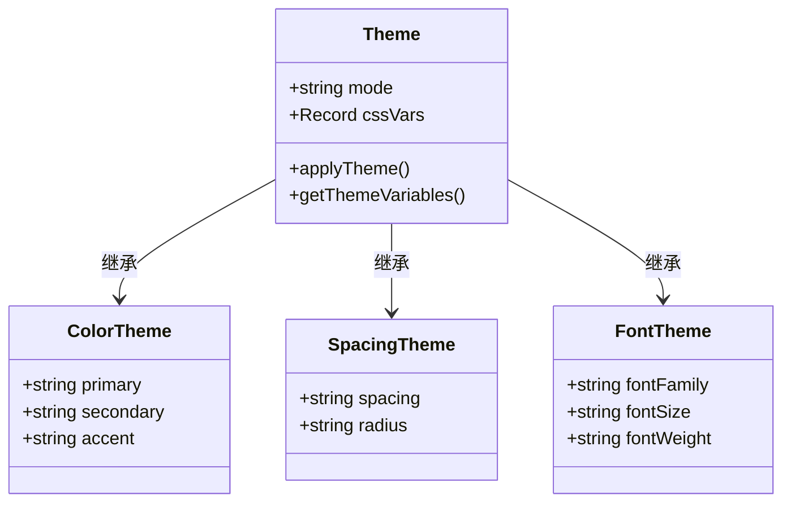
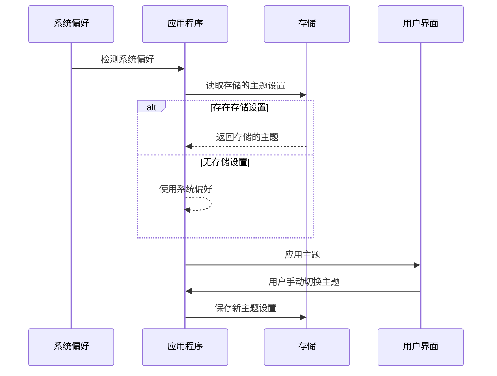
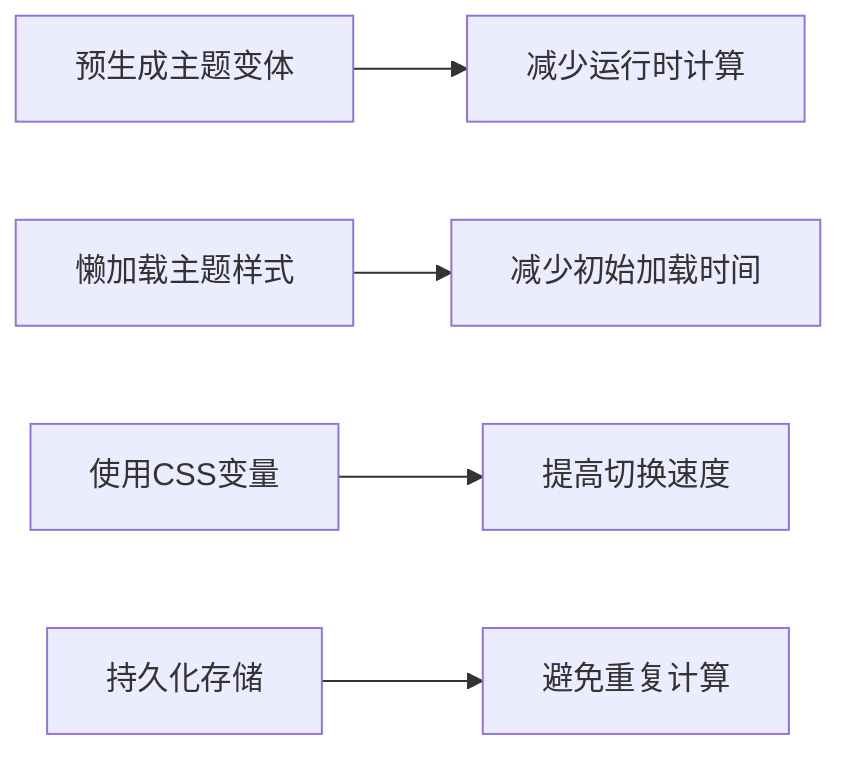
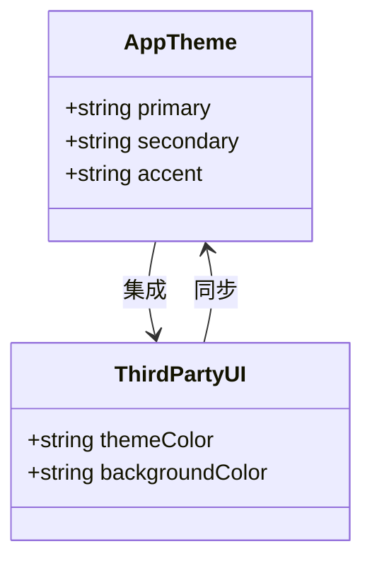

# 动态主题支持

<cite>
**本文档引用的文件**   
- [theme.css](file://packages/weapp-tailwindcss/css/theme.css)
- [Theme.vue](file://tailwindcss-weapp/src/pages/theme/custom/Theme.vue)
- [index.vue](file://tailwindcss-weapp/src/pages/theme/index.vue)
- [use-theme-preset.ts](file://apps/react-app/src/theme/use-theme-preset.ts)
- [options.ts](file://apps/react-app/src/theme/options.ts)
- [theme.ts](file://apps/vue-app/src/features/home/theme.ts)
- [tailwindcss.ts](file://packages-runtime/theme-transition/src/tailwindcss.ts)
- [index.ts](file://packages-runtime/theme-transition/src/index.ts)
- [preflight.ts](file://packages/postcss/src/preflight.ts)
- [useSystemStore.ts](file://tailwindcss-weapp/src/stores/index.ts)
</cite>

## 目录
1. [简介](#简介)
2. [主题系统实现原理](#主题系统实现原理)
3. [多主题配置示例](#多主题配置示例)
4. [暗色模式检测与切换](#暗色模式检测与切换)
5. [性能优化策略](#性能优化策略)
6. [第三方UI库集成指导](#第三方ui库集成指导)

## 简介

weapp-tailwindcss 提供了强大的动态主题支持功能，允许开发者轻松实现主题切换和暗色模式。该系统基于CSS变量构建，支持静态和动态两种主题切换方式。通过 `mode` 和 `vars` 两个属性，开发者可以灵活地控制主题的外观和行为。

**Section sources**
- [Theme.vue](file://tailwindcss-weapp/src/pages/theme/custom/Theme.vue#L1-L20)

## 主题系统实现原理

weapp-tailwindcss 的主题系统基于CSS变量实现，通过 `@theme` 规则定义主题变量。这些变量涵盖了颜色、间距、字体、边框半径等多个设计系统方面。主题变量在CSS中被定义为自定义属性，可以在运行时通过JavaScript动态修改。

**Diagram sources**
- [theme.css](file://packages/weapp-tailwindcss/css/theme.css#L1-L457)

**Section sources**
- [theme.css](file://packages/weapp-tailwindcss/css/theme.css#L1-L457)

## 多主题配置示例

以下是一个完整的多主题配置示例，涵盖了颜色、间距、字体等设计系统的各个方面：

**Diagram sources**
- [theme.css](file://packages/weapp-tailwindcss/css/theme.css#L1-L457)
- [Theme.vue](file://tailwindcss-weapp/src/pages/theme/custom/Theme.vue#L1-L20)

**Section sources**
- [theme.css](file://packages/weapp-tailwindcss/css/theme.css#L1-L457)
- [Theme.vue](file://tailwindcss-weapp/src/pages/theme/custom/Theme.vue#L1-L20)

## 暗色模式检测与切换

weapp-tailwindcss 支持多种暗色模式检测和切换机制，包括系统偏好匹配、手动切换和持久化存储。通过 `useThemePreset` 钩子，可以轻松实现主题的初始化和切换。

**Diagram sources**
- [use-theme-preset.ts](file://apps/react-app/src/theme/use-theme-preset.ts#L1-L31)
- [options.ts](file://apps/react-app/src/theme/options.ts#L1-L23)
- [theme.ts](file://apps/vue-app/src/features/home/theme.ts#L1-L13)

**Section sources**
- [use-theme-preset.ts](file://apps/react-app/src/theme/use-theme-preset.ts#L1-L31)
- [options.ts](file://apps/react-app/src/theme/options.ts#L1-L23)
- [theme.ts](file://apps/vue-app/src/features/home/theme.ts#L1-L13)

## 性能优化策略

为了提高主题切换的性能，weapp-tailwindcss 提供了多种优化策略，包括预生成主题变体和懒加载主题样式。

**Diagram sources**
- [preflight.ts](file://packages/postcss/src/preflight.ts#L1-L26)
- [index.ts](file://packages-runtime/theme-transition/src/index.ts#L54-L93)

**Section sources**
- [preflight.ts](file://packages/postcss/src/preflight.ts#L1-L26)
- [index.ts](file://packages-runtime/theme-transition/src/index.ts#L54-L93)

## 第三方UI库集成指导

weapp-tailwindcss 可以轻松与第三方UI库集成，通过提供统一的主题变量接口，确保UI库的样式与应用程序的主题保持一致。

**Diagram sources**
- [useSystemStore.ts](file://tailwindcss-weapp/src/stores/index.ts#L1-L30)
- [tailwindcss.ts](file://packages-runtime/theme-transition/src/tailwindcss.ts#L49-L76)

**Section sources**
- [useSystemStore.ts](file://tailwindcss-weapp/src/stores/index.ts#L1-L30)
- [tailwindcss.ts](file://packages-runtime/theme-transition/src/tailwindcss.ts#L49-L76)