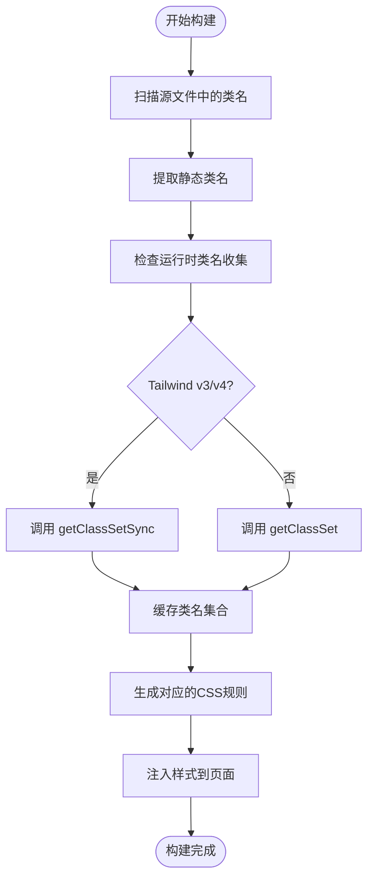
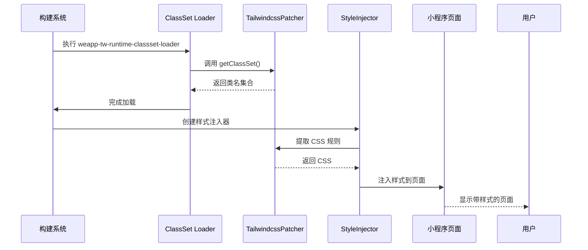

# 动态样式问题

<cite>
**本文档中引用的文件**  
- [runtime.ts](file://packages/weapp-tailwindcss/src/tailwindcss/runtime.ts)
- [weapp-tw-runtime-classset-loader.ts](file://packages/weapp-tailwindcss/src/bundlers/webpack/loaders/weapp-tw-runtime-classset-loader.ts)
- [index.ts](file://packages/weapp-style-injector/src/index.ts)
- [patcher.ts](file://packages/weapp-tailwindcss/src/tailwindcss/patcher.ts)
- [v4/patcher.ts](file://packages/weapp-tailwindcss/src/tailwindcss/v4/patcher.ts)
</cite>

## 目录
1. [简介](#简介)
2. [动态类名处理机制](#动态类名处理机制)
3. [JIT模式下的动态类名预生成策略](#jit模式下的动态类名预生成策略)
4. [JavaScript/TypeScript中动态样式的最佳实践](#javascripttypescript中动态样式的最佳实践)
5. [运行时样式计算与注入实现](#运行时样式计算与注入实现)
6. [动态主题与暗色模式支持](#动态主题与暗色模式支持)
7. [常见问题排查](#常见问题排查)
8. [结论](#结论)

## 简介
weapp-tailwindcss 是一个专为微信小程序等轻应用环境设计的 Tailwind CSS 集成解决方案。它通过静态提取和运行时注入相结合的方式，支持在小程序中使用 Tailwind CSS 的全部功能，包括动态类名、条件渲染和主题切换等高级特性。本文档详细说明其动态样式处理机制，帮助开发者解决常见的动态样式问题。

## 动态类名处理机制

weapp-tailwindcss 支持多种动态类名表达式，包括三元运算符、逻辑运算符和数组条件等。其核心机制是通过静态分析和运行时收集相结合的方式，确保所有可能的类名都能被正确生成和应用。

在模板中，以下动态类名表达式均被支持：
- 三元表达式：`class="{{ condition ? 'text-red-500' : 'text-green-500' }}"`
- 逻辑与/或：`class="{{ isActive && 'bg-blue-500' || 'bg-gray-200' }}"`
- 数组条件：`class="{{ [isActive ? 'active' : '', size === 'large' ? 'text-lg' : ''] }}"`
- 对象语法：`class="{{ {'text-red-500': isError, 'text-green-500': isSuccess} }}"`

系统通过分析源码中的类名使用情况，提前生成对应的 CSS 规则，并在运行时根据实际条件动态应用这些预生成的类名。

**Section sources**
- [runtime.ts](file://packages/weapp-tailwindcss/src/tailwindcss/runtime.ts#L144-L230)
- [patcher.ts](file://packages/weapp-tailwindcss/src/tailwindcss/patcher.ts)

## JIT模式下的动态类名预生成策略

JIT（Just-In-Time）模式是 weapp-tailwindcss 的核心特性之一，它允许按需生成 CSS 类名，避免生成大量未使用的样式规则。

### 预生成策略
1. **静态扫描**：构建时扫描所有源文件（WXML、Vue、Taro 等），提取所有出现的类名。
2. **运行时收集**：通过 `getClassSet` 和 `getClassSetSync` 方法收集运行时可能生成的动态类名。
3. **缓存机制**：使用 `WeakMap` 缓存已收集的类名集合，避免重复计算。
4. **版本兼容**：根据 Tailwind CSS 主版本号决定是否优先使用同步方法。

### 限制
- **动态字符串拼接**：如 `class="text-{{ color }}-500"` 无法被静态分析捕获，需要手动在配置中声明。
- **运行时计算**：完全在运行时通过复杂逻辑生成的类名可能无法被提前生成。
- **性能开销**：首次加载时需要执行类名收集，可能影响启动性能。



**Diagram sources**
- [runtime.ts](file://packages/weapp-tailwindcss/src/tailwindcss/runtime.ts#L116-L142)
- [weapp-tw-runtime-classset-loader.ts](file://packages/weapp-tailwindcss/src/bundlers/webpack/loaders/weapp-tw-runtime-classset-loader.ts)

**Section sources**
- [runtime.ts](file://packages/weapp-tailwindcss/src/tailwindcss/runtime.ts#L1-L230)

## JavaScript/TypeScript中动态样式的最佳实践

在 JavaScript/TypeScript 代码中使用动态样式时，应遵循以下最佳实践：

### 1. 使用工具函数合并类名
推荐使用 `classnames` 或 `clsx` 等库来安全地合并动态类名：

```typescript
import clsx from 'clsx'

function Button({ isActive, size }) {
  return (
    <button class={clsx(
      'px-4 py-2 rounded',
      { 'bg-blue-500': isActive },
      { 'text-lg': size === 'large' }
    )}>
      Click me
    </button>
  )
}
```

### 2. 避免动态字符串拼接
不要使用字符串拼接方式生成类名，这会导致 JIT 无法识别：

```typescript
// ❌ 错误做法
const className = `text-${color}-500`

// ✅ 正确做法：使用对象语法
const className = { 
  'text-red-500': color === 'red',
  'text-green-500': color === 'green',
  'text-blue-500': color === 'blue'
}
```

### 3. 预声明动态类名
对于必须使用动态值的场景，在 `tailwind.config.js` 中预声明可能的值：

```javascript
// tailwind.config.js
module.exports = {
  theme: {
    extend: {
      colors: {
        'dynamic-red': '#ef4444',
        'dynamic-green': '#22c55e',
        'dynamic-blue': '#3b82f6'
      }
    }
  }
}
```

**Section sources**
- [runtime.ts](file://packages/weapp-tailwindcss/src/tailwindcss/runtime.ts)
- [index.ts](file://packages/weapp-style-injector/src/index.ts)

## 运行时样式计算与注入实现

weapp-tailwindcss 的运行时样式系统通过多个组件协同工作，实现样式的动态计算和注入。

### 核心组件
1. **StyleInjector**：负责将 CSS 样式注入到小程序页面中。
2. **TailwindcssPatcher**：处理 Tailwind CSS 的补丁和类名提取。
3. **RuntimeClassSetCache**：缓存运行时类名集合，提高性能。

### 注入流程
1. 构建时通过 `weapp-tw-runtime-classset-loader` 收集类名
2. 运行时通过 `collectRuntimeClassSet` 方法获取类名集合
3. 使用 `createStyleInjector` 创建样式注入器
4. 将生成的 CSS 注入到页面的 `<style>` 标签中



**Diagram sources**
- [weapp-tw-runtime-classset-loader.ts](file://packages/weapp-tailwindcss/src/bundlers/webpack/loaders/weapp-tw-runtime-classset-loader.ts)
- [index.ts](file://packages/weapp-style-injector/src/index.ts)

**Section sources**
- [weapp-tw-runtime-classset-loader.ts](file://packages/weapp-tailwindcss/src/bundlers/webpack/loaders/weapp-tw-runtime-classset-loader.ts#L1-L28)
- [index.ts](file://packages/weapp-style-injector/src/index.ts#L1-L37)

## 动态主题与暗色模式支持

weapp-tailwindcss 完整支持动态主题切换和暗色模式，通过 CSS 变量和条件类名实现。

### 实现机制
1. **CSS 变量**：使用 CSS 自定义属性定义主题颜色
2. **数据属性**：通过 `data-theme` 属性控制主题
3. **媒体查询**：支持 `prefers-color-scheme` 媒体查询

### 配置示例
```javascript
// tailwind.config.js
module.exports = {
  darkMode: 'class', // 或 'media'
  theme: {
    extend: {
      colors: {
        primary: 'var(--color-primary)',
        secondary: 'var(--color-secondary)'
      }
    }
  }
}
```

### 使用方式
```html
<!-- 方式1：class 切换 -->
<div data-theme="dark" class="bg-white dark:bg-gray-900">
  <!-- 内容 -->
</div>

<!-- 方式2：自动检测 -->
<div class="bg-white dark:bg-gray-900">
  <!-- 根据系统偏好自动切换 -->
</div>
```

系统会在构建时生成对应的深色模式类名，并在运行时根据 `data-theme` 属性或系统设置动态应用。

**Section sources**
- [v4/patcher.ts](file://packages/weapp-tailwindcss/src/tailwindcss/v4/patcher.ts)
- [runtime.ts](file://packages/weapp-tailwindcss/src/tailwindcss/runtime.ts)

## 常见问题排查

### 1. 动态类名不生效
**可能原因**：
- 动态生成的类名未被 JIT 引擎捕获
- 字符串拼接方式生成类名
- 运行时类名收集失败

**解决方案**：
- 检查 `tailwind.config.js` 中是否预声明了相关类名
- 改用对象语法或数组语法替代字符串拼接
- 确保 `getClassSet` 方法能正确返回类名集合

### 2. 样式注入失败
**可能原因**：
- StyleInjector 未正确初始化
- 构建流程中断
- 页面生命周期问题

**解决方案**：
- 检查构建日志是否有错误信息
- 确认 `weapp-style-injector` 已正确配置
- 验证页面 `onLoad` 生命周期中样式是否已注入

### 3. 主题切换无效
**可能原因**：
- `darkMode` 配置不正确
- 缺少必要的 CSS 变量定义
- 数据属性未正确设置

**解决方案**：
- 确认 `tailwind.config.js` 中 `darkMode` 设置为 `'class'` 或 `'media'`
- 检查 HTML 根元素是否设置了正确的 `data-theme` 属性
- 验证 CSS 变量是否已正确注入

**Section sources**
- [runtime.ts](file://packages/weapp-tailwindcss/src/tailwindcss/runtime.ts#L45-L50)
- [weapp-tw-runtime-classset-loader.ts](file://packages/weapp-tailwindcss/src/bundlers/webpack/loaders/weapp-tw-runtime-classset-loader.ts)

## 结论
weapp-tailwindcss 提供了一套完整的动态样式解决方案，通过静态分析和运行时收集相结合的方式，有效支持了条件类名、动态类名和主题切换等复杂场景。开发者应遵循最佳实践，避免使用 JIT 引擎无法识别的动态模式，并合理配置主题系统，以确保样式能够正确生成和应用。对于复杂的动态样式需求，建议结合预声明和工具函数的方式，既能保持代码灵活性，又能确保样式正确性。