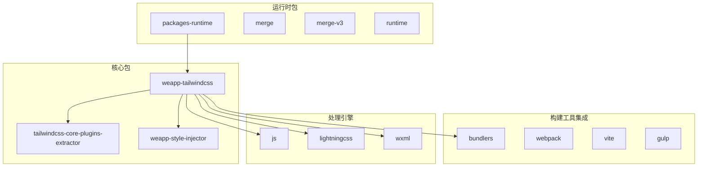
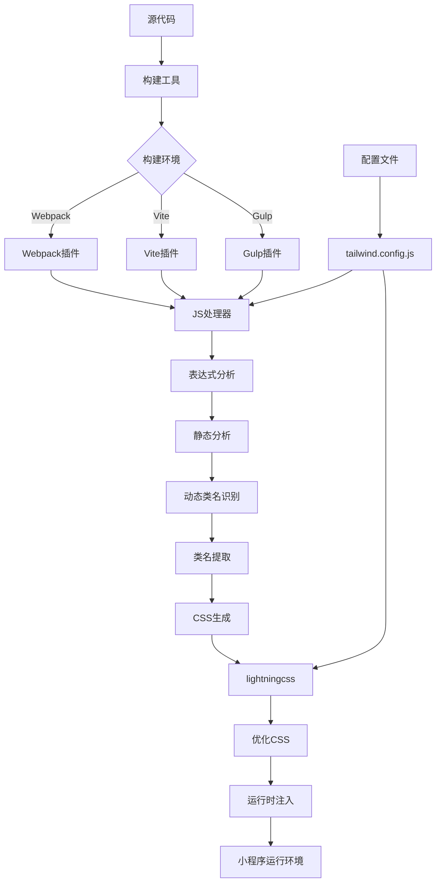
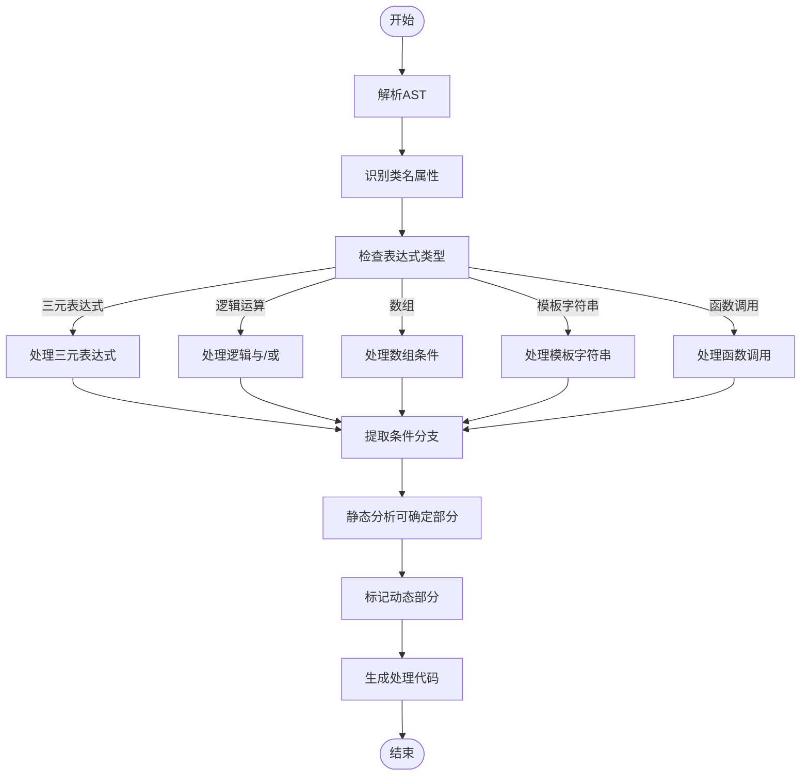
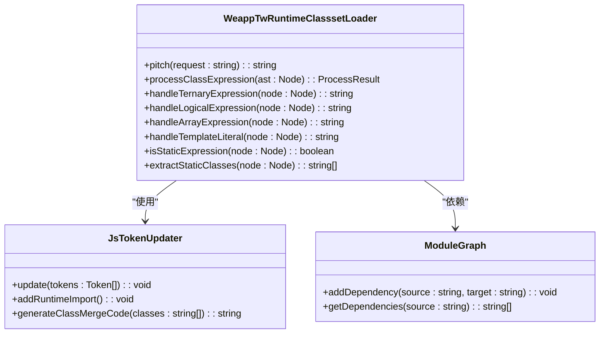
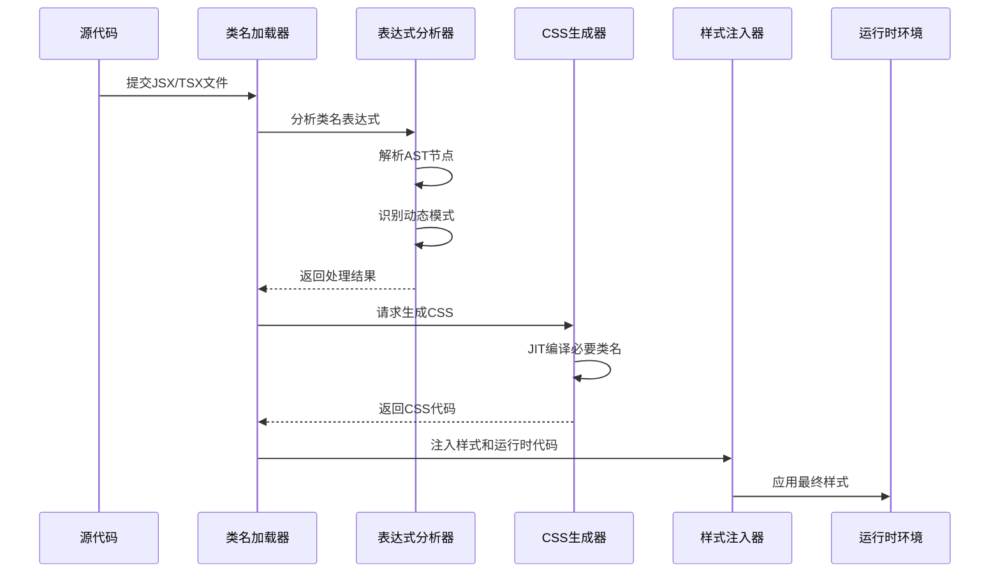

# 条件类名处理

<cite>
**本文档中引用的文件**  
- [weapp-tw-runtime-classset-loader.ts](file://packages/weapp-tailwindcss/src/bundlers/webpack/loaders/weapp-tw-runtime-classset-loader.ts)
- [style-handler.ts](file://packages/weapp-tailwindcss/src/lightningcss/style-handler.ts)
- [index.ts](file://packages/weapp-tailwindcss/src/index.ts)
- [core.ts](file://packages/weapp-tailwindcss/src/core.ts)
- [handlers.ts](file://packages/weapp-tailwindcss/src/js/handlers.ts)
- [evalTransforms.ts](file://packages/weapp-tailwindcss/src/js/evalTransforms.ts)
- [tailwind.config.js](file://apps/vite-native/tailwind.config.js)
- [tailwind.config.js](file://apps/taro-webpack-tailwindcss-v4/tailwind.config.js)
</cite>

## 目录
1. [简介](#简介)
2. [项目结构](#项目结构)
3. [核心组件](#核心组件)
4. [架构概述](#架构概述)
5. [详细组件分析](#详细组件分析)
6. [依赖分析](#依赖分析)
7. [性能考虑](#性能考虑)
8. [故障排除指南](#故障排除指南)
9. [结论](#结论)

## 简介
本文档深入探讨weapp-tailwindcss如何解析和处理JSX/TSX中的动态类名语法，包括三元表达式、逻辑与/或运算符、数组条件等复杂条件。详细说明了在小程序环境中使用Tailwind CSS时的条件类名处理机制，涵盖JIT编译器的静态分析策略、预生成方案以及与clsx、classnames等工具库的集成方法。同时提供常见错误模式的解决方案，帮助开发者有效排查条件类名不生效等问题。

## 项目结构
weapp-tailwindcss项目采用模块化设计，核心功能分布在多个包中，主要结构如下：



**Diagram sources**
- [index.ts](file://packages/weapp-tailwindcss/src/index.ts)
- [core.ts](file://packages/weapp-tailwindcss/src/core.ts)

**Section sources**
- [index.ts](file://packages/weapp-tailwindcss/src/index.ts)
- [core.ts](file://packages/weapp-tailwindcss/src/core.ts)

## 核心组件
weapp-tailwindcss的核心组件主要包括：

1. **Webpack/Vite/Gulp集成层**：提供构建工具插件，处理不同构建环境下的类名提取和注入
2. **JavaScript处理器**：分析JSX/TSX中的动态类名表达式
3. **CSS处理器**：使用lightningcss处理Tailwind CSS的生成和优化
4. **WXML处理器**：处理小程序模板中的类名绑定
5. **运行时类名处理器**：在运行时处理动态类名的计算和应用

这些组件协同工作，确保在开发和构建阶段都能正确处理复杂的条件类名。

**Section sources**
- [index.ts](file://packages/weapp-tailwindcss/src/index.ts)
- [core.ts](file://packages/weapp-tailwindcss/src/core.ts)
- [js/handlers.ts](file://packages/weapp-tailwindcss/src/js/handlers.ts)

## 架构概述
weapp-tailwindcss的架构设计旨在高效处理小程序环境下的Tailwind CSS需求，特别是动态类名的处理：



**Diagram sources**
- [webpack/index.ts](file://packages/weapp-tailwindcss/src/bundlers/webpack/index.ts)
- [vite/index.ts](file://packages/weapp-tailwindcss/src/bundlers/vite/index.ts)
- [js/index.ts](file://packages/weapp-tailwindcss/src/js/index.ts)

## 详细组件分析

### JavaScript处理器分析
JavaScript处理器负责分析JSX/TSX中的类名表达式，支持多种动态语法：

#### 表达式处理流程


**Diagram sources**
- [js/handlers.ts](file://packages/weapp-tailwindcss/src/js/handlers.ts)
- [js/evalTransforms.ts](file://packages/weapp-tailwindcss/src/js/evalTransforms.ts)

**Section sources**
- [js/handlers.ts](file://packages/weapp-tailwindcss/src/js/handlers.ts)
- [js/evalTransforms.ts](file://packages/weapp-tailwindcss/src/js/evalTransforms.ts)

### Webpack类名加载器分析
Webpack类名加载器是处理动态类名的关键组件：



**Diagram sources**
- [weapp-tw-runtime-classset-loader.ts](file://packages/weapp-tailwindcss/src/bundlers/webpack/loaders/weapp-tw-runtime-classset-loader.ts)
- [JsTokenUpdater.ts](file://packages/weapp-tailwindcss/src/js/JsTokenUpdater.ts)

### CSS处理机制
CSS处理机制确保动态类名能够正确生成和应用：



**Diagram sources**
- [style-handler.ts](file://packages/weapp-tailwindcss/src/lightningcss/style-handler.ts)
- [weapp-tw-runtime-classset-loader.ts](file://packages/weapp-tailwindcss/src/bundlers/webpack/loaders/weapp-tw-runtime-classset-loader.ts)

## 依赖分析
weapp-tailwindcss的依赖关系复杂但清晰，确保了功能的完整性和可维护性：

```mermaid
graph TD
A[weapp-tailwindcss] --> B[tailwindcss]
A --> C[postcss]
A --> D[lightningcss]
A --> E[@babel/parser]
A --> F[@babel/generator]
A --> G[oxc]
A --> H[swc]
A --> I[tailwindcss-core-plugins-extractor]
A --> J[weapp-style-injector]
A --> K[packages-runtime]
I --> B
J --> C
K --> L[clsx]
K --> M[classnames]
subgraph "构建工具依赖"
N[webpack] --> A
O[vite] --> A
P[gulp] --> A
end
subgraph "运行时依赖"
Q[mini-program-runtime] --> A
R[uni-app-runtime] --> A
S[taro-runtime] --> A
end
```

**Diagram sources**
- [package.json](file://packages/weapp-tailwindcss/package.json)
- [tailwind.config.js](file://apps/vite-native/tailwind.config.js)

**Section sources**
- [package.json](file://packages/weapp-tailwindcss/package.json)
- [tailwind.config.js](file://apps/vite-native/tailwind.config.js)

## 性能考虑
在处理条件类名时，性能是关键考虑因素：

1. **静态分析优化**：尽可能在构建时确定类名，减少运行时计算
2. **JIT编译策略**：只生成实际使用的类名，避免生成不必要的CSS
3. **缓存机制**：使用MD5哈希缓存处理结果，避免重复计算
4. **模块图优化**：跟踪模块依赖关系，实现增量构建

最佳实践包括：
- 尽量使用静态类名
- 复杂条件逻辑封装到工具函数中
- 避免在循环中使用复杂的动态类名
- 使用clsx等优化的工具库处理条件组合

## 故障排除指南
常见问题及解决方案：

### 条件类名不生效
**可能原因**：
- 动态表达式过于复杂，无法被静态分析
- 变量作用域问题
- 构建缓存未更新

**解决方案**：
1. 简化表达式结构
2. 使用`/* tw */`注释标记需要处理的类名
3. 清除构建缓存后重新构建

### 构建时无法识别动态类名
**可能原因**：
- AST分析未能正确解析表达式
- 非标准JavaScript语法

**解决方案**：
1. 检查语法是否符合支持的模式
2. 将复杂逻辑拆分为多个简单表达式
3. 使用工具库如clsx明确标记条件类名

### 运行时样式错乱
**可能原因**：
- CSS优先级冲突
- 样式注入时机问题

**解决方案**：
1. 检查Tailwind CSS的排序配置
2. 确保样式在组件渲染前已注入
3. 使用`!important`变体解决优先级问题

**Section sources**
- [weapp-tw-runtime-classset-loader.ts](file://packages/weapp-tailwindcss/src/bundlers/webpack/loaders/weapp-tw-runtime-classset-loader.ts)
- [style-handler.ts](file://packages/weapp-tailwindcss/src/lightningcss/style-handler.ts)

## 结论
weapp-tailwindcss提供了一套完整的条件类名处理方案，通过静态分析和运行时处理的结合，有效支持了小程序环境下的动态样式需求。理解其内部工作机制有助于开发者更好地利用Tailwind CSS的灵活性，同时避免常见的陷阱和性能问题。建议在实际项目中结合使用静态类名和经过优化的动态表达式，以达到最佳的开发体验和运行性能。