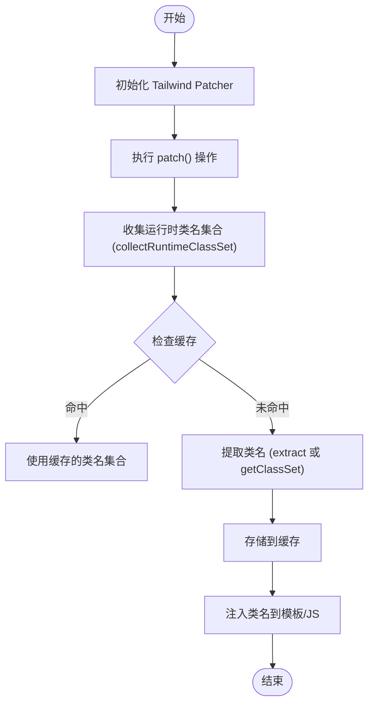
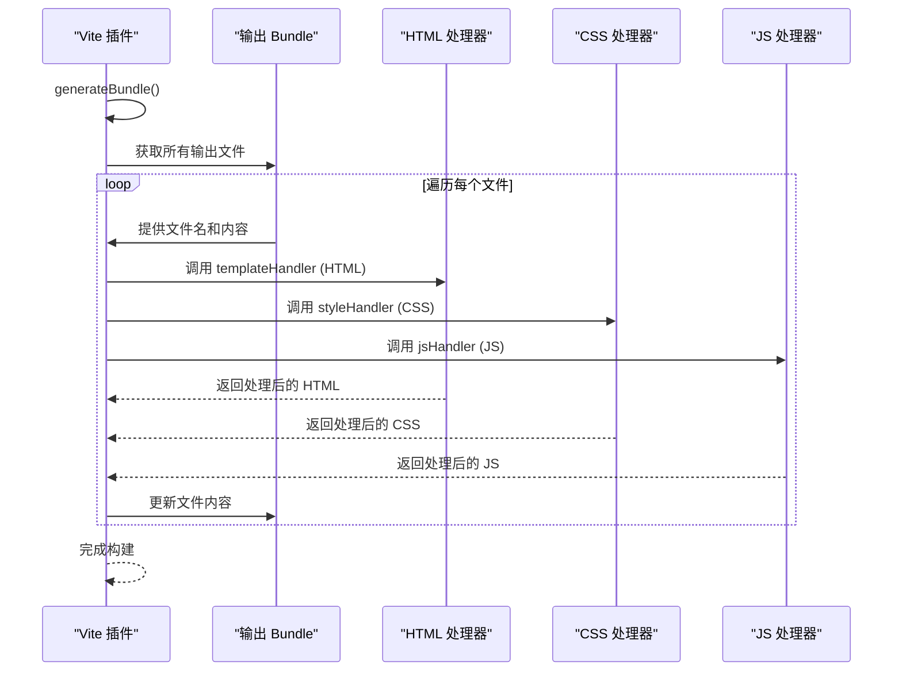
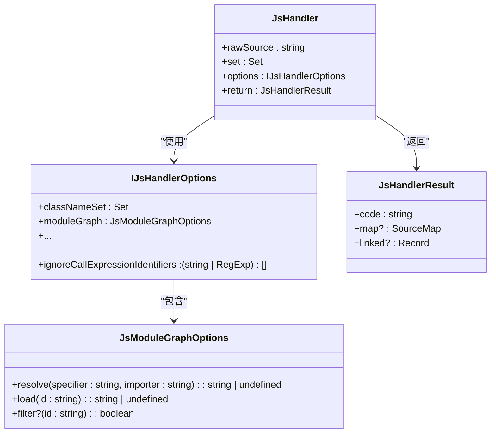
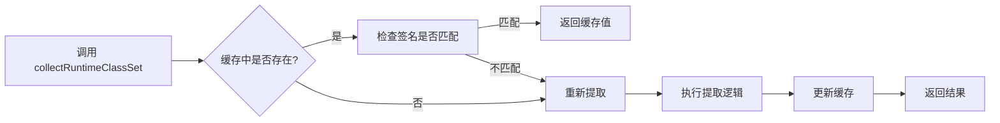
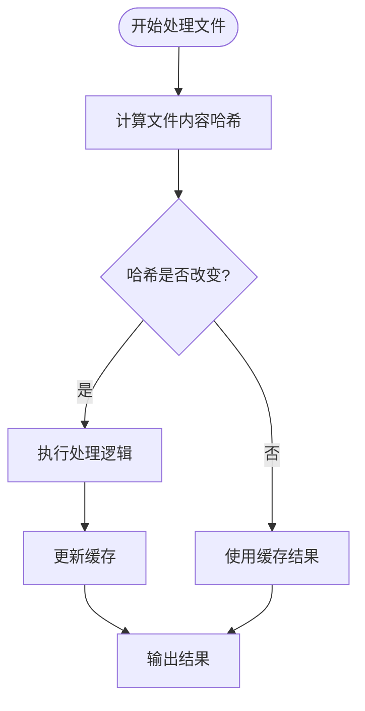

# 运行时样式

<cite>
**本文档引用文件**   
- [runtime.ts](file://packages/weapp-tailwindcss/src/tailwindcss/runtime.ts)
- [create-runtime.ts](file://packages-runtime/runtime/src/create-runtime.ts)
- [index.ts](file://packages/weapp-tailwindcss/src/bundlers/vite/index.ts)
- [options-a2565187.mjs](file://demo/native-mina/weapp-tw-dist/options-a2565187.mjs)
- [variants.ts](file://packages-runtime/variants/src/index.ts)
- [cache.ts](file://packages/weapp-tailwindcss/src/cache/index.ts)
- [types/index.ts](file://packages/weapp-tailwindcss/src/types/index.ts)
</cite>

## 目录
1. [引言](#引言)
2. [运行时样式生命周期](#运行时样式生命周期)
3. [动态类名解析与注入](#动态类名解析与注入)
4. [JavaScript/TypeScript中动态样式应用](#javascripttypescript中动态样式应用)
5. [性能优化策略](#性能优化策略)
6. [组件生命周期中的安全使用](#组件生命周期中的安全使用)
7. [SSR/SSG场景下的特殊处理](#ssrssg场景下的特殊处理)
8. [总结](#总结)

## 引言

weapp-tailwindcss 是一个专为小程序环境设计的 Tailwind CSS 集成解决方案，其核心能力之一是在运行时处理动态样式。该系统允许开发者在 JavaScript/TypeScript 代码中动态生成和应用 Tailwind 类名，支持变量插值、函数调用返回类名等高级用法，并通过类名缓存、样式去重等机制优化性能。本文档详细阐述了 weapp-tailwindcss 在运行时处理动态样式的完整能力，包括样式计算、类名解析和注入的生命周期，以及在不同构建环境和应用场景下的实现细节。

**Section sources**
- [runtime.ts](file://packages/weapp-tailwindcss/src/tailwindcss/runtime.ts#L1-L230)
- [index.ts](file://packages/weapp-tailwindcss/src/bundlers/vite/index.ts#L1-L479)

## 运行时样式生命周期

weapp-tailwindcss 的运行时样式处理遵循一个清晰的生命周期，从初始化到类名的最终注入，确保样式能够正确地应用于小程序的各个组件。

**Diagram sources **
- [runtime.ts](file://packages/weapp-tailwindcss/src/tailwindcss/runtime.ts#L144-L229)
- [index.ts](file://packages/weapp-tailwindcss/src/bundlers/vite/index.ts#L234-L259)

**Section sources**
- [runtime.ts](file://packages/weapp-tailwindcss/src/tailwindcss/runtime.ts#L1-L230)
- [index.ts](file://packages/weapp-tailwindcss/src/bundlers/vite/index.ts#L1-L479)

## 动态类名解析与注入

weapp-tailwindcss 通过 `collectRuntimeClassSet` 函数来解析和收集运行时所需的类名。该函数会根据配置的 Tailwind Patcher 实例，尝试通过 `getClassSetSync`、`extract` 或 `getClassSet` 方法获取类名集合，并利用 WeakMap 进行缓存，避免重复计算。

类名的注入则通过 Vite 或 Webpack 插件在 `generateBundle` 阶段完成。插件会遍历输出的 bundle，对 HTML、CSS 和 JS 文件分别进行处理：
- **HTML**: 使用 `templateHandler` 处理内联的类名。
- **CSS**: 使用 `styleHandler` 处理 CSS 文件，注入必要的样式规则。
- **JS**: 使用 `jsHandler` 分析 JavaScript 代码，识别并转换动态生成的类名。

**Diagram sources **
- [index.ts](file://packages/weapp-tailwindcss/src/bundlers/vite/index.ts#L296-L471)
- [options-a2565187.mjs](file://demo/native-mina/weapp-tw-dist/options-a2565187.mjs#L494-L507)

**Section sources**
- [index.ts](file://packages/weapp-tailwindcss/src/bundlers/vite/index.ts#L1-L479)
- [options-a2565187.mjs](file://demo/native-mina/weapp-tw-dist/options-a2565187.mjs#L466-L526)

## JavaScript/TypeScript中动态样式应用

weapp-tailwindcss 支持在 JavaScript/TypeScript 代码中动态生成和应用 Tailwind 类名。这主要通过 `jsHandler` 函数实现，它利用 Babel 解析器遍历 AST（抽象语法树），识别出字符串字面量和模板字符串中的类名，并进行相应的转换。

### 支持的高级用法

1. **变量插值**: 可以在模板字符串中使用变量，`jsHandler` 会正确处理这些动态部分。
2. **函数调用返回类名**: 允许调用函数来返回类名字符串，`jsHandler` 会分析函数调用并提取结果。
3. **条件表达式**: 支持在类名中使用三元运算符等条件表达式。

### 配置选项

`IJsHandlerOptions` 接口定义了 `jsHandler` 的配置选项，包括：
- `classNameSet`: 运行时类名集合。
- `ignoreCallExpressionIdentifiers`: 忽略特定的函数调用标识符，避免不必要的处理。
- `moduleGraph`: 用于跨文件分析的模块图，支持更复杂的依赖关系。

**Diagram sources **
- [types/index.ts](file://packages/weapp-tailwindcss/src/types/index.ts#L59-L87)
- [js/index.ts](file://packages/weapp-tailwindcss/src/js/index.ts#L1-L55)
- [evalTransforms.ts](file://packages/weapp-tailwindcss/src/js/evalTransforms.ts#L51-L172)

**Section sources**
- [types/index.ts](file://packages/weapp-tailwindcss/src/types/index.ts#L1-L190)
- [js/index.ts](file://packages/weapp-tailwindcss/src/js/index.ts#L1-L55)

## 性能优化策略

weapp-tailwindcss 采用了多种性能优化策略来确保运行时样式的处理既高效又可靠。

### 类名缓存

核心的性能优化来自于 `collectRuntimeClassSet` 函数中的缓存机制。该函数使用 `WeakMap` 以 `TailwindcssPatcherLike` 实例为键，存储类名集合的 `Promise` 和最终值。同时，通过 `getTailwindConfigSignature` 函数计算配置文件的签名（基于文件路径、大小和修改时间），作为缓存失效的依据，避免了不必要的重复提取。

**Diagram sources **
- [runtime.ts](file://packages/weapp-tailwindcss/src/tailwindcss/runtime.ts#L169-L227)

### 样式去重

在类名的处理过程中，`wrapClassAggregator` 函数内部使用了一个固定大小（默认 256）的 `Map` 缓存来存储原始输入和处理后的结果。这避免了对相同输入的重复计算，特别是在使用 `twMerge` 或 `twJoin` 等函数时，能显著提升性能。

### 构建缓存

weapp-tailwindcss 集成了构建级别的缓存。通过 `processCachedTask` 函数，对 HTML、CSS 和 JS 文件的处理结果进行缓存。它基于文件内容的哈希值来判断是否需要重新处理，从而在增量构建时跳过未更改的文件，大幅缩短构建时间。

**Diagram sources **
- [create-runtime.ts](file://packages-runtime/runtime/src/create-runtime.ts#L42-L98)
- [cache.ts](file://packages/weapp-tailwindcss/src/cache/index.ts#L44-L150)
- [cache.ts](file://packages/weapp-tailwindcss/src/bundlers/shared/cache.ts#L1-L44)

**Section sources**
- [runtime.ts](file://packages/weapp-tailwindcss/src/tailwindcss/runtime.ts#L1-L230)
- [create-runtime.ts](file://packages-runtime/runtime/src/create-runtime.ts#L1-L148)
- [cache.ts](file://packages/weapp-tailwindcss/src/cache/index.ts#L1-L150)

## 组件生命周期中的安全使用

在组件的生命周期中安全使用动态样式，关键在于避免内存泄漏和性能瓶颈。

### 避免内存泄漏

1. **缓存管理**: `runtimeClassSetCache` 使用 `WeakMap`，其键（`TailwindcssPatcherLike` 实例）是弱引用。当 Patcher 实例被垃圾回收时，对应的缓存条目也会自动被清除，防止了内存泄漏。
2. **事件监听**: 所有由插件创建的事件监听器都应在插件生命周期结束时被正确移除或由构建工具管理，避免累积。

### 避免性能瓶颈

1. **异步处理**: 所有耗时的类名提取和文件处理操作都应在 `generateBundle` 阶段以异步方式执行，并利用 `Promise.all` 并行处理，避免阻塞主线程。
2. **增量构建**: 充分利用构建缓存，确保只有内容发生改变的文件才会被重新处理。
3. **配置优化**: 合理配置 `ignoreCallExpressionIdentifiers`，避免对不需要处理的函数调用进行 AST 分析，减少不必要的计算。

**Section sources**
- [runtime.ts](file://packages/weapp-tailwindcss/src/tailwindcss/runtime.ts#L15-L28)
- [index.ts](file://packages/weapp-tailwindcss/src/bundlers/vite/index.ts#L345-L468)

## SSR/SSG场景下的特殊处理

在 SSR（服务端渲染）和 SSG（静态站点生成）场景下，weapp-tailwindcss 的运行时样式处理需要特别注意。

### 服务端渲染 (SSR)

在 SSR 环境中，`createSSRApp` 被用于创建应用实例。weapp-tailwindcss 的插件会在服务端构建时正常工作，将动态样式注入到生成的 HTML 中。关键在于确保服务端的构建环境与客户端一致，特别是 `tailwind.config.js` 的配置，以保证生成的类名是正确的。

### 静态站点生成 (SSG)

对于 SSG，所有样式和类名的处理都在构建时完成。由于没有客户端的运行时环境，因此所有动态样式的解析和注入都必须在构建阶段一次性完成。weapp-tailwindcss 的构建时插件（如 Vite 插件）正是为此设计的，它会分析所有源文件，提取出所有可能用到的类名，并将其固化到最终的输出文件中。

**Diagram sources **
- [main.ts](file://demo/uni-app-tailwindcss-v4/src/main.ts#L1-L9)
- [index.ts](file://packages/weapp-tailwindcss/src/bundlers/vite/index.ts#L296-L471)

**Section sources**
- [main.ts](file://demo/uni-app-tailwindcss-v4/src/main.ts#L1-L9)
- [index.ts](file://packages/weapp-tailwindcss/src/bundlers/vite/index.ts#L1-L479)

## 总结

weapp-tailwindcss 提供了一套强大且高效的运行时样式处理机制。它通过清晰的生命周期管理，实现了从类名提取、缓存优化到最终注入的完整流程。系统支持在 JavaScript/TypeScript 中动态生成类名，并通过类名缓存、构建缓存和样式去重等策略确保了高性能。在组件生命周期中，通过合理的缓存设计避免了内存泄漏。对于 SSR/SSG 场景，其构建时处理能力确保了静态输出的正确性和完整性。这套机制使得开发者能够在小程序开发中灵活运用 Tailwind CSS，同时保持良好的应用性能。