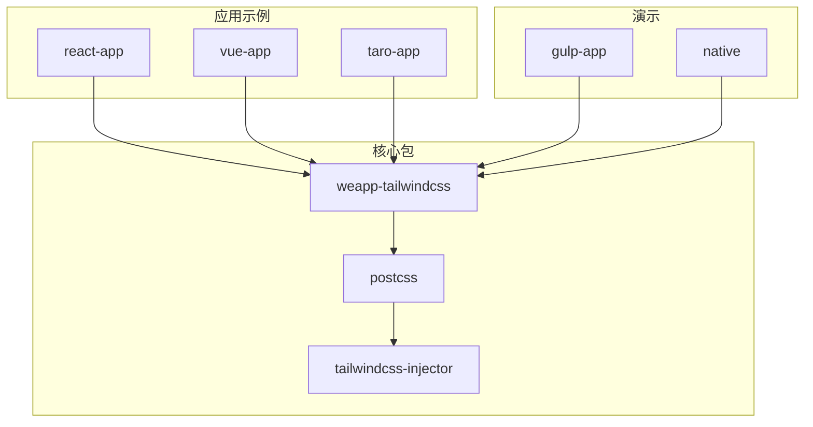
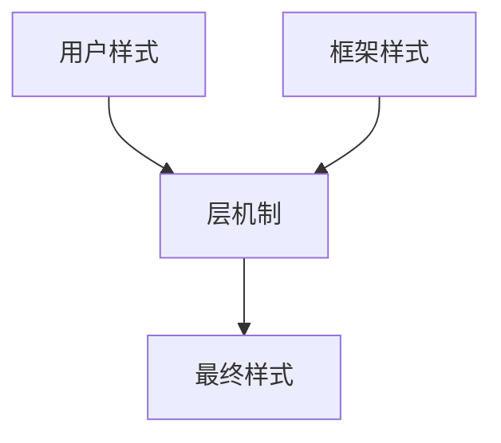
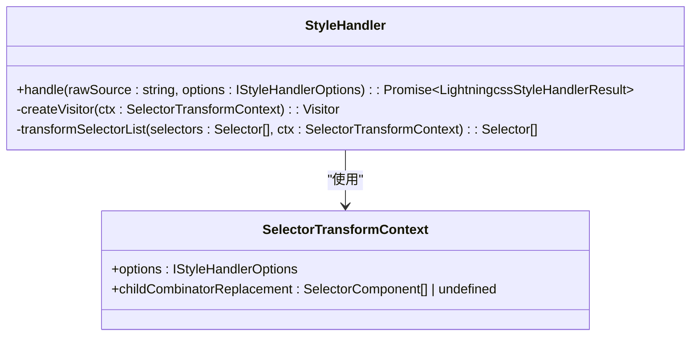
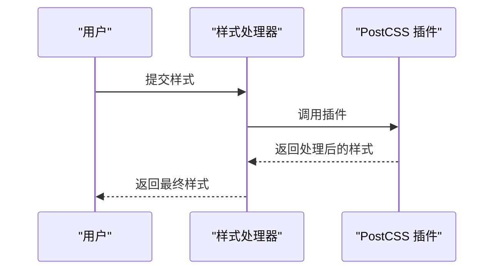
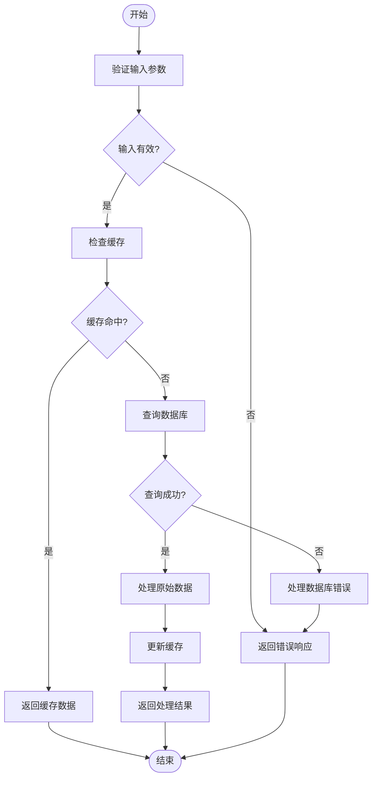
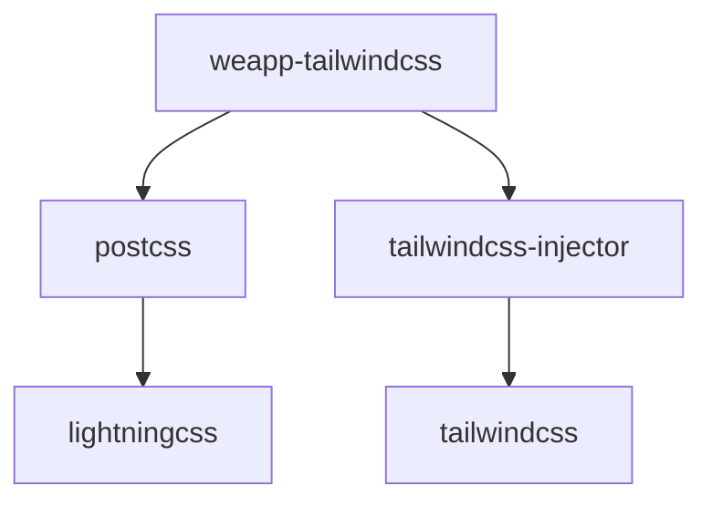

# 优先级冲突

<cite>
**本文档引用的文件**
- [style-handler.ts](file://packages/weapp-tailwindcss/src/lightningcss/style-handler.ts)
- [postcss/index.ts](file://packages/postcss/src/index.ts)
- [with-layer.css](file://packages/weapp-tailwindcss/css/with-layer.css)
- [important.test.ts](file://packages/weapp-tailwindcss/test/tailwindcss/important.test.ts)
- [coverage-extra.test.ts](file://packages/postcss/test/coverage-extra.test.ts)
</cite>

## 目录
1. [简介](#简介)
2. [项目结构](#项目结构)
3. [核心组件](#核心组件)
4. [架构概述](#架构概述)
5. [详细组件分析](#详细组件分析)
6. [依赖分析](#依赖分析)
7. [性能考虑](#性能考虑)
8. [故障排除指南](#故障排除指南)
9. [结论](#结论)

## 简介
本文档详细解释了在小程序环境中，weapp-tailwindcss 如何处理 CSS 特异性计算和样式优先级冲突。文档涵盖了内置样式、用户样式和框架样式之间的优先级关系，并提供了多种解决方案，包括使用 `!important`、调整选择器特异性、利用层（layer）机制等。通过实际案例分析，展示了如何诊断和解决复杂的样式优先级问题，并提供了最佳实践建议，帮助开发者避免优先级冲突。

## 项目结构
weapp-tailwindcss 项目结构清晰，主要分为以下几个部分：
- `packages/`：包含核心包和工具。
- `apps/`：包含各种应用示例。
- `demo/`：包含演示应用。
- `benchmark/`：包含性能基准测试。
- `e2e/`：包含端到端测试。

**图源**
- [style-handler.ts](file://packages/weapp-tailwindcss/src/lightningcss/style-handler.ts)
- [postcss/index.ts](file://packages/postcss/src/index.ts)

## 核心组件
weapp-tailwindcss 的核心组件包括样式处理器、PostCSS 插件和 Tailwind CSS 集成。这些组件共同工作，确保样式在小程序环境中正确应用。

**节源**
- [style-handler.ts](file://packages/weapp-tailwindcss/src/lightningcss/style-handler.ts)
- [postcss/index.ts](file://packages/postcss/src/index.ts)

## 架构概述
weapp-tailwindcss 的架构设计旨在解决小程序环境中的样式优先级冲突。通过使用层（layer）机制和特异性调整，确保用户样式优先于框架样式。

**图源**
- [with-layer.css](file://packages/weapp-tailwindcss/css/with-layer.css)

## 详细组件分析

### 样式处理器分析
样式处理器是 weapp-tailwindcss 的核心，负责处理和转换 CSS 样式。

#### 对象导向组件

**图源**
- [style-handler.ts](file://packages/weapp-tailwindcss/src/lightningcss/style-handler.ts)

#### API/服务组件

**图源**
- [style-handler.ts](file://packages/weapp-tailwindcss/src/lightningcss/style-handler.ts)
- [postcss/index.ts](file://packages/postcss/src/index.ts)

### 复杂逻辑组件

**图源**
- [style-handler.ts](file://packages/weapp-tailwindcss/src/lightningcss/style-handler.ts)

**节源**
- [style-handler.ts](file://packages/weapp-tailwindcss/src/lightningcss/style-handler.ts)
- [important.test.ts](file://packages/weapp-tailwindcss/test/tailwindcss/important.test.ts)

## 依赖分析
weapp-tailwindcss 依赖于多个核心包，包括 PostCSS 和 Tailwind CSS。这些依赖关系确保了样式的正确处理和转换。

**图源**
- [package.json](file://packages/weapp-tailwindcss/package.json)

**节源**
- [package.json](file://packages/weapp-tailwindcss/package.json)

## 性能考虑
在处理样式时，weapp-tailwindcss 通过优化选择器和减少不必要的样式规则来提高性能。此外，使用层机制可以有效减少样式冲突，提高渲染效率。

## 故障排除指南
当遇到样式优先级冲突时，可以采取以下步骤进行诊断和解决：
1. 检查 `!important` 的使用。
2. 调整选择器的特异性。
3. 使用层机制分离样式。

**节源**
- [important.test.ts](file://packages/weapp-tailwindcss/test/tailwindcss/important.test.ts)
- [coverage-extra.test.ts](file://packages/postcss/test/coverage-extra.test.ts)

## 结论
weapp-tailwindcss 通过多种机制有效解决了小程序环境中的样式优先级冲突。通过合理使用 `!important`、调整选择器特异性和利用层机制，开发者可以确保样式按预期应用。遵循最佳实践，可以避免大多数常见的样式问题。