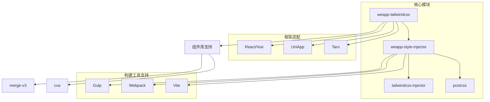
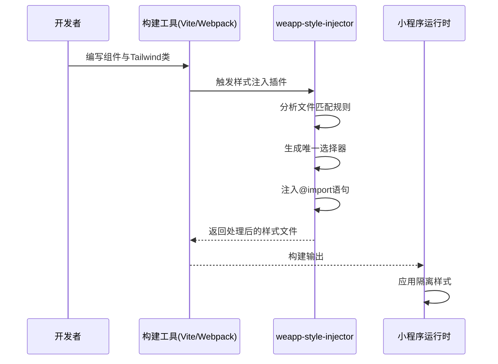
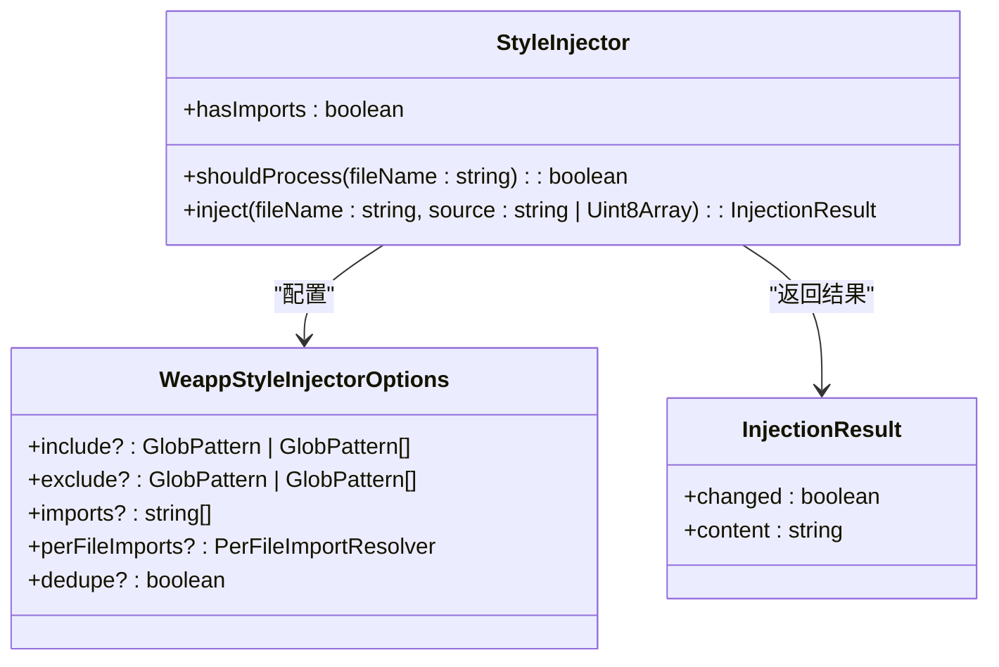
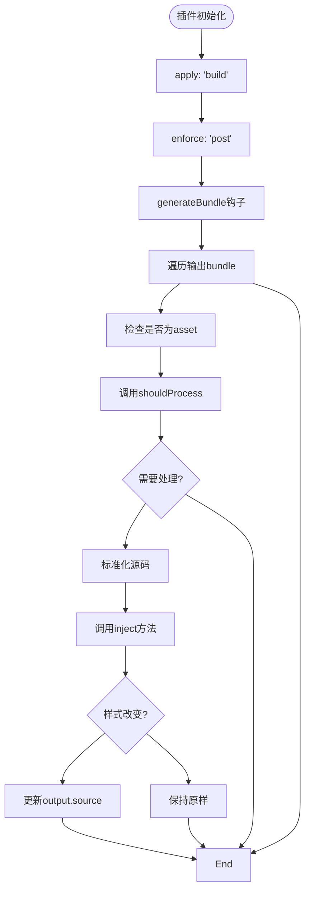
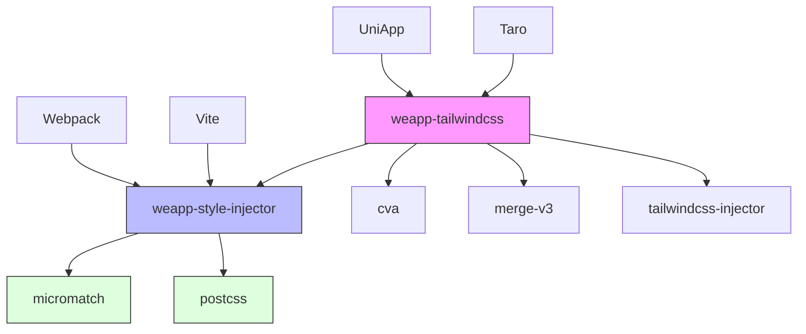

# 样式作用域问题

<cite>
**本文档中引用的文件**  
- [core.ts](file://packages/weapp-style-injector/src/core.ts#L1-L156)
- [vite.ts](file://packages/weapp-style-injector/src/vite.ts#L1-L62)
- [index.ts](file://packages/weapp-tailwindcss/src/index.ts#L1-L5)
- [index.ts](file://apps/vite-native-ts/miniprogram/components/IceButton/index.ts#L1-L100)
- [weapp-tailwindcss](file://packages/weapp-tailwindcss)
- [weapp-style-injector](file://packages/weapp-style-injector)
</cite>

## 目录
1. [简介](#简介)
2. [项目结构](#项目结构)
3. [核心组件](#核心组件)
4. [架构概述](#架构概述)
5. [详细组件分析](#详细组件分析)
6. [依赖分析](#依赖分析)
7. [性能考虑](#性能考虑)
8. [故障排除指南](#故障排除指南)
9. [结论](#结论)

## 简介
本文档详细探讨了 `weapp-tailwindcss` 项目中的样式作用域问题，涵盖样式泄漏、作用域不正确、全局样式冲突等常见问题的解决方案。文档深入解析了该工具如何通过唯一选择器生成机制实现组件级样式隔离，并说明了从 CSS 生成到注入小程序样式文件的完整流程。同时提供了解决样式优先级冲突的最佳实践，包括使用 `!important` 和调整选择器特异性等方法。此外，还涵盖了外部样式类（externalClasses）的支持与限制，以及在构建组件库时实现样式隔离的推荐做法。

## 项目结构
`weapp-tailwindcss` 是一个专为微信小程序设计的 Tailwind CSS 集成工具，其主要功能是将现代 CSS 框架无缝集成到小程序开发流程中。该项目采用 Monorepo 结构，核心模块位于 `packages/` 目录下，其中最关键的是 `weapp-style-injector` 和 `weapp-tailwindcss` 两个包。



**Diagram sources**
- [weapp-tailwindcss](file://packages/weapp-tailwindcss)
- [weapp-style-injector](file://packages/weapp-style-injector)

**Section sources**
- [index.ts](file://packages/weapp-tailwindcss/src/index.ts#L1-L5)

## 核心组件
`weapp-tailwindcss` 的核心功能依赖于多个关键组件协同工作，主要包括：
- **weapp-style-injector**：负责样式注入的核心插件，支持 Vite 和 Webpack 构建工具
- **cva (Compound Variant Authoring)**：用于定义可复用的 UI 组件变体
- **merge-v3**：样式合并工具，确保类名正确合并而不产生冲突
- **Tailwind CSS 配置处理器**：解析并应用 Tailwind 配置到小程序环境

这些组件共同实现了从开发到构建过程中对样式作用域的精确控制。

**Section sources**
- [weapp-tailwindcss](file://packages/weapp-tailwindcss)
- [weapp-style-injector](file://packages/weapp-style-injector)

## 架构概述
`weapp-tailwindcss` 的架构设计旨在解决小程序环境中样式作用域隔离的挑战。它通过构建时的静态分析和动态注入机制，在不破坏小程序原生样式系统的前提下，实现了类似现代前端框架的样式封装能力。



**Diagram sources**
- [vite.ts](file://packages/weapp-style-injector/src/vite.ts#L1-L62)
- [core.ts](file://packages/weapp-style-injector/src/core.ts#L1-L156)

## 详细组件分析

### 样式注入器分析
`weapp-style-injector` 是实现样式作用域控制的核心组件，其主要职责是在构建阶段自动向小程序的 `.wxss` 或 `.css` 文件中注入必要的样式导入语句。

#### 核心功能实现


**Diagram sources**
- [core.ts](file://packages/weapp-style-injector/src/core.ts#L1-L156)

`createStyleInjector` 函数根据传入的选项创建一个样式注入器实例。它支持通过 `include` 和 `exclude` 模式匹配需要处理的文件，通过 `imports` 指定全局需要注入的样式文件，并可通过 `perFileImports` 实现按文件定制的导入逻辑。

**Section sources**
- [core.ts](file://packages/weapp-style-injector/src/core.ts#L1-L156)

### Vite 插件机制分析
Vite 环境下的样式注入通过标准的 Vite 插件接口实现，确保与现代构建工具链的无缝集成。



**Diagram sources**
- [vite.ts](file://packages/weapp-style-injector/src/vite.ts#L1-L62)

该插件在构建阶段（`apply: 'build'`）且作为后置插件（`enforce: 'post'`）执行，确保在其他样式处理完成后进行最终的样式注入操作。

**Section sources**
- [vite.ts](file://packages/weapp-style-injector/src/vite.ts#L1-L62)

### 组件样式隔离实现
以 `IceButton` 组件为例，展示如何通过配置实现样式隔离。

```mermaid
classDiagram
class IceButton {
+externalClasses : ['class']
+options : { styleIsolation : 'apply-shared' }
+properties : { twClass, hoverClass, twHoverClass }
+data : { mergedClass }
+observers : { twClass }
+lifetimes : { ready }
}
class cva {
+variants : { intent, size, disabled }
+compoundVariants : [...]
+defaultVariants : { intent, size, disabled }
}
class twMerge {
+功能 : 合并Tailwind类名
+特性 : 智能去重与覆盖
}
IceButton --> cva : "使用"
IceButton --> twMerge : "使用"
```

**Diagram sources**
- [index.ts](file://apps/vite-native-ts/miniprogram/components/IceButton/index.ts#L1-L100)

该组件通过设置 `styleIsolation: 'apply-shared'` 实现样式应用共享但定义隔离，同时利用 `externalClasses: ['class']` 暴露外部类名接口，允许父组件传递样式类。

**Section sources**
- [index.ts](file://apps/vite-native-ts/miniprogram/components/IceButton/index.ts#L1-L100)

## 依赖分析
`weapp-tailwindcss` 项目具有清晰的依赖层级结构，各模块职责分明。



**Diagram sources**
- [package.json](file://packages/weapp-tailwindcss/package.json)
- [package.json](file://packages/weapp-style-injector/package.json)

核心依赖包括：
- **micromatch**：用于文件路径的 glob 模式匹配
- **postcss**：CSS 转换工具链基础
- **cva**：变体类名生成
- **merge-v3**：类名合并工具

**Section sources**
- [package.json](file://packages/weapp-tailwindcss/package.json)
- [package.json](file://packages/weapp-style-injector/package.json)

## 性能考虑
在实现样式作用域控制时，需注意以下性能相关因素：

1. **构建性能**：样式注入发生在构建阶段，应尽量减少运行时开销
2. **缓存机制**：`perFileCache` 用于缓存每个文件的导入解析结果，避免重复计算
3. **去重优化**：通过 `Set` 数据结构自动去除重复的导入语句
4. **条件处理**：仅当文件匹配 `include` 模式且不匹配 `exclude` 模式时才进行处理

这些优化措施确保了即使在大型项目中也能保持良好的构建性能。

## 故障排除指南

### 样式泄漏问题
当出现样式泄漏时，检查以下几点：

1. **检查 styleIsolation 配置**：确保组件设置了正确的样式隔离模式
2. **验证 externalClasses 使用**：确认是否正确声明了 `externalClasses`
3. **审查全局样式注入**：检查 `imports` 配置是否意外引入了全局样式

### 样式优先级冲突
解决样式优先级冲突的方法包括：

1. **使用 !important**：在关键样式上添加 `!important` 标记
2. **调整选择器特异性**：通过增加选择器层级提高优先级
3. **利用构建顺序**：后定义的样式会覆盖先定义的样式

### 外部样式类限制
`externalClasses` 的使用存在以下限制：

1. **只能用于组件属性**：不能在页面或其他上下文中使用
2. **需要显式声明**：必须在组件定义中明确列出
3. **不支持动态名称**：名称必须是静态字符串

### 最佳实践建议
1. **统一使用 cva 定义组件变体**
2. **始终通过 twMerge 合并类名**
3. **避免直接操作原始类名字符串**
4. **在组件库中启用严格的样式隔离**

**Section sources**
- [core.ts](file://packages/weapp-style-injector/src/core.ts#L1-L156)
- [index.ts](file://apps/vite-native-ts/miniprogram/components/IceButton/index.ts#L1-L100)

## 结论
`weapp-tailwindcss` 通过精心设计的样式注入机制和构建时处理策略，有效解决了小程序开发中的样式作用域问题。其模块化架构支持多种构建工具和框架，同时提供了强大的样式隔离能力。通过合理配置和遵循最佳实践，开发者可以在保持 Tailwind CSS 开发体验的同时，确保样式的封装性和可维护性。