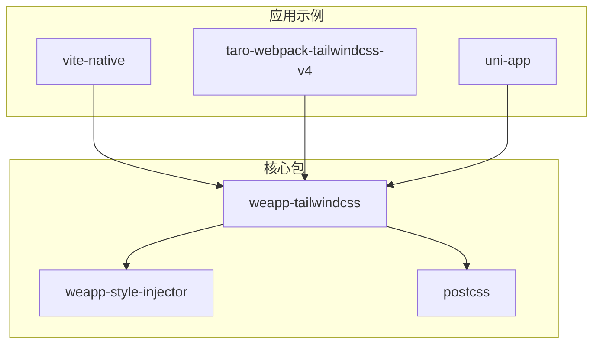
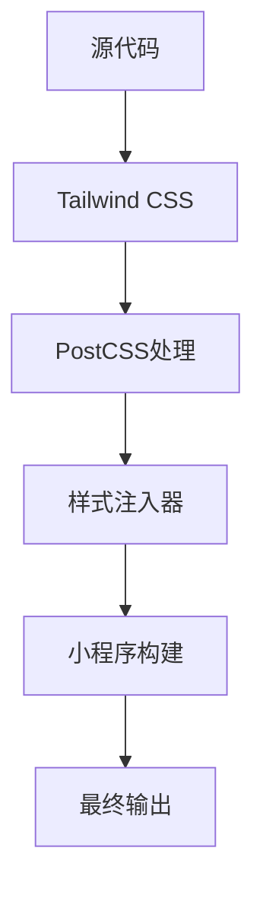
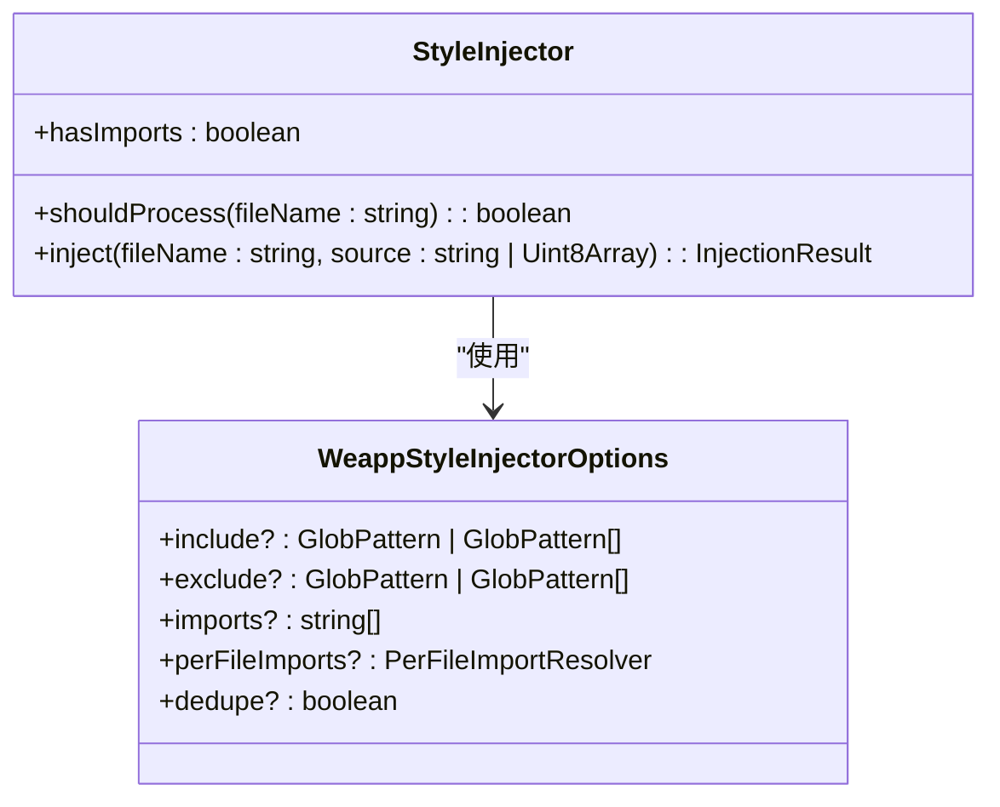
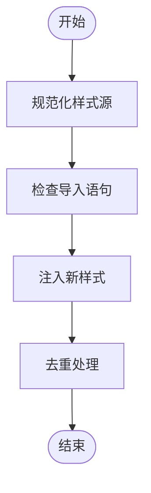
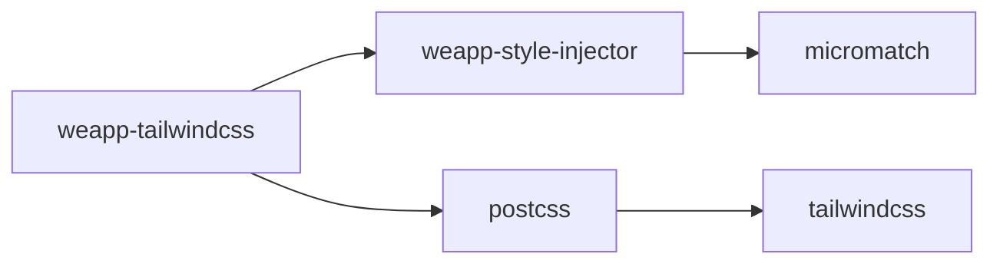

# 样式泄漏

<cite>
**本文档引用的文件**
- [core.ts](file://packages/weapp-style-injector/src/core.ts)
- [utils.ts](file://packages/weapp-style-injector/src/utils.ts)
- [index.ts](file://packages/weapp-tailwindcss/src/index.ts)
- [app.wxss](file://apps/native/dist/app.wxss)
- [index.wxss](file://apps/native/dist/pages/index/index.wxss)
- [postcss/index.ts](file://packages/postcss/src/index.ts)
</cite>

## 目录
1. [简介](#简介)
2. [项目结构](#项目结构)
3. [核心组件](#核心组件)
4. [架构概述](#架构概述)
5. [详细组件分析](#详细组件分析)
6. [依赖分析](#依赖分析)
7. [性能考虑](#性能考虑)
8. [故障排除指南](#故障排除指南)
9. [结论](#结论)

## 简介
本文档详细解释了在小程序环境中样式泄漏的根本原因，并深入探讨了weapp-tailwindcss如何通过生成唯一选择器来防止样式泄漏。文档涵盖了组件级和页面级样式的隔离机制，提供了实际代码示例展示如何正确配置样式作用域以避免泄漏。同时，文档还包含了使用scoped CSS、CSS Modules等技术的实现细节，以及对常见样式泄漏场景的诊断方法和修复方案。

## 项目结构
weapp-tailwindcss项目采用模块化设计，主要分为多个包（packages）和应用示例（apps）。核心功能由`weapp-tailwindcss`和`weapp-style-injector`等包提供，而`apps`目录下包含各种框架集成的示例应用。

**图示来源**
- [weapp-tailwindcss/src/index.ts](file://packages/weapp-tailwindcss/src/index.ts)
- [weapp-style-injector/src/index.ts](file://packages/weapp-style-injector/src/index.ts)

**本节来源**
- [weapp-tailwindcss/src/index.ts](file://packages/weapp-tailwindcss/src/index.ts)
- [weapp-style-injector/src/index.ts](file://packages/weapp-style-injector/src/index.ts)

## 核心组件
weapp-tailwindcss的核心组件包括样式注入器、PostCSS处理器和Tailwind CSS集成。这些组件共同工作，确保样式在小程序环境中正确隔离和应用。

**本节来源**
- [weapp-tailwindcss/src/index.ts](file://packages/weapp-tailwindcss/src/index.ts)
- [postcss/src/index.ts](file://packages/postcss/src/index.ts)

## 架构概述
weapp-tailwindcss的架构设计旨在解决小程序环境中的样式泄漏问题。通过生成唯一的选择器和使用scoped CSS，确保样式仅应用于特定组件或页面。

**图示来源**
- [weapp-style-injector/src/core.ts](file://packages/weapp-style-injector/src/core.ts)
- [postcss/src/index.ts](file://packages/postcss/src/index.ts)

## 详细组件分析

### 样式注入器分析
样式注入器是weapp-tailwindcss的核心组件之一，负责将生成的样式注入到小程序的wxss文件中。

#### 核心实现

**图示来源**
- [weapp-style-injector/src/core.ts](file://packages/weapp-style-injector/src/core.ts)

**本节来源**
- [weapp-style-injector/src/core.ts](file://packages/weapp-style-injector/src/core.ts)

### PostCSS处理分析
PostCSS处理器负责处理和转换CSS样式，确保它们符合小程序的要求。

#### 处理流程

**图示来源**
- [postcss/src/index.ts](file://packages/postcss/src/index.ts)

**本节来源**
- [postcss/src/index.ts](file://packages/postcss/src/index.ts)

## 依赖分析
weapp-tailwindcss项目依赖于多个核心包，这些包协同工作以实现样式隔离和注入功能。

**图示来源**
- [packages/weapp-tailwindcss/src/index.ts](file://packages/weapp-tailwindcss/src/index.ts)
- [packages/weapp-style-injector/src/index.ts](file://packages/weapp-style-injector/src/index.ts)

**本节来源**
- [packages/weapp-tailwindcss/src/index.ts](file://packages/weapp-tailwindcss/src/index.ts)
- [packages/weapp-style-injector/src/index.ts](file://packages/weapp-style-injector/src/index.ts)

## 性能考虑
weapp-tailwindcss在设计时充分考虑了性能优化，通过缓存机制和去重处理减少不必要的样式注入，提高构建效率。

## 故障排除指南
当遇到样式泄漏问题时，可以按照以下步骤进行诊断和修复：
1. 检查`weapp-style-injector`的配置是否正确
2. 确认`include`和`exclude`模式是否匹配目标文件
3. 验证`perFileImports`解析器是否正常工作
4. 检查生成的wxss文件中是否存在重复的样式导入

**本节来源**
- [weapp-style-injector/src/core.ts](file://packages/weapp-style-injector/src/core.ts)
- [weapp-style-injector/src/utils.ts](file://packages/weapp-style-injector/src/utils.ts)

## 结论
weapp-tailwindcss通过生成唯一选择器和使用scoped CSS，有效解决了小程序环境中的样式泄漏问题。其模块化设计和灵活的配置选项使其能够适应各种开发需求，为开发者提供了强大的样式管理工具。