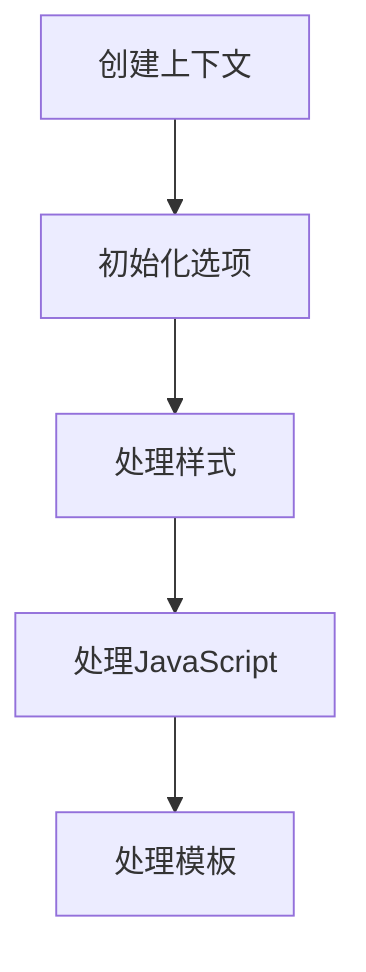

# 样式问题

<cite>
**本文档中引用的文件**  
- [core.ts](file://packages/weapp-tailwindcss/src/core.ts)
- [defaults.ts](file://packages/weapp-tailwindcss/src/defaults.ts)
- [context/index.ts](file://packages/weapp-tailwindcss/src/context/index.ts)
- [lightningcss/style-handler.ts](file://packages/weapp-tailwindcss/src/lightningcss/style-handler.ts)
- [tailwindcss/runtime.ts](file://packages/weapp-tailwindcss/src/tailwindcss/runtime.ts)
- [wxml/index.ts](file://packages/weapp-tailwindcss/src/wxml/index.ts)
- [js/index.ts](file://packages/weapp-tailwindcss/src/js/index.ts)
- [cache/index.ts](file://packages/weapp-tailwindcss/src/cache/index.ts)
- [utils/index.ts](file://packages/weapp-tailwindcss/src/utils/index.ts)
</cite>

## 目录
1. [简介](#简介)
2. [weapp-tailwindcss样式处理流程](#weapp-tailwindcss样式处理流程)
3. [常见样式问题及解决方案](#常见样式问题及解决方案)
4. [调试样式生成过程](#调试样式生成过程)
5. [样式作用域与优先级冲突解决](#样式作用域与优先级冲突解决)
6. [特殊场景处理](#特殊场景处理)
7. [@apply指令、CSS变量和自定义样式支持](#apply指令、css变量和自定义样式支持)
8. [验证样式正确性的调试技巧](#验证样式正确性的调试技巧)

## 简介

`weapp-tailwindcss` 是一个为小程序开发者提供 Tailwind CSS 原子化样式思想的全面解决方案。它支持多种构建工具（如 webpack、vite、gulp）和主流小程序框架（如 Taro、uni-app、原生小程序）。本文档旨在解决类名未生成、样式不生效、样式冲突等常见问题，详细解释样式处理流程，并提供调试和验证样式的实用技巧。

## weapp-tailwindcss样式处理流程

`weapp-tailwindcss` 的样式处理流程从类名提取到 CSS 生成的完整链路如下：

1. **上下文创建**：通过 `createContext` 函数创建一个上下文对象，用于处理小程序的模板、样式和脚本转换。
2. **选项初始化**：使用 `getCompilerContext` 函数获取用户定义的选项并初始化相关的处理程序和补丁。
3. **样式处理**：调用 `transformWxss` 方法处理原始 CSS 代码，生成适配小程序环境的样式。
4. **JavaScript 处理**：调用 `transformJs` 方法处理 JavaScript 代码中的类名，确保动态类名被正确处理。
5. **模板处理**：调用 `transformWxml` 方法处理 WXML 模板中的类名，确保类名在模板中正确应用。

**Diagram sources**
- [core.ts](file://packages/weapp-tailwindcss/src/core.ts#L13-L75)
- [context/index.ts](file://packages/weapp-tailwindcss/src/context/index.ts#L130-L132)

**Section sources**
- [core.ts](file://packages/weapp-tailwindcss/src/core.ts#L13-L75)
- [context/index.ts](file://packages/weapp-tailwindcss/src/context/index.ts#L130-L132)

## 常见样式问题及解决方案

### 类名未生成

**问题描述**：在某些情况下，预期的 Tailwind CSS 类名没有被生成。

**解决方案**：
- 确保 `tailwind.config.js` 文件中正确配置了 `content` 字段，包含所有需要扫描的文件路径。
- 检查 `weapp-tailwindcss` 插件是否正确安装并配置。
- 使用 `createContext` 函数时，确保传递了正确的选项。

### 样式不生效

**问题描述**：生成的样式在小程序中不生效。

**解决方案**：
- 确认生成的 CSS 文件是否正确引入到小程序项目中。
- 检查是否有其他样式覆盖了生成的样式。
- 使用浏览器开发者工具检查生成的 CSS 是否正确应用。

### 样式冲突

**问题描述**：不同组件或模块之间的样式发生冲突。

**解决方案**：
- 使用 `cssSelectorReplacement` 配置项来替换特定的选择器，避免冲突。
- 确保每个组件的样式作用域独立，避免全局样式污染。

**Section sources**
- [defaults.ts](file://packages/weapp-tailwindcss/src/defaults.ts#L44-L137)
- [lightningcss/style-handler.ts](file://packages/weapp-tailwindcss/src/lightningcss/style-handler.ts#L1-L485)

## 调试样式生成过程

### 检查生成的CSS文件

1. **查看生成的 CSS 文件**：在构建输出目录中找到生成的 CSS 文件，检查其中是否包含预期的类名。
2. **验证类名匹配**：使用正则表达式或其他工具验证生成的类名是否与预期一致。

### 验证类名匹配

1. **手动验证**：在生成的 CSS 文件中搜索特定的类名，确认其存在且正确。
2. **自动化测试**：编写单元测试，验证生成的类名是否符合预期。

**Section sources**
- [lightningcss/style-handler.ts](file://packages/weapp-tailwindcss/src/lightningcss/style-handler.ts#L1-L485)
- [tailwindcss/runtime.ts](file://packages/weapp-tailwindcss/src/tailwindcss/runtime.ts#L1-L230)

## 样式作用域与优先级冲突解决

### 样式作用域

**问题描述**：样式作用域不明确，导致样式被意外覆盖。

**解决方案**：
- 使用 `cssSelectorReplacement` 配置项来替换特定的选择器，确保样式作用域独立。
- 在组件级别使用 `scoped` 样式，避免全局样式污染。

### 优先级冲突

**问题描述**：不同样式的优先级冲突，导致某些样式不生效。

**解决方案**：
- 使用 `!important` 关键字提高特定样式的优先级。
- 调整 CSS 选择器的特异性，确保高优先级的样式具有更高的特异性。

**Section sources**
- [defaults.ts](file://packages/weapp-tailwindcss/src/defaults.ts#L44-L137)
- [lightningcss/style-handler.ts](file://packages/weapp-tailwindcss/src/lightningcss/style-handler.ts#L1-L485)

## 特殊场景处理

### 动态类名

**问题描述**：动态生成的类名无法被正确识别和处理。

**解决方案**：
- 使用 `jsPreserveClass` 配置项来保留特定的类名。
- 在 JavaScript 中使用 `template literals` 或 `string concatenation` 来生成动态类名。

### 条件类名

**问题描述**：条件生成的类名无法被正确识别和处理。

**解决方案**：
- 使用 `template literals` 或 `ternary operators` 来生成条件类名。
- 确保条件逻辑在构建时可以被静态分析。

**Section sources**
- [js/index.ts](file://packages/weapp-tailwindcss/src/js/index.ts#L1-L55)
- [wxml/index.ts](file://packages/weapp-tailwindcss/src/wxml/index.ts#L1-L3)

## @apply指令、CSS变量和自定义样式支持

### @apply指令

**支持情况**：`weapp-tailwindcss` 支持 `@apply` 指令，但需要注意在小程序环境中可能存在的限制。

**限制**：某些复杂的 `@apply` 指令可能无法完全转换，建议尽量使用简单的类名组合。

### CSS变量

**支持情况**：`weapp-tailwindcss` 支持 CSS 变量，但需要确保小程序环境支持这些变量。

**限制**：某些小程序平台可能不支持最新的 CSS 变量特性，建议进行兼容性测试。

### 自定义样式

**支持情况**：`weapp-tailwindcss` 允许通过 `customAttributes` 配置项添加自定义属性。

**限制**：自定义属性需要手动处理，确保在小程序环境中正确应用。

**Section sources**
- [defaults.ts](file://packages/weapp-tailwindcss/src/defaults.ts#L44-L137)
- [context/index.ts](file://packages/weapp-tailwindcss/src/context/index.ts#L92-L100)

## 验证样式正确性的调试技巧

### 使用开发者工具

1. **检查生成的 CSS**：使用浏览器开发者工具检查生成的 CSS 文件，确保类名和样式正确。
2. **调试 JavaScript**：使用断点调试 JavaScript 代码，确保动态类名被正确生成和应用。

### 日志记录

1. **启用日志**：在 `weapp-tailwindcss` 配置中启用日志记录，查看详细的处理过程。
2. **分析日志**：分析日志输出，查找潜在的问题和错误。

### 单元测试

1. **编写测试用例**：编写单元测试，验证生成的类名和样式是否符合预期。
2. **运行测试**：定期运行测试，确保样式处理流程的稳定性。

**Section sources**
- [tailwindcss/runtime.ts](file://packages/weapp-tailwindcss/src/tailwindcss/runtime.ts#L1-L230)
- [cache/index.ts](file://packages/weapp-tailwindcss/src/cache/index.ts#L1-L151)