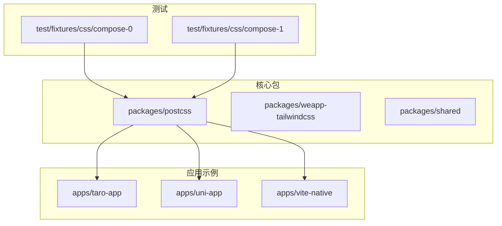
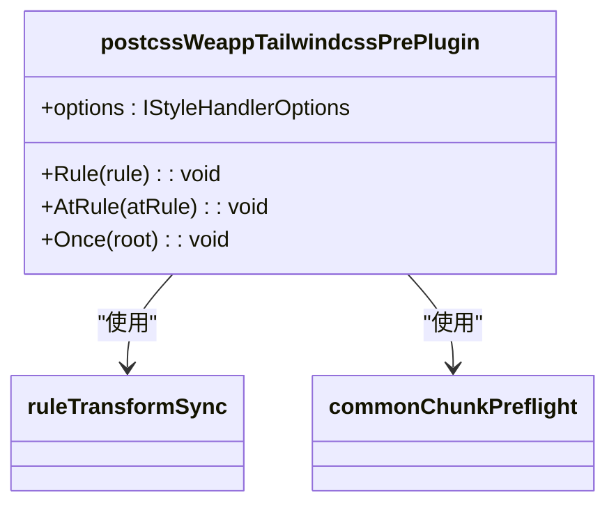
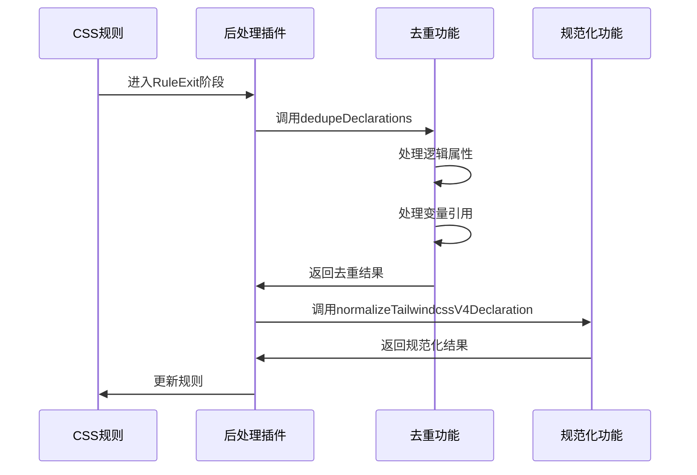
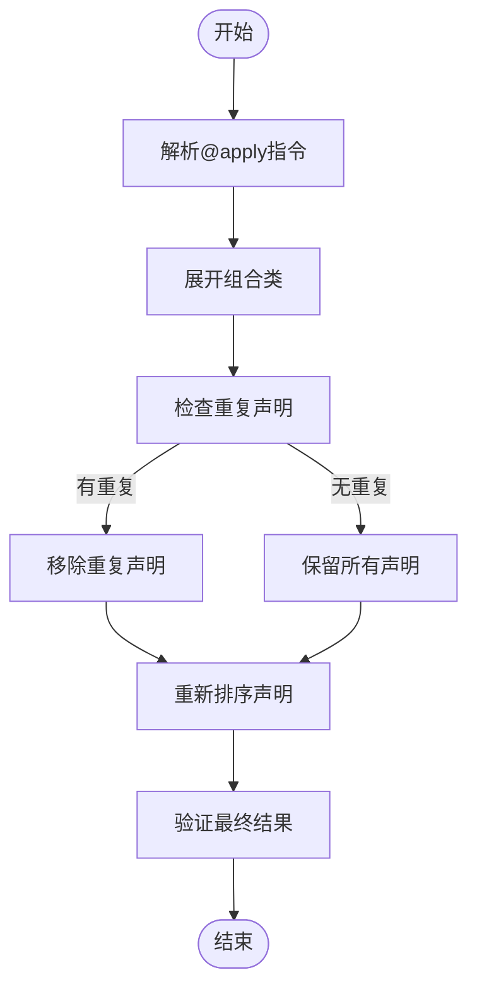
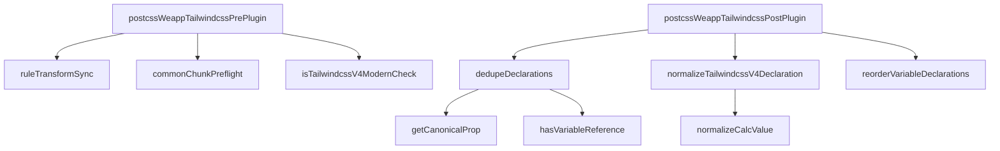

# @apply指令支持

<cite>
**本文档引用的文件**
- [pre.ts](file://packages/postcss/src/plugins/pre.ts)
- [post.ts](file://packages/postcss/src/plugins/post.ts)
- [pipeline.ts](file://packages/postcss/src/pipeline.ts)
- [handler.ts](file://packages/postcss/src/handler.ts)
- [types.ts](file://packages/postcss/src/types.ts)
- [compose-0/index.css](file://packages/postcss/test/fixtures/css/compose-0/index.css)
- [compose-1/index.css](file://packages/postcss/test/fixtures/css/compose-1/index.css)
</cite>

## 目录
1. [简介](#简介)
2. [项目结构](#项目结构)
3. [核心组件](#核心组件)
4. [架构概述](#架构概述)
5. [详细组件分析](#详细组件分析)
6. [依赖分析](#依赖分析)
7. [性能考虑](#性能考虑)
8. [故障排除指南](#故障排除指南)
9. [结论](#结论)
10. [附录](#附录)（如有必要）

## 简介
本文档详细说明了weapp-tailwindcss如何处理@apply指令，包括在小程序环境中的工作机制、预处理和后处理阶段的实现细节。文档涵盖了@apply在不同框架（如Taro、uni-app）中的兼容性情况，提供了使用@apply的最佳实践和常见问题解决方案，如样式覆盖顺序、作用域问题等。同时包含在JIT模式下@apply的处理方式和性能考虑。

## 项目结构
weapp-tailwindcss项目的结构主要分为多个应用示例、核心包和测试文件。核心功能实现在packages/postcss目录下，特别是plugins/pre.ts和plugins/post.ts文件中处理@apply指令的关键逻辑。



**图示来源**
- [pre.ts](file://packages/postcss/src/plugins/pre.ts)
- [post.ts](file://packages/postcss/src/plugins/post.ts)

**本节来源**
- [pre.ts](file://packages/postcss/src/plugins/pre.ts)
- [post.ts](file://packages/postcss/src/plugins/post.ts)

## 核心组件
weapp-tailwindcss处理@apply指令的核心组件包括预处理插件（pre.ts）和后处理插件（post.ts）。这些组件共同协作，确保@apply指令在小程序环境中正确解析和应用。

**本节来源**
- [pre.ts](file://packages/postcss/src/plugins/pre.ts#L1-L140)
- [post.ts](file://packages/postcss/src/plugins/post.ts#L1-L334)

## 架构概述
weapp-tailwindcss的@apply指令处理架构分为三个主要阶段：预处理、正常处理和后处理。每个阶段都有特定的职责，确保样式规则正确转换和优化。

```mermaid
graph LR
A[源CSS] --> B[预处理阶段]
B --> C[正常处理阶段]
C --> D[后处理阶段]
D --> E[输出CSS]
B --> |处理@apply| F[展开组合类]
C --> |兼容性转换| G[预设环境]
D --> |优化| H[去重和排序]
```

**图示来源**
- [pipeline.ts](file://packages/postcss/src/pipeline.ts#L67-L278)
- [handler.ts](file://packages/postcss/src/handler.ts#L10-L44)

## 详细组件分析

### 预处理组件分析
预处理阶段负责处理@apply指令的初始解析和转换。在pre.ts文件中，通过postcssWeappTailwindcssPrePlugin插件实现。



**图示来源**
- [pre.ts](file://packages/postcss/src/plugins/pre.ts#L63-L140)

**本节来源**
- [pre.ts](file://packages/postcss/src/plugins/pre.ts#L1-L140)

### 后处理组件分析
后处理阶段负责对@apply指令处理后的CSS进行优化和清理。在post.ts文件中，通过postcssWeappTailwindcssPostPlugin插件实现。



**图示来源**
- [post.ts](file://packages/postcss/src/plugins/post.ts#L273-L334)
- [types.ts](file://packages/postcss/src/types.ts#L51-L67)

**本节来源**
- [post.ts](file://packages/postcss/src/plugins/post.ts#L1-L334)

### 组合类处理分析
@apply指令的核心功能是组合类的处理，这在compose-0和compose-1测试用例中得到了验证。



**图示来源**
- [compose-0/index.css](file://packages/postcss/test/fixtures/css/compose-0/index.css#L4-L8)
- [compose-1/index.css](file://packages/postcss/test/fixtures/css/compose-1/index.css#L4)

**本节来源**
- [compose-0/index.css](file://packages/postcss/test/fixtures/css/compose-0/index.css)
- [compose-1/index.css](file://packages/postcss/test/fixtures/css/compose-1/index.css)

## 依赖分析
weapp-tailwindcss的@apply指令处理依赖于多个核心模块和第三方库，形成了复杂的依赖关系网络。



**图示来源**
- [pre.ts](file://packages/postcss/src/plugins/pre.ts)
- [post.ts](file://packages/postcss/src/plugins/post.ts)
- [types.ts](file://packages/postcss/src/types.ts)

**本节来源**
- [pre.ts](file://packages/postcss/src/plugins/pre.ts)
- [post.ts](file://packages/postcss/src/plugins/post.ts)

## 性能考虑
在处理@apply指令时，需要考虑多个性能因素，包括处理速度、内存使用和最终CSS文件大小。

- **处理速度**：通过缓存机制和流水线优化提高处理速度
- **内存使用**：避免在处理过程中创建不必要的对象
- **文件大小**：通过去重和压缩减少最终CSS文件大小
- **JIT模式**：在JIT模式下，只处理实际使用的类，提高性能

## 故障排除指南
在使用@apply指令时可能会遇到一些常见问题，以下是一些解决方案：

**本节来源**
- [pre.ts](file://packages/postcss/src/plugins/pre.ts)
- [post.ts](file://packages/postcss/src/plugins/post.ts)

## 结论
weapp-tailwindcss通过预处理和后处理两个阶段，有效地支持了@apply指令在小程序环境中的使用。通过合理的架构设计和优化策略，确保了样式处理的正确性和性能。

## 附录
本文档基于weapp-tailwindcss项目的实际代码分析而成，所有信息均来自项目源码。