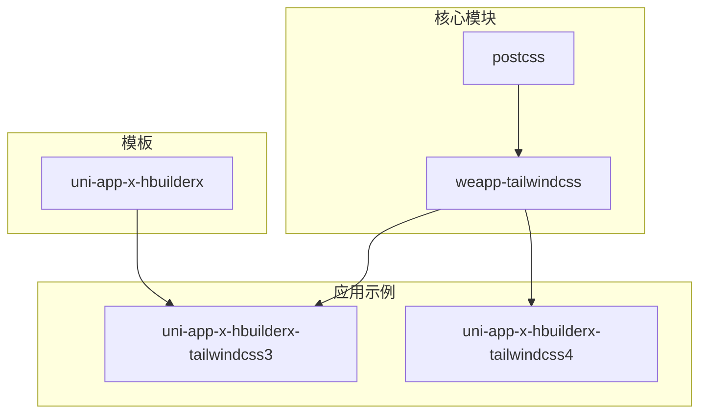
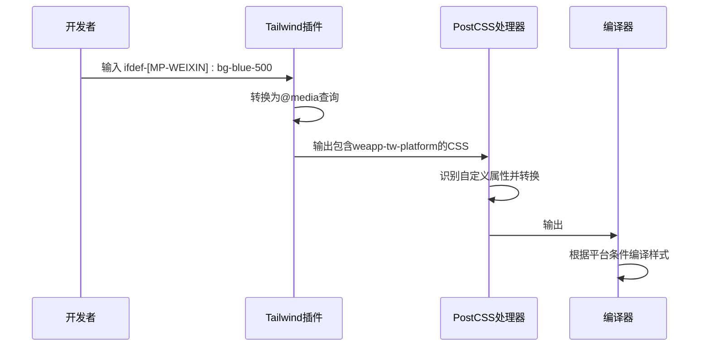
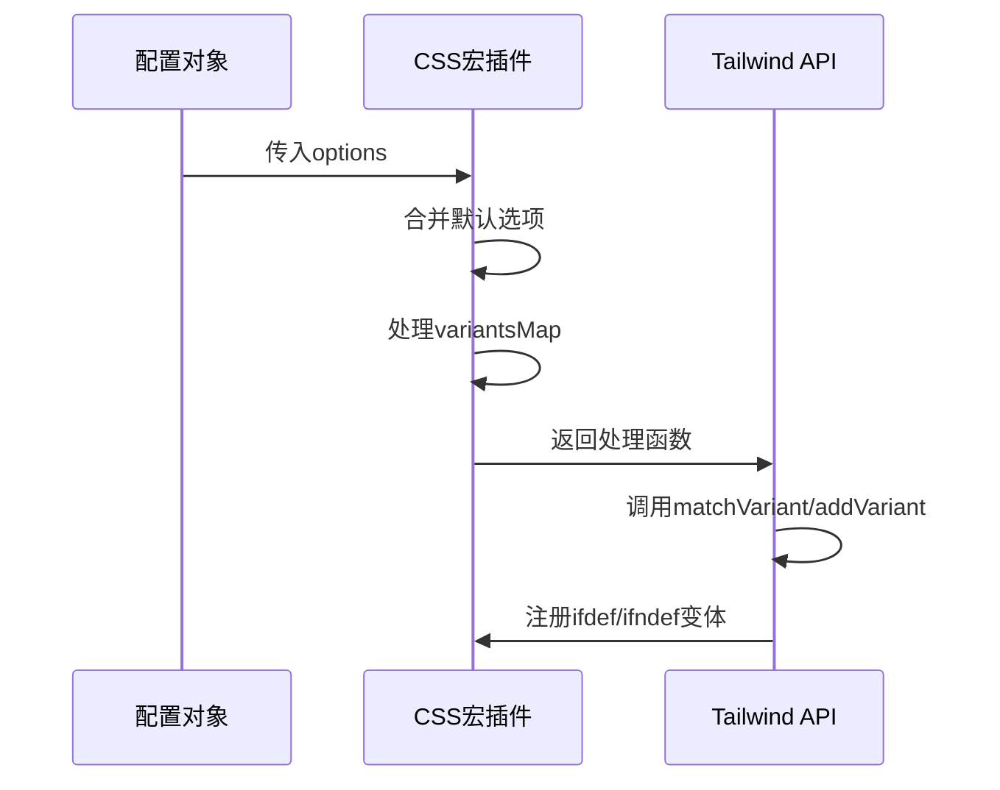
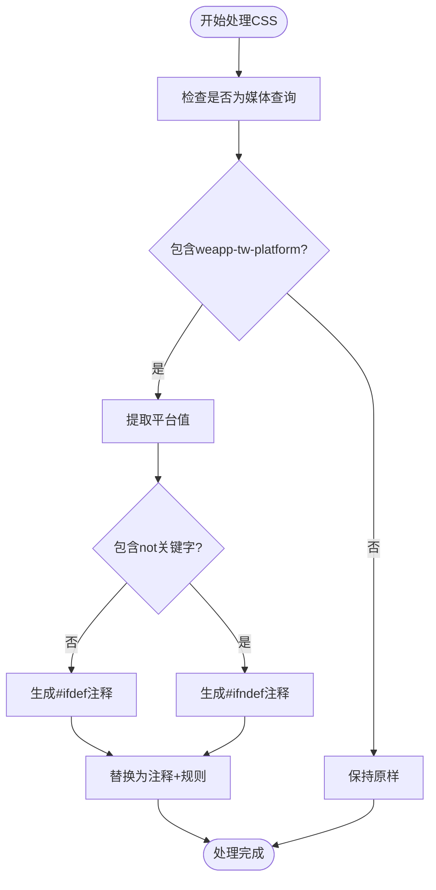
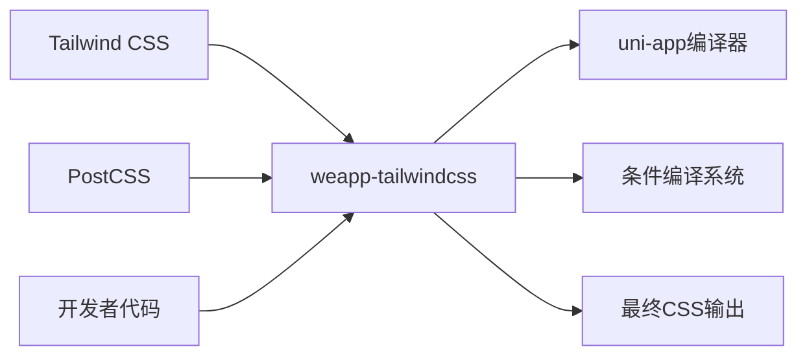

# CSS宏使用

<cite>
**本文档中引用的文件**  
- [css-macro/index.ts](file://packages/weapp-tailwindcss/src/css-macro/index.ts)
- [css-macro/constants.ts](file://packages/weapp-tailwindcss/src/css-macro/constants.ts)
- [css-macro/postcss.ts](file://packages/weapp-tailwindcss/src/css-macro/postcss.ts)
- [presets/uni-app-x.ts](file://packages/weapp-tailwindcss/src/presets/uni-app-x.ts)
- [compat/uni-app-x.ts](file://packages/postcss/src/compat/uni-app-x.ts)
- [uni-app-x.test.ts](file://packages/weapp-tailwindcss/test/uni-app-x.test.ts)
- [index.test.ts](file://packages/weapp-tailwindcss/test/css-macro/index.test.ts)
- [snap.test.ts](file://packages/weapp-tailwindcss/test/css-macro/snap.test.ts)
</cite>

## 目录
1. [简介](#简介)
2. [项目结构](#项目结构)
3. [核心组件](#核心组件)
4. [架构概述](#架构概述)
5. [详细组件分析](#详细组件分析)
6. [依赖分析](#依赖分析)
7. [性能考虑](#性能考虑)
8. [故障排除指南](#故障排除指南)
9. [结论](#结论)

## 简介
本文档详细介绍了在uni-app-x等环境中使用CSS宏的指导。重点说明了CSS宏的定义、注册和调用机制，涵盖CSS宏与普通CSS规则的交互方式以及在构建过程中的处理流程。同时提供创建自定义CSS宏的最佳实践和调试技巧，并包含不同平台间的兼容性考虑和性能影响评估。

## 项目结构
本项目采用模块化设计，主要包含以下几个关键目录：
- `packages/weapp-tailwindcss`: 核心功能实现，包括CSS宏相关代码
- `packages/postcss`: PostCSS插件处理逻辑
- `apps/`: 各种应用示例，特别是uni-app-x相关的实现
- `templates/`: 模板文件，展示实际使用场景

这些结构共同支持CSS宏在不同环境下的灵活应用。



**图示来源**
- [css-macro/index.ts](file://packages/weapp-tailwindcss/src/css-macro/index.ts#L1-L58)
- [presets/uni-app-x.ts](file://packages/weapp-tailwindcss/src/presets/uni-app-x.ts#L1-L63)

**本节来源**
- [project_structure](file://#L1-L1000)

## 核心组件
CSS宏的核心实现位于`weapp-tailwindcss`包中，主要包括三个主要部分：Tailwind插件、PostCSS处理器和配置预设。这些组件协同工作，实现了从开发到生产的完整CSS宏处理流程。

**本节来源**
- [css-macro/index.ts](file://packages/weapp-tailwindcss/src/css-macro/index.ts#L1-L58)
- [css-macro/postcss.ts](file://packages/weapp-tailwindcss/src/css-macro/postcss.ts#L1-L57)

## 架构概述
整个CSS宏系统基于Tailwind插件和PostCSS处理器的双重处理机制。首先通过Tailwind插件将条件编译语法转换为媒体查询，然后通过PostCSS插件将媒体查询转换为实际的条件编译注释。



**图示来源**
- [css-macro/index.ts](file://packages/weapp-tailwindcss/src/css-macro/index.ts#L21-L58)
- [css-macro/postcss.ts](file://packages/weapp-tailwindcss/src/css-macro/postcss.ts#L6-L56)

## 详细组件分析

### CSS宏插件分析
CSS宏插件实现了Tailwind插件接口，提供动态和静态两种变体定义方式。动态模式支持`ifdef`和`ifndef`语法，静态模式通过`variantsMap`配置预定义变体。

#### 对象导向组件
```mermaid
classDiagram
class CssMacro {
+Options options
+Required~Options~ defaultOptions
+plugin.withOptions() cssMacro
}
class Options {
+Record~string, string | { value : string, negative? : boolean }~ variantsMap
+boolean dynamic
}
class NormalizedVariant {
+string name
+boolean negative
+string value
}
CssMacro --> Options : "使用"
CssMacro --> NormalizedVariant : "生成"
```

**图示来源**
- [css-macro/index.ts](file://packages/weapp-tailwindcss/src/css-macro/index.ts#L5-L58)

#### API/服务组件


**图示来源**
- [css-macro/index.ts](file://packages/weapp-tailwindcss/src/css-macro/index.ts#L21-L58)

### PostCSS处理器分析
PostCSS处理器负责将Tailwind生成的特殊媒体查询转换为实际的条件编译注释，这是实现跨平台样式的最后一步。

#### 复杂逻辑组件


**图示来源**
- [css-macro/postcss.ts](file://packages/weapp-tailwindcss/src/css-macro/postcss.ts#L6-L56)

**本节来源**
- [css-macro/index.ts](file://packages/weapp-tailwindcss/src/css-macro/index.ts#L1-L58)
- [css-macro/postcss.ts](file://packages/weapp-tailwindcss/src/css-macro/postcss.ts#L1-L57)
- [css-macro/constants.ts](file://packages/weapp-tailwindcss/src/css-macro/constants.ts#L1-L77)

## 依赖分析
CSS宏系统依赖于多个核心包和工具，形成了一个完整的处理链条。



**图示来源**
- [package.json](file://packages/weapp-tailwindcss/package.json#L1-L50)
- [css-macro/index.ts](file://packages/weapp-tailwindcss/src/css-macro/index.ts#L1-L58)

**本节来源**
- [css-macro/index.ts](file://packages/weapp-tailwindcss/src/css-macro/index.ts#L1-L58)
- [css-macro/postcss.ts](file://packages/weapp-tailwindcss/src/css-macro/postcss.ts#L1-L57)

## 性能考虑
CSS宏的处理发生在构建阶段，对运行时性能没有直接影响。但由于增加了额外的处理步骤，可能会轻微增加构建时间。建议在生产环境中启用缓存机制以优化构建性能。

## 故障排除指南
当遇到CSS宏不生效的问题时，可以按照以下步骤进行排查：

**本节来源**
- [index.test.ts](file://packages/weapp-tailwindcss/test/css-macro/index.test.ts#L1-L37)
- [snap.test.ts](file://packages/weapp-tailwindcss/test/css-macro/snap.test.ts#L1-L29)
- [uni-app-x.test.ts](file://packages/weapp-tailwindcss/test/uni-app-x.test.ts#L1-L37)

## 结论
CSS宏为uni-app-x等跨平台开发环境提供了强大的样式条件编译能力。通过Tailwind插件和PostCSS处理器的协同工作，开发者可以使用简洁的语法实现复杂的平台特定样式控制。建议在项目中合理使用自定义变体映射来提高开发效率，并注意构建性能的优化。