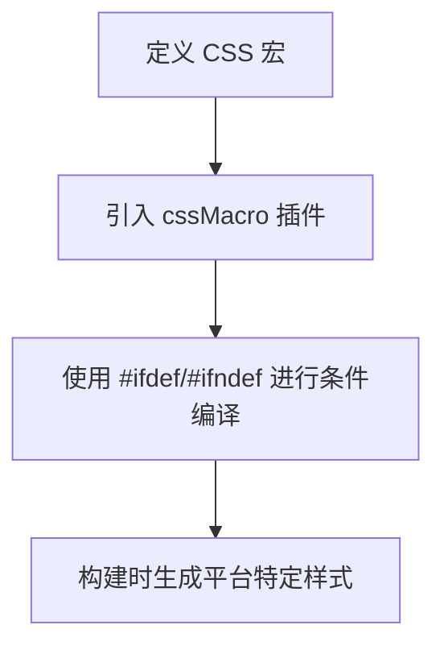

# 特殊语法支持

<cite>
**本文档中引用的文件**  
- [index.ts](file://packages/weapp-tailwindcss/src/index.ts)
- [transform.ts](file://packages/weapp-tailwindcss/src/uni-app-x/transform.ts)
- [css-macro/index.ts](file://packages/weapp-tailwindcss/src/css-macro/index.ts)
- [css-macro/postcss.ts](file://packages/weapp-tailwindcss/src/css-macro/postcss.ts)
- [css-macro/constants.ts](file://packages/weapp-tailwindcss/src/css-macro/constants.ts)
- [uni-app-x.ts](file://packages/weapp-tailwindcss/src/presets/uni-app-x.ts)
- [patcher.ts](file://packages/weapp-tailwindcss/src/tailwindcss/v4/patcher.ts)
- [style-handler.ts](file://packages/weapp-tailwindcss/src/lightningcss/style-handler.ts)
</cite>

## 目录
1. [介绍](#介绍)
2. [@apply 指令支持机制与限制](#apply-指令支持机制与限制)
3. [CSS 变量处理方式](#css-变量处理方式)
4. [calc() 函数与数学表达式支持](#calc-函数与数学表达式支持)
5. [uni-app-x 环境中的 CSS 宏使用指导](#uni-app-x-环境中的-css-宏使用指导)
6. [现代 CSS 特性兼容性处理](#现代-css-特性兼容性处理)

## 介绍
`weapp-tailwindcss` 是一个专为小程序环境设计的 Tailwind CSS 集成工具，支持在微信小程序、uni-app、Taro 等多端框架中使用 Tailwind CSS。本文档重点解决在小程序环境中使用特殊 CSS 语法（如 `@apply`、CSS 变量、`calc()` 函数等）时可能遇到的问题，并提供详细的故障排除指南和替代方案。

## @apply 指令支持机制与限制
`weapp-tailwindcss` 通过 PostCSS 插件和编译时转换机制支持 `@apply` 指令。该指令允许开发者在 CSS 中复用 Tailwind 的实用类，但在小程序环境中存在一些限制。

- **支持机制**：`weapp-tailwindcss` 在构建过程中解析 CSS 文件，将 `@apply` 指令转换为对应的具体样式规则，并注入到最终的样式表中。
- **限制**：
  - `@apply` 指令不能在动态类名中使用。
  - 在 `uni-app-x` 环境中，`@apply` 指令的处理需要通过特定的 Vite 插件进行预处理。
  - 某些复杂的嵌套规则可能无法完全转换，建议使用原子化类名代替。

**Section sources**
- [index.ts](file://packages/weapp-tailwindcss/src/index.ts#L1-L5)
- [patcher.ts](file://packages/weapp-tailwindcss/src/tailwindcss/v4/patcher.ts#L1-L403)

## CSS 变量处理方式
CSS 变量在小程序环境中需要特殊处理，因为小程序原生不支持 CSS 自定义属性。`weapp-tailwindcss` 提供了将 Tailwind 的 CSS 变量转换为小程序支持格式的机制。

- **转换机制**：通过 `cssPresetEnv` 配置，可以控制是否保留 CSS 变量。默认情况下，`weapp-tailwindcss` 会将 CSS 变量转换为具体的像素值或使用 `var()` 函数进行替换。
- **uni-app-x 支持**：在 `uni-app-x` 环境中，可以通过 `uniAppX` 配置启用对 CSS 变量的支持，并结合条件编译实现跨平台兼容。

**Section sources**
- [style-handler.ts](file://packages/weapp-tailwindcss/src/lightningcss/style-handler.ts#L1-L485)
- [uni-app-x.ts](file://packages/weapp-tailwindcss/src/presets/uni-app-x.ts#L1-L63)

## calc() 函数与数学表达式支持
`calc()` 函数在小程序环境中受到一定限制，但 `weapp-tailwindcss` 通过 PostCSS 插件和编译时计算支持大部分 `calc()` 表达式。

- **支持情况**：
  - 基本的加减乘除运算（如 `calc(100% - 20px)`）被完全支持。
  - 嵌套的 `calc()` 表达式（如 `calc(calc(100% - 20px) / 2)`）也被支持。
  - 在 `uni-app-x` 环境中，`calc()` 函数可以直接使用，无需额外转换。
- **限制**：
  - 某些复杂的数学函数（如 `min()`、`max()`）可能需要通过条件编译或 JavaScript 动态计算实现。

**Section sources**
- [style-handler.ts](file://packages/weapp-tailwindcss/src/lightningcss/style-handler.ts#L1-L485)
- [constants.ts](file://packages/weapp-tailwindcss/src/css-macro/constants.ts#L1-L77)

## uni-app-x 环境中的 CSS 宏使用指导
`uni-app-x` 是一个支持多端构建的框架，`weapp-tailwindcss` 提供了专门的插件和配置来支持其 CSS 宏功能。

- **CSS 宏定义**：通过 `cssMacro` 插件，可以在 CSS 中定义宏，用于条件编译和平台特定样式。
- **使用方法**：
  - 在 `tailwind.config.js` 中引入 `cssMacro` 插件。
  - 使用 `#ifdef` 和 `#ifndef` 指令进行条件编译。
  - 通过 `matchVariant` 和 `addVariant` API 扩展自定义变体。

**Diagram sources**
- [css-macro/index.ts](file://packages/weapp-tailwindcss/src/css-macro/index.ts#L1-L59)
- [css-macro/postcss.ts](file://packages/weapp-tailwindcss/src/css-macro/postcss.ts#L1-L57)

**Section sources**
- [css-macro/index.ts](file://packages/weapp-tailwindcss/src/css-macro/index.ts#L1-L59)
- [css-macro/postcss.ts](file://packages/weapp-tailwindcss/src/css-macro/postcss.ts#L1-L57)

## 现代 CSS 特性兼容性处理
`weapp-tailwindcss` 通过集成 `lightningcss` 和 `postcss-preset-env` 实现对现代 CSS 特性的兼容性处理。

- **支持的特性**：
  - `:is()` 和 `:where()` 伪类选择器。
  - `custom-properties`（CSS 变量）的保留与转换。
  - `cascade-layers`（层叠上下文）。
- **处理方式**：
  - 使用 `lightningcss` 进行高效的 CSS 转换和压缩。
  - 通过 `cssPresetEnv` 配置启用或禁用特定的 CSS 特性。
  - 在 `uni-app-x` 环境中，自动适配平台特定的 CSS 规则。

**Section sources**
- [style-handler.ts](file://packages/weapp-tailwindcss/src/lightningcss/style-handler.ts#L1-L485)
- [uni-app-x.ts](file://packages/weapp-tailwindcss/src/presets/uni-app-x.ts#L1-L63)