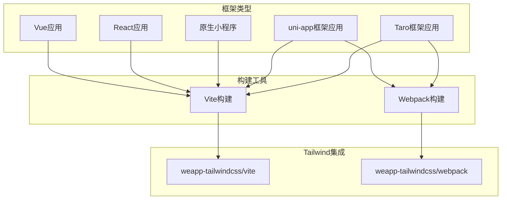
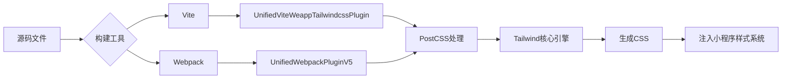
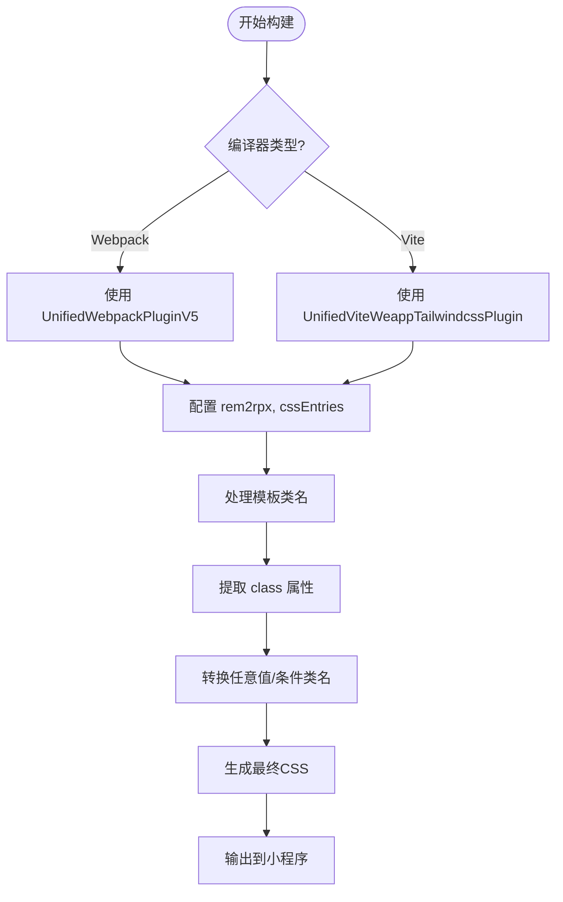
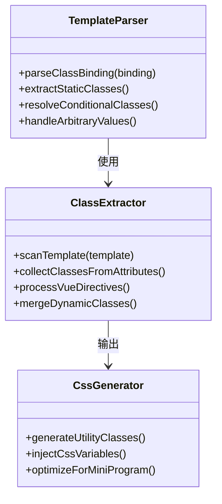
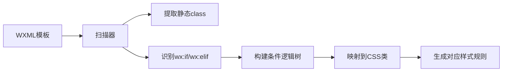

# 框架特定问题

<cite>
**本文档引用文件**  
- [index.vue](file://demo/uni-app/src/pages/index/index.vue)
- [index.vue](file://demo/taro-vue3-app/src/pages/index/index.vue)
- [index.wxml](file://demo/native/pages/index/index.wxml)
- [vite.config.ts](file://demo/uni-app-x-hbuilderx-tailwindcss4/vite.config.ts)
- [index.ts](file://demo/taro-webpack-tailwindcss-v4/config/index.ts)
- [vite.config.ts](file://apps/vite-native/vite.config.ts)
- [index.ts](file://demo/taro-vite-tailwindcss-v4/config/index.ts)
- [vue.config.js](file://demo/uni-app-webpack-tailwindcss-v4/vue.config.js)
</cite>

## 目录
1. [简介](#简介)
2. [项目结构](#项目结构)
3. [核心组件](#核心组件)
4. [架构概述](#架构概述)
5. [详细组件分析](#详细组件分析)
6. [依赖分析](#依赖分析)
7. [性能考虑](#性能考虑)
8. [故障排除指南](#故障排除指南)
9. [结论](#结论)

## 简介
本文档旨在深入分析不同前端框架（如Taro、uni-app、原生小程序等）在类名生成方面的差异与挑战。通过研究各框架的模板语法（如Taro的JSX、uni-app的Vue语法、原生小程序的WXML）对类名提取的影响，结合构建工具（Vite、Webpack）的配置差异，提供全面的排查方案和最佳实践建议，确保Tailwind CSS类名在多框架环境下正确生成并生效。

## 项目结构
本项目为一个多应用仓库，包含多个基于不同框架和技术栈的小程序示例，涵盖Taro、uni-app、原生微信小程序等多种实现方式。每个子项目独立配置，支持Vite或Webpack构建流程，并集成weapp-tailwindcss插件以实现Tailwind CSS在小程序环境中的兼容性处理。



**Diagram sources**  
- [vite.config.ts](file://demo/uni-app-x-hbuilderx-tailwindcss4/vite.config.ts)
- [index.ts](file://demo/taro-webpack-tailwindcss-v4/config/index.ts)

**Section sources**
- [vite.config.ts](file://demo/uni-app-x-hbuilderx-tailwindcss4/vite.config.ts)
- [index.ts](file://demo/taro-webpack-tailwindcss-v4/config/index.ts)

## 核心组件
系统核心在于`weapp-tailwindcss`提供的Vite与Webpack插件，分别通过`UnifiedViteWeappTailwindcssPlugin`和`UnifiedWebpackPluginV5`实现对不同构建流程的支持。这些插件负责解析模板中的动态类名、处理条件编译语法（ifdef/ifndef）、转换CSS变量、支持任意值语法（arbitrary values）等功能，确保Tailwind类名能在小程序运行时正确注入。

**Section sources**
- [vite.config.ts](file://demo/uni-app-x-hbuilderx-tailwindcss4/vite.config.ts)
- [index.ts](file://demo/taro-webpack-tailwindcss-v4/config/index.ts)
- [vue.config.js](file://demo/uni-app-webpack-tailwindcss-v4/vue.config.js)

## 架构概述
整体架构采用插件化设计，通过统一接口适配不同框架和构建工具。Vite和Webpack分别通过各自的插件机制加载`weapp-tailwindcss`提供的处理器，完成从源码扫描、类名提取、CSS生成到最终注入的完整流程。PostCSS作为中间层，结合Tailwind核心功能与自定义转换逻辑，实现跨平台样式兼容。



**Diagram sources**  
- [vite.config.ts](file://apps/vite-native/vite.config.ts)
- [index.ts](file://demo/taro-webpack-tailwindcss-v4/config/index.ts)

## 详细组件分析

### Taro框架类名处理分析
Taro框架支持多种构建方式（Vite/Webpack），其类名提取需结合框架自身的编译流程。在Webpack模式下，通过`webpackChain`注入`UnifiedWebpackPluginV5`插件；在Vite模式下，则通过`vitePlugins`注册`UnifiedViteWeappTailwindcssPlugin`。

#### 配置流程图


**Diagram sources**  
- [index.ts](file://demo/taro-webpack-tailwindcss-v4/config/index.ts)
- [index.ts](file://demo/taro-vite-tailwindcss-v4/config/index.ts)

**Section sources**
- [index.ts](file://demo/taro-webpack-tailwindcss-v4/config/index.ts)
- [index.ts](file://demo/taro-vite-tailwindcss-v4/config/index.ts)

### uni-app框架类名处理分析
uni-app使用Vue模板语法，其类名提取需兼容`v-bind:class`、三元表达式、数组语法等多种动态绑定方式。在Webpack构建中通过`configureWebpack`添加插件，在Vite中则直接在`vite.config.ts`中注册。

#### 动态类名支持示例


**Diagram sources**  
- [vue.config.js](file://demo/uni-app-webpack-tailwindcss-v4/vue.config.js)
- [vite.config.ts](file://demo/uni-app-x-hbuilderx-tailwindcss4/vite.config.ts)

**Section sources**
- [vue.config.js](file://demo/uni-app-webpack-tailwindcss-v4/vue.config.js)
- [vite.config.ts](file://demo/uni-app-x-hbuilderx-tailwindcss4/vite.config.ts)

### 原生小程序类名处理分析
原生小程序使用WXML模板，语法相对固定，但缺乏现代框架的动态能力。类名提取主要依赖静态分析，支持`wx:if`、`wx:elif`、`wx:else`等条件渲染指令，以及`hover-class`等特殊属性。

#### WXML类名提取流程


**Diagram sources**  
- [index.wxml](file://demo/native/pages/index/index.wxml)

**Section sources**
- [index.wxml](file://demo/native/pages/index/index.wxml)

## 依赖分析
项目依赖关系清晰，核心为`weapp-tailwindcss`包提供的构建插件，根据不同构建工具选择对应模块。Vite项目依赖`weapp-tailwindcss/vite`，Webpack项目依赖`weapp-tailwindcss/webpack`。同时，各框架需配合相应的PostCSS插件（如`@tailwindcss/postcss`）完成样式处理。

```mermaid
dependencyGraph
weappTailwindcss["weapp-tailwindcss"]
vitePlugin["weapp-tailwindcss/vite"]
webpackPlugin["weapp-tailwindcss/webpack"]
postcssTailwind["@tailwindcss/postcss"]
taroCli["@tarojs/cli"]
vueCli["@vue/cli-service"]
uniPlugin["@dcloudio/vite-plugin-uni"]
weappTailwindcss --> vitePlugin
weappTailwindcss --> webpackPlugin
vitePlugin --> postcssTailwind
webpackPlugin --> postcssTailwind
taroCli --> webpackPlugin
taroCli --> vitePlugin
vueCli --> webpackPlugin
uniPlugin --> vitePlugin
```

**Diagram sources**  
- [package.json](file://demo/taro-webpack-tailwindcss-v4/package.json)
- [package.json](file://demo/uni-app-x-hbuilderx-tailwindcss4/package.json)

**Section sources**
- [index.ts](file://demo/taro-webpack-tailwindcss-v4/config/index.ts)
- [vite.config.ts](file://demo/uni-app-x-hbuilderx-tailwindcss4/vite.config.ts)
- [vue.config.js](file://demo/uni-app-webpack-tailwindcss-v4/vue.config.js)

## 性能考虑
类名提取过程应尽量避免重复解析和冗余计算。建议：
- 合理配置`cssEntries`，仅包含必要的入口CSS文件
- 在生产环境中启用缓存机制
- 减少模板中过于复杂的动态类名表达式
- 使用`rem2rpx`转换时注意性能开销

## 故障排除指南
常见类名生成问题及解决方案：

| 问题现象 | 可能原因 | 解决方案 |
|--------|--------|--------|
| 类名未生成 | 插件未正确注册 | 检查vite.config.ts或webpack配置中是否正确引入插件 |
| 动态类名失效 | 表达式语法不支持 | 使用标准三元运算符或数组语法 |
| 任意值语法无效 | PostCSS处理缺失 | 确保@tailwindcss/postcss已正确配置 |
| 条件编译类名丢失 | ifdef语法错误 | 检查ifdef-[CONDITION]:class格式是否正确 |
| 样式未注入 | cssEntries路径错误 | 确认cssEntries指向正确的CSS入口文件 |

**Section sources**
- [index.vue](file://demo/uni-app/src/pages/index/index.vue)
- [index.vue](file://demo/taro-vue3-app/src/pages/index/index.vue)
- [vite.config.ts](file://apps/vite-native/vite.config.ts)

## 结论
不同框架下的类名生成问题主要源于模板语法差异和构建流程不同。通过统一的`weapp-tailwindcss`插件体系，可以有效解决Taro、uni-app、原生小程序等环境下的Tailwind CSS兼容性问题。关键在于正确配置构建工具插件、合理设置cssEntries路径、理解各框架模板语法特性，并遵循最佳实践进行开发。