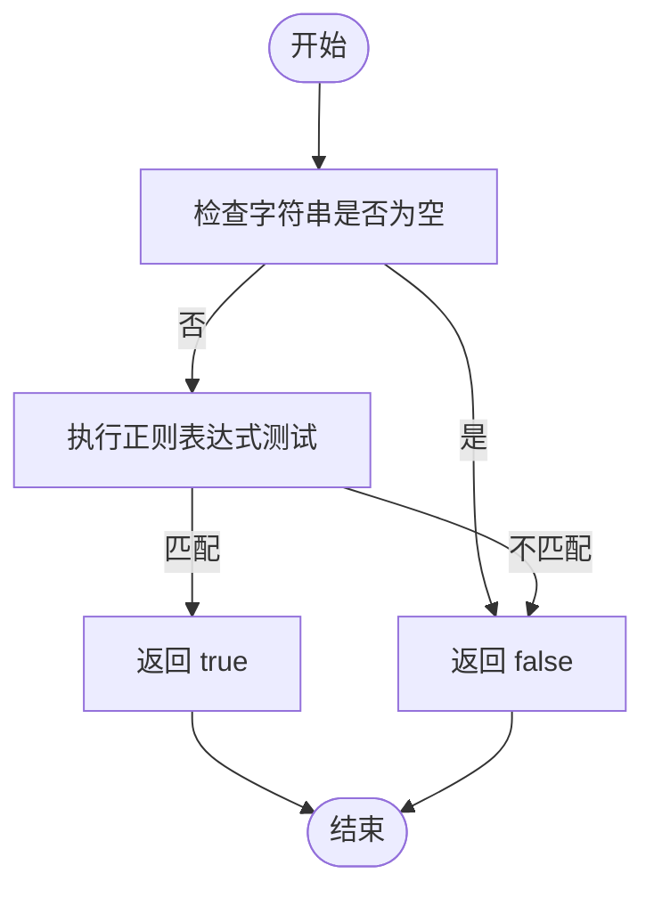
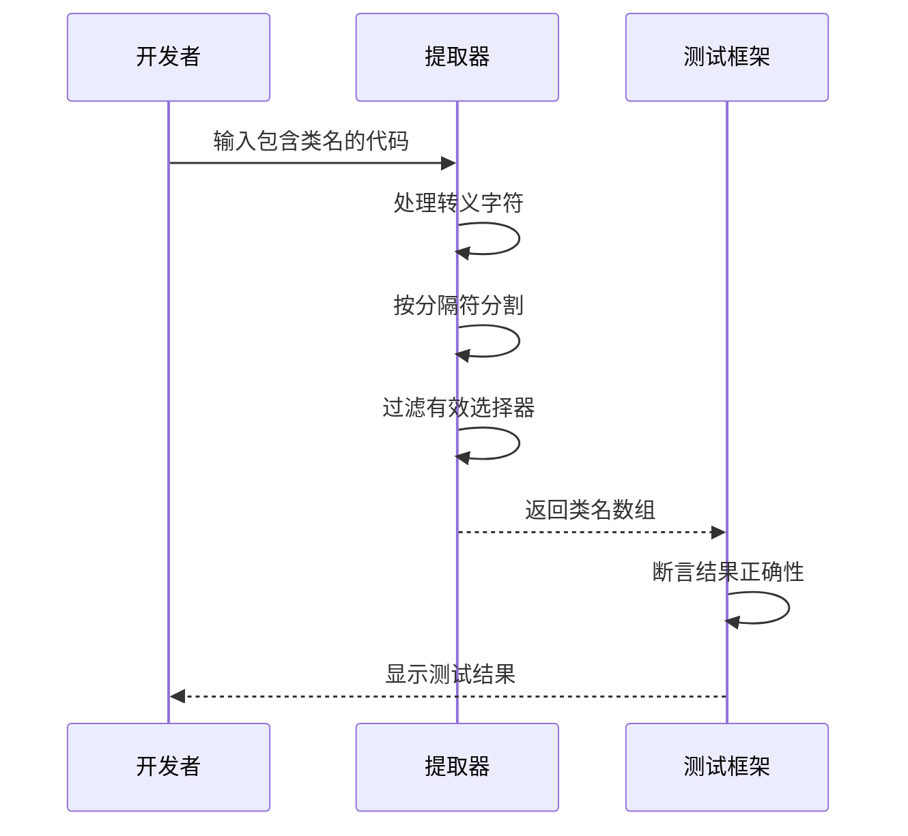

# 类名提取失败

<cite>
**本文档中引用的文件**  
- [split.ts](file://packages/shared/src/extractors/split.ts)
- [extractors.test.ts](file://packages/shared/test/extractors.test.ts)
- [extractors.test.ts](file://packages/weapp-tailwindcss/test/extractors.test.ts)
</cite>

## 目录
1. [简介](#简介)
2. [类名提取机制](#类名提取机制)
3. [提取器工作原理](#提取器工作原理)
4. [常见提取失败原因](#常见提取失败原因)
5. [调试方法](#调试方法)
6. [修复建议与最佳实践](#修复建议与最佳实践)
7. [结论](#结论)

## 简介
本文档详细分析了weapp-tailwindcss中类名提取失败的问题，重点探讨了类名未被正确识别和提取的原因。文档解释了类名提取机制，包括如何解析WXML/UX/Vue模板文件并提取其中的类名，详细说明了提取器的工作原理，包括正则表达式匹配模式和字符串分割逻辑。同时提供了常见导致提取失败的原因、调试方法以及修复建议和最佳实践，以确保类名能被正确提取。

**Section sources**
- [split.ts](file://packages/shared/src/extractors/split.ts#L1-L23)

## 类名提取机制
weapp-tailwindcss通过`splitCode`函数从模板文件中提取类名。该机制主要针对WXML、UX、Vue等模板文件中的`class`属性值进行解析。提取过程首先对代码中的转义空白字符（如`\n`、`\r`、`\t`）进行还原，然后根据配置的分隔符将字符串分割成多个部分，最后通过`isValidSelector`函数过滤出有效的类名。

**Section sources**
- [split.ts](file://packages/shared/src/extractors/split.ts#L1-L23)

## 提取器工作原理
类名提取器的核心实现位于`packages/shared/src/extractors/split.ts`文件中，主要包括两个关键函数：`isValidSelector`和`splitCode`。

### isValidSelector 函数
该函数用于验证一个字符串是否为有效的CSS选择器。它使用正则表达式`/[\w\u00A0-\uFFFF%-?]/`来检测字符串中是否包含字母、数字、下划线、Unicode字符或特定符号。



**Diagram sources**
- [split.ts](file://packages/shared/src/extractors/split.ts#L5-L7)

### splitCode 函数
该函数负责将代码字符串分割成独立的类名。其工作流程如下：
1. 检查代码中是否包含反斜杠，如果有，则将转义的空白字符（`\n`、`\r`、`\t`）替换为空格
2. 根据`allowDoubleQuotes`参数决定分隔符：若为true则使用空白字符作为分隔符，否则使用空白字符或双引号
3. 使用split方法按分隔符分割字符串
4. 对分割后的每个元素调用`isValidSelector`进行验证
5. 返回所有通过验证的有效类名数组

```mermaid
flowchart TD
Start([函数入口]) --> CheckBackslash["检查代码中是否包含反斜杠"]
CheckBackslash --> |包含| ReplaceEscape["替换转义空白字符为普通空格"]
CheckBackslash --> |不包含| UseOriginal["使用原始代码"]
ReplaceEscape --> NormalizedCode["得到规范化代码"]
UseOriginal --> NormalizedCode
NormalizedCode --> DetermineSplitter["确定分隔符"]
DetermineSplitter --> |allowDoubleQuotes=true| UseSpace["使用 \\s+ 作为分隔符"]
DetermineSplitter --> |allowDoubleQuotes=false| UseSpaceOrQuote["使用 \\s+|\" 作为分隔符"]
UseSpace --> SplitCode["按分隔符分割代码"]
UseSpaceOrQuote --> SplitCode
SplitCode --> FilterValid["过滤有效选择器"]
FilterValid --> |isValidSelector(element)| KeepElement["保留元素"]
FilterValid --> |!isValidSelector(element)| DiscardElement["丢弃元素"]
KeepElement --> CollectResults["收集结果"]
DiscardElement --> CollectResults
CollectResults --> ReturnArray["返回有效类名数组"]
ReturnArray --> End([函数出口])
```

**Diagram sources**
- [split.ts](file://packages/shared/src/extractors/split.ts#L11-L21)

**Section sources**
- [split.ts](file://packages/shared/src/extractors/split.ts#L11-L21)

## 常见提取失败原因
根据代码分析和测试用例，以下是导致类名提取失败的常见原因：

### 特殊字符处理问题
当类名中包含方括号内的复杂表达式时，如果使用双引号而非单引号，可能会导致提取失败。例如`after:content-["*"]`在`allowDoubleQuotes=false`时会被错误分割。

### 注释中的类名
虽然提取器主要处理模板文件中的实际代码，但如果类名出现在特定格式的注释中，可能不会被正确识别，因为提取器主要关注`class`属性的值。

### 模板语法冲突
在某些情况下，模板语法中的特殊字符可能与CSS类名语法冲突，导致提取器无法正确解析。例如，当模板引擎的插值语法与Tailwind CSS的动态类名语法相似时。

### 转义字符问题
压缩后的代码中可能包含转义的空白字符（如`\n`、`\t`），如果这些字符没有被正确处理，可能会导致类名被粘连在一起而无法正确分割。

**Section sources**
- [extractors.test.ts](file://packages/weapp-tailwindcss/test/extractors.test.ts#L25-L30)
- [split.ts](file://packages/shared/src/extractors/split.ts#L13)

## 调试方法
为了诊断和解决类名提取问题，可以采用以下调试方法：

### 启用提取器调试日志
可以通过在测试中添加console.log语句来观察`splitCode`函数的处理过程和输出结果。

### 验证提取结果
使用单元测试来验证特定代码片段的提取结果是否符合预期。例如，可以编写测试用例来检查包含特殊字符的类名是否能被正确提取。



**Diagram sources**
- [extractors.test.ts](file://packages/shared/test/extractors.test.ts)
- [extractors.test.ts](file://packages/weapp-tailwindcss/test/extractors.test.ts)

**Section sources**
- [extractors.test.ts](file://packages/shared/test/extractors.test.ts)
- [extractors.test.ts](file://packages/weapp-tailwindcss/test/extractors.test.ts)

## 修复建议与最佳实践
为了确保类名能被正确提取，建议遵循以下最佳实践：

### 使用单引号包裹复杂值
当在类名中使用方括号包含复杂值时，建议使用单引号而非双引号，以避免与HTML属性的双引号冲突。

### 避免在类名中使用特殊分隔符
尽量避免在类名中使用会被提取器作为分隔符的字符，如双引号（当`allowDoubleQuotes=false`时）。

### 确保代码格式化一致
保持代码格式化的一致性，特别是在团队协作开发时，统一的代码风格有助于提取器更可靠地工作。

### 充分测试边缘情况
在项目中添加针对特殊类名的测试用例，确保提取器能够正确处理各种边缘情况。

### 及时更新依赖
保持weapp-tailwindcss及相关依赖的更新，以获取最新的提取器改进和bug修复。

**Section sources**
- [split.ts](file://packages/shared/src/extractors/split.ts#L11-L21)

## 结论
weapp-tailwindcss的类名提取机制基于简单的字符串分割和正则表达式验证，虽然高效但对某些特殊情况可能不够健壮。通过理解提取器的工作原理和常见失败原因，开发者可以采取相应的预防措施和调试方法，确保类名能够被正确提取。遵循最佳实践并进行充分的测试是保证提取成功率的关键。