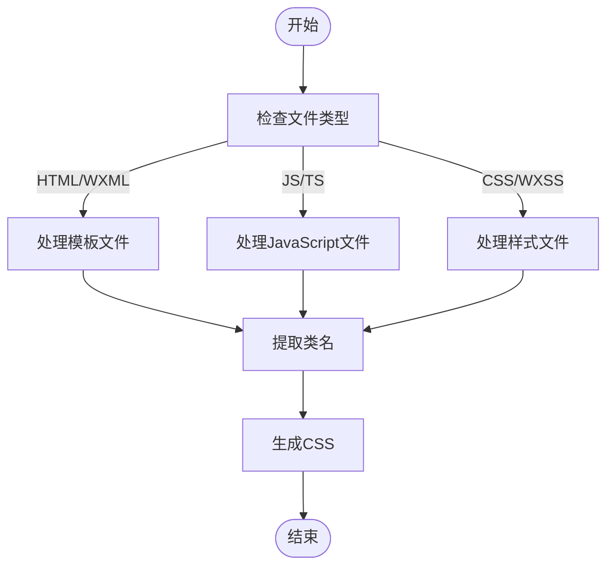
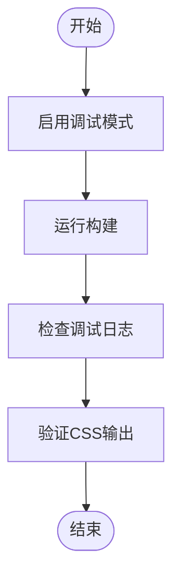

# 类名生成问题

<cite>
**本文档引用的文件**  
- [index.ts](file://packages/weapp-tailwindcss/src/index.ts)
- [cli.ts](file://packages/weapp-tailwindcss/src/cli.ts)
- [vite/index.ts](file://packages/weapp-tailwindcss/src/bundlers/vite/index.ts)
- [webpack/index.ts](file://packages/weapp-tailwindcss/src/bundlers/webpack/index.ts)
- [gulp/index.ts](file://packages/weapp-tailwindcss/src/bundlers/gulp/index.ts)
- [package.json](file://packages/weapp-tailwindcss/package.json)
</cite>

## 目录
1. [简介](#简介)
2. [类名提取机制](#类名提取机制)
3. [支持的类名语法格式](#支持的类名语法格式)
4. [调试类名提取过程](#调试类名提取过程)
5. [不同框架下的类名提取差异](#不同框架下的类名提取差异)
6. [复杂表达式中的类名提取](#复杂表达式中的类名提取)
7. [常见问题与故障排除](#常见问题与故障排除)

## 简介
weapp-tailwindcss 是一个为小程序开发者提供 Tailwind CSS 原子化样式能力的工具。本文档详细说明了类名生成和提取的机制，帮助开发者解决类名未被识别、类名未生成 CSS 等常见问题。

**Section sources**
- [package.json](file://packages/weapp-tailwindcss/package.json#L1-L215)

## 类名提取机制
weapp-tailwindcss 通过分析模板文件（如 WXML、UX、Vue）中的类名属性来提取需要生成的 CSS 类。提取过程在构建时进行，支持多种构建工具（Vite、Webpack、Gulp）。

在 Vite 插件中，`generateBundle` 钩子函数负责处理不同类型的文件（HTML、JS、CSS），并调用相应的处理器（templateHandler、jsHandler、styleHandler）来处理类名。



**Diagram sources**
- [vite/index.ts](file://packages/weapp-tailwindcss/src/bundlers/vite/index.ts#L296-L470)

**Section sources**
- [vite/index.ts](file://packages/weapp-tailwindcss/src/bundlers/vite/index.ts#L1-L479)

## 支持的类名语法格式
weapp-tailwindcss 支持多种类名语法格式，包括静态类名、动态类名和模板字符串中的类名。

### 静态类名
静态类名是最简单的形式，直接在模板中写入 Tailwind CSS 类名。

```html
<view class="flex items-center justify-between p-4 bg-white">
  <!-- 内容 -->
</view>
```

### 动态类名
动态类名通过条件表达式或变量来决定最终应用的类名。

```html
<view class="{{ isActive ? 'bg-blue-500' : 'bg-gray-500' }} p-4 rounded">
  <!-- 内容 -->
</view>
```

### 模板字符串中的类名
在 JavaScript 或 TypeScript 文件中使用模板字符串定义类名。

```javascript
const className = `flex ${isLarge ? 'p-6' : 'p-3'} items-center`;
```

**Section sources**
- [vite/index.ts](file://packages/weapp-tailwindcss/src/bundlers/vite/index.ts#L346-L372)
- [gulp/index.ts](file://packages/weapp-tailwindcss/src/bundlers/gulp/index.ts#L212-L242)

## 调试类名提取过程
为了帮助开发者调试类名提取过程，weapp-tailwindcss 提供了多种调试方法。

### 启用调试日志
通过设置环境变量或配置选项来启用调试日志，查看类名提取的详细过程。

```javascript
import { createDebug } from '@/debug'
const debug = createDebug()
debug('html handle: %s', file)
```

### 检查提取结果
在构建完成后，检查生成的 CSS 文件，确认所需的类名是否已正确生成。



**Diagram sources**
- [vite/index.ts](file://packages/weapp-tailwindcss/src/bundlers/vite/index.ts#L24)
- [gulp/index.ts](file://packages/weapp-tailwindcss/src/bundlers/gulp/index.ts#L14)

**Section sources**
- [vite/index.ts](file://packages/weapp-tailwindcss/src/bundlers/vite/index.ts#L24-L25)
- [gulp/index.ts](file://packages/weapp-tailwindcss/src/bundlers/gulp/index.ts#L14-L15)

## 不同框架下的类名提取差异
weapp-tailwindcss 支持多种小程序框架，不同框架下的类名提取方式略有差异。

### Taro 框架
Taro 框架使用 React 语法，类名提取主要在 JSX 中进行。

```jsx
<View className={classNames('flex', { 'flex-col': isColumn })}>
  {/* 内容 */}
</View>
```

### uni-app 框架
uni-app 框架支持 Vue 语法，类名提取在模板和脚本中均可进行。

```vue
<template>
  <view :class="['flex', isColumn ? 'flex-col' : '']">
    <!-- 内容 -->
  </view>
</template>
```

### 原生小程序
原生小程序使用 WXML 语法，类名提取主要在 WXML 文件中进行。

```xml
<view class="flex {{isColumn ? 'flex-col' : ''}}">
  <!-- 内容 -->
</view>
```

**Section sources**
- [vite/index.ts](file://packages/weapp-tailwindcss/src/bundlers/vite/index.ts#L134-L135)
- [webpack/index.ts](file://packages/weapp-tailwindcss/src/bundlers/webpack/index.ts#L1-L2)

## 复杂表达式中的类名提取
weapp-tailwindcss 支持在复杂表达式中提取类名，包括三元运算符、逻辑运算符和函数调用等。

```html
<view class="{{ condition1 ? 'class1' : condition2 ? 'class2' : 'class3' }} {{ dynamicClass() }}">
  <!-- 内容 -->
</view>
```

对于复杂的 JavaScript 表达式，插件会使用 Babel 解析器来分析代码结构，确保正确提取所有可能的类名。

**Section sources**
- [vite/index.ts](file://packages/weapp-tailwindcss/src/bundlers/vite/index.ts#L394-L396)
- [gulp/index.ts](file://packages/weapp-tailwindcss/src/bundlers/gulp/index.ts#L203-L204)

## 常见问题与故障排除
### 类名未被识别
**问题描述**：在模板中使用的类名没有生成对应的 CSS。
**解决方案**：
1. 确认类名拼写正确
2. 检查构建工具配置是否正确
3. 确认文件类型是否被正确识别

### 类名未生成 CSS
**问题描述**：类名被识别但没有生成对应的 CSS 规则。
**解决方案**：
1. 检查 Tailwind CSS 配置文件
2. 确认 weapp-tailwindcss 插件已正确安装和配置
3. 查看调试日志，确认类名提取过程是否正常

### 动态类名不生效
**问题描述**：条件表达式中的类名无法根据条件变化。
**解决方案**：
1. 确保动态表达式语法正确
2. 检查变量作用域
3. 确认构建工具支持动态类名提取

**Section sources**
- [vite/index.ts](file://packages/weapp-tailwindcss/src/bundlers/vite/index.ts#L346-L372)
- [gulp/index.ts](file://packages/weapp-tailwindcss/src/bundlers/gulp/index.ts#L212-L242)