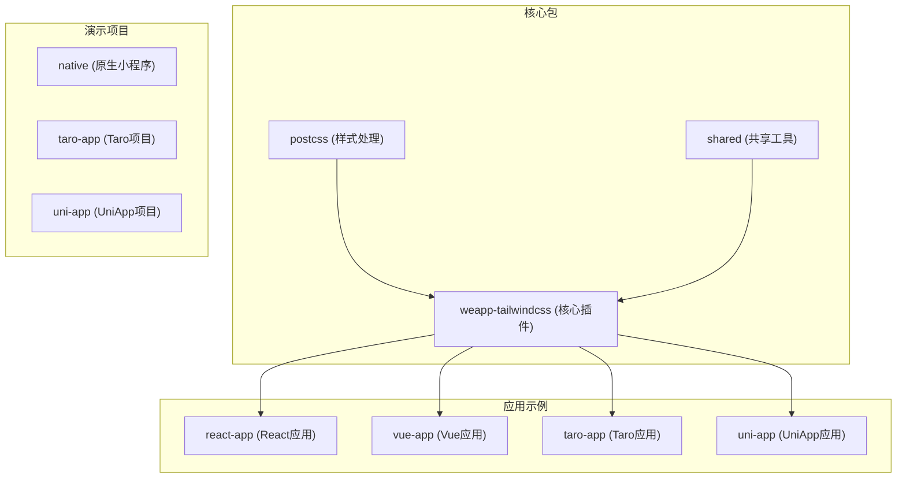
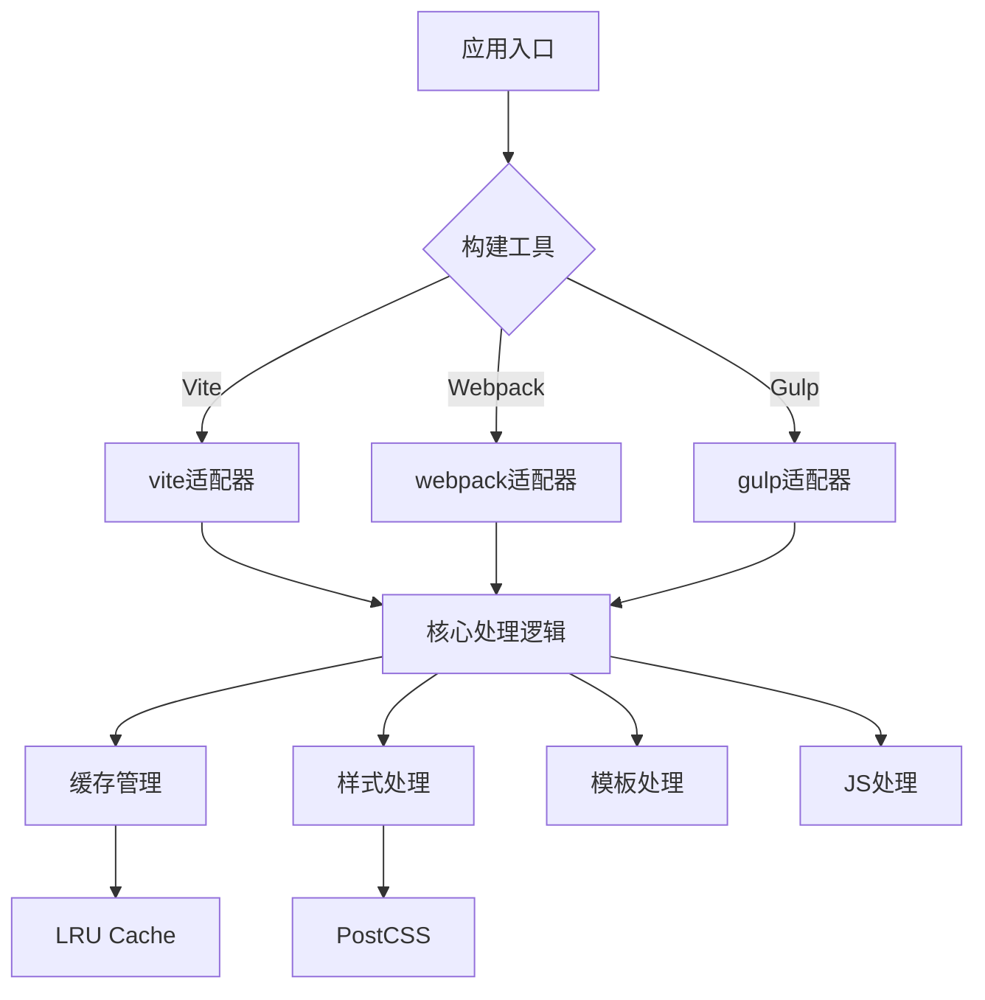
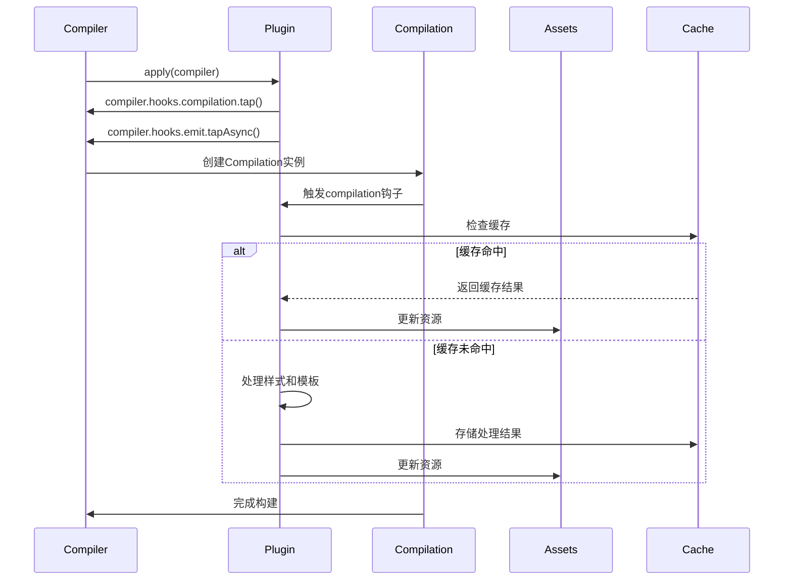
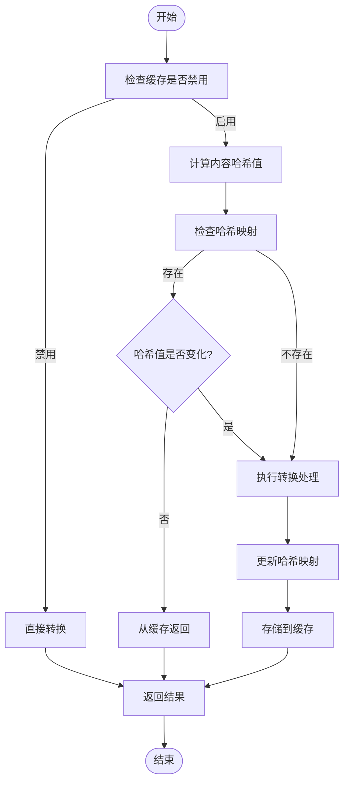
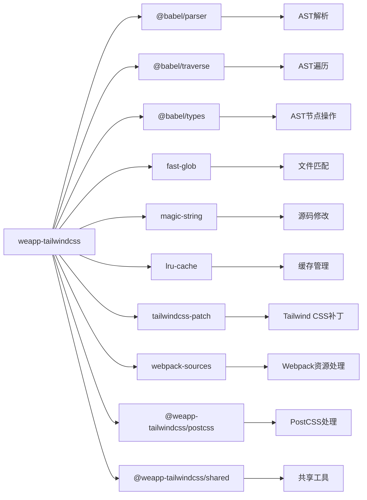
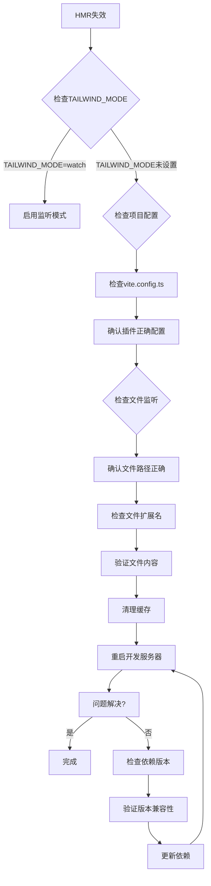

# React构建问题

<cite>
**本文档中引用的文件**  
- [weapp-tailwindcss/package.json](file://packages/weapp-tailwindcss/package.json)
- [react-app/vite.config.ts](file://apps/react-app/vite.config.ts)
- [react-app/package.json](file://apps/react-app/package.json)
- [weapp-tailwindcss/src/vite.ts](file://packages/weapp-tailwindcss/src/vite.ts)
- [weapp-tailwindcss/src/webpack.ts](file://packages/weapp-tailwindcss/src/webpack.ts)
- [weapp-tailwindcss/src/bundlers/vite/index.ts](file://packages/weapp-tailwindcss/src/bundlers/vite/index.ts)
- [weapp-tailwindcss/src/bundlers/webpack/index.ts](file://packages/weapp-tailwindcss/src/bundlers/webpack/index.ts)
- [weapp-tailwindcss/src/cache/index.ts](file://packages/weapp-tailwindcss/src/cache/index.ts)
</cite>

## 目录
1. [简介](#简介)
2. [项目结构](#项目结构)
3. [核心组件](#核心组件)
4. [架构概述](#架构概述)
5. [详细组件分析](#详细组件分析)
6. [依赖分析](#依赖分析)
7. [性能考虑](#性能考虑)
8. [故障排除指南](#故障排除指南)
9. [结论](#结论)

## 简介
本文档旨在为使用React框架的开发者提供关于构建问题的详细故障排除指南，重点解决HMR热更新失效和构建性能问题。文档详细分析了vite和webpack构建工具中weapp-tailwindcss插件的集成方式，并解释如何正确配置构建插件以支持React项目。同时涵盖构建产物优化、代码分割策略以及tree-shaking配置等内容。

## 项目结构
本项目采用monorepo结构，包含多个应用示例和工具包。主要目录包括apps（应用示例）、packages（核心包）、demo（演示项目）等。这种结构使得不同技术栈的项目可以共享相同的构建配置和工具。



**图表来源**  
- [package.json](file://packages/weapp-tailwindcss/package.json)
- [vite.config.ts](file://apps/react-app/vite.config.ts)

**章节来源**  
- [package.json](file://packages/weapp-tailwindcss/package.json)
- [project structure](file://README.md#L1-L50)

## 核心组件
weapp-tailwindcss是本项目的核心插件，提供了对vite和webpack构建工具的支持。该插件通过exports字段导出多个模块，包括vite、webpack、gulp等不同构建工具的适配器。插件支持Tailwind CSS的原子化样式思想，并针对小程序开发进行了优化。

**章节来源**  
- [weapp-tailwindcss/package.json](file://packages/weapp-tailwindcss/package.json)
- [weapp-tailwindcss/src/index.ts](file://packages/weapp-tailwindcss/src/index.ts)

## 架构概述
weapp-tailwindcss插件的架构设计充分考虑了不同构建工具的需求，提供了统一的API接口。插件通过条件导出(exports)机制，为vite、webpack等不同构建工具提供专门的适配器。缓存机制采用LRU算法，确保构建性能的同时避免内存泄漏。



**图表来源**  
- [weapp-tailwindcss/package.json](file://packages/weapp-tailwindcss/package.json)
- [weapp-tailwindcss/src/vite.ts](file://packages/weapp-tailwindcss/src/vite.ts)
- [weapp-tailwindcss/src/webpack.ts](file://packages/weapp-tailwindcss/src/webpack.ts)

## 详细组件分析

### Vite集成分析
weapp-tailwindcss插件为Vite构建工具提供了完整的支持。通过UnifiedViteWeappTailwindcssPlugin函数创建插件实例，该函数返回一个插件数组，包含CSS导入重写和后处理功能。

```mermaid
classDiagram
class UnifiedViteWeappTailwindcssPlugin {
+options : UserDefinedOptions
+rewriteCssImportsSpecified : boolean
+opts : CompilerContext
+disabledOptions : DisabledOptions
+tailwindcssMajorVersion : number
+shouldRewriteCssImports : boolean
+rewritePlugins : Plugin[]
+customAttributesEntities : CustomAttributesEntities
+patchRecorderState : PatchRecorderState
+runtimeState : RuntimeState
+runtimeSet : Set~string~
+runtimeSetPromise : Promise~Set~string~~
+resolvedConfig : ResolvedConfig
+refreshRuntimeState(force : boolean) : Promise~void~
+ensureRuntimeClassSet(force : boolean) : Promise~Set~string~~
+getResolvedConfig() : ResolvedConfig
+utsPlatform : UtsPlatform
+isIosPlatform : boolean
+uniAppXPlugins : Plugin[] | undefined
+plugins : Plugin[]
}
class Plugin {
<<interface>>
+name : string
+enforce : 'pre' | 'post'
+configResolved(config : ResolvedConfig) : void
+generateBundle(options : any, bundle : Bundle) : Promise~void~
+resolveId(id : string, importer : string) : string | null
+transform(code : string, id : string) : { code : string, map : any } | null
}
class Cache {
+hashMap : Map~HashMapKey, HashMapValue~
+instance : LRUCache~string, CacheValue~
+hasHashKey(key : HashMapKey) : boolean
+getHashValue(key : HashMapKey) : HashMapValue | undefined
+setHashValue(key : HashMapKey, value : HashMapValue) : Map~HashMapKey, HashMapValue~
+computeHash(message : string | Buffer) : string
+get~V~(key : string) : V | undefined
+set~V~(key : string, value : V) : LRUCache~string, CacheValue~
+has(key : string) : boolean
+calcHashValueChanged(key : HashMapKey, hash : string) : ICreateCacheReturnType
+process~T~(options : CacheProcessOptions~T~) : Promise~T~
}
UnifiedViteWeappTailwindcssPlugin --> Plugin : "implements"
UnifiedViteWeappTailwindcssPlugin --> Cache : "uses"
```

**图表来源**  
- [weapp-tailwindcss/src/bundlers/vite/index.ts](file://packages/weapp-tailwindcss/src/bundlers/vite/index.ts)
- [weapp-tailwindcss/src/cache/index.ts](file://packages/weapp-tailwindcss/src/cache/index.ts)

**章节来源**  
- [weapp-tailwindcss/src/bundlers/vite/index.ts](file://packages/weapp-tailwindcss/src/bundlers/vite/index.ts)
- [react-app/vite.config.ts](file://apps/react-app/vite.config.ts)

### Webpack集成分析
对于Webpack构建工具，weapp-tailwindcss通过BaseUnifiedPlugin/v5模块提供支持。插件利用Webpack的compiler和compilation生命周期钩子，在适当的时机注入样式处理逻辑。



**图表来源**  
- [weapp-tailwindcss/src/bundlers/webpack/index.ts](file://packages/weapp-tailwindcss/src/bundlers/webpack/index.ts)
- [weapp-tailwindcss/test/webpack.v5.test.ts](file://packages/weapp-tailwindcss/test/webpack.v5.test.ts)

**章节来源**  
- [weapp-tailwindcss/src/bundlers/webpack/index.ts](file://packages/weapp-tailwindcss/src/bundlers/webpack/index.ts)
- [weapp-tailwindcss/test/bundlers/webpack.v4.unit.test.ts](file://packages/weapp-tailwindcss/test/bundlers/webpack.v4.unit.test.ts)

### 缓存机制分析
weapp-tailwindcss插件实现了高效的缓存机制，基于LRU算法管理缓存项。缓存系统包含哈希映射和LRU实例，通过计算内容哈希值来判断文件是否发生变化。



**图表来源**  
- [weapp-tailwindcss/src/cache/index.ts](file://packages/weapp-tailwindcss/src/cache/index.ts)
- [weapp-tailwindcss/test/cache.test.ts](file://packages/weapp-tailwindcss/test/cache.test.ts)

**章节来源**  
- [weapp-tailwindcss/src/cache/index.ts](file://packages/weapp-tailwindcss/src/cache/index.ts)
- [weapp-tailwindcss/test/bundlers.cache-helper.test.ts](file://packages/weapp-tailwindcss/test/bundlers.cache-helper.test.ts)

## 依赖分析
weapp-tailwindcss插件依赖于多个核心库，包括@babel/parser用于AST解析，fast-glob用于文件匹配，magic-string用于源码修改等。这些依赖共同构成了插件的基础功能。



**图表来源**  
- [weapp-tailwindcss/package.json](file://packages/weapp-tailwindcss/package.json)
- [weapp-tailwindcss/src/index.ts](file://packages/weapp-tailwindcss/src/index.ts)

**章节来源**  
- [weapp-tailwindcss/package.json](file://packages/weapp-tailwindcss/package.json)
- [weapp-tailwindcss/src/index.ts](file://packages/weapp-tailwindcss/src/index.ts)

## 性能考虑
weapp-tailwindcss插件在设计时充分考虑了构建性能。通过缓存机制避免重复处理，利用并发任务处理提高构建效率。插件还支持按需处理，只对需要的文件进行转换。

### 构建性能优化建议
1. **启用缓存**：确保缓存机制正常工作，避免重复处理未更改的文件
2. **合理配置监听**：正确设置文件监听范围，避免不必要的重新构建
3. **优化依赖版本**：保持依赖库的版本兼容性，避免因版本冲突导致的性能问题
4. **使用预构建**：对于大型项目，考虑使用vite的预构建功能
5. **代码分割**：合理配置代码分割策略，减少单个文件的大小

## 故障排除指南

### HMR热更新失效诊断流程
当遇到HMR热更新失效问题时，可按照以下步骤进行诊断：



**图表来源**  
- [demo/uni-app/.env.development](file://demo/uni-app/.env.development)
- [react-app/vite.config.ts](file://apps/react-app/vite.config.ts)

**章节来源**  
- [demo/uni-app/.env.development](file://demo/uni-app/.env.development)
- [react-app/vite.config.ts](file://apps/react-app/vite.config.ts)

### 常见问题解决方案
1. **文件监听配置问题**：确保vite.config.ts中的server配置正确，特别是host和port设置
2. **缓存清理**：定期清理构建缓存，避免因缓存问题导致的构建错误
3. **依赖版本兼容性**：检查package.json中的依赖版本，确保与weapp-tailwindcss插件兼容
4. **CSS导入重写**：对于Tailwind CSS v4及以上版本，确保rewriteCssImports配置正确

## 结论
weapp-tailwindcss插件为React项目提供了强大的构建支持，通过合理的配置可以有效解决HMR热更新失效和构建性能问题。插件的架构设计充分考虑了不同构建工具的需求，提供了统一的API接口和高效的缓存机制。开发者应根据具体项目需求，合理配置插件参数，优化构建流程，提高开发效率。