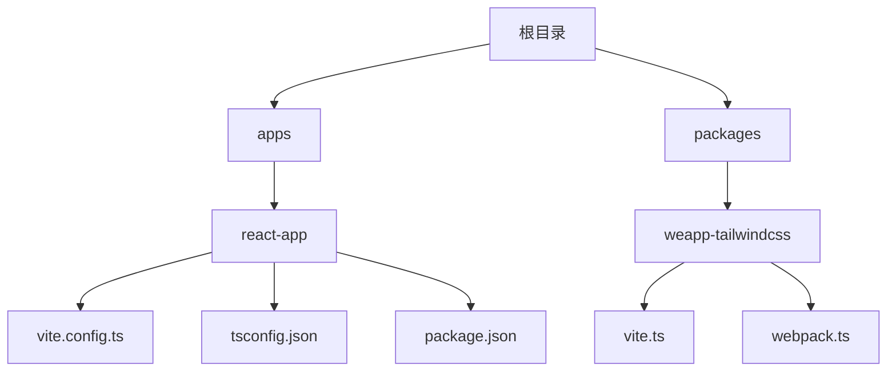
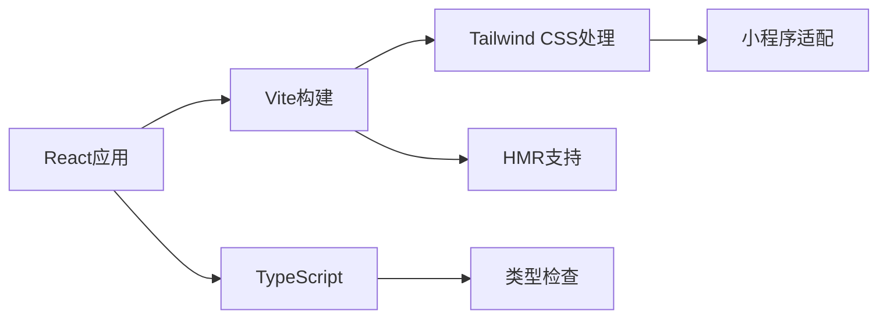
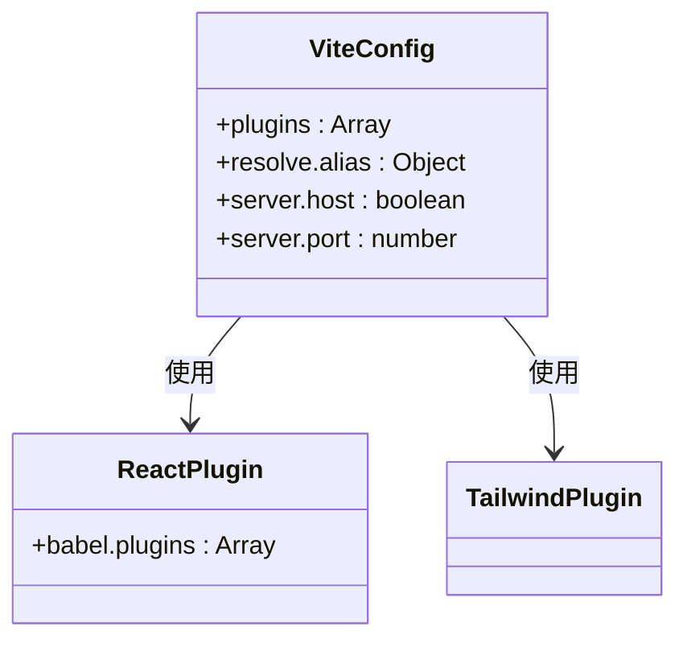
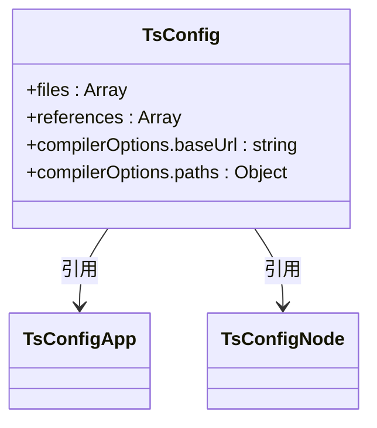

# React框架集成问题

<cite>
**本文档中引用的文件**  
- [vite.config.ts](file://apps/react-app/vite.config.ts)
- [tsconfig.json](file://apps/react-app/tsconfig.json)
- [package.json](file://apps/react-app/package.json)
- [main.tsx](file://apps/react-app/src/main.tsx)
- [README.md](file://README.md)
- [vite.ts](file://packages/weapp-tailwindcss/src/vite.ts)
- [webpack.ts](file://packages/weapp-tailwindcss/src/webpack.ts)
</cite>

## 目录
1. [简介](#简介)
2. [项目结构](#项目结构)
3. [核心组件](#核心组件)
4. [架构概述](#架构概述)
5. [详细组件分析](#详细组件分析)
6. [依赖分析](#依赖分析)
7. [性能考虑](#性能考虑)
8. [故障排除指南](#故障排除指南)
9. [结论](#结论)

## 简介
本文档旨在为使用React框架集成weapp-tailwindcss时遇到的常见问题提供详细的故障排除指南。涵盖HMR热更新失效、组件样式隔离、CSS-in-JS兼容性等问题，并详细说明如何在React项目中正确引入和配置weapp-tailwindcss，包括vite和webpack构建工具的配置方法。

## 项目结构
本项目采用模块化设计，主要包含多个应用示例和核心包。其中React应用位于`apps/react-app/`目录下，使用Vite作为构建工具，并集成了Tailwind CSS。



**图示来源**  
- [vite.config.ts](file://apps/react-app/vite.config.ts#L1-L25)
- [vite.ts](file://packages/weapp-tailwindcss/src/vite.ts#L1-L3)
- [webpack.ts](file://packages/weapp-tailwindcss/src/webpack.ts#L1-L3)

**本节来源**  
- [README.md](file://README.md#L1-L101)

## 核心组件
React应用的核心组件包括Vite配置、TypeScript配置以及必要的开发依赖。这些配置确保了Tailwind CSS能够正确地与React项目集成。

**本节来源**  
- [vite.config.ts](file://apps/react-app/vite.config.ts#L1-L25)
- [tsconfig.json](file://apps/react-app/tsconfig.json#L1-L19)
- [package.json](file://apps/react-app/package.json#L1-L42)

## 架构概述
该项目基于现代前端开发栈，使用React 19作为UI框架，Vite作为构建工具，并通过`@tailwindcss/vite`插件实现Tailwind CSS的支持。整体架构支持热模块替换（HMR），并具备良好的开发体验。



**图示来源**  
- [vite.config.ts](file://apps/react-app/vite.config.ts#L1-L25)
- [package.json](file://apps/react-app/package.json#L1-L42)

## 详细组件分析

### Vite配置分析
Vite配置文件定义了React插件和Tailwind CSS插件的使用方式，同时设置了路径别名以提高模块导入的可读性和维护性。



**图示来源**  
- [vite.config.ts](file://apps/react-app/vite.config.ts#L1-L25)

**本节来源**  
- [vite.config.ts](file://apps/react-app/vite.config.ts#L1-L25)

### TypeScript配置分析
TypeScript配置通过引用`tsconfig.app.json`和`tsconfig.node.json`来分离应用和节点环境的编译选项，并设置了`@/*`路径别名指向`src`目录。



**图示来源**  
- [tsconfig.json](file://apps/react-app/tsconfig.json#L1-L19)

**本节来源**  
- [tsconfig.json](file://apps/react-app/tsconfig.json#L1-L19)

## 依赖分析
项目依赖分为生产依赖和开发依赖。生产依赖包括React及其相关库，开发依赖则包含Vite、Tailwind CSS、TypeScript等构建和类型检查工具。

```mermaid
graph TD
A[package.json] --> B[dependencies]
A --> C[devDependencies]
B --> D[react]
B --> E[react-dom]
C --> F[vite]
C --> G[@vitejs/plugin-react]
C --> H[tailwindcss]
C --> I[@tailwindcss/vite]
```

**图示来源**  
- [package.json](file://apps/react-app/package.json#L1-L42)

**本节来源**  
- [package.json](file://apps/react-app/package.json#L1-L42)

## 性能考虑
由于使用了Vite作为构建工具，项目具备快速的冷启动和热更新能力。通过`@tailwindcss/vite`插件，Tailwind CSS的类名能够在开发时即时编译，减少构建时间。

## 故障排除指南
以下是一些常见的React集成问题及其解决方案：

### HMR热更新失效
**问题描述**：修改组件后页面未自动刷新。  
**解决方案**：
1. 确保`vite.config.ts`中已启用`server.hmr`选项。
2. 检查浏览器控制台是否有错误信息。
3. 清除Vite缓存（`node_modules/.vite`）后重新启动开发服务器。

### 组件样式隔离问题
**问题描述**：Tailwind类名未正确作用于组件。  
**解决方案**：
1. 确保`tailwind.config.js`中的`content`字段正确包含所有源文件路径。
2. 检查是否在JSX中正确使用了类名字符串，避免动态拼接导致类名被忽略。

### CSS-in-JS兼容性问题
**问题描述**：使用styled-components或emotion时与Tailwind冲突。  
**解决方案**：
1. 使用`@apply`指令在CSS-in-JS中引用Tailwind类。
2. 或者将Tailwind类直接作为字符串传递给组件的`className`属性。

### weapp-tailwindcss集成配置
#### Vite配置方法
```ts
import { defineConfig } from 'vite'
import react from '@vitejs/plugin-react'
import tailwindcss from '@tailwindcss/vite'

export default defineConfig({
  plugins: [
    react(),
    tailwindcss()
  ]
})
```

#### Webpack配置方法
对于使用Webpack的项目，需安装`weapp-tailwindcss/webpack`插件并在配置中添加：
```js
const WeappTailwindcssWebpackPlugin = require('weapp-tailwindcss/webpack')

module.exports = {
  plugins: [
    new WeappTailwindcssWebpackPlugin()
  ]
}
```

### 常见配置错误
#### tsconfig.json配置错误
- 错误：未设置`baseUrl`和`paths`导致路径别名不生效。
- 正确配置应包含：
```json
{
  "compilerOptions": {
    "baseUrl": ".",
    "paths": {
      "@/*": ["./src/*"]
    }
  }
}
```

#### vite.config.ts配置错误
- 错误：未正确引入`@tailwindcss/vite`插件。
- 正确做法是确保插件已安装并正确导入。

**本节来源**  
- [vite.config.ts](file://apps/react-app/vite.config.ts#L1-L25)
- [tsconfig.json](file://apps/react-app/tsconfig.json#L1-L19)
- [package.json](file://apps/react-app/package.json#L1-L42)
- [README.md](file://README.md#L1-L101)

## 结论
通过合理配置Vite和TypeScript，结合weapp-tailwindcss提供的插件支持，可以有效解决React项目中集成Tailwind CSS时遇到的各种问题。建议开发者参考官方文档和模板项目进行配置，以确保最佳实践和兼容性。