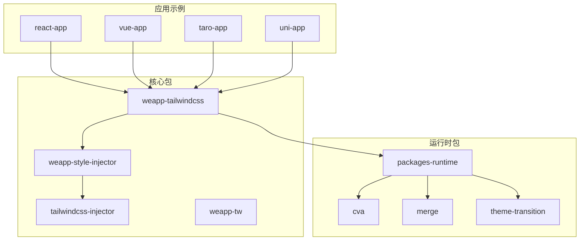
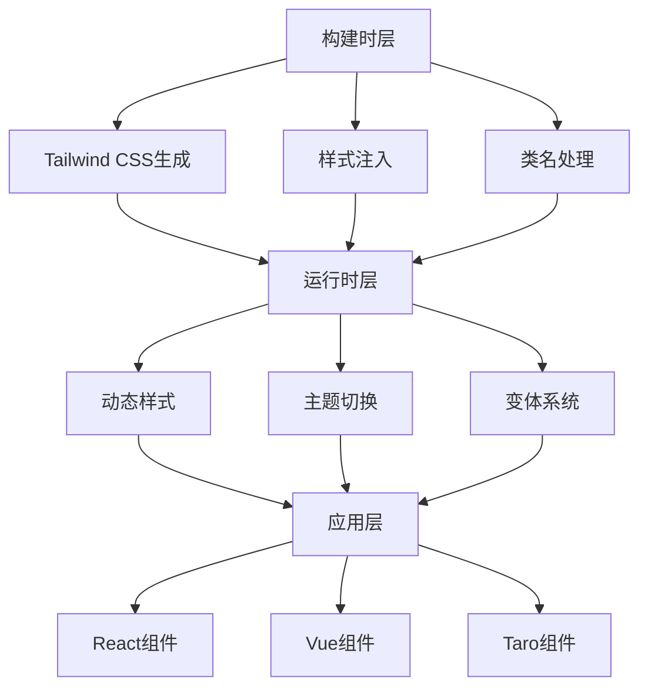
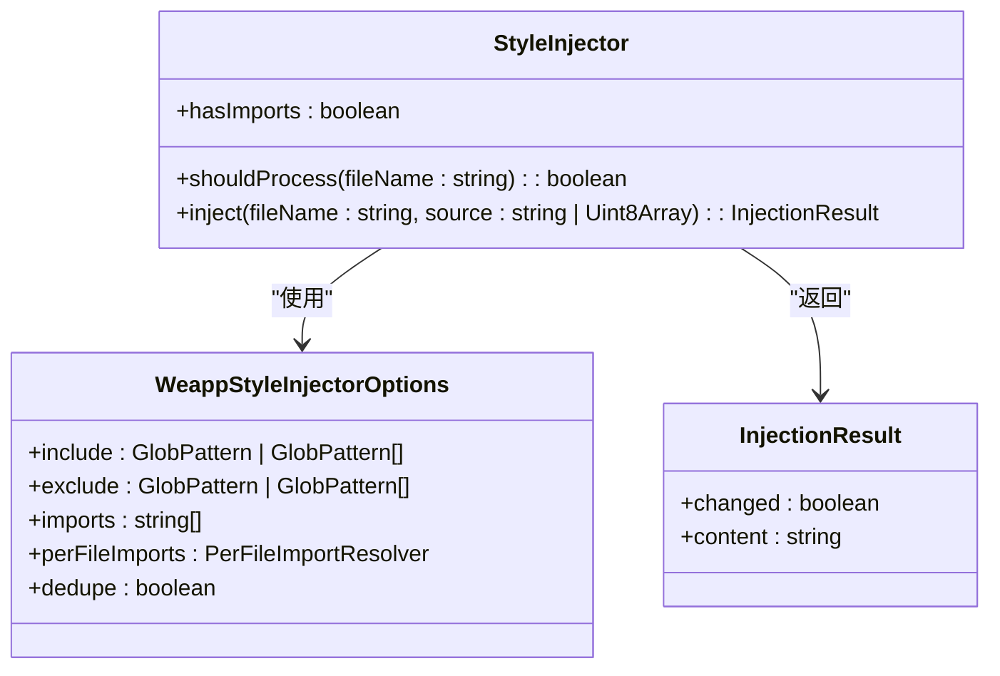
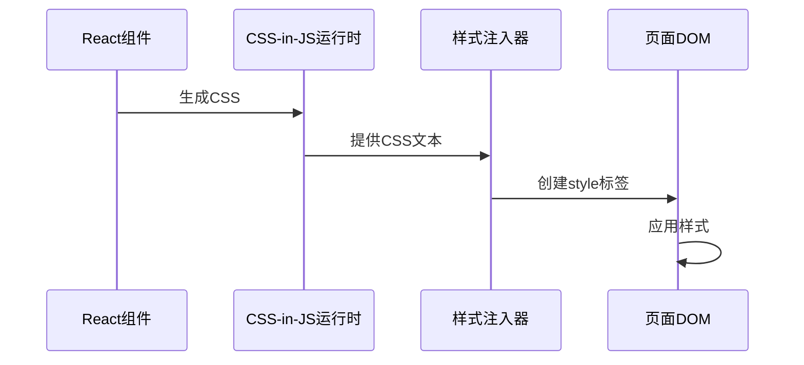
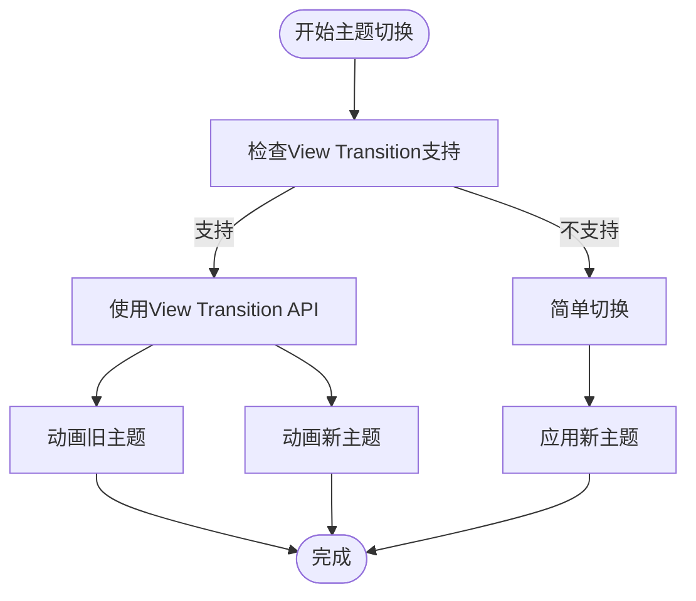
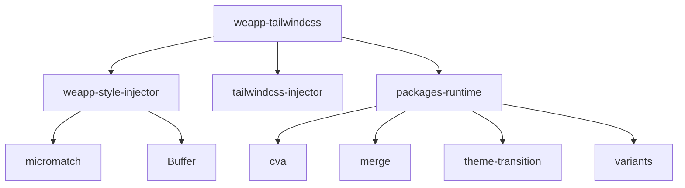

# React运行时问题

<cite>
**本文档引用的文件**  
- [weapp-style-injector/src/core.ts](file://packages/weapp-style-injector/src/core.ts)
- [weapp-style-injector/src/index.ts](file://packages/weapp-style-injector/src/index.ts)
- [apps/vue-app/src/lib/cssInJsRuntime.ts](file://apps/vue-app/src/lib/cssInJsRuntime.ts)
- [apps/vue-app/src/features/history/CssInJsDemo.vue](file://apps/vue-app/src/features/history/CssInJsDemo.vue)
- [website/build/tailwindcss/style-isolation.md](file://website/build/tailwindcss/style-isolation.md)
- [packages-runtime/ui/src/preset.ts](file://packages-runtime/ui/src/preset.ts)
- [packages-runtime/theme-transition/src/index.ts](file://packages-runtime/theme-transition/src/index.ts)
</cite>

## 目录
1. [简介](#简介)
2. [项目结构](#项目结构)
3. [核心组件](#核心组件)
4. [架构概述](#架构概述)
5. [详细组件分析](#详细组件分析)
6. [依赖分析](#依赖分析)
7. [性能考虑](#性能考虑)
8. [故障排除指南](#故障排除指南)
9. [结论](#结论)

## 简介
本文档详细探讨了在React运行时环境中使用weapp-tailwindcss时遇到的样式隔离和CSS-in-JS兼容性问题。重点分析了weapp-tailwindcss的样式注入机制、React组件的样式作用域处理、CSS-in-JS库（如styled-components、emotion）的集成方案，以及动态主题切换和变体系统的使用方法。同时提供了常见问题的调试技巧和修复方法。

## 项目结构
weapp-tailwindcss项目采用monorepo结构，包含多个子包和应用示例。核心功能由`packages`目录下的多个包实现，包括`weapp-tailwindcss`、`weapp-style-injector`、`tailwindcss-injector`等。`apps`目录包含多个应用示例，用于演示不同框架和构建工具的集成方式。

**图示来源**
- [packages/weapp-tailwindcss](file://packages/weapp-tailwindcss)
- [packages/weapp-style-injector](file://packages/weapp-style-injector)
- [packages-runtime](file://packages-runtime)
- [apps/react-app](file://apps/react-app)
- [apps/vue-app](file://apps/vue-app)

**章节来源**
- [packages](file://packages)
- [apps](file://apps)

## 核心组件
weapp-tailwindcss的核心组件包括样式注入器、主题切换器和变体系统。样式注入器负责将Tailwind CSS类注入到小程序样式文件中，主题切换器提供动态主题切换功能，变体系统支持组件的多种状态和样式变体。

**章节来源**
- [packages/weapp-style-injector/src/core.ts](file://packages/weapp-style-injector/src/core.ts)
- [packages-runtime/theme-transition/src/index.ts](file://packages-runtime/theme-transition/src/index.ts)
- [packages-runtime/ui/src/preset.ts](file://packages-runtime/ui/src/preset.ts)

## 架构概述
weapp-tailwindcss的架构分为三个主要层次：构建时层、运行时层和应用层。构建时层负责将Tailwind CSS类生成并注入到小程序样式文件中；运行时层提供动态样式和主题切换功能；应用层集成这些功能并提供用户界面。

**图示来源**
- [packages/weapp-tailwindcss](file://packages/weapp-tailwindcss)
- [packages/weapp-style-injector](file://packages/weapp-style-injector)
- [packages-runtime](file://packages-runtime)

## 详细组件分析

### 样式注入机制
weapp-tailwindcss通过`weapp-style-injector`包实现样式注入。该包提供了一个样式注入器，可以在构建时将Tailwind CSS类注入到小程序样式文件中。

**图示来源**
- [packages/weapp-style-injector/src/core.ts](file://packages/weapp-style-injector/src/core.ts)

**章节来源**
- [packages/weapp-style-injector/src/core.ts](file://packages/weapp-style-injector/src/core.ts)

### CSS-in-JS集成
weapp-tailwindcss支持与CSS-in-JS库（如styled-components、emotion）的集成。通过运行时注入机制，可以将CSS-in-JS生成的样式注入到页面中。

**图示来源**
- [apps/vue-app/src/lib/cssInJsRuntime.ts](file://apps/vue-app/src/lib/cssInJsRuntime.ts)
- [apps/vue-app/src/features/history/CssInJsDemo.vue](file://apps/vue-app/src/features/history/CssInJsDemo.vue)

**章节来源**
- [apps/vue-app/src/lib/cssInJsRuntime.ts](file://apps/vue-app/src/lib/cssInJsRuntime.ts)
- [apps/vue-app/src/features/history/CssInJsDemo.vue](file://apps/vue-app/src/features/history/CssInJsDemo.vue)

### 动态主题切换
weapp-tailwindcss通过`theme-transition`包实现动态主题切换功能。该功能利用CSS变量和动画过渡，实现平滑的主题切换效果。

**图示来源**
- [packages-runtime/theme-transition/src/index.ts](file://packages-runtime/theme-transition/src/index.ts)

**章节来源**
- [packages-runtime/theme-transition/src/index.ts](file://packages-runtime/theme-transition/src/index.ts)

## 依赖分析
weapp-tailwindcss的依赖关系复杂，涉及多个核心包和运行时包。主要依赖包括`weapp-style-injector`用于样式注入，`tailwindcss-injector`用于Tailwind CSS处理，`packages-runtime`提供运行时功能。

**图示来源**
- [packages/weapp-tailwindcss](file://packages/weapp-tailwindcss)
- [packages/weapp-style-injector](file://packages/weapp-style-injector)
- [packages-runtime](file://packages-runtime)

**章节来源**
- [packages](file://packages)

## 性能考虑
在使用weapp-tailwindcss时，需要注意以下性能考虑：
- 样式注入的时机和频率，避免重复注入
- 动态主题切换的动画性能，特别是在低端设备上
- CSS-in-JS的运行时开销，特别是在复杂组件中
- 类名处理的效率，避免不必要的字符串操作

## 故障排除指南
### 样式丢失问题
当遇到样式丢失问题时，可以按照以下步骤进行排查：
1. 检查构建配置是否正确
2. 确认样式注入器是否正常工作
3. 检查类名是否被正确处理
4. 验证CSS-in-JS运行时是否正确注入样式

### 优先级错乱问题
当遇到样式优先级错乱问题时，可以：
1. 检查样式注入的顺序
2. 确认CSS-in-JS样式的注入时机
3. 验证Tailwind CSS的purge配置
4. 检查是否有重复的样式定义

**章节来源**
- [packages/weapp-style-injector/src/core.ts](file://packages/weapp-style-injector/src/core.ts)
- [apps/vue-app/src/lib/cssInJsRuntime.ts](file://apps/vue-app/src/lib/cssInJsRuntime.ts)

## 结论
weapp-tailwindcss为React运行时环境提供了完整的样式解决方案，包括样式隔离、CSS-in-JS兼容性、动态主题切换和变体系统。通过合理的架构设计和优化，可以有效解决常见的样式问题，提升开发效率和用户体验。