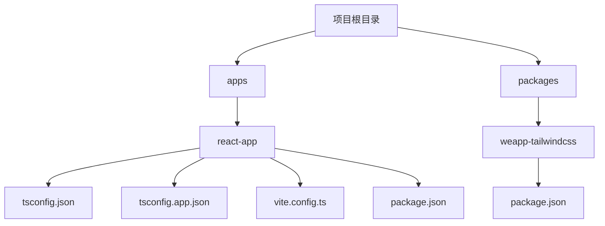

# React配置问题

<cite>
**本文档中引用的文件**  
- [tsconfig.json](file://apps/react-app/tsconfig.json)
- [tsconfig.app.json](file://apps/react-app/tsconfig.app.json)
- [vite.config.ts](file://apps/react-app/vite.config.ts)
- [package.json](file://apps/react-app/package.json)
- [weapp-tailwindcss/package.json](file://packages/weapp-tailwindcss/package.json)
- [tailwind.config.js](file://apps/vite-native/tailwind.config.js)
- [postcss.config.js](file://apps/vite-native/postcss.config.js)
</cite>

## 目录
1. [简介](#简介)
2. [项目结构](#项目结构)
3. [核心配置文件分析](#核心配置文件分析)
4. [tsconfig.json配置详解](#tsconfigjson配置详解)
5. [vite.config.ts配置详解](#viteconfigts配置详解)
6. [weapp-tailwindcss插件集成](#weapp-tailwindcss插件集成)
7. [常见配置错误与诊断](#常见配置错误与诊断)
8. [最佳实践建议](#最佳实践建议)

## 简介
本文档详细说明了在React项目中正确配置TypeScript和Vite的相关设置，重点解决`tsconfig.json`和`vite.config.ts`中的配置问题。特别关注如何正确集成weapp-tailwindcss插件，涵盖编译选项、JSX配置、模块解析等关键配置项。

## 项目结构
本项目采用多包管理结构，包含多个应用示例。重点关注`apps/react-app`目录下的React应用配置。



**Diagram sources**
- [apps/react-app/tsconfig.json](file://apps/react-app/tsconfig.json)
- [packages/weapp-tailwindcss/package.json](file://packages/weapp-tailwindcss/package.json)

**Section sources**
- [apps/react-app/tsconfig.json](file://apps/react-app/tsconfig.json)
- [apps/react-app/vite.config.ts](file://apps/react-app/vite.config.ts)

## 核心配置文件分析
分析React应用中的核心配置文件，包括TypeScript配置、Vite构建配置和依赖管理。

**Section sources**
- [apps/react-app/tsconfig.json](file://apps/react-app/tsconfig.json)
- [apps/react-app/vite.config.ts](file://apps/react-app/vite.config.ts)
- [apps/react-app/package.json](file://apps/react-app/package.json)

## tsconfig.json配置详解
### 主配置文件 (tsconfig.json)
主配置文件通过引用其他配置文件来组织TypeScript设置，采用分层配置方式。

```json
{
  "files": [],
  "references": [
    {
      "path": "./tsconfig.app.json"
    },
    {
      "path": "./tsconfig.node.json"
    }
  ],
  "compilerOptions": {
    "baseUrl": ".",
    "paths": {
      "@/*": [
        "./src/*"
      ]
    }
  }
}
```

### 应用配置文件 (tsconfig.app.json)
此文件包含React应用的具体编译选项：

- **target**: ES2022 - 设置编译目标为ES2022
- **lib**: 包含ES2022、DOM和DOM.Iterable - 定义可用的库
- **module**: ESNext - 使用最新的模块系统
- **moduleResolution**: bundler - 采用打包器模式的模块解析
- **jsx**: react-jsx - 配置JSX转换为React.createElement调用
- **strict**: true - 启用所有严格类型检查选项
- **paths**: 配置路径别名@指向src目录

**Section sources**
- [apps/react-app/tsconfig.json](file://apps/react-app/tsconfig.json#L1-L19)
- [apps/react-app/tsconfig.app.json](file://apps/react-app/tsconfig.app.json#L1-L40)

## vite.config.ts配置详解
### Vite配置结构
Vite配置文件定义了构建工具的核心设置：

```typescript
import { defineConfig } from 'vite'
import react from '@vitejs/plugin-react'
import path from "path"
import tailwindcss from "@tailwindcss/vite"

export default defineConfig({
  plugins: [
    react({
      babel: {
        plugins: [['babel-plugin-react-compiler']],
      },
    }),
    tailwindcss()
  ],
  resolve: {
    alias: {
      "@": path.resolve(__dirname, "./src"),
    },
  },
  server: {
    host: true,
    port: 5173,
  },
})
```

### 关键配置项说明
- **plugins**: 配置Vite插件，包括React插件和Tailwind CSS插件
- **resolve.alias**: 设置路径别名，@指向src目录
- **server.host**: 允许外部访问开发服务器
- **server.port**: 设置开发服务器端口为5173

### 插件配置细节
React插件配置了Babel编译器，包含`babel-plugin-react-compiler`插件，用于优化React组件的编译。

**Section sources**
- [apps/react-app/vite.config.ts](file://apps/react-app/vite.config.ts#L1-L25)

## weapp-tailwindcss插件集成
### 插件安装与依赖
根据package.json文件，项目依赖了weapp-tailwindcss相关包：

- `@weapp-tailwindcss/variants`: 工作区依赖
- `@tailwindcss/vite`: Tailwind CSS的Vite插件
- `tailwindcss`: 核心Tailwind CSS库

### 插件配置方式
weapp-tailwindcss插件通过多种方式集成到构建系统中：

- **Vite**: 通过`@tailwindcss/vite`导入
- **Webpack**: 提供`weapp-tailwindcss/webpack`导出
- **PostCSS**: 提供`@tailwindcss/postcss`配置
- **Gulp**: 提供`weapp-tailwindcss/gulp`支持

### Tailwind配置示例
```javascript
/** @type {import('tailwindcss').Config} */
export default {
  content: ['./pages/**/*.{wxml,html,js,ts,jsx,tsx,vue}'],
  plugins: [
    iconsPlugin({
      collections: getIconCollections(['mdi', 'lucide']),
    }),
  ],
  corePlugins: {
    preflight: false,
    container: false,
  },
}
```

### PostCSS配置
```javascript
export default {
  plugins: {
    '@tailwindcss/postcss': {},
  },
}
```

**Section sources**
- [packages/weapp-tailwindcss/package.json](file://packages/weapp-tailwindcss/package.json#L1-L215)
- [apps/vite-native/tailwind.config.js](file://apps/vite-native/tailwind.config.js#L1-L21)
- [apps/vite-native/postcss.config.js](file://apps/vite-native/postcss.config.js#L1-L12)

## 常见配置错误与诊断
### 模块解析失败
**问题**: TypeScript无法解析路径别名
**解决方案**: 确保`tsconfig.json`和`vite.config.ts`中的路径别名配置一致

### 类型定义缺失
**问题**: 缺少Vite客户端类型定义
**解决方案**: 在`tsconfig.app.json`中添加`"types": ["vite/client"]`

### JSX编译错误
**问题**: JSX语法无法正确编译
**解决方案**: 确认`tsconfig.app.json`中`jsx`设置为`react-jsx`

### 插件集成问题
**问题**: weapp-tailwindcss插件未生效
**解决方案**: 
1. 确认已安装正确版本的插件
2. 检查Vite配置中是否正确引入插件
3. 验证Tailwind配置文件的content路径是否正确

### 严格模式兼容性
**问题**: TypeScript严格模式下的类型错误
**解决方案**: 
- 确保所有变量都有明确的类型声明
- 处理null和undefined的情况
- 使用非空断言操作符时要谨慎

**Section sources**
- [apps/react-app/tsconfig.app.json](file://apps/react-app/tsconfig.app.json#L24-L29)
- [apps/react-app/vite.config.ts](file://apps/react-app/vite.config.ts#L7-L14)

## 最佳实践建议
### 配置文件组织
采用分层配置方式，将TypeScript配置拆分为多个文件：
- `tsconfig.json`: 主配置文件
- `tsconfig.app.json`: 应用特定配置
- `tsconfig.node.json`: Node.js环境配置

### 路径别名管理
统一管理路径别名，在`tsconfig.json`和构建工具配置中保持一致：
```json
"paths": {
  "@/*": ["./src/*"]
}
```

### 构建插件集成
正确集成weapp-tailwindcss插件：
1. 安装必要的依赖包
2. 在构建配置中正确引入插件
3. 配置适当的Tailwind内容扫描路径

### 开发环境配置
优化开发体验：
- 设置合适的开发服务器端口
- 启用热重载
- 配置适当的错误提示

**Section sources**
- [apps/react-app/tsconfig.json](file://apps/react-app/tsconfig.json)
- [apps/react-app/vite.config.ts](file://apps/react-app/vite.config.ts)
- [apps/react-app/tsconfig.app.json](file://apps/react-app/tsconfig.app.json)