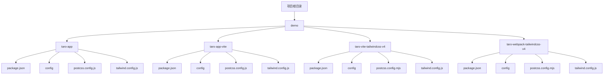
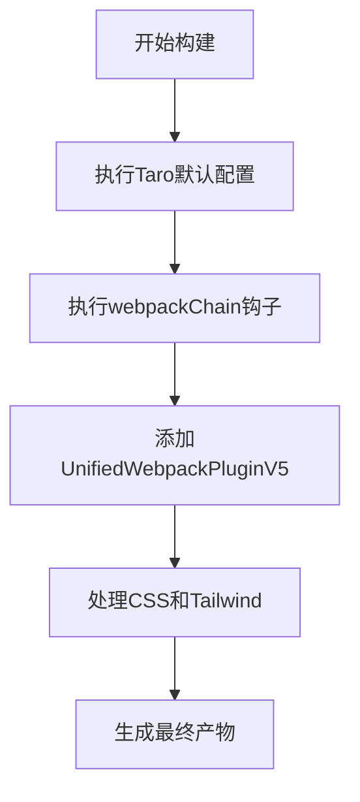
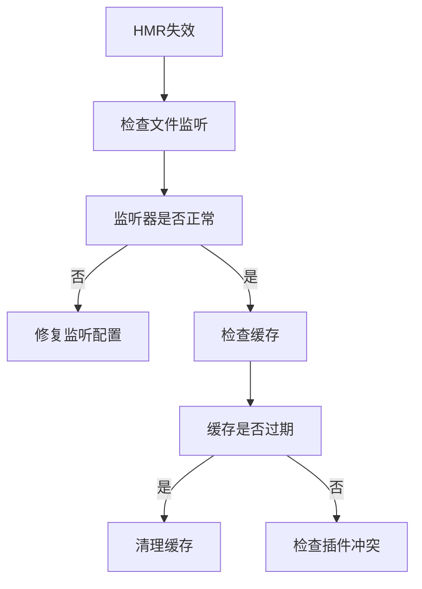
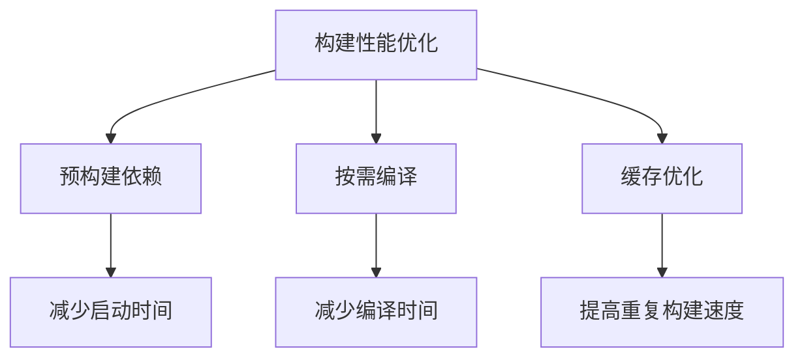
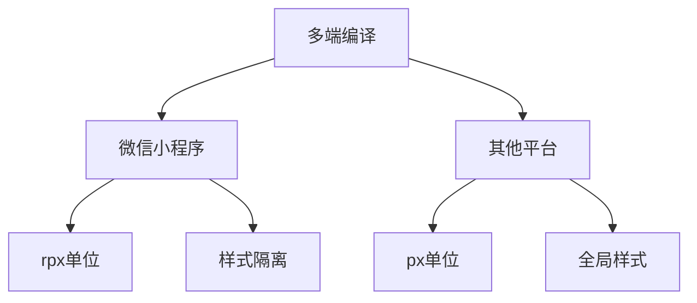
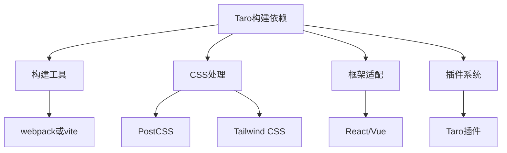

# Taro构建问题

<cite>
**本文档引用的文件**
- [taro-app/package.json](file://demo/taro-app/package.json)
- [taro-app-vite/package.json](file://demo/taro-app-vite/package.json)
- [taro-vite-tailwindcss-v4/package.json](file://demo/taro-vite-tailwindcss-v4/package.json)
- [taro-webpack-tailwindcss-v4/package.json](file://demo/taro-webpack-tailwindcss-v4/package.json)
- [taro-app/config/index.js](file://demo/taro-app/config/index.js)
- [taro-app/config/dev.js](file://demo/taro-app/config/dev.js)
- [taro-app/config/prod.js](file://demo/taro-app/config/prod.js)
- [taro-app/postcss.config.js](file://demo/taro-app/postcss.config.js)
- [taro-app/tailwind.config.js](file://demo/taro-app/tailwind.config.js)
- [taro-app-vite/postcss.config.js](file://demo/taro-app-vite/postcss.config.js)
- [taro-app-vite/tailwind.config.js](file://demo/taro-app-vite/tailwind.config.js)
- [taro-vite-tailwindcss-v4/postcss.config.mjs](file://demo/taro-vite-tailwindcss-v4/postcss.config.mjs)
- [taro-vite-tailwindcss-v4/tailwind.config.js](file://demo/taro-vite-tailwindcss-v4/tailwind.config.js)
- [taro-webpack-tailwindcss-v4/postcss.config.mjs](file://demo/taro-webpack-tailwindcss-v4/postcss.config.mjs)
- [taro-webpack-tailwindcss-v4/tailwind.config.js](file://demo/taro-webpack-tailwindcss-v4/tailwind.config.js)
</cite>

## 目录
1. [简介](#简介)
2. [项目结构](#项目结构)
3. [核心组件](#核心组件)
4. [架构概述](#架构概述)
5. [详细组件分析](#详细组件分析)
6. [依赖分析](#依赖分析)
7. [性能考虑](#性能考虑)
8. [故障排除指南](#故障排除指南)
9. [结论](#结论)
10. [附录](#附录)（如有必要）

## 简介
本文档深入分析Taro框架在使用webpack和vite构建工具时遇到的各类构建问题。重点探讨HMR热更新失效的根本原因及解决方案，包括文件监听配置和缓存清理策略。文档涵盖多端编译时的构建差异，特别是微信小程序与其他平台在样式处理上的区别。同时提供构建性能优化建议，如减少构建时间和优化产物体积的方法。此外，文档解释构建插件的执行顺序和可能的冲突情况，以及如何调试构建过程中的错误。

## 项目结构
本项目包含多个Taro应用实例，分别使用不同的构建工具和配置。主要结构包括使用webpack的`taro-app`和`taro-webpack-tailwindcss-v4`，以及使用vite的`taro-app-vite`和`taro-vite-tailwindcss-v4`。每个应用都有独立的配置文件，包括`package.json`、`config`目录下的配置文件、`postcss.config.js`和`tailwind.config.js`。



**Diagram sources**
- [demo/taro-app/package.json](file://demo/taro-app/package.json)
- [demo/taro-app-vite/package.json](file://demo/taro-app-vite/package.json)
- [demo/taro-vite-tailwindcss-v4/package.json](file://demo/taro-vite-tailwindcss-v4/package.json)
- [demo/taro-webpack-tailwindcss-v4/package.json](file://demo/taro-webpack-tailwindcss-v4/package.json)

**Section sources**
- [demo/taro-app/package.json](file://demo/taro-app/package.json)
- [demo/taro-app-vite/package.json](file://demo/taro-app-vite/package.json)
- [demo/taro-vite-tailwindcss-v4/package.json](file://demo/taro-vite-tailwindcss-v4/package.json)
- [demo/taro-webpack-tailwindcss-v4/package.json](file://demo/taro-webpack-tailwindcss-v4/package.json)

## 核心组件
Taro构建系统的核心组件包括构建工具（webpack或vite）、PostCSS配置、Tailwind CSS集成以及Taro自身的构建配置。这些组件共同决定了应用的构建行为和最终产物。

**Section sources**
- [demo/taro-app/package.json](file://demo/taro-app/package.json)
- [demo/taro-app-vite/package.json](file://demo/taro-app-vite/package.json)
- [demo/taro-vite-tailwindcss-v4/package.json](file://demo/taro-vite-tailwindcss-v4/package.json)
- [demo/taro-webpack-tailwindcss-v4/package.json](file://demo/taro-webpack-tailwindcss-v4/package.json)

## 架构概述
Taro应用的构建架构分为两个主要分支：基于webpack的构建系统和基于vite的构建系统。两者在插件机制、配置方式和构建性能上存在显著差异。

```mermaid
graph TD
A[Taro构建架构] --> B[webpack构建系统]
A --> C[vite构建系统]
B --> D[@tarojs/webpack5-runner]
B --> E[TaroWeappTailwindcssWebpackPluginV5]
C --> F[@tarojs/vite-runner]
C --> G[@tailwindcss/vite]
D --> H[生产环境优化]
E --> I[开发环境HMR]
F --> J[快速启动]
G --> K[按需编译]
```

**Diagram sources**
- [demo/taro-app/config/index.js](file://demo/taro-app/config/index.js)
- [demo/taro-app-vite/config/index.ts](file://demo/taro-app-vite/config/index.ts)
- [demo/taro-vite-tailwindcss-v4/config/index.ts](file://demo/taro-vite-tailwindcss-v4/config/index.ts)
- [demo/taro-webpack-tailwindcss-v4/config/index.ts](file://demo/taro-webpack-tailwindcss-v4/config/index.ts)

## 详细组件分析

### webpack构建系统分析
webpack构建系统通过`@tarojs/webpack5-runner`和自定义插件`UnifiedWebpackPluginV5`实现Tailwind CSS的集成。配置中通过`webpackChain`方法修改webpack配置，添加必要的插件和loader。

#### 构建插件执行顺序


**Diagram sources**
- [demo/taro-app/config/index.js](file://demo/taro-app/config/index.js)
- [demo/taro-webpack-tailwindcss-v4/config/index.ts](file://demo/taro-webpack-tailwindcss-v4/config/index.ts)

#### HMR热更新失效问题
HMR热更新失效通常由文件监听配置不当或缓存未清理引起。在webpack配置中，需要确保`watch`模式正确启用，并且相关文件的监听器正常工作。



**Diagram sources**
- [demo/taro-app/config/index.js](file://demo/taro-app/config/index.js)
- [demo/taro-app/config/dev.js](file://demo/taro-app/config/dev.js)

**Section sources**
- [demo/taro-app/config/index.js](file://demo/taro-app/config/index.js)
- [demo/taro-app/config/dev.js](file://demo/taro-app/config/dev.js)
- [demo/taro-app/config/prod.js](file://demo/taro-app/config/prod.js)

### vite构建系统分析
vite构建系统利用其原生ES模块支持和按需编译特性，提供更快的启动速度和开发体验。通过`@tarojs/vite-runner`和`@tailwindcss/vite`插件实现与Taro和Tailwind的集成。

#### 构建性能优化
vite构建系统通过以下方式优化构建性能：
- 利用浏览器原生ES模块支持，减少打包时间
- 按需编译，只编译当前请求的模块
- 预构建依赖，提高加载速度



**Diagram sources**
- [demo/taro-app-vite/package.json](file://demo/taro-app-vite/package.json)
- [demo/taro-vite-tailwindcss-v4/package.json](file://demo/taro-vite-tailwindcss-v4/package.json)

#### 多端编译差异
不同平台在样式处理上存在差异，特别是微信小程序和其他平台。主要差异体现在：
- 单位转换（rpx vs px）
- 样式作用域处理
- 特定平台的CSS特性支持



**Diagram sources**
- [demo/taro-app/config/index.js](file://demo/taro-app/config/index.js)
- [demo/taro-app-vite/config/index.ts](file://demo/taro-app-vite/config/index.ts)

**Section sources**
- [demo/taro-app-vite/package.json](file://demo/taro-app-vite/package.json)
- [demo/taro-vite-tailwindcss-v4/package.json](file://demo/taro-vite-tailwindcss-v4/package.json)
- [demo/taro-app-vite/postcss.config.js](file://demo/taro-app-vite/postcss.config.js)
- [demo/taro-app-vite/tailwind.config.js](file://demo/taro-app-vite/tailwind.config.js)

## 依赖分析
Taro构建系统的依赖关系复杂，涉及多个层次的依赖管理。主要依赖包括构建工具、CSS处理工具、框架适配器和插件系统。



**Diagram sources**
- [demo/taro-app/package.json](file://demo/taro-app/package.json)
- [demo/taro-app-vite/package.json](file://demo/taro-app-vite/package.json)
- [demo/taro-vite-tailwindcss-v4/package.json](file://demo/taro-vite-tailwindcss-v4/package.json)
- [demo/taro-webpack-tailwindcss-v4/package.json](file://demo/taro-webpack-tailwindcss-v4/package.json)

**Section sources**
- [demo/taro-app/package.json](file://demo/taro-app/package.json)
- [demo/taro-app-vite/package.json](file://demo/taro-app-vite/package.json)
- [demo/taro-vite-tailwindcss-v4/package.json](file://demo/taro-vite-tailwindcss-v4/package.json)
- [demo/taro-webpack-tailwindcss-v4/package.json](file://demo/taro-webpack-tailwindcss-v4/package.json)

## 性能考虑
构建性能是Taro应用开发中的关键因素。优化构建性能可以从以下几个方面入手：
- 减少不必要的依赖
- 优化PostCSS和Tailwind配置
- 合理使用缓存
- 选择合适的构建工具

**Section sources**
- [demo/taro-app/config/index.js](file://demo/taro-app/config/index.js)
- [demo/taro-app-vite/config/index.ts](file://demo/taro-app-vite/config/index.ts)
- [demo/taro-vite-tailwindcss-v4/config/index.ts](file://demo/taro-vite-tailwindcss-v4/config/index.ts)
- [demo/taro-webpack-tailwindcss-v4/config/index.ts](file://demo/taro-webpack-tailwindcss-v4/config/index.ts)

## 故障排除指南
构建过程中常见的错误包括HMR失效、样式不生效、构建时间过长等。以下是一些常见问题的解决方案：

**Section sources**
- [demo/taro-app/config/dev.js](file://demo/taro-app/config/dev.js)
- [demo/taro-app/config/prod.js](file://demo/taro-app/config/prod.js)
- [demo/taro-app/postcss.config.js](file://demo/taro-app/postcss.config.js)
- [demo/taro-app/tailwind.config.js](file://demo/taro-app/tailwind.config.js)

## 结论
Taro框架在webpack和vite构建工具下表现出不同的特性和问题。通过深入理解构建系统的内部机制，可以有效解决HMR失效、样式处理差异和构建性能问题。选择合适的构建工具和配置策略，可以显著提升开发效率和应用性能。

## 附录
本文档引用的所有文件列表：
- [demo/taro-app/package.json](file://demo/taro-app/package.json)
- [demo/taro-app-vite/package.json](file://demo/taro-app-vite/package.json)
- [demo/taro-vite-tailwindcss-v4/package.json](file://demo/taro-vite-tailwindcss-v4/package.json)
- [demo/taro-webpack-tailwindcss-v4/package.json](file://demo/taro-webpack-tailwindcss-v4/package.json)
- [demo/taro-app/config/index.js](file://demo/taro-app/config/index.js)
- [demo/taro-app/config/dev.js](file://demo/taro-app/config/dev.js)
- [demo/taro-app/config/prod.js](file://demo/taro-app/config/prod.js)
- [demo/taro-app/postcss.config.js](file://demo/taro-app/postcss.config.js)
- [demo/taro-app/tailwind.config.js](file://demo/taro-app/tailwind.config.js)
- [demo/taro-app-vite/postcss.config.js](file://demo/taro-app-vite/postcss.config.js)
- [demo/taro-app-vite/tailwind.config.js](file://demo/taro-app-vite/tailwind.config.js)
- [demo/taro-vite-tailwindcss-v4/postcss.config.mjs](file://demo/taro-vite-tailwindcss-v4/postcss.config.mjs)
- [demo/taro-vite-tailwindcss-v4/tailwind.config.js](file://demo/taro-vite-tailwindcss-v4/tailwind.config.js)
- [demo/taro-webpack-tailwindcss-v4/postcss.config.mjs](file://demo/taro-webpack-tailwindcss-v4/postcss.config.mjs)
- [demo/taro-webpack-tailwindcss-v4/tailwind.config.js](file://demo/taro-webpack-tailwindcss-v4/tailwind.config.js)