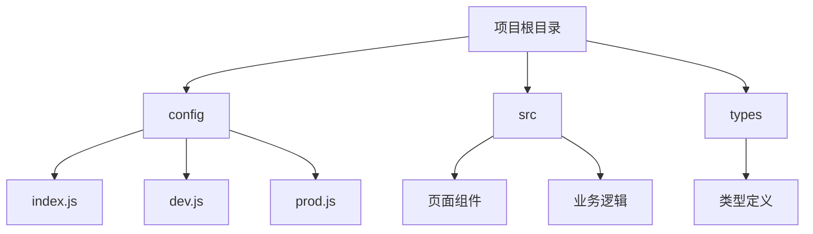
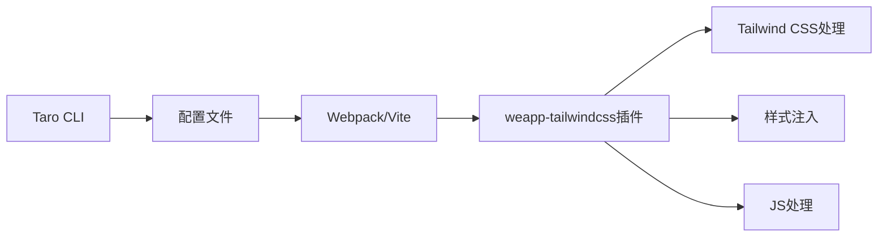
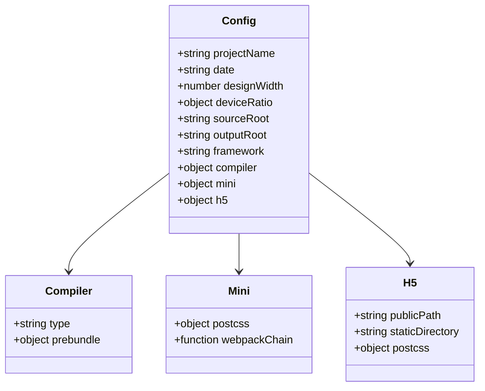
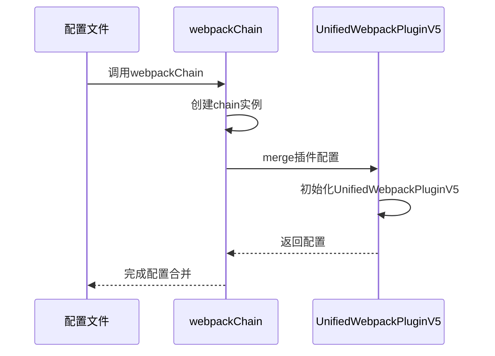
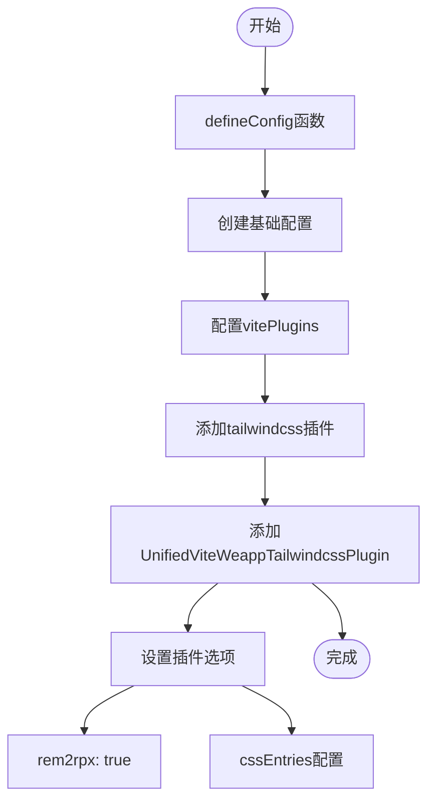
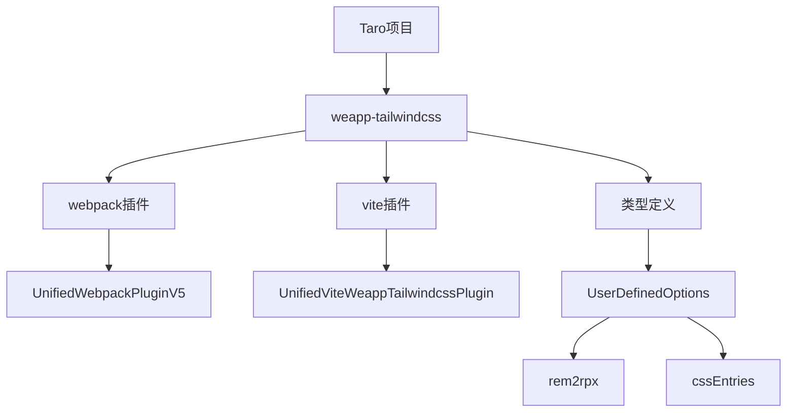

# Taro框架集成问题

<cite>
**本文档引用的文件**
- [index.js](file://demo/taro-app/config/index.js)
- [index.ts](file://demo/taro-vite-tailwindcss-v4/config/index.ts)
- [index.ts](file://demo/taro-webpack-tailwindcss-v4/config/index.ts)
- [postcss.config.js](file://demo/taro-app/postcss.config.js)
- [index.ts](file://packages/weapp-tailwindcss/src/index.ts)
- [types/index.ts](file://packages/weapp-tailwindcss/src/types/index.ts)
</cite>

## 目录
1. [简介](#简介)
2. [项目结构](#项目结构)
3. [核心组件](#核心组件)
4. [架构概述](#架构概述)
5. [详细组件分析](#详细组件分析)
6. [依赖分析](#依赖分析)
7. [性能考虑](#性能考虑)
8. [故障排除指南](#故障排除指南)
9. [结论](#结论)

## 简介
本文档旨在为Taro框架集成weapp-tailwindcss提供详细的故障排除指南。涵盖HMR热更新失效、组件样式隔离、多端兼容性等问题，并详细说明在Taro项目中正确引入和配置weapp-tailwindcss的方法，包括webpack和vite构建工具的配置差异。

## 项目结构
Taro项目结构遵循标准的多端开发模式，包含配置文件、源代码、类型定义等目录。主要配置文件位于`config/`目录下，包括开发和生产环境的配置。



**图示来源**
- [index.js](file://demo/taro-app/config/index.js#L1-L157)

**本节来源**
- [index.js](file://demo/taro-app/config/index.js#L1-L157)

## 核心组件
Taro框架的核心组件包括配置管理、编译器集成、样式处理和JavaScript处理等模块。这些组件协同工作以实现跨平台开发能力。

**本节来源**
- [index.js](file://demo/taro-app/config/index.js#L1-L157)
- [index.ts](file://packages/weapp-tailwindcss/src/index.ts#L1-L5)

## 架构概述
Taro框架通过统一的插件系统集成weapp-tailwindcss，支持webpack和vite两种构建工具。架构设计允许灵活配置和扩展。



**图示来源**
- [index.js](file://demo/taro-app/config/index.js#L63-L130)
- [index.ts](file://demo/taro-vite-tailwindcss-v4/config/index.ts#L39-L59)

## 详细组件分析

### 配置组件分析
Taro项目的配置通过`config/index.js`或`config/index.ts`文件进行管理，支持环境变量和条件配置。

#### 配置对象结构


**图示来源**
- [index.js](file://demo/taro-app/config/index.js#L6-L157)
- [index.ts](file://demo/taro-vite-tailwindcss-v4/config/index.ts#L1-L128)

#### Webpack集成配置


**图示来源**
- [index.js](file://demo/taro-app/config/index.js#L63-L130)

#### Vite集成配置


**图示来源**
- [index.ts](file://demo/taro-vite-tailwindcss-v4/config/index.ts#L39-L59)

**本节来源**
- [index.js](file://demo/taro-app/config/index.js#L1-L157)
- [index.ts](file://demo/taro-vite-tailwindcss-v4/config/index.ts#L1-L128)
- [index.ts](file://demo/taro-webpack-tailwindcss-v4/config/index.ts#L1-L138)

### PostCSS配置分析
PostCSS配置通过`postcss.config.js`文件进行管理，支持动态配置和条件判断。

```mermaid
flowchart TD
A[postcss.config.js] --> B[loaderContext参数]
B --> C{是否为独立分包?}
C --> |是| D[加载子配置文件]
C --> |否| E[使用默认配置]
D --> F[tailwind.config.sub-b.js]
D --> G[tailwind.config.sub-c.js]
E --> H[tailwindcss: {}]
E --> I[autoprefixer: {}]
F --> J[返回配置对象]
G --> J
H --> J
I --> J
J --> K[完成配置]
```

**图示来源**
- [postcss.config.js](file://demo/taro-app/postcss.config.js#L8-L45)

**本节来源**
- [postcss.config.js](file://demo/taro-app/postcss.config.js#L1-L45)

## 依赖分析
Taro项目依赖weapp-tailwindcss包提供的核心功能，通过插件系统集成到构建流程中。



**图示来源**
- [index.ts](file://packages/weapp-tailwindcss/src/index.ts#L1-L5)
- [types/index.ts](file://packages/weapp-tailwindcss/src/types/index.ts#L1-L190)

**本节来源**
- [index.ts](file://packages/weapp-tailwindcss/src/index.ts#L1-L5)
- [types/index.ts](file://packages/weapp-tailwindcss/src/types/index.ts#L1-L190)

## 性能考虑
在Taro项目中集成weapp-tailwindcss时需要考虑以下性能因素：
- 构建缓存配置
- 样式处理效率
- JavaScript转换性能
- 多端编译优化

## 故障排除指南
### HMR热更新失效
当HMR热更新失效时，请检查以下配置：
- 确保`cache.enable`设置为`false`
- 检查webpack/vite配置是否正确
- 验证插件是否正确注册

### 组件样式隔离
为实现组件样式隔离，请确保：
- 正确配置`cssModules`
- 使用`generateScopedName`生成唯一类名
- 避免全局样式污染

### 多端兼容性问题
处理多端兼容性问题时：
- 使用`designWidth`函数根据不同文件返回不同值
- 配置`deviceRatio`适应不同设备
- 在`mini`和`h5`配置中分别设置合适的选项

### weapp-tailwindcss配置
#### Webpack配置要点
- 在`webpackChain`中正确注册`UnifiedWebpackPluginV5`
- 设置`rem2rpx: true`实现单位转换
- 配置`cssEntries`指定入口CSS文件

#### Vite配置要点
- 在`vitePlugins`中添加`UnifiedViteWeappTailwindcssPlugin`
- 确保`compiler.type`设置为`'vite'`
- 正确配置`cssEntries`路径

### 常见配置错误
#### config/index.js配置项
- `projectName`必须与项目实际名称一致
- `sourceRoot`和`outputRoot`路径必须正确
- `framework`必须指定有效的框架类型
- `compiler.type`必须与实际使用的构建工具匹配

**本节来源**
- [index.js](file://demo/taro-app/config/index.js#L6-L157)
- [index.ts](file://demo/taro-vite-tailwindcss-v4/config/index.ts#L1-L128)
- [index.ts](file://demo/taro-webpack-tailwindcss-v4/config/index.ts#L1-L138)

## 结论
本文档详细介绍了Taro框架集成weapp-tailwindcss的配置方法和常见问题解决方案。通过正确的配置和故障排除，可以有效解决HMR热更新、组件样式隔离和多端兼容性等问题。