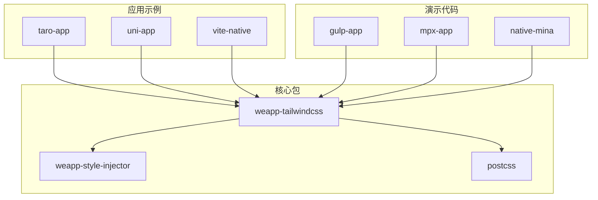
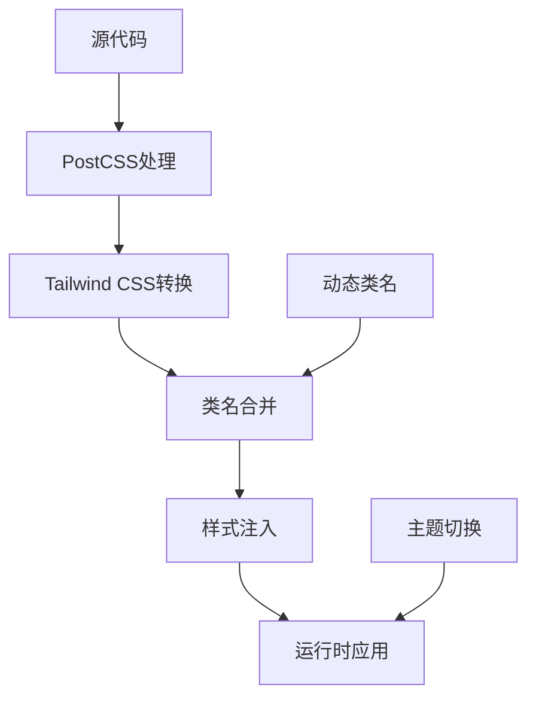
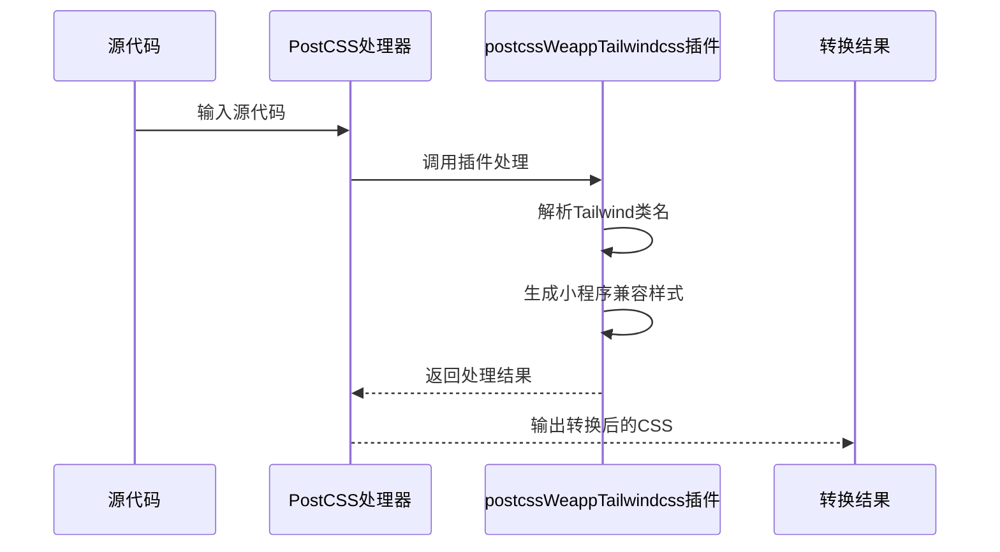
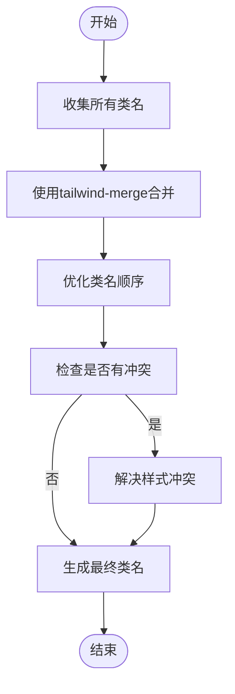
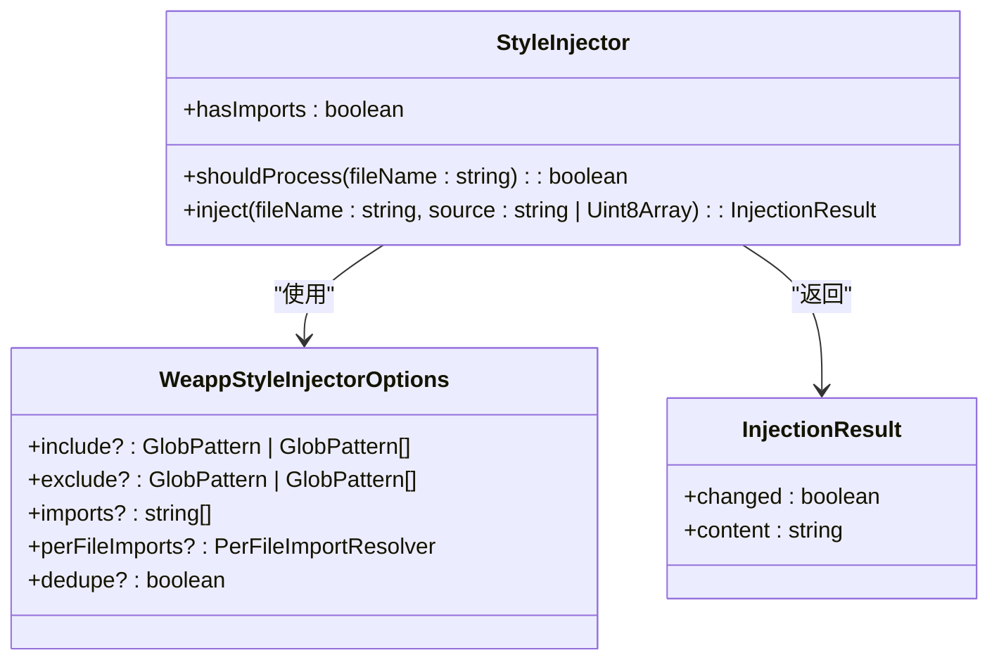
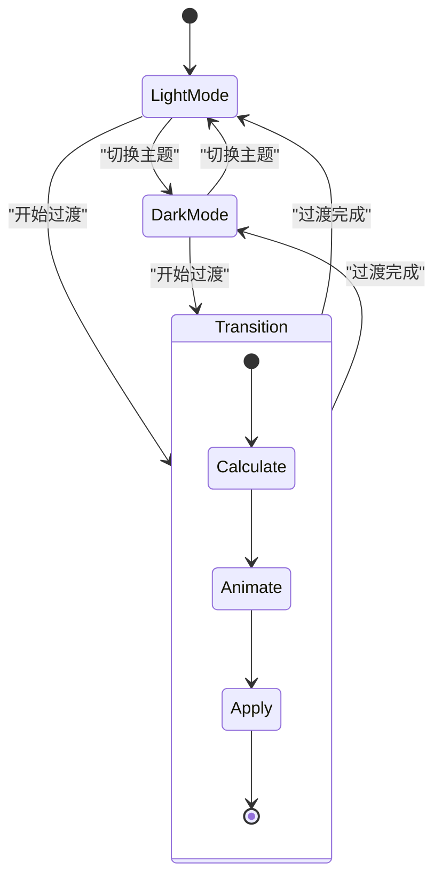
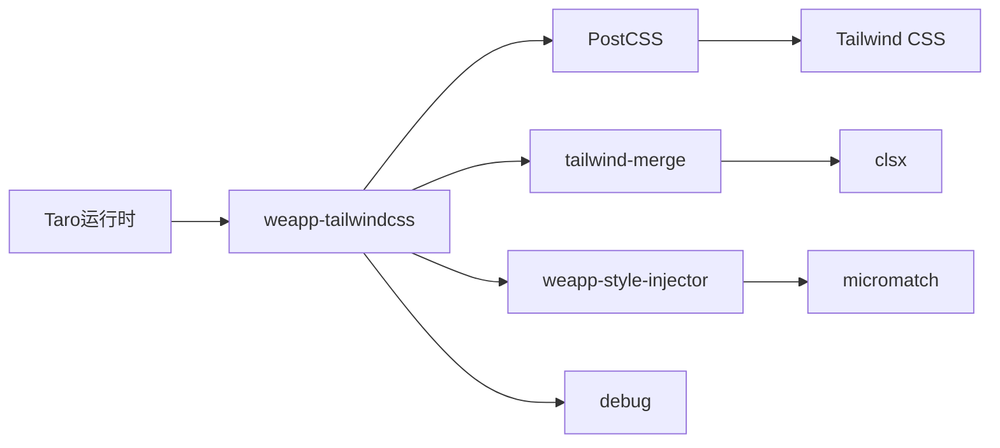

# Taro运行时问题

<cite>
**本文档引用的文件**  
- [options-a2565187.mjs](file://demo/native-mina/weapp-tw-dist/options-a2565187.mjs)
- [style-handler.ts](file://packages/weapp-tailwindcss/src/lightningcss/style-handler.ts)
- [core.ts](file://packages/weapp-style-injector/src/core.ts)
- [runtime.ts](file://packages/weapp-tailwindcss/src/tailwindcss/runtime.ts)
- [create-runtime.ts](file://packages-runtime/runtime/src/create-runtime.ts)
- [preflight.ts](file://packages/postcss/src/preflight.ts)
- [weapp-tw-runtime-classset-loader.ts](file://packages/weapp-tailwindcss/src/bundlers/webpack/loaders/weapp-tw-runtime-classset-loader.ts)
- [index.ts](file://packages-runtime/theme-transition/src/index.ts)
- [list.mpx](file://demo/mpx-tailwindcss-v4/src/components/list.mpx)
- [index.ts](file://apps/vite-native-ts/miniprogram/components/IceButton/index.ts)
</cite>

## 目录
1. [引言](#引言)
2. [项目结构](#项目结构)
3. [核心组件](#核心组件)
4. [架构概述](#架构概述)
5. [详细组件分析](#详细组件分析)
6. [依赖分析](#依赖分析)
7. [性能考虑](#性能考虑)
8. [故障排除指南](#故障排除指南)
9. [结论](#结论)

## 引言
本文档旨在为Taro框架中使用weapp-tailwindcss时遇到的运行时问题提供详细的排查指南。重点解决组件样式隔离失效、动态类名不生效等问题，并深入探讨Taro运行时如何处理weapp-tailwindcss生成的样式，包括样式注入机制和作用域管理。同时涵盖多端运行时的兼容性问题，如某些CSS特性在不同小程序平台的表现差异，以及动态主题切换在Taro中的实现方案和常见陷阱。

## 项目结构
本项目包含多个应用示例、演示代码、基准测试、端到端测试、构建脚本和核心包。核心功能主要集中在`packages`目录下，特别是`weapp-tailwindcss`和`weapp-style-injector`包，它们负责处理Tailwind CSS在小程序环境下的适配和样式注入。

**Diagram sources**
- [weapp-tailwindcss](file://packages/weapp-tailwindcss)
- [weapp-style-injector](file://packages/weapp-style-injector)
- [postcss](file://packages/postcss)

**Section sources**
- [project structure](file://project_structure)

## 核心组件
本文档的核心组件包括weapp-tailwindcss运行时、样式注入器、预设样式处理器和动态类名处理机制。这些组件共同协作，确保Tailwind CSS能够在Taro框架中正确地编译、注入和应用。

**Section sources**
- [runtime.ts](file://packages/weapp-tailwindcss/src/tailwindcss/runtime.ts)
- [core.ts](file://packages/weapp-style-injector/src/core.ts)
- [preflight.ts](file://packages/postcss/src/preflight.ts)

## 架构概述
Taro运行时处理weapp-tailwindcss的架构主要包括样式处理、类名合并、动态注入和主题切换四个主要部分。样式处理通过PostCSS插件将Tailwind CSS转换为小程序可识别的样式；类名合并利用tailwind-merge库优化最终的类名集合；动态注入通过weapp-style-injector在编译时将样式注入到目标文件；主题切换则通过theme-transition包实现平滑的视觉过渡。

**Diagram sources**
- [runtime.ts](file://packages/weapp-tailwindcss/src/tailwindcss/runtime.ts)
- [create-runtime.ts](file://packages-runtime/runtime/src/create-runtime.ts)
- [index.ts](file://packages-runtime/theme-transition/src/index.ts)

## 详细组件分析

### 样式处理组件分析
weapp-tailwindcss通过PostCSS插件系统处理Tailwind CSS，将现代CSS语法转换为小程序支持的样式。核心处理逻辑位于`styleHandler`函数中，它使用`postcssWeappTailwindcss`插件进行转换。

**Diagram sources**
- [style-handler.ts](file://packages/weapp-tailwindcss/src/lightningcss/style-handler.ts)
- [runtime.ts](file://packages/weapp-tailwindcss/src/tailwindcss/runtime.ts)

### 类名合并组件分析
类名合并是优化渲染性能的关键步骤，通过`tailwind-merge`库实现。运行时会收集所有动态和静态类名，然后进行智能合并，去除冗余样式，确保最终的类名集合是最优的。

**Diagram sources**
- [create-runtime.ts](file://packages-runtime/runtime/src/create-runtime.ts)
- [runtime.ts](file://packages/weapp-tailwindcss/src/tailwindcss/runtime.ts)

### 样式注入组件分析
样式注入器负责将处理后的样式注入到目标文件中。它通过分析文件依赖关系，确定样式注入的位置和顺序，确保样式能够正确应用到组件上。

**Diagram sources**
- [core.ts](file://packages/weapp-style-injector/src/core.ts)
- [weapp-tw-runtime-classset-loader.ts](file://packages/weapp-tailwindcss/src/bundlers/webpack/loaders/weapp-tw-runtime-classset-loader.ts)

### 主题切换组件分析
动态主题切换通过`theme-transition`包实现，利用View Transition API提供平滑的视觉过渡效果。该组件监听主题变化事件，计算过渡动画的关键帧，并应用到页面上。

**Diagram sources**
- [index.ts](file://packages-runtime/theme-transition/src/index.ts)
- [utils/types.ts](file://packages-runtime/theme-transition/src/utils/types.ts)

**Section sources**
- [index.ts](file://packages-runtime/theme-transition/src/index.ts)
- [test/index.test.ts](file://packages-runtime/theme-transition/test/index.test.ts)

## 依赖分析
Taro运行时与weapp-tailwindcss的依赖关系复杂而紧密。核心依赖包括PostCSS用于样式处理，tailwind-merge用于类名优化，以及weapp-style-injector用于样式注入。这些依赖共同构成了一个完整的样式处理流水线。

**Diagram sources**
- [package.json](file://packages/weapp-tailwindcss/package.json)
- [package.json](file://packages/weapp-style-injector/package.json)

**Section sources**
- [package.json](file://packages/weapp-tailwindcss/package.json)
- [package.json](file://packages/weapp-style-injector/package.json)

## 性能考虑
在Taro运行时中使用weapp-tailwindcss时，性能优化至关重要。主要考虑以下几点：
1. 类名合并的缓存机制，避免重复计算
2. 样式注入的去重处理，减少冗余样式
3. 动态类名的懒加载，提高初始渲染速度
4. 主题切换的动画优化，确保流畅的用户体验

## 故障排除指南
### 组件样式隔离失效
当组件样式隔离失效时，首先检查组件的`styleIsolation`配置。确保在组件配置中正确设置了`styleIsolation`为`apply-shared`或`shared`，以允许样式穿透。

**Section sources**
- [index.json](file://templates/weapp-native-mina-tailwindcss-template/src/custom-tab-bar/index.json)
- [index.ts](file://apps/vite-native-ts/miniprogram/components/IceButton/index.ts)

### 动态类名不生效
动态类名不生效通常是由于类名未被正确收集或合并。检查`weapp-tw-runtime-classset-loader`是否正确配置，并确保在构建过程中调用了`getClassSet`方法。

**Section sources**
- [weapp-tw-runtime-classset-loader.ts](file://packages/weapp-tailwindcss/src/bundlers/webpack/loaders/weapp-tw-runtime-classset-loader.ts)
- [runtime.ts](file://packages/weapp-tailwindcss/src/tailwindcss/runtime.ts)

### 多端兼容性问题
不同小程序平台对CSS特性的支持存在差异。建议使用weapp-tailwindcss提供的兼容性处理功能，并在开发过程中使用开发者工具检查样式应用情况。

### 动态主题切换陷阱
实现动态主题切换时，需要注意以下几点：
1. 确保View Transition API的浏览器兼容性
2. 处理动画失败的降级方案
3. 避免在动画过程中修改DOM结构

**Section sources**
- [index.ts](file://packages-runtime/theme-transition/src/index.ts)
- [test/index.test.ts](file://packages-runtime/theme-transition/test/index.test.ts)

## 结论
本文档详细介绍了Taro运行时中使用weapp-tailwindcss时可能遇到的问题及其解决方案。通过深入分析样式处理、类名合并、样式注入和主题切换等核心组件，为开发者提供了全面的排查指南和最佳实践建议。正确理解和应用这些知识，可以显著提升小程序的开发效率和用户体验。