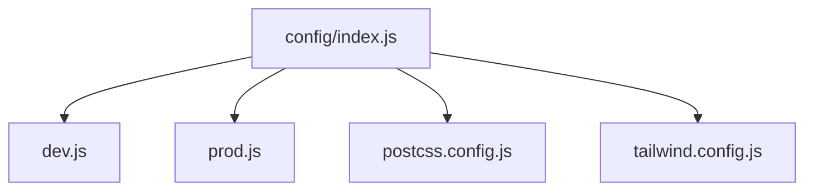
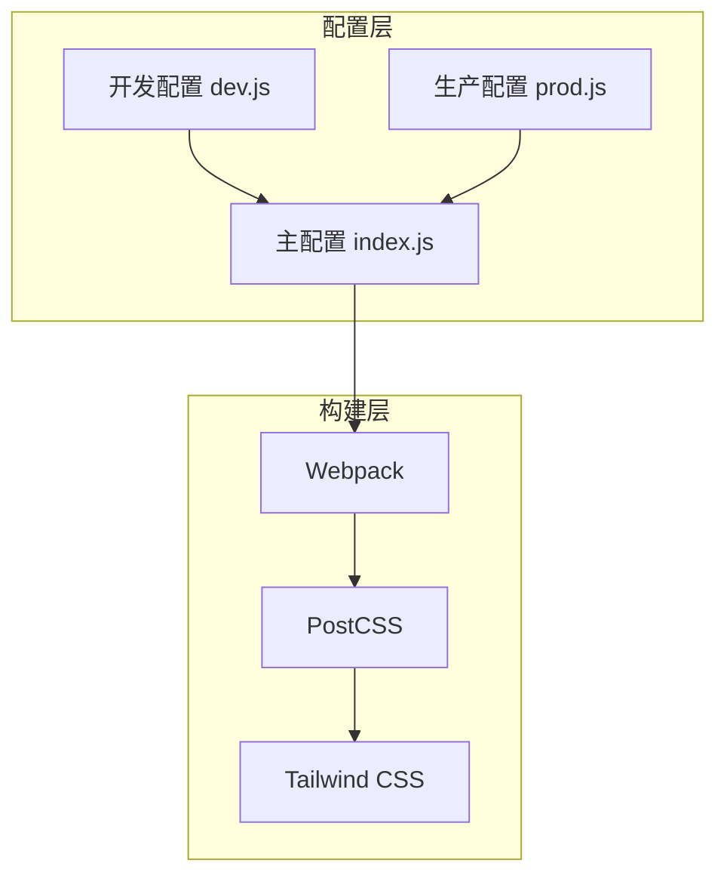
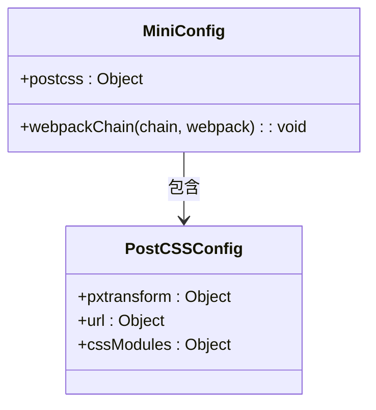
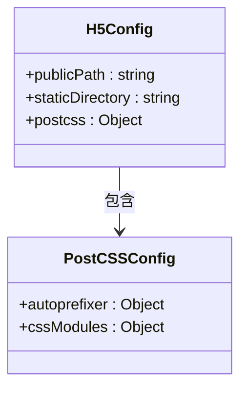
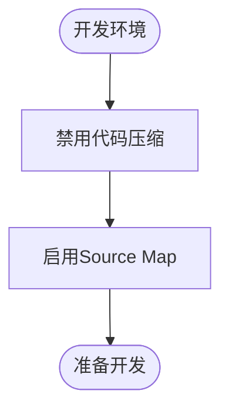
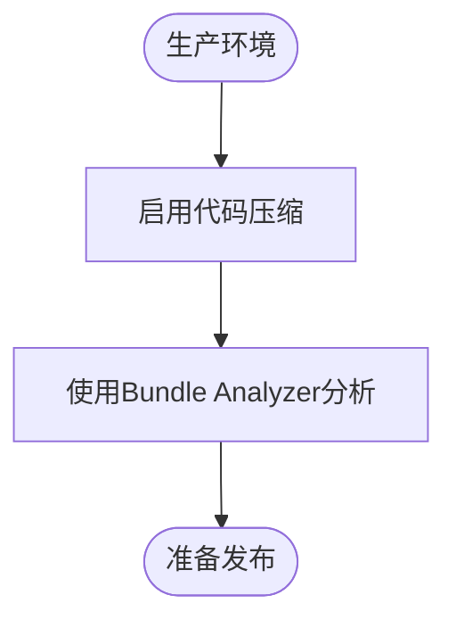
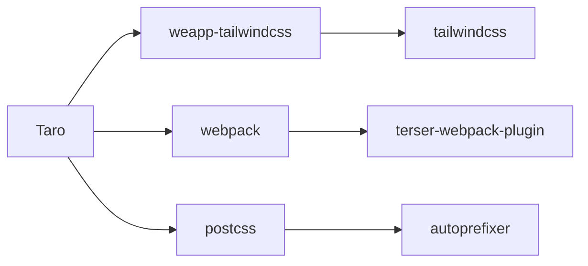

# Taro配置问题

<cite>
**本文档中引用的文件**  
- [index.js](file://demo/taro-app/config/index.js)
- [dev.js](file://demo/taro-app/config/dev.js)
- [prod.js](file://demo/taro-app/config/prod.js)
- [postcss.config.js](file://demo/taro-app/postcss.config.js)
- [tailwind.config.js](file://demo/taro-app/tailwind.config.js)
</cite>

## 目录
1. [简介](#简介)
2. [项目结构](#项目结构)
3. [核心组件](#核心组件)
4. [架构概述](#架构概述)
5. [详细组件分析](#详细组件分析)
6. [依赖分析](#依赖分析)
7. [性能考虑](#性能考虑)
8. [故障排除指南](#故障排除指南)
9. [结论](#结论)

## 简介
本文档旨在提供关于Taro项目中`config/index.js`或`config/index.ts`配置文件的全面指南，重点解决与`weapp-tailwindcss`集成相关的常见配置问题。文档详细说明了在不同环境（开发/生产）下如何正确配置Taro项目以支持Tailwind CSS，并涵盖mini和h5平台的特定设置。此外，还介绍了PostCSS插件链的正确配置方式、最佳实践以及从Taro 2.x升级到3.x时需要注意的变更事项。

## 项目结构
Taro项目的配置通常位于`config/`目录下，包含多个环境特定的配置文件。主配置文件`index.js`或`index.ts`通过合并开发和生产环境的配置来生成最终的构建配置。这种结构允许开发者根据运行环境灵活调整设置。

**图示来源**  
- [index.js](file://demo/taro-app/config/index.js#L1-L157)
- [dev.js](file://demo/taro-app/config/dev.js#L1-L35)
- [prod.js](file://demo/taro-app/config/prod.js#L1-L18)

**本节来源**  
- [index.js](file://demo/taro-app/config/index.js#L1-L157)

## 核心组件
Taro配置的核心在于`config/index.js`文件，它定义了项目的全局设置，包括编译器类型、设计宽度、设备比例等基础参数。同时，该文件通过`webpackChain`方法扩展了Webpack配置，用于集成`weapp-tailwindcss`插件，从而实现Tailwind CSS在小程序中的使用。

**本节来源**  
- [index.js](file://demo/taro-app/config/index.js#L6-L148)

## 架构概述
Taro项目采用模块化配置架构，将不同环境的配置分离，确保开发和生产环境之间的差异得到妥善处理。通过`merge`函数动态合并配置，实现了灵活性和可维护性的平衡。此外，PostCSS和Tailwind CSS的集成通过专门的插件完成，保证了样式处理的高效性和一致性。

**图示来源**  
- [index.js](file://demo/taro-app/config/index.js#L1-L157)
- [postcss.config.js](file://demo/taro-app/postcss.config.js)

## 详细组件分析

### 主配置文件分析
主配置文件`index.js`是整个Taro项目配置的入口点，负责定义项目的基本属性和构建选项。其中，`mini`和`h5`字段分别针对小程序和H5平台进行定制化配置。

#### mini平台配置
`mini`字段下的`postcss`配置启用了`pxtransform`和`url`插件，分别用于单位转换和资源路径处理。此外，`webpackChain`方法通过引入`UnifiedWebpackPluginV5`插件实现了Tailwind CSS的支持。

**图示来源**  
- [index.js](file://demo/taro-app/config/index.js#L34-L131)

#### h5平台配置
`h5`字段下的配置相对简单，主要启用了`autoprefixer`插件以确保CSS样式在不同浏览器中的兼容性。`publicPath`和`staticDirectory`则定义了静态资源的访问路径和存储位置。

**图示来源**  
- [index.js](file://demo/taro-app/config/index.js#L132-L148)

### 环境配置分析
环境配置文件`dev.js`和`prod.js`分别定义了开发和生产环境下的特殊设置。例如，`dev.js`中可以启用调试工具，而`prod.js`则可能包含代码压缩和分析插件。

#### 开发环境配置
开发环境配置侧重于提高开发效率，通常会关闭某些优化选项以便于调试。

**图示来源**  
- [dev.js](file://demo/taro-app/config/dev.js#L1-L35)

#### 生产环境配置
生产环境配置注重性能优化，可能会引入代码分析工具来监控打包体积。

**图示来源**  
- [prod.js](file://demo/taro-app/config/prod.js#L1-L18)

**本节来源**  
- [index.js](file://demo/taro-app/config/index.js#L151-L156)
- [dev.js](file://demo/taro-app/config/dev.js#L1-L35)
- [prod.js](file://demo/taro-app/config/prod.js#L1-L18)

## 依赖分析
Taro项目的配置依赖于多个外部库，如`weapp-tailwindcss`、`webpack`和`postcss`。这些依赖通过`package.json`文件进行管理，并在配置文件中通过`require`语句引入。正确的依赖版本选择对于确保配置的稳定性和兼容性至关重要。

**图示来源**  
- [package.json](file://packages/weapp-tailwindcss/package.json#L188-L212)

**本节来源**  
- [package.json](file://packages/weapp-tailwindcss/package.json#L188-L212)

## 性能考虑
在配置Taro项目时，必须考虑性能影响。例如，在生产环境中启用代码压缩和Tree Shaking可以显著减小包体积，但在开发环境中应避免这些操作以加快构建速度。此外，合理配置PostCSS插件链可以减少不必要的处理步骤，提升构建效率。

## 故障排除指南
当遇到配置问题时，首先检查配置文件的语法是否正确，然后确认所有依赖项均已正确安装。对于Tailwind CSS集成问题，确保`weapp-tailwindcss`插件已正确配置并应用于Webpack构建流程。如果问题仍然存在，可以通过启用详细的日志输出来定位问题根源。

**本节来源**  
- [index.js](file://demo/taro-app/config/index.js#L63-L130)
- [dev.js](file://demo/taro-app/config/dev.js#L6-L31)
- [prod.js](file://demo/taro-app/config/prod.js#L8-L14)

## 结论
本文档提供了Taro项目中`config/index.js`或`config/index.ts`配置文件的全面指南，涵盖了从基础设置到高级集成的各个方面。通过遵循文档中的最佳实践，开发者可以有效避免常见的配置错误，确保项目顺利运行。随着Taro版本的不断演进，建议定期查阅官方文档以获取最新的配置建议和技术支持。