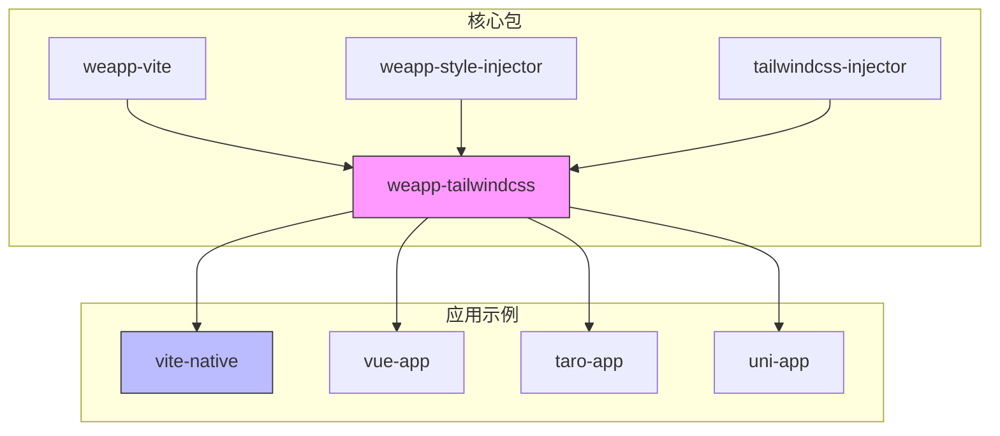
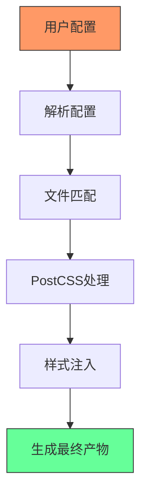
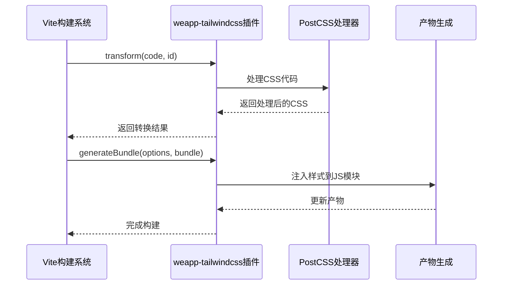
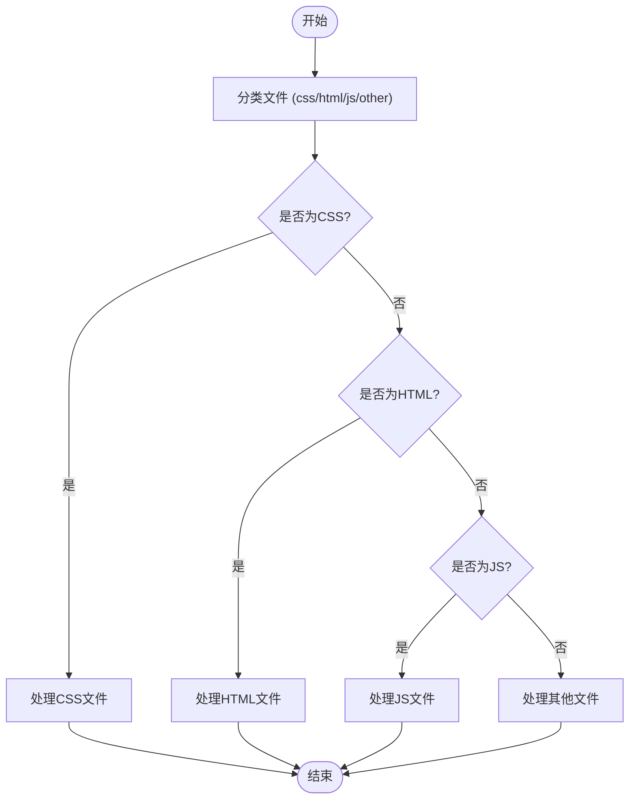

# Vite构建问题

<cite>
**本文档中引用的文件**  
- [vite.config.ts](file://apps/vite-native/vite.config.ts)
- [index.ts](file://packages/weapp-tailwindcss/src/index.ts)
- [utils/index.ts](file://packages/weapp-tailwindcss/src/utils/index.ts)
- [types.ts](file://packages/weapp-tailwindcss/src/types.ts)
- [tailwind.config.js](file://apps/vite-native/tailwind.config.js)
- [postcss.config.js](file://apps/vite-native/postcss.config.js)
</cite>

## 目录
1. [简介](#简介)
2. [项目结构](#项目结构)
3. [核心组件](#核心组件)
4. [架构概述](#架构概述)
5. [详细组件分析](#详细组件分析)
6. [依赖分析](#依赖分析)
7. [性能考虑](#性能考虑)
8. [故障排除指南](#故障排除指南)
9. [结论](#结论)

## 简介
本文档旨在深入分析和解决在使用Vite构建微信小程序项目时遇到的常见问题，特别是HMR热更新失效、构建速度慢、产物体积过大等问题。重点研究weapp-tailwindcss插件在Vite构建过程中的工作原理，包括其如何处理Vue单文件组件中的样式、如何优化构建性能。文档将提供Vite配置下的优化建议，如chunk分割、tree-shaking配置、预构建配置等，并解释如何调试构建过程中的样式处理问题。

## 项目结构
本项目是一个复杂的monorepo结构，包含多个应用示例和核心包。核心的weapp-tailwindcss包位于`packages/weapp-tailwindcss`目录下，而各种应用示例（如vite-native、vue-app等）则位于`apps`目录下，用于演示不同框架和配置下的集成方式。



**Diagram sources**
- [packages/weapp-tailwindcss](file://packages/weapp-tailwindcss)
- [apps/vite-native](file://apps/vite-native)

**Section sources**
- [packages/weapp-tailwindcss](file://packages/weapp-tailwindcss)
- [apps/vite-native](file://apps/vite-native)

## 核心组件
weapp-tailwindcss的核心功能由多个模块组成，包括Vite插件、Webpack插件、类型定义和工具函数。其主要职责是将Tailwind CSS的功能适配到微信小程序的构建环境中，处理CSS类名的生成、样式注入和单位转换（如rem到rpx）。

**Section sources**
- [packages/weapp-tailwindcss/src/index.ts](file://packages/weapp-tailwindcss/src/index.ts)
- [packages/weapp-tailwindcss/src/vite.ts](file://packages/weapp-tailwindcss/src/vite.ts)

## 架构概述
weapp-tailwindcss的架构设计为一个可扩展的插件系统，能够无缝集成到Vite和Webpack等主流构建工具中。其核心流程包括：解析用户配置、匹配需要处理的文件、通过PostCSS处理CSS、将生成的样式注入到小程序的JS和WXML文件中。



**Diagram sources**
- [packages/weapp-tailwindcss/src/index.ts](file://packages/weapp-tailwindcss/src/index.ts)
- [packages/weapp-tailwindcss/src/vite.ts](file://packages/weapp-tailwindcss/src/vite.ts)

## 详细组件分析

### Vite插件分析
weapp-tailwindcss的Vite插件实现了Vite插件API，通过`transform`钩子拦截和修改CSS文件，通过`generateBundle`钩子将生成的样式注入到JS文件中。

#### 对于API/服务组件：


**Diagram sources**
- [packages/weapp-tailwindcss/src/vite.ts](file://packages/weapp-tailwindcss/src/vite.ts)
- [apps/vite-native/vite.config.ts](file://apps/vite-native/vite.config.ts)

### 工具函数分析
工具函数模块提供了文件分类、路径处理、配置合并等基础功能，是整个插件系统稳定运行的关键。

#### 对于复杂逻辑组件：


**Diagram sources**
- [packages/weapp-tailwindcss/src/utils/index.ts](file://packages/weapp-tailwindcss/src/utils/index.ts)
- [packages/weapp-tailwindcss/src/types.ts](file://packages/weapp-tailwindcss/src/types.ts)

**Section sources**
- [packages/weapp-tailwindcss/src/utils/index.ts](file://packages/weapp-tailwindcss/src/utils/index.ts)
- [packages/weapp-tailwindcss/src/types.ts](file://packages/weapp-tailwindcss/src/types.ts)

## 依赖分析
weapp-tailwindcss依赖于多个核心包，包括`@weapp-tailwindcss/shared`用于共享工具函数，`tailwindcss-injector`用于样式注入，`weapp-vite`提供Vite构建支持。

```mermaid
graph LR
A[weapp-tailwindcss] --> B[@weapp-tailwindcss/shared]
A --> C[tailwindcss-injector]
A --> D[weapp-vite]
A --> E[postcss]
A --> F[tailwindcss]
style A fill:#f9f,stroke:#333
```

**Diagram sources**
- [packages/weapp-tailwindcss/package.json](file://packages/weapp-tailwindcss/package.json)
- [packages/weapp-tailwindcss/src/index.ts](file://packages/weapp-tailwindcss/src/index.ts)

**Section sources**
- [packages/weapp-tailwindcss/package.json](file://packages/weapp-tailwindcss/package.json)

## 性能考虑
为了优化构建性能，建议在Vite配置中启用预构建，并合理配置chunk分割策略。同时，可以通过tree-shaking移除未使用的CSS代码，减少最终产物体积。

## 故障排除指南
当遇到HMR热更新失效时，应检查Vite配置中的`cssEntries`是否正确配置。对于构建速度慢的问题，可以分析PostCSS处理流程，确保没有不必要的插件。产物体积过大通常与未启用tree-shaking或未正确配置purge选项有关。

**Section sources**
- [apps/vite-native/vite.config.ts](file://apps/vite-native/vite.config.ts)
- [apps/vite-native/tailwind.config.js](file://apps/vite-native/tailwind.config.js)

## 结论
weapp-tailwindcss为在微信小程序项目中使用Tailwind CSS提供了强大的支持。通过深入理解其架构和工作原理，开发者可以有效解决构建过程中的各种问题，并通过合理的配置优化构建性能和产物质量。