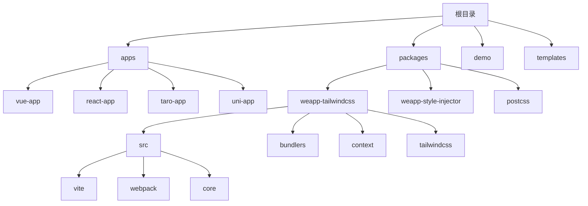
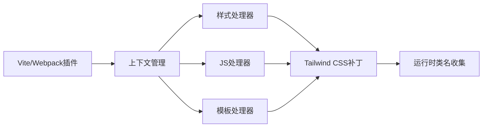
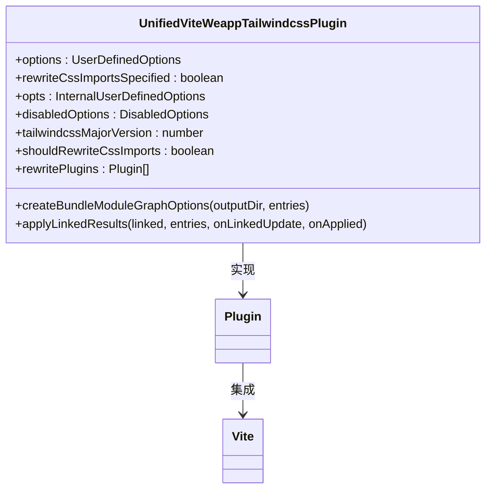
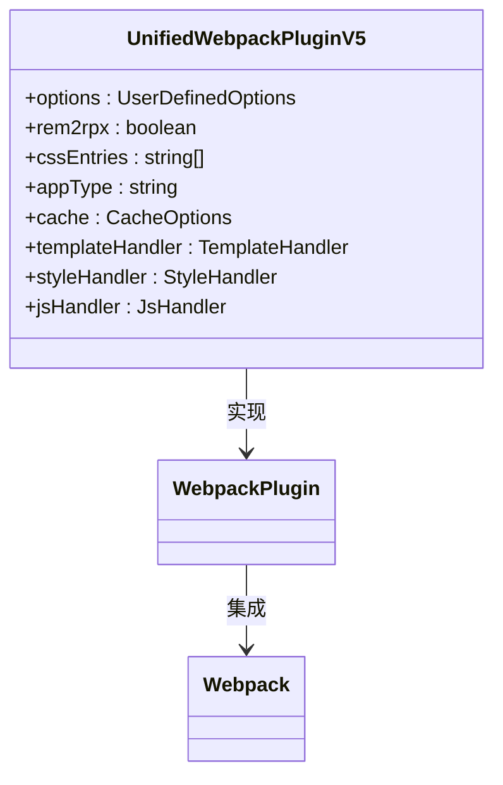
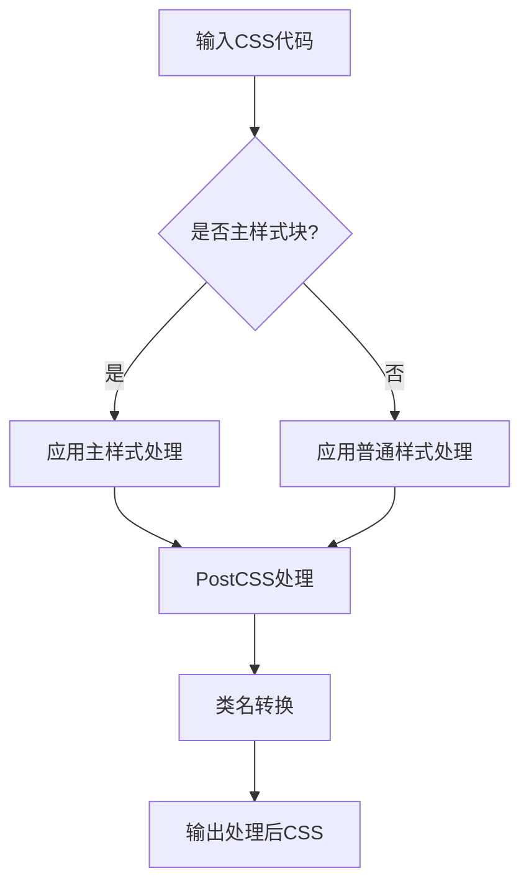
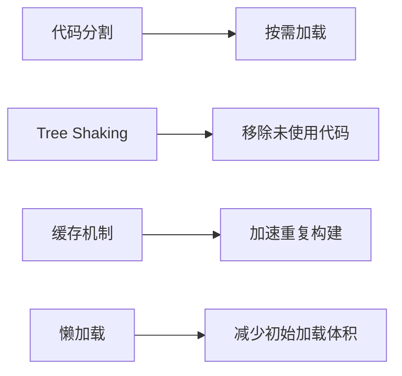

# Vue构建问题

<cite>
**本文档引用的文件**  
- [index.ts](file://packages/weapp-tailwindcss/src/index.ts)
- [vite.config.ts](file://apps/vue-app/vite.config.ts)
- [package.json](file://apps/vue-app/package.json)
- [package.json](file://packages/weapp-tailwindcss/package.json)
- [vite/index.ts](file://packages/weapp-tailwindcss/src/bundlers/vite/index.ts)
- [webpack/index.ts](file://packages/weapp-tailwindcss/src/bundlers/webpack/index.ts)
- [context/index.ts](file://packages/weapp-tailwindcss/src/context/index.ts)
- [core.ts](file://packages/weapp-tailwindcss/src/core.ts)
- [uni-app-x/vite.ts](file://packages/weapp-tailwindcss/src/uni-app-x/vite.ts)
- [weapp-style-injector/src/vite/uni-app.ts](file://packages/weapp-style-injector/src/vite/uni-app.ts)
</cite>

## 目录
1. [简介](#简介)
2. [项目结构](#项目结构)
3. [核心组件](#核心组件)
4. [架构概述](#架构概述)
5. [详细组件分析](#详细组件分析)
6. [依赖分析](#依赖分析)
7. [性能考虑](#性能考虑)
8. [故障排除指南](#故障排除指南)
9. [结论](#结论)

## 简介
本文档旨在为使用weapp-tailwindcss在Vue项目中构建时遇到的常见问题提供详细的解决方案。重点解决HMR热更新失效、构建速度慢、产物体积过大等问题。文档详细说明了weapp-tailwindcss在Vue项目构建过程中的工作原理，包括如何处理单文件组件中的样式、如何优化构建性能。同时提供了Vite和Webpack构建工具下的优化配置建议，如chunk分割、tree-shaking配置等。此外，还解释了如何调试构建过程中的样式处理问题，包括PostCSS处理流程、类名生成机制等，并包含构建产物分析方法和性能优化技巧。

## 项目结构
本项目采用monorepo结构，包含多个应用示例和核心包。主要结构如下：



**图源**  
- [package.json](file://package.json#L1-L215)
- [vite.config.ts](file://apps/vue-app/vite.config.ts#L1-L18)

## 核心组件
weapp-tailwindcss的核心组件主要包括Vite和Webpack插件、样式处理器、JS处理器和模板处理器。这些组件协同工作，实现Tailwind CSS在小程序环境中的原子化样式处理。

**组件源**  
- [index.ts](file://packages/weapp-tailwindcss/src/index.ts#L1-L5)
- [core.ts](file://packages/weapp-tailwindcss/src/core.ts#L1-L76)

## 架构概述
weapp-tailwindcss的架构设计遵循模块化原则，各组件职责分明。核心架构包括：



**图源**  
- [context/index.ts](file://packages/weapp-tailwindcss/src/context/index.ts#L1-L133)
- [core.ts](file://packages/weapp-tailwindcss/src/core.ts#L1-L76)

## 详细组件分析

### Vite插件分析
Vite插件是weapp-tailwindcss的核心组件之一，负责在Vite构建过程中处理Tailwind CSS相关任务。

#### Vite插件实现


**图源**  
- [vite/index.ts](file://packages/weapp-tailwindcss/src/bundlers/vite/index.ts#L1-L200)

**组件源**  
- [vite/index.ts](file://packages/weapp-tailwindcss/src/bundlers/vite/index.ts#L1-L479)

### Webpack插件分析
Webpack插件为Webpack用户提供Tailwind CSS支持，与Vite插件功能类似但实现方式不同。

#### Webpack插件实现


**图源**  
- [webpack/index.ts](file://packages/weapp-tailwindcss/src/bundlers/webpack/index.ts#L1-L2)

### 样式处理分析
样式处理器负责处理CSS文件中的Tailwind类名，将其转换为小程序可用的样式。

#### 样式处理流程


**图源**  
- [uni-app-x/vite.ts](file://packages/weapp-tailwindcss/src/uni-app-x/vite.ts#L66-L118)

### 构建性能优化
针对构建速度慢和产物体积过大的问题，weapp-tailwindcss提供了多种优化策略。

#### 构建优化策略


**图源**  
- [weapp-style-injector/src/vite/uni-app.ts](file://packages/weapp-style-injector/src/vite/uni-app.ts#L1-L111)

## 依赖分析
weapp-tailwindcss的依赖关系复杂，涉及多个核心包和工具。

```mermaid
graph TD
A[weapp-tailwindcss] --> B[@babel/parser]
A --> C[@babel/traverse]
A --> D[@babel/types]
A --> E[@vue/compiler-dom]
A --> F[@vue/compiler-sfc]
A --> G[tailwindcss-patch]
A --> H[postcss]
A --> I[vite]
A --> J[webpack]
```

**图源**  
- [package.json](file://packages/weapp-tailwindcss/package.json#L189-L212)

**依赖源**  
- [package.json](file://packages/weapp-tailwindcss/package.json#L1-L215)

## 性能考虑
在使用weapp-tailwindcss时，需要考虑以下几个性能方面：

1. **构建速度**：通过缓存和并行处理优化构建速度
2. **产物体积**：利用tree-shaking和代码分割减少最终包大小
3. **内存使用**：合理配置缓存大小，避免内存溢出
4. **热更新**：优化HMR机制，提高开发体验

## 故障排除指南
当遇到构建问题时，可以按照以下步骤进行排查：

**排查源**  
- [context/index.ts](file://packages/weapp-tailwindcss/src/context/index.ts#L64-L133)
- [core.ts](file://packages/weapp-tailwindcss/src/core.ts#L13-L76)

## 结论
weapp-tailwindcss为Vue项目在小程序环境中的构建提供了完整的解决方案。通过深入理解其架构和工作原理，开发者可以更好地优化构建过程，解决常见问题，提高开发效率和应用性能。