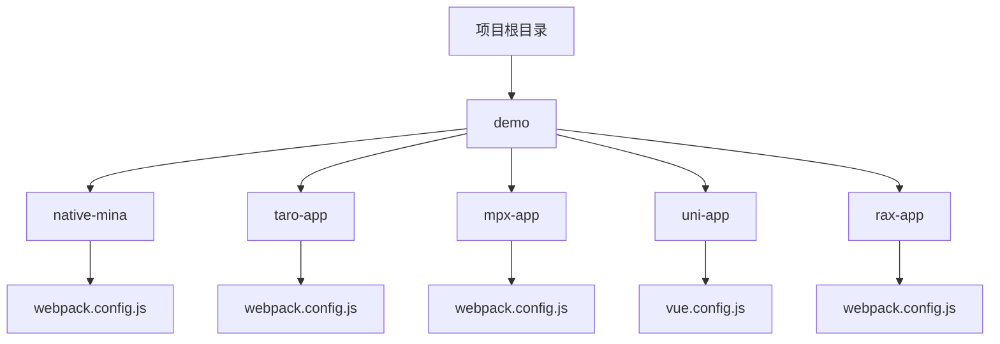
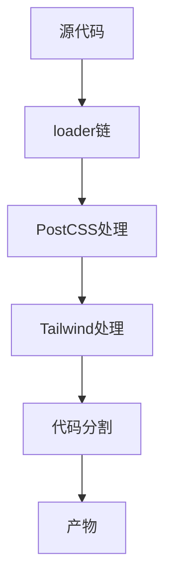
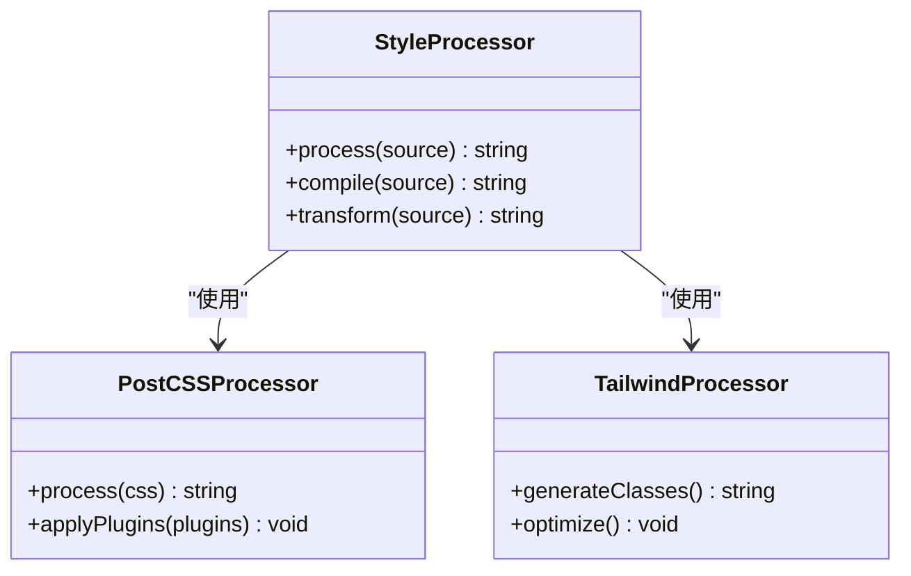
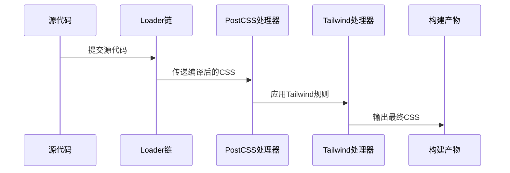
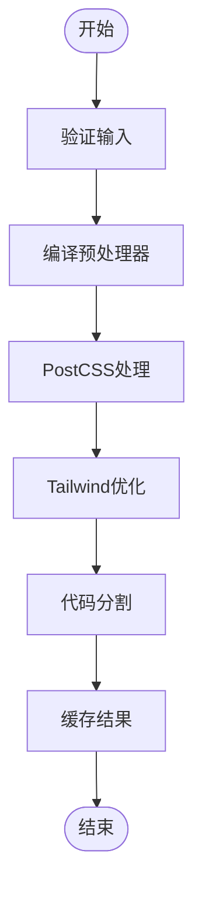
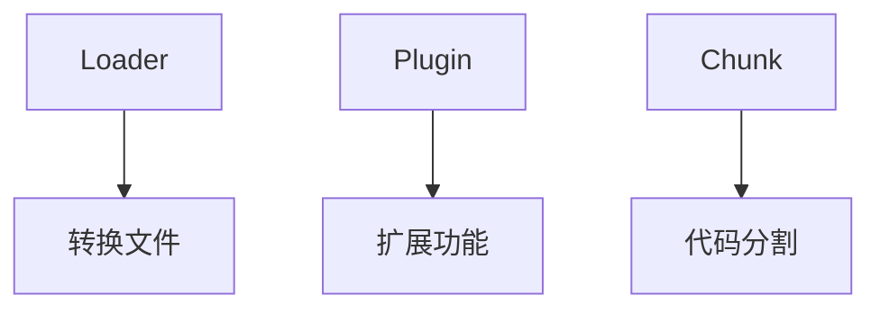
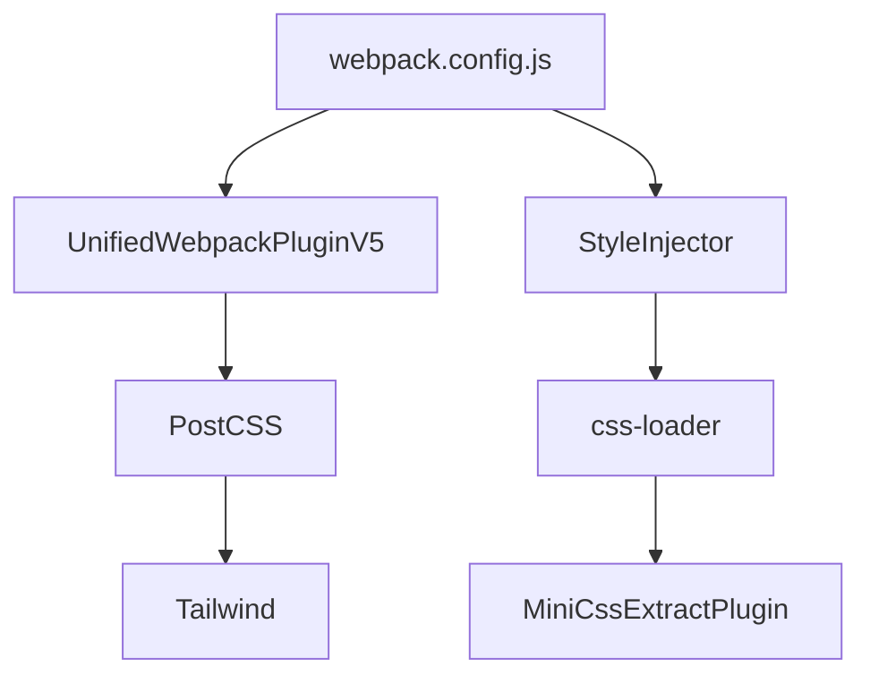

# Webpack构建问题

<cite>
**本文档引用的文件**   
- [webpack.config.js](file://demo/native-mina/webpack.config.js)
- [vue.config.js](file://demo/uni-app-webpack-tailwindcss-v4/vue.config.js)
- [uni-app.ts](file://packages/weapp-style-injector/src/webpack/uni-app.ts)
- [webpack-style-loaders.md](file://demo/webpack-style-loaders.md)
- [webpack-loader-order-details.md](file://demo/webpack-loader-order-details.md)
</cite>

## 目录
1. [介绍](#介绍)
2. [项目结构](#项目结构)
3. [核心组件](#核心组件)
4. [架构概述](#架构概述)
5. [详细组件分析](#详细组件分析)
6. [依赖分析](#依赖分析)
7. [性能考虑](#性能考虑)
8. [故障排除指南](#故障排除指南)
9. [结论](#结论)

## 介绍
本指南详细介绍了在使用Webpack构建微信小程序项目时常见的问题，特别是HMR热更新失效、构建速度慢和产物体积过大的问题。重点分析了weapp-tailwindcss在Webpack构建过程中的工作原理，包括如何处理Vue单文件组件中的样式，以及如何优化构建性能。提供了Webpack配置下的优化建议，如loader顺序、chunk分割、tree-shaking配置和缓存配置等。同时解释了如何调试构建过程中的样式处理问题，包括PostCSS处理流程、类名生成机制和loader执行顺序等。

## 项目结构
项目结构展示了多个基于Webpack的示例应用，包括原生小程序、Taro、Mpx、Uni-app和Rax等框架的应用。每个示例都包含了相应的Webpack配置文件，用于处理不同的构建需求。

**Diagram sources**
- [webpack.config.js](file://demo/native-mina/webpack.config.js)
- [vue.config.js](file://demo/uni-app-webpack-tailwindcss-v4/vue.config.js)

**Section sources**
- [webpack.config.js](file://demo/native-mina/webpack.config.js)
- [vue.config.js](file://demo/uni-app-webpack-tailwindcss-v4/vue.config.js)

## 核心组件
核心组件包括UnifiedWebpackPluginV5、StyleInjector和各种loader，这些组件共同协作完成样式处理和代码优化。

**Section sources**
- [webpack.config.js](file://demo/native-mina/webpack.config.js)
- [vue.config.js](file://demo/uni-app-webpack-tailwindcss-v4/vue.config.js)

## 架构概述
架构概述展示了Webpack构建过程中各个组件的交互关系，从源代码到最终产物的转换流程。

**Diagram sources**
- [webpack.config.js](file://demo/native-mina/webpack.config.js)
- [webpack-style-loaders.md](file://demo/webpack-style-loaders.md)

## 详细组件分析

### 样式处理组件分析
样式处理组件负责将SCSS、Less等预处理器语言编译为CSS，并通过PostCSS进行进一步处理。

#### 对于对象导向组件：

**Diagram sources**
- [webpack.config.js](file://demo/native-mina/webpack.config.js)
- [webpack-style-loaders.md](file://demo/webpack-style-loaders.md)

#### 对于API/服务组件：

**Diagram sources**
- [webpack.config.js](file://demo/native-mina/webpack.config.js)
- [webpack-loader-order-details.md](file://demo/webpack-loader-order-details.md)

#### 对于复杂逻辑组件：

**Diagram sources**
- [webpack.config.js](file://demo/native-mina/webpack.config.js)
- [webpack-style-loaders.md](file://demo/webpack-style-loaders.md)

**Section sources**
- [webpack.config.js](file://demo/native-mina/webpack.config.js)
- [webpack-style-loaders.md](file://demo/webpack-style-loaders.md)

### 概念概述
概念概述部分介绍了构建过程中的基本概念，如loader、plugin和chunk等。

## 依赖分析
依赖分析展示了各个组件之间的依赖关系，帮助理解构建过程中的数据流。

**Diagram sources**
- [webpack.config.js](file://demo/native-mina/webpack.config.js)
- [vue.config.js](file://demo/uni-app-webpack-tailwindcss-v4/vue.config.js)

**Section sources**
- [webpack.config.js](file://demo/native-mina/webpack.config.js)
- [vue.config.js](file://demo/uni-app-webpack-tailwindcss-v4/vue.config.js)

## 性能考虑
性能考虑部分讨论了如何通过优化配置来提高构建速度和减少产物体积。

- 使用`splitChunks`进行代码分割
- 启用`cache-loader`进行缓存
- 配置`tree-shaking`去除未使用的代码
- 优化`postcss-loader`的执行顺序

## 故障排除指南
故障排除指南提供了常见问题的解决方案，如HMR热更新失效、构建速度慢等。

**Section sources**
- [webpack.config.js](file://demo/native-mina/webpack.config.js)
- [webpack-loader-order-details.md](file://demo/webpack-loader-order-details.md)

## 结论
总结了Webpack构建过程中的关键点和最佳实践，为开发者提供了一个全面的参考。