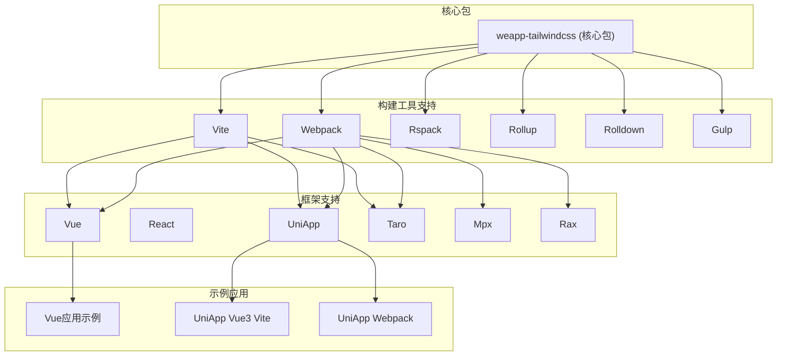
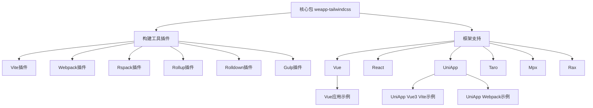
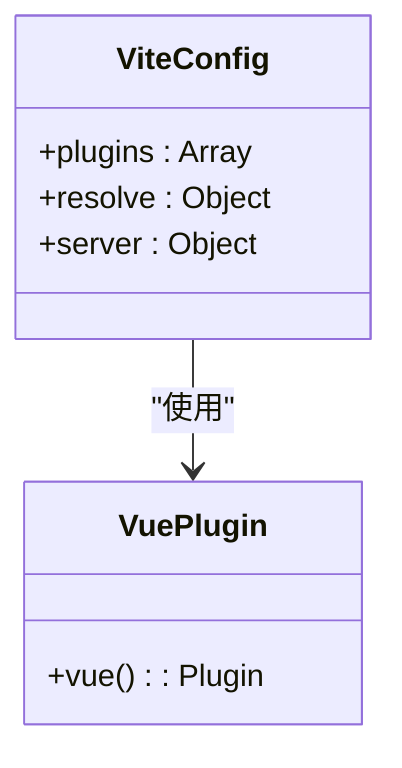
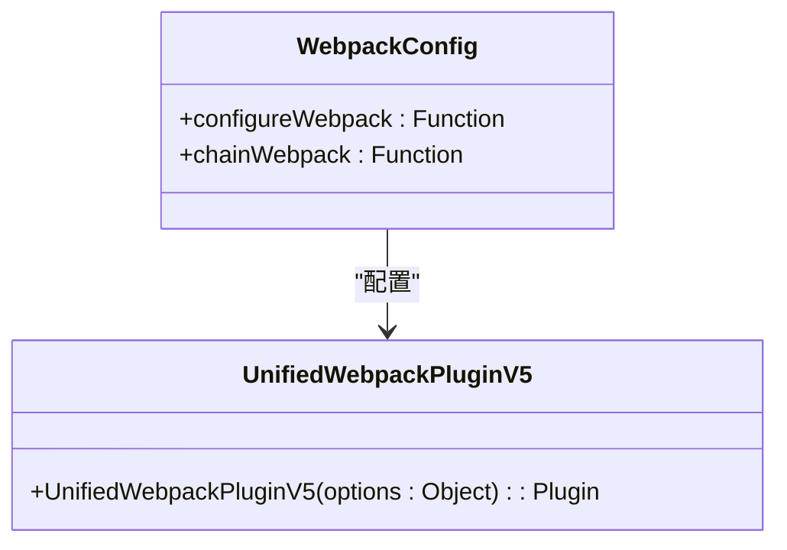
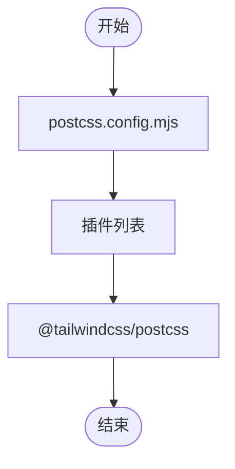
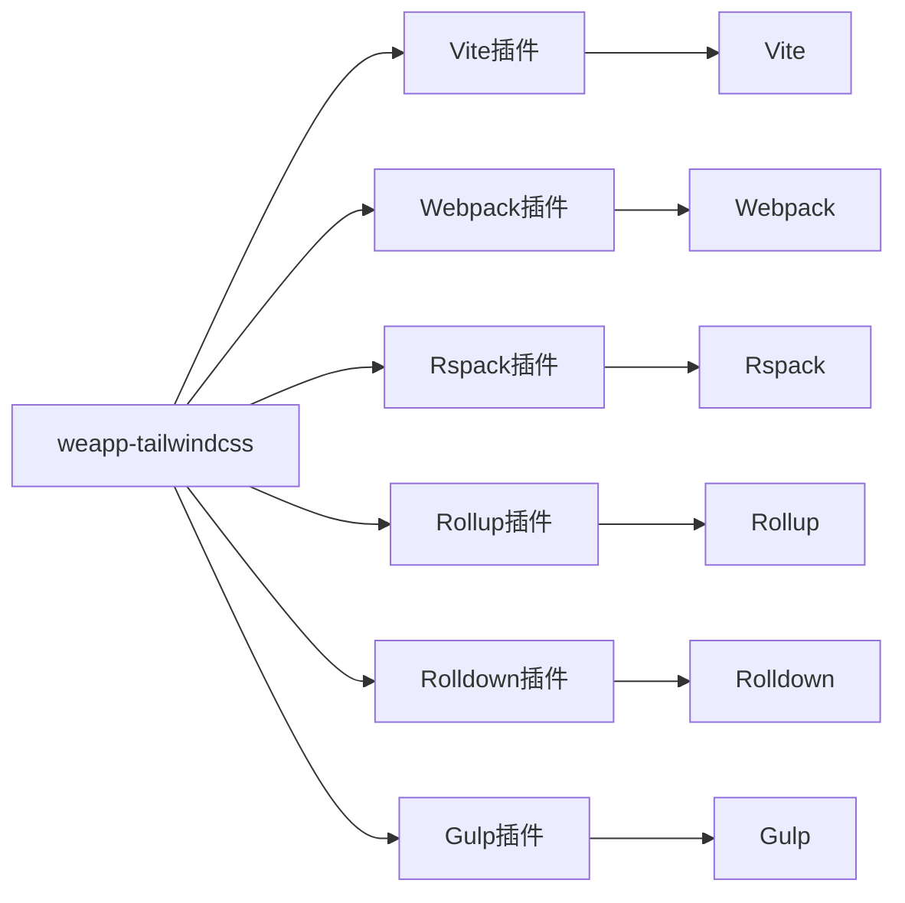

# Vue框架集成问题

<cite>
**本文档引用的文件**
- [vue.config.js](file://demo/uni-app-webpack-tailwindcss-v4/vue.config.js)
- [vite.config.ts](file://apps/vue-app/vite.config.ts)
- [postcss.config.mjs](file://apps/vue-app/postcss.config.mjs)
- [App.vue](file://apps/vue-app/src/App.vue)
- [uni-app-vue3-vite/vite.config.ts](file://demo/uni-app-vue3-vite/vite.config.ts)
- [uni-app-webpack-tailwindcss-v4/vue.config.js](file://demo/uni-app-webpack-tailwindcss-v4/vue.config.js)
- [weapp-tailwindcss/src/index.ts](file://packages/weapp-tailwindcss/src/index.ts)
</cite>

## 目录
1. [简介](#简介)
2. [项目结构](#项目结构)
3. [核心组件](#核心组件)
4. [架构概述](#架构概述)
5. [详细组件分析](#详细组件分析)
6. [依赖分析](#依赖分析)
7. [性能考虑](#性能考虑)
8. [故障排除指南](#故障排除指南)
9. [结论](#结论)
10. [附录](#附录)（如有必要）

## 简介
本文档旨在为Vue框架集成weapp-tailwindcss提供详细的故障排除指南。文档涵盖了Vue项目中HMR热更新失效、组件样式隔离、scoped样式兼容性等问题的解决方案。详细说明了如何在Vue项目中正确引入和配置weapp-tailwindcss，包括vite和webpack构建工具的配置方法。提供了Vue特定的构建插件使用方法和注意事项，如如何处理Vue的单文件组件和scoped样式。包含了Vue项目中常见的配置错误及其解决方案，如vue.config.js和vite.config.ts中的配置项设置。收集并整理了Vue社区中报告的典型问题及其解决方法。

## 项目结构
项目结构显示了多个Vue应用示例和配置文件，包括使用Vite和Webpack构建工具的项目。关键的Vue应用位于`apps/vue-app`目录下，而其他Vue相关的配置示例可以在`demo`和`templates`目录中找到。项目支持多种构建工具，包括Vite、Webpack、Rspack、Rollup、Rolldown和Gulp，涵盖了市面上几乎所有的主流开发框架。



**图表来源**
- [README.md](file://README.md#L44-L48)

**章节来源**
- [README.md](file://README.md#L30-L42)

## 核心组件
核心组件包括weapp-tailwindcss插件本身，它支持多种构建工具和框架。插件能够自动识别并精确处理所有tailwindcss的工具类来适配小程序环境。对于Vue项目，关键文件包括`vite.config.ts`、`vue.config.js`、`postcss.config.mjs`和`App.vue`。

**章节来源**
- [weapp-tailwindcss/src/index.ts](file://packages/weapp-tailwindcss/src/index.ts#L1-L5)
- [apps/vue-app/vite.config.ts](file://apps/vue-app/vite.config.ts#L1-L18)
- [apps/vue-app/postcss.config.mjs](file://apps/vue-app/postcss.config.mjs#L1-L6)

## 架构概述
weapp-tailwindcss的架构设计支持多种构建工具和框架，通过核心插件实现对tailwindcss工具类的精确处理。架构分为几个主要部分：核心包、构建工具插件、框架支持和示例应用。核心包提供基础功能，构建工具插件适配不同的构建系统，框架支持确保与各种前端框架的兼容性，示例应用展示实际使用方法。



**图表来源**
- [README.md](file://README.md#L44-L48)
- [weapp-tailwindcss/src/index.ts](file://packages/weapp-tailwindcss/src/index.ts#L1-L5)

## 详细组件分析

### Vue应用配置分析
Vue应用的配置主要涉及`vite.config.ts`和`vue.config.js`文件。对于使用Vite构建的Vue项目，配置相对简单，主要通过`@vitejs/plugin-vue`插件集成Vue支持。对于使用Webpack构建的项目，需要在`vue.config.js`中配置`UnifiedWebpackPluginV5`插件来集成weapp-tailwindcss。

#### Vite配置示例


**图表来源**
- [apps/vue-app/vite.config.ts](file://apps/vue-app/vite.config.ts#L1-L18)

#### Webpack配置示例


**图表来源**
- [demo/uni-app-webpack-tailwindcss-v4/vue.config.js](file://demo/uni-app-webpack-tailwindcss-v4/vue.config.js#L1-L31)

### PostCSS配置分析
PostCSS配置是weapp-tailwindcss集成的关键部分。在Vue项目中，通过`postcss.config.mjs`文件配置PostCSS插件，将`@tailwindcss/postcss`添加到插件列表中。



**图表来源**
- [apps/vue-app/postcss.config.mjs](file://apps/vue-app/postcss.config.mjs#L1-L6)

**章节来源**
- [apps/vue-app/postcss.config.mjs](file://apps/vue-app/postcss.config.mjs#L1-L6)

## 依赖分析
weapp-tailwindcss项目依赖多种构建工具和框架的插件，确保广泛的兼容性。核心依赖包括Vite、Webpack、Rspack、Rollup、Rolldown和Gulp的插件。这些插件通过统一的API与weapp-tailwindcss核心包集成，提供一致的功能和配置选项。



**图表来源**
- [README.md](file://README.md#L50-L55)
- [weapp-tailwindcss/src/index.ts](file://packages/weapp-tailwindcss/src/index.ts#L1-L5)

**章节来源**
- [README.md](file://README.md#L50-L55)

## 性能考虑
在Vue项目中集成weapp-tailwindcss时，性能是一个重要的考虑因素。建议在生产环境中启用代码压缩，并合理配置HMR（热模块替换）以提高开发效率。对于大型项目，可以考虑使用tree-shaking和code-splitting来优化打包结果。

## 故障排除指南
### HMR热更新失效
如果在Vue项目中遇到HMR热更新失效的问题，可以检查以下几点：
1. 确保`vite.config.ts`或`vue.config.js`中的HMR配置正确。
2. 检查是否有其他插件冲突导致HMR失效。
3. 确保开发服务器正确启动并监听文件变化。

### 组件样式隔离
Vue的scoped样式可以有效避免样式冲突。在使用weapp-tailwindcss时，确保scoped样式正确应用：
```vue
<style scoped>
/* scoped样式 */
</style>
```

### scoped样式兼容性
在某些情况下，scoped样式可能与weapp-tailwindcss的处理方式不兼容。解决方案包括：
1. 使用深度选择器`>>>`或`::v-deep`来穿透scoped样式。
2. 在`postcss.config.mjs`中调整配置，确保scoped样式正确处理。

### 常见配置错误
#### vue.config.js配置
确保`vue.config.js`中正确配置`UnifiedWebpackPluginV5`插件：
```javascript
const { UnifiedWebpackPluginV5 } = require('weapp-tailwindcss/webpack')
module.exports = {
    configureWebpack: (config) => {
        config.plugins.push(
            new UnifiedWebpackPluginV5({
                rem2rpx: true,
            })
        )
    }
}
```

#### vite.config.ts配置
确保`vite.config.ts`中正确配置Vue插件：
```typescript
import vue from '@vitejs/plugin-vue'
export default defineConfig({
    plugins: [vue()],
})
```

**章节来源**
- [demo/uni-app-webpack-tailwindcss-v4/vue.config.js](file://demo/uni-app-webpack-tailwindcss-v4/vue.config.js#L1-L31)
- [apps/vue-app/vite.config.ts](file://apps/vue-app/vite.config.ts#L1-L18)

## 结论
weapp-tailwindcss为Vue框架提供了强大的tailwindcss集成解决方案，支持多种构建工具和框架。通过正确的配置和使用方法，可以有效解决HMR热更新失效、组件样式隔离、scoped样式兼容性等问题。文档提供了详细的配置示例和故障排除指南，帮助开发者顺利集成weapp-tailwindcss到Vue项目中。

## 附录
### 相关链接
- [weapp-tailwindcss文档](https://tw.icebreaker.top)
- [GitHub仓库](https://github.com/sonofmagic/weapp-tailwindcss)