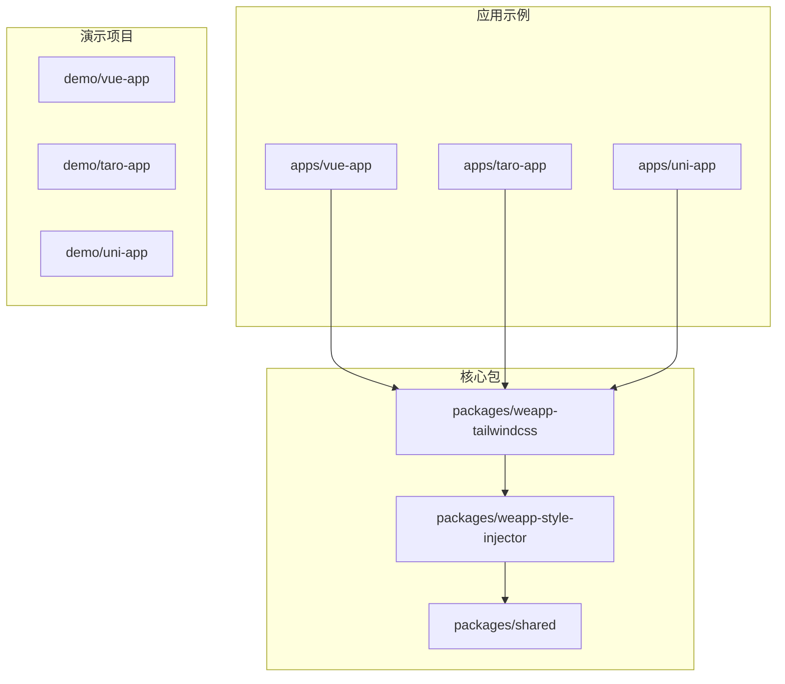
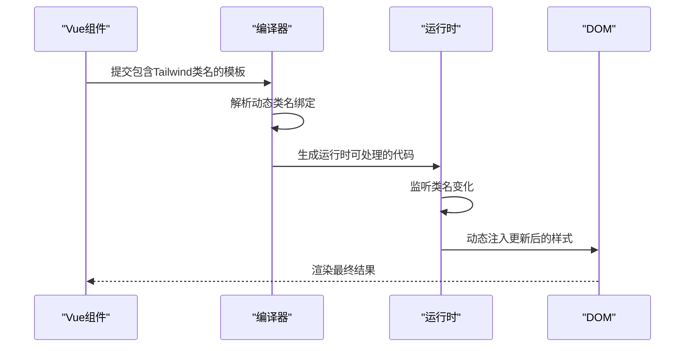
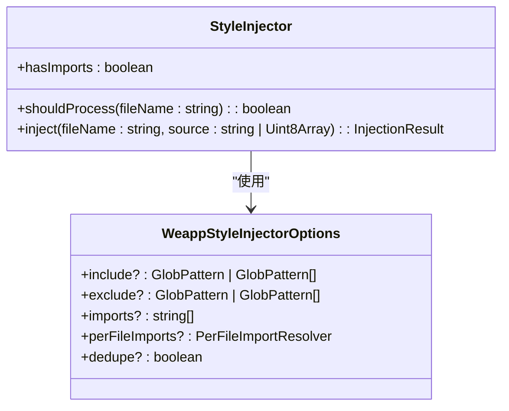
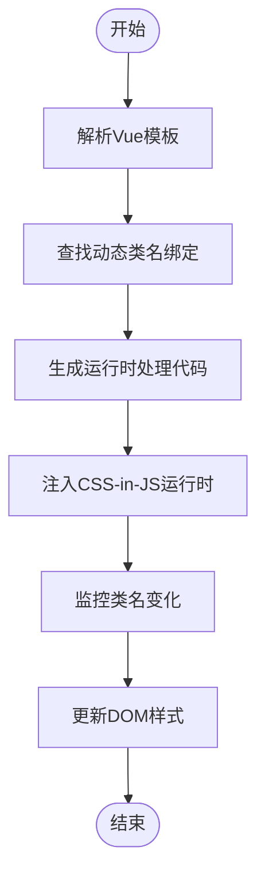
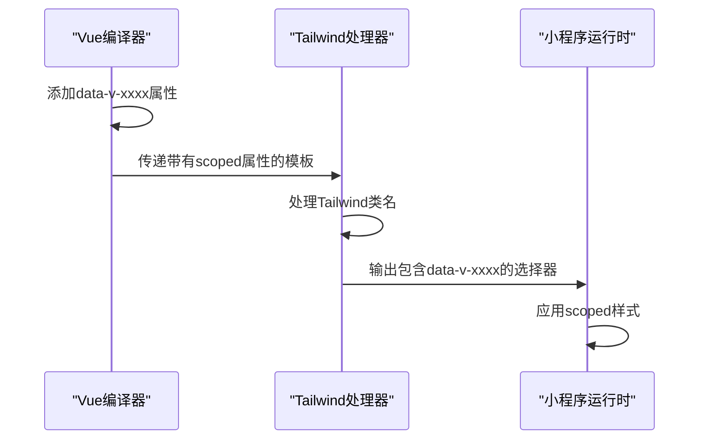
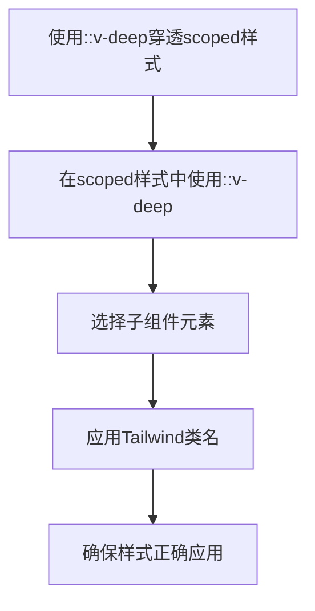
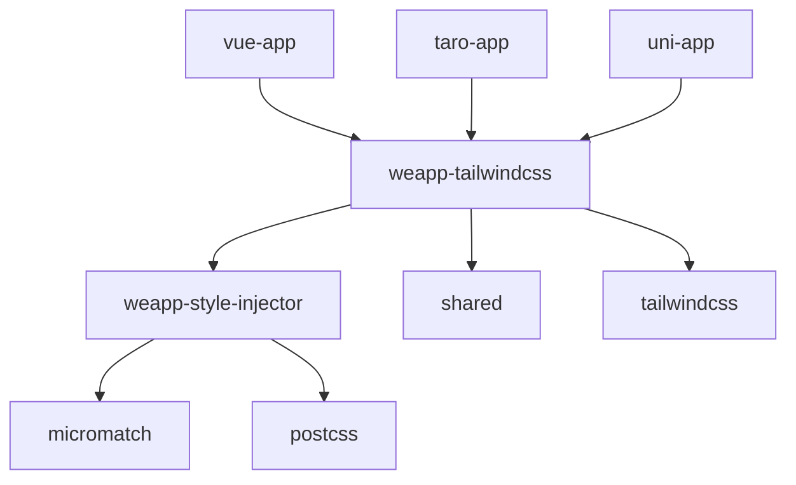

# Vue运行时问题

<cite>
**本文档引用的文件**   
- [index.ts](file://packages/weapp-tailwindcss/src/index.ts)
- [core.ts](file://packages/weapp-style-injector/src/core.ts)
- [cssInJsRuntime.ts](file://apps/vue-app/src/lib/cssInJsRuntime.ts)
- [CssInJsDemo.vue](file://apps/vue-app/src/features/history/CssInJsDemo.vue)
- [index.vue](file://demo/taro-vue3-app/src/pages/index/index.vue)
- [custom-attributes.ts](file://packages/weapp-tailwindcss/src/context/custom-attributes.ts)
- [uni-app.ts](file://packages/weapp-style-injector/src/vite/uni-app.ts)
- [webpack.ts](file://packages/weapp-style-injector/src/webpack.ts)
- [style-isolation.md](file://website/build/tailwindcss/style-isolation.md)
- [llms-full.txt](file://website/build/llms-full.txt)
</cite>

## 目录
1. [简介](#简介)
2. [项目结构](#项目结构)
3. [核心组件](#核心组件)
4. [架构概述](#架构概述)
5. [详细组件分析](#详细组件分析)
6. [依赖分析](#依赖分析)
7. [性能考虑](#性能考虑)
8. [故障排除指南](#故障排除指南)
9. [结论](#结论)

## 简介
本文档详细探讨了在Vue运行时环境中使用weapp-tailwindcss时遇到的样式隔离、scoped样式兼容性以及动态类名失效等问题。文档深入分析了weapp-tailwindcss在Vue单文件组件中的工作机制，包括样式注入方式、作用域处理和动态类名解析。此外，还提供了针对Vue动态组件和异步组件中样式问题的解决方案，并解释了如何调试运行时的样式注入问题。

## 项目结构
weapp-tailwindcss项目是一个复杂的单体仓库，包含多个应用示例、演示项目和核心包。项目结构清晰地分为几个主要部分：`apps`目录包含各种框架的应用示例，`demo`目录包含不同构建工具的演示项目，`packages`目录包含核心功能包，而`packages-runtime`则包含运行时相关的工具。

**图表来源**
- [index.ts](file://packages/weapp-tailwindcss/src/index.ts)
- [core.ts](file://packages/weapp-style-injector/src/core.ts)

**章节来源**
- [index.ts](file://packages/weapp-tailwindcss/src/index.ts)
- [project_structure](file://project_structure#L1-L50)

## 核心组件
weapp-tailwindcss的核心组件主要包括样式注入器（Style Injector）、自定义属性处理器和运行时CSS注入机制。这些组件共同协作，确保Tailwind CSS类名能够在小程序环境中正确解析和应用。

**章节来源**
- [index.ts](file://packages/weapp-tailwindcss/src/index.ts#L1-L5)
- [core.ts](file://packages/weapp-style-injector/src/core.ts#L1-L156)

## 架构概述
weapp-tailwindcss的架构设计旨在解决小程序环境中CSS作用域和动态类名处理的挑战。系统通过编译时和运行时两个阶段来处理样式：编译时阶段负责解析和转换Tailwind类名，运行时阶段则负责动态注入和更新样式。

**图表来源**
- [core.ts](file://packages/weapp-style-injector/src/core.ts#L69-L156)
- [cssInJsRuntime.ts](file://apps/vue-app/src/lib/cssInJsRuntime.ts#L1-L23)

## 详细组件分析

### 样式注入机制分析
weapp-tailwindcss的样式注入机制是其核心功能之一，它解决了小程序环境中样式作用域隔离的问题。

#### 样式注入器实现

**图表来源**
- [core.ts](file://packages/weapp-style-injector/src/core.ts#L22-L156)

#### 动态类名处理流程

**图表来源**
- [CssInJsDemo.vue](file://apps/vue-app/src/features/history/CssInJsDemo.vue#L93-L95)
- [cssInJsRuntime.ts](file://apps/vue-app/src/lib/cssInJsRuntime.ts#L1-L23)

**章节来源**
- [cssInJsRuntime.ts](file://apps/vue-app/src/lib/cssInJsRuntime.ts#L1-L23)
- [CssInJsDemo.vue](file://apps/vue-app/src/features/history/CssInJsDemo.vue#L93-L129)

### Vue Scoped样式兼容性分析
Vue的scoped样式机制与weapp-tailwindcss的集成需要特殊处理，以确保样式正确作用于目标组件。

#### Scoped样式处理机制

**图表来源**
- [style-isolation.md](file://website/build/tailwindcss/style-isolation.md#L66-L86)
- [llms-full.txt](file://website/build/llms-full.txt#L12805-L12824)

#### 深度选择器使用方案

**图表来源**
- [style-isolation.md](file://website/build/tailwindcss/style-isolation.md#L88-L89)
- [llms-full.txt](file://website/build/llms-full.txt#L12825-L12826)

**章节来源**
- [style-isolation.md](file://website/build/tailwindcss/style-isolation.md#L66-L109)
- [llms-full.txt](file://website/build/llms-full.txt#L12805-L12848)

## 依赖分析
weapp-tailwindcss项目依赖于多个核心包和工具，这些依赖共同构成了完整的样式处理系统。

**图表来源**
- [package.json](file://packages/weapp-tailwindcss/package.json#L1-L30)
- [package.json](file://packages/weapp-style-injector/package.json#L1-L30)

**章节来源**
- [package.json](file://packages/weapp-tailwindcss/package.json#L1-L50)
- [package.json](file://packages/weapp-style-injector/package.json#L1-L50)

## 性能考虑
在Vue运行时环境中使用weapp-tailwindcss时，需要考虑以下几个性能方面：

1. **样式注入效率**：避免重复注入相同的样式规则
2. **内存使用**：合理管理样式缓存，防止内存泄漏
3. **运行时开销**：最小化运行时的计算和DOM操作

通过使用`injectCss`函数的缓存机制，可以有效避免重复创建和插入相同的`<style>`元素，从而提高性能。

## 故障排除指南
当遇到weapp-tailwindcss在Vue运行时中的问题时，可以按照以下步骤进行排查：

1. **检查样式注入**：确认样式是否正确注入到页面中
2. **验证类名解析**：检查动态类名是否被正确解析和应用
3. **调试scoped样式**：确保scoped样式没有阻止Tailwind类名的应用
4. **审查构建配置**：确认构建工具配置正确支持weapp-tailwindcss

**章节来源**
- [cssInJsRuntime.ts](file://apps/vue-app/src/lib/cssInJsRuntime.ts#L1-L23)
- [core.ts](file://packages/weapp-style-injector/src/core.ts#L69-L156)

## 结论
weapp-tailwindcss为Vue运行时环境提供了一套完整的Tailwind CSS集成方案，通过精心设计的样式注入机制和运行时处理，成功解决了小程序环境中的样式隔离和动态类名问题。通过合理使用深度选择器和样式穿透配置，可以有效解决Vue scoped样式与weapp-tailwindcss的兼容性问题。对于动态组件和异步组件中的样式问题，建议使用CSS-in-JS运行时方案进行处理，以确保样式能够正确应用和更新。