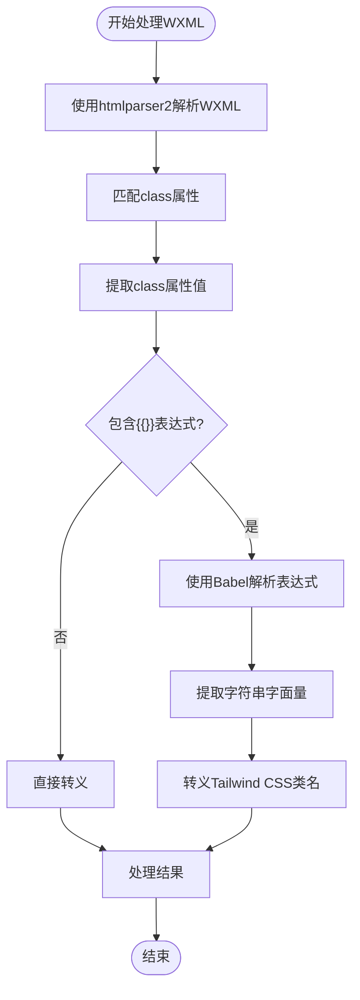
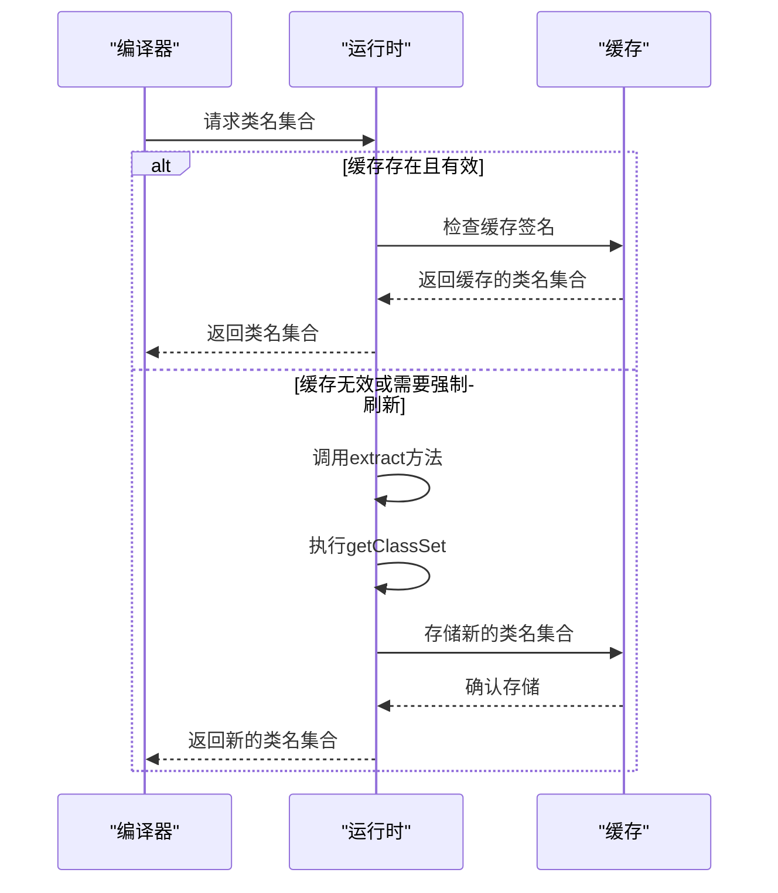

# 动态类名问题

<cite>
**本文档引用文件**   
- [index.md](file://website/build/principle/index.md)
- [utils.ts](file://packages/weapp-tailwindcss/src/wxml/utils.ts)
- [context.ts](file://packages/weapp-tailwindcss/src/context/index.ts)
- [index.ts](file://packages/weapp-tailwindcss/src/index.ts)
- [tailwindcss.config.js](file://templates/uni-app-vue2-tailwind-hbuilder-template/tailwind.config.js)
- [vue.config.js](file://templates/uni-app-vue2-tailwind-hbuilder-template/vue.config.js)
- [index.vue](file://demo/uni-app/src/pages/index/index.vue)
- [index.vue](file://demo/uni-app-tailwindcss-v4/src/pages/index/index.vue)
- [index.uvue](file://templates/uni-app-x-hbuilderx/pages/index/index.uvue)
- [runtime.ts](file://packages/weapp-tailwindcss/src/tailwindcss/runtime.ts)
</cite>

## 目录
1. [简介](#简介)
2. [Vue动态类名在小程序中的问题](#vue动态类名在小程序中的问题)
3. [weapp-tailwindcss处理动态类名的机制](#weapp-tailwindcss处理动态类名的机制)
4. [v-bind:class中使用weapp-tailwindcss类名的解决方案](#v-bindclass中使用weapp-tailwindcss类名的解决方案)
5. [处理计算属性和条件渲染中的动态类名](#处理计算属性和条件渲染中的动态类名)
6. [配置JIT模式确保动态类名编译](#配置jit模式确保动态类名编译)
7. [总结](#总结)

## 简介
本文档详细说明了在使用weapp-tailwindcss时，Vue动态类名在小程序中失效的问题及其解决方案。重点分析了weapp-tailwindcss如何处理Vue动态类名，包括类名解析时机、静态类名与动态类名的处理差异，并提供了在v-bind:class中正确使用weapp-tailwindcss类名的方法。

**Section sources**
- [index.md](file://website/build/principle/index.md)

## Vue动态类名在小程序中的问题
在Vue开发小程序时，使用动态绑定类名（如v-bind:class）时，weapp-tailwindcss可能会出现类名失效的问题。这是因为小程序的WXML模板与Vue的动态绑定机制存在差异，导致动态生成的Tailwind CSS任意值（Arbitrary values）无法被正确解析和编译。

例如，当在WXML中使用{{expression}}表达式动态绑定类名时：
```html
<view class="w-[13px] {{flag?'h-[23px]':'h-[6px]'}} bg-[#123456] {{customClass}}"></view>
```
weapp-tailwindcss需要在构建过程中正确解析这些动态表达式，并对其中的Tailwind CSS类名进行转义处理。

**Section sources**
- [index.md](file://website/build/principle/index.md#字符串以及变量绑定的处理)

## weapp-tailwindcss处理动态类名的机制
weapp-tailwindcss通过一系列复杂的处理机制来解决动态类名的问题，主要包括模板解析、字符串处理和运行时类名收集。

### 模板解析机制
weapp-tailwindcss使用htmlparser2库来解析WXML模板，获取所有class属性的内容。对于包含{{}}表达式的动态类名，会进行特殊处理：

1. 使用htmlparser2匹配class属性，获取完整的类名字符串
2. 对字符串进行{{}}表达式匹配，区分静态部分和动态表达式部分
3. 在{{}}表达式外的字符串直接进行转义
4. 在{{}}表达式内的代码使用Babel进行解析，获取所有的JavaScript字符串字面量并进行转义



**Diagram sources **
- [utils.ts](file://packages/weapp-tailwindcss/src/wxml/utils.ts)
- [index.md](file://website/build/principle/index.md#如何使用-htmlparser2)

### 类名解析时机
weapp-tailwindcss在构建过程中的不同阶段处理类名：

1. **模板处理阶段**：在WXML编译过程中，通过自定义的模板处理器处理class属性
2. **样式处理阶段**：使用PostCSS处理WXSS文件，确保CSS选择器正确
3. **JS处理阶段**：使用Babel处理JS文件，确保JS中的字符串字面量正确转义

这种多阶段处理机制确保了无论是静态类名还是动态类名都能被正确处理。

**Section sources**
- [index.md](file://website/build/principle/index.md#笔者的实现)
- [context.ts](file://packages/weapp-tailwindcss/src/context/index.ts)

## v-bind:class中使用weapp-tailwindcss类名的解决方案
为了解决v-bind:class中weapp-tailwindcss类名失效的问题，可以采用以下几种解决方案：

### 数组语法
使用数组语法可以确保weapp-tailwindcss正确识别和处理类名：

```vue
<template>
  <view :class="['bg-[#0000ff]', flag ? 'text-[45rpx]' : 'text-[30rpx]', 'text-white']">
    示例文本
  </view>
</template>
```

### 对象语法
使用对象语法可以更清晰地表达条件类名：

```vue
<template>
  <view :class="{
    'bg-[#0000ff]': true,
    'text-[45rpx]': flag,
    'text-[30rpx]': !flag,
    'text-white': true
  }">
    示例文本
  </view>
</template>
```

### 计算属性
将复杂的类名逻辑封装在计算属性中：

```vue
<script setup lang="ts">
import { ref, computed } from 'vue'

const flag = ref(false)
const className = computed(() => [
  'bg-[#0000ff]',
  flag.value ? 'text-[45rpx]' : 'text-[30rpx]',
  'text-white'
])
</script>

<template>
  <view :class="className">
    示例文本
  </view>
</template>
```

**Section sources**
- [index.vue](file://demo/uni-app-tailwindcss-v4/src/pages/index/index.vue)
- [index.uvue](file://templates/uni-app-x-hbuilderx/pages/index/index.uvue)

## 处理计算属性和条件渲染中的动态类名
在计算属性和条件渲染中使用动态类名时，需要特别注意weapp-tailwindcss的处理机制。

### 计算属性中的动态类名
当在计算属性中返回动态类名时，weapp-tailwindcss需要能够正确识别这些类名：

```vue
<script setup lang="ts">
import { ref, computed } from 'vue'

const themeRef = ref<string>('')
const classArray = computed(() => [
  'bg-[#aa00aa] text-[#ffffffee]',
])

// 基于状态动态生成类名
const buttonClass = computed(() => {
  return buttonColors[state.globalNum % buttonColors.length]
})
</script>
```

### 条件渲染中的动态类名
在条件渲染中使用动态类名时，建议使用对象语法或数组语法：

```vue
<template>
  <div class="flex flex-col divide-y-4 border p-2 divide-[#41eb04] divide-dotted" 
       :class="{
         'divide-y-reverse': reverseFlag,
         'flex-col-reverse': reverseFlag
       }">
    <div>01</div>
    <div>02</div>
    <div>03</div>
  </div>
</template>
```

### 自定义属性支持
weapp-tailwindcss支持通过customAttributesEntities配置项处理自定义属性中的类名：

```javascript
// 配置示例
const config = {
  customAttributes: {
    'custom-class': true,
    'happy-attr': true,
    'sad-attr': true
  }
}
```

这样可以确保在自定义组件属性中使用的Tailwind CSS类名也能被正确处理。

**Section sources**
- [index.uvue](file://templates/uni-app-x-hbuilderx/pages/index/index.uvue)
- [index.md](file://website/build/principle/index.md#模板解析的重新实现)

## 配置JIT模式确保动态类名编译
为了确保动态生成的类名能被正确编译，需要正确配置JIT（Just-In-Time）模式。

### 启用JIT模式
在tailwind.config.js中启用JIT模式：

```javascript
/** @type {import('@types/tailwindcss/tailwind-config').TailwindConfig} */
module.exports = {
  mode: "jit",
  purge: {
    content: [
      resolve("./index.html"),
      resolve("./pages/**/*.{vue,js,ts,jsx,tsx,wxml}"),
    ],
  },
  corePlugins: {
    preflight: false,
  },
};
```

### 运行时类名收集
weapp-tailwindcss通过运行时类名收集机制确保动态类名被正确编译：



**Diagram sources **
- [runtime.ts](file://packages/weapp-tailwindcss/src/tailwindcss/runtime.ts)
- [tailwind.config.js](file://templates/uni-app-vue2-tailwind-hbuilder-template/tailwind.config.js)

### 配置优化
为了优化JIT模式的性能，可以配置缓存和刷新策略：

```javascript
// vue.config.js配置示例
const config = {
  configureWebpack: {
    plugins: [
      new UnifiedWebpackPluginV4({
        rem2rpx: true,
        disabled: WeappTailwindcssDisabled,
      }),
    ],
  },
};
```

**Section sources**
- [vue.config.js](file://templates/uni-app-vue2-tailwind-hbuilder-template/vue.config.js)
- [runtime.ts](file://packages/weapp-tailwindcss/src/tailwindcss/runtime.ts)

## 总结
本文档详细介绍了weapp-tailwindcss处理Vue动态类名的机制和解决方案。关键要点包括：

1. weapp-tailwindcss使用htmlparser2和Babel协同工作，正确解析和转义动态类名
2. 在v-bind:class中推荐使用数组语法或对象语法确保类名被正确识别
3. 计算属性和条件渲染中的动态类名需要特别处理
4. 正确配置JIT模式和运行时类名收集机制确保动态类名编译
5. 通过customAttributesEntities配置项支持自定义属性中的类名

通过遵循这些最佳实践，可以有效解决Vue动态类名在小程序中失效的问题，充分发挥Tailwind CSS任意值的强大功能。

**Section sources**
- [index.md](file://website/build/principle/index.md)
- [utils.ts](file://packages/weapp-tailwindcss/src/wxml/utils.ts)
- [runtime.ts](file://packages/weapp-tailwindcss/src/tailwindcss/runtime.ts)