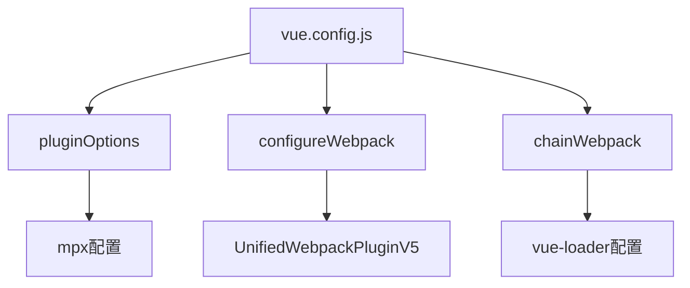
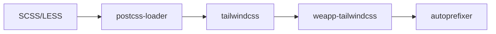
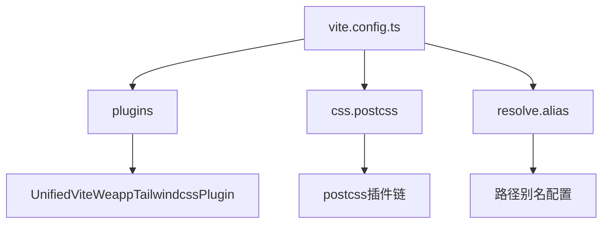
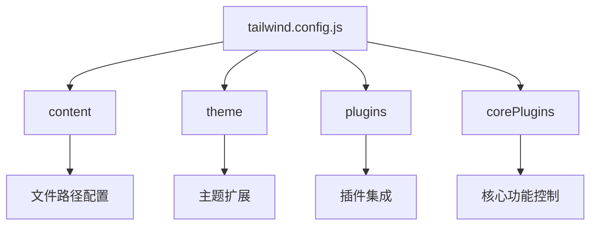
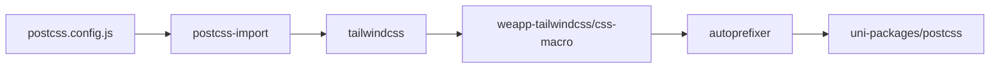

# Vue配置问题

<cite>
**本文档中引用的文件**  
- [vue.config.js](file://demo/mpx-app/vue.config.js)
- [vue.config.js](file://demo/uni-app/vue.config.js)
- [vue.config.js](file://demo/uni-app-webpack5/vue.config.js)
- [vue.config.js](file://demo/uni-app-webpack-tailwindcss-v4/vue.config.js)
- [vite.config.ts](file://demo/uni-app-vue3-vite/vite.config.ts)
- [vite.config.ts](file://demo/uni-app-tailwindcss-v4/vite.config.ts)
- [vite.config.ts](file://demo/uni-app-x-hbuilderx-tailwindcss3/vite.config.ts)
- [tailwind.config.js](file://demo/uni-app/tailwind.config.js)
- [tailwind.config.js](file://demo/uni-app-x-hbuilderx-tailwindcss3/tailwind.config.js)
- [tailwind.config.js](file://demo/uni-app-vue3-vite/tailwind.config.js)
- [tailwind.config.js](file://demo/native-ts/tailwind.config.js)
- [tailwind.config.js](file://demo/native-mina/tailwind.config.js)
- [tailwind.config.js](file://demo/uni-app-tailwindcss-v4/tailwind.config.js)
- [postcss.config.js](file://demo/uni-app/postcss.config.js)
- [postcss.config.js](file://demo/native-mina/postcss.config.js)
</cite>

## 目录
1. [简介](#简介)
2. [Vue CLI配置](#vue-cli配置)
3. [Vite配置](#vite配置)
4. [Tailwind CSS配置](#tailwind-css配置)
5. [PostCSS配置](#postcss配置)
6. [配置验证与调试](#配置验证与调试)

## 简介
本文档详细介绍了在Vue项目中配置weapp-tailwindcss插件的方法，涵盖Vue CLI和Vite两种构建方式。文档重点解决vue.config.js和vite.config.ts中的配置问题，提供完整的配置示例和最佳实践。

## Vue CLI配置

在Vue CLI项目中，通过vue.config.js文件进行weapp-tailwindcss插件的配置。配置主要涉及插件注册、选项设置和构建工具集成。



**图示来源**
- [vue.config.js](file://demo/mpx-app/vue.config.js)
- [vue.config.js](file://demo/uni-app/vue.config.js)

**本节来源**
- [vue.config.js](file://demo/mpx-app/vue.config.js#L1-L52)
- [vue.config.js](file://demo/uni-app/vue.config.js#L1-L62)
- [vue.config.js](file://demo/uni-app-webpack5/vue.config.js#L1-L60)
- [vue.config.js](file://demo/uni-app-webpack-tailwindcss-v4/vue.config.js#L1-L31)

### 插件注册与配置

在vue.config.js中，通过UnifiedWebpackPluginV5类注册weapp-tailwindcss插件。插件配置包含多个关键选项：

- **rem2rpx**: 启用rem到rpx的转换
- **disabled**: 控制插件是否禁用
- **customAttributes**: 自定义属性配置
- **wxsMatcher**: WXS文件匹配器
- **inlineWxs**: 是否内联WXS代码

```javascript
configureWebpack(config) {
  config.plugins.push(
    new UnifiedWebpackPluginV5({
      rem2rpx: true,
      disabled: WeappTailwindcssDisabled,
      customAttributes: {
        '*': ['className']
      },
      wxsMatcher() {
        return false
      },
      inlineWxs: false
    })
  )
}
```

### CSS预处理器兼容性

对于使用SCSS、LESS等CSS预处理器的项目，需要在css.loaderOptions中进行特殊配置以确保与weapp-tailwindcss的兼容性。



**本节来源**
- [vue.config.js](file://demo/uni-app/vue.config.js#L12-L20)
- [vue.config.js](file://demo/uni-app-webpack5/vue.config.js#L41-L55)

## Vite配置

在Vite项目中，通过vite.config.ts文件进行weapp-tailwindcss插件的配置。Vite配置与Vue CLI有所不同，主要体现在插件系统和CSS处理方式上。



**图示来源**
- [vite.config.ts](file://demo/uni-app-vue3-vite/vite.config.ts)
- [vite.config.ts](file://demo/uni-app-tailwindcss-v4/vite.config.ts)

**本节来源**
- [vite.config.ts](file://demo/uni-app-vue3-vite/vite.config.ts#L1-L118)
- [vite.config.ts](file://demo/uni-app-tailwindcss-v4/vite.config.ts#L1-L43)
- [vite.config.ts](file://demo/uni-app-x-hbuilderx-tailwindcss3/vite.config.ts#L1-L30)

### 插件集成

在Vite配置中，通过UnifiedViteWeappTailwindcssPlugin函数集成weapp-tailwindcss插件。配置选项与Vue CLI类似，但语法略有不同。

```typescript
plugins: [
  uni(),
  UnifiedViteWeappTailwindcssPlugin({
    px2rpx: true,
    wxsMatcher() {
      return false;
    },
    inlineWxs: true,
    onStart() {
      bench.start();
    },
    onEnd() {
      bench.end();
      bench.dump();
    },
    rem2rpx: true,
    disabled: WeappTailwindcssDisabled
  })
]
```

### CSS处理配置

Vite项目中的CSS处理通过css.postcss.plugins配置项完成，需要确保tailwindcss和其他相关插件正确配置。

```typescript
css: {
  postcss: {
    plugins: [
      require('autoprefixer')(),
      require('tailwindcss')()
    ]
  },
  preprocessorOptions: {
    scss: {
      silenceDeprecations: ['legacy-js-api', 'import']
    }
  }
}
```

## Tailwind CSS配置

tailwind.config.js文件是Tailwind CSS的核心配置文件，需要根据weapp-tailwindcss的特殊要求进行配置。



**图示来源**
- [tailwind.config.js](file://demo/uni-app/tailwind.config.js)
- [tailwind.config.js](file://demo/uni-app-vue3-vite/tailwind.config.js)

**本节来源**
- [tailwind.config.js](file://demo/uni-app/tailwind.config.js#L1-L37)
- [tailwind.config.js](file://demo/uni-app-x-hbuilderx-tailwindcss3/tailwind.config.js#L1-L16)
- [tailwind.config.js](file://demo/uni-app-vue3-vite/tailwind.config.js#L1-L68)
- [tailwind.config.js](file://demo/native-ts/tailwind.config.js#L1-L21)
- [tailwind.config.js](file://demo/native-mina/tailwind.config.js#L1-L10)
- [tailwind.config.js](file://demo/uni-app-tailwindcss-v4/tailwind.config.js#L1-L31)

### 内容配置

content配置项指定了Tailwind CSS需要扫描的文件路径，确保在这些文件中使用的类名能够生成对应的CSS。

```javascript
content: [
  './public/index.html',
  './src/**/*.{vue,js,ts,jsx,tsx,wxml}',
  '!./src/pages-order/**/*.{html,vue,js,ts,jsx,tsx}'
]
```

### 核心插件配置

在小程序环境中，需要禁用某些H5专用的核心插件，以避免不必要的CSS生成。

```javascript
corePlugins: {
  preflight: false,
  container: false
}
```

### 插件集成

weapp-tailwindcss需要集成css-macro插件来支持条件样式和平台特有样式。

```javascript
plugins: [
  cssMacro({
    variantsMap: {
      wx: 'MP-WEIXIN',
      '-wx': {
        value: 'MP-WEIXIN',
        negative: true
      }
    }
  })
]
```

## PostCSS配置

PostCSS配置通过postcss.config.js文件完成，定义了CSS处理的插件链。



**图示来源**
- [postcss.config.js](file://demo/uni-app/postcss.config.js)
- [postcss.config.js](file://demo/native-mina/postcss.config.js)

**本节来源**
- [postcss.config.js](file://demo/uni-app/postcss.config.js#L1-L39)
- [postcss.config.js](file://demo/native-mina/postcss.config.js#L1-L11)

### 插件链配置

PostCSS插件按顺序执行，每个插件处理CSS并传递给下一个插件。

```javascript
module.exports = {
  plugins: [
    require('postcss-import')({
      resolve(id, basedir, importOptions) {
        // 路径解析逻辑
      }
    }),
    require('tailwindcss')({ config: './tailwind.config.js' }),
    require('weapp-tailwindcss/css-macro/postcss'),
    require('autoprefixer')({
      remove: process.env.UNI_PLATFORM !== 'h5'
    })
  ]
}
```

## 配置验证与调试

### 配置验证方法

1. 检查构建输出中是否包含预期的CSS类
2. 验证rpx转换是否正确应用
3. 确认平台特有样式是否按预期工作
4. 检查构建日志中的插件执行信息

### 调试技巧

1. 启用性能监控：通过onStart和onEnd回调监控插件执行时间
2. 使用调试工具：集成vite-plugin-inspect等调试插件
3. 日志输出：在关键位置添加console.log进行调试
4. 逐步验证：逐个启用配置项，确保每个配置都能正常工作

```javascript
onStart() {
  bench.start();
  start = performance.now();
},
onEnd() {
  bench.end();
  bench.dump();
  console.log('UnifiedWebpackPluginV5 onEnd:', performance.now() - start, 'ms');
}
```

**本节来源**
- [vite.config.ts](file://demo/uni-app-vue3-vite/vite.config.ts#L5-L12)
- [vue.config.js](file://demo/mpx-app/vue.config.js#L3-L4)
- [vite.config.ts](file://demo/uni-app-vue3-vite/vite.config.ts#L51-L58)