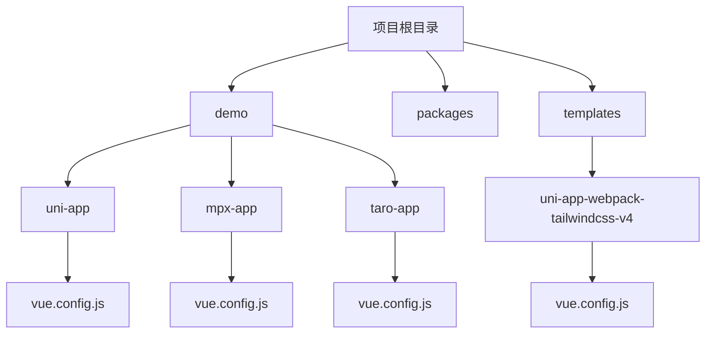
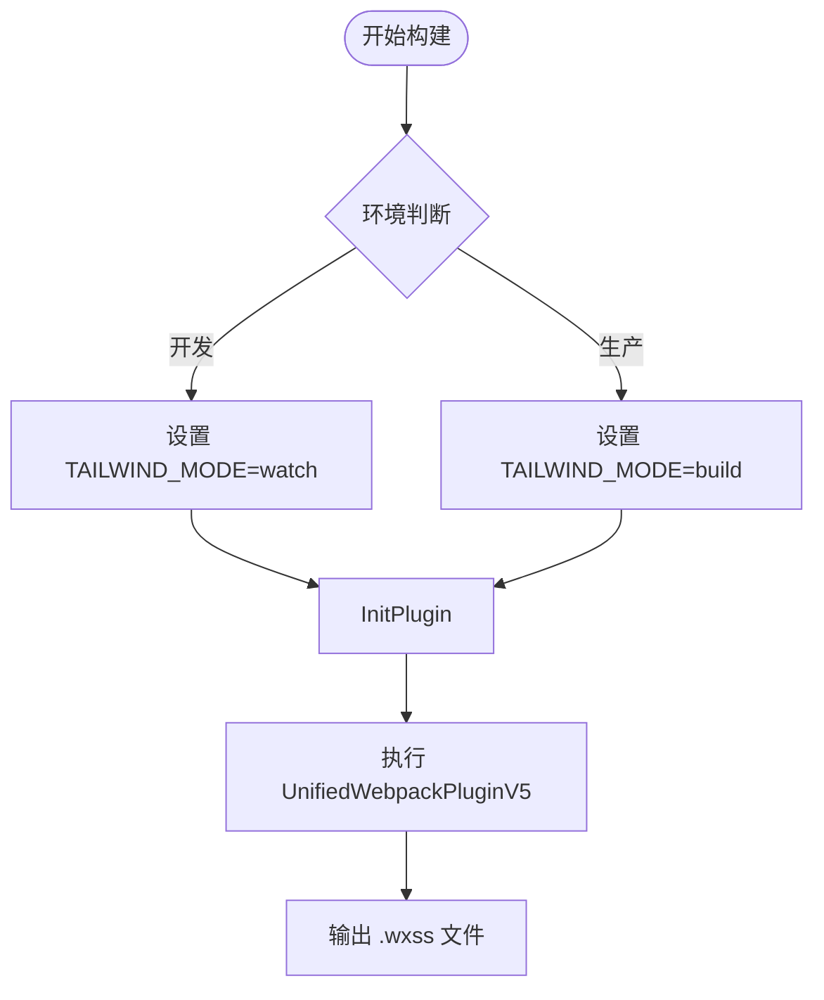
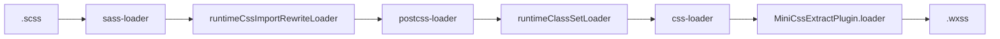
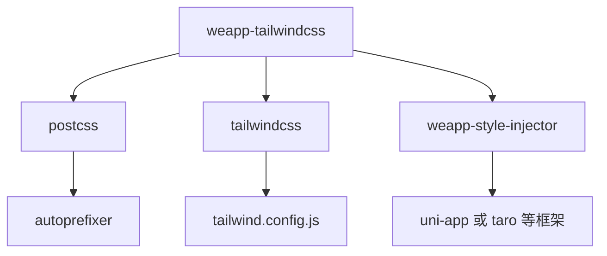

# Webpack配置

<cite>
**本文档引用文件**  
- [vue.config.js](file://demo/uni-app/vue.config.js)
- [vue.config.js](file://demo/uni-app-webpack5/vue.config.js)
- [vue.config.js](file://demo/uni-app-webpack-tailwindcss-v4/vue.config.js)
- [vue.config.js](file://templates/uni-app-webpack-tailwindcss-v4/vue.config.js)
- [vue.config.js](file://demo/mpx-app/vue.config.js)
- [webpack-style-loaders.md](file://demo/webpack-style-loaders.md)
- [webpack-loader-order-details.md](file://demo/webpack-loader-order-details.md)
- [index.ts](file://packages/weapp-tailwindcss/src/bundlers/vite/index.ts)
- [index.ts](file://packages/weapp-tailwindcss/src/bundlers/webpack/index.ts)
- [webpack.v5.test.ts](file://packages/weapp-tailwindcss/test/webpack.v5.test.ts)
</cite>

## 目录
1. [简介](#简介)
2. [项目结构](#项目结构)
3. [核心组件](#核心组件)
4. [架构概述](#架构概述)
5. [详细组件分析](#详细组件分析)
6. [依赖分析](#依赖分析)
7. [性能考虑](#性能考虑)
8. [故障排除指南](#故障排除指南)
9. [结论](#结论)

## 简介
本文档旨在为在 Vue CLI 项目中使用 `weapp-tailwindcss` 插件提供详细的 Webpack 配置指南。重点介绍如何在 `vue.config.js` 中正确配置插件，包括 `css.loaderOptions` 设置、PostCSS 插件集成以及 Webpack loader 的执行顺序。涵盖开发与生产环境的不同配置需求，并提供处理预处理器兼容性、构建验证及性能优化的完整方案。

## 项目结构
本项目包含多个基于不同框架的演示应用，均集成 `weapp-tailwindcss` 以支持微信小程序中的 Tailwind CSS。主要结构包括：
- `demo/`：包含多个框架（如 uni-app、mpx、taro）的示例配置
- `packages/weapp-tailwindcss/`：核心插件源码
- `templates/`：可复用的项目模板

重点关注 `demo` 和 `templates` 目录下的 `vue.config.js` 文件，这些是实际配置的参考实现。



**图示来源**  
- [demo/uni-app/vue.config.js](file://demo/uni-app/vue.config.js)
- [demo/mpx-app/vue.config.js](file://demo/mpx-app/vue.config.js)
- [templates/uni-app-webpack-tailwindcss-v4/vue.config.js](file://templates/uni-app-webpack-tailwindcss-v4/vue.config.js)

**本节来源**  
- [demo/uni-app/vue.config.js](file://demo/uni-app/vue.config.js)
- [demo/mpx-app/vue.config.js](file://demo/mpx-app/vue.config.js)
- [templates/uni-app-webpack-tailwindcss-v4/vue.config.js](file://templates/uni-app-webpack-tailwindcss-v4/vue.config.js)

## 核心组件
`weapp-tailwindcss` 的核心是 `UnifiedWebpackPluginV5`，它作为 Webpack 插件注入并处理 Tailwind 样式。该插件负责：
- 解析 HTML 和 JS 中的 `className`
- 生成对应的小程序样式文件
- 支持 rem 到 rpx 的自动转换
- 提供构建生命周期钩子（如 onStart/onEnd）

此外，`weapp-style-injector` 用于样式注入，确保样式正确作用于组件。

**本节来源**  
- [demo/uni-app/vue.config.js](file://demo/uni-app/vue.config.js#L3-L52)
- [demo/uni-app-webpack5/vue.config.js](file://demo/uni-app-webpack5/vue.config.js#L3-L60)

## 架构概述
`weapp-tailwindcss` 在 Webpack 构建流程中通过插件机制介入，其核心架构如下：


插件通过 `configureWebpack` 注入，监听构建生命周期，在适当阶段执行样式提取与转换。

**图示来源**  
- [demo/uni-app/vue.config.js](file://demo/uni-app/vue.config.js#L21-L58)
- [demo/uni-app-webpack5/vue.config.js](file://demo/uni-app-webpack5/vue.config.js#L15-L39)

## 详细组件分析

### UnifiedWebpackPluginV5 配置分析
`UnifiedWebpackPluginV5` 是 `weapp-tailwindcss` 的核心 Webpack 插件，用于在构建过程中处理 Tailwind CSS 并生成小程序样式。

#### 配置选项说明
```js
new UnifiedWebpackPluginV5({
  disabled: WeappTailwindcssDisabled,
  rem2rpx: true,
  cssEntries: [path.resolve(__dirname, 'src/app.css')],
  customAttributes: { '*': ['className'] },
  onStart: () => { /* 构建开始 */ },
  onEnd: () => { /* 构建结束 */ }
})
```

- `disabled`: 控制插件是否禁用
- `rem2rpx`: 是否启用 rem 到 rpx 的单位转换
- `cssEntries`: 显式指定需要处理的 CSS 入口文件
- `customAttributes`: 定义哪些属性包含 Tailwind 类名（如 `className`）
- `onStart/onEnd`: 构建生命周期钩子

#### 开发与生产环境配置差异
在开发环境中，通常设置 `process.env.TAILWIND_MODE = "watch"` 以启用增量构建；生产环境则默认全量构建。



**图示来源**  
- [templates/uni-app-vue2-tailwind-hbuilder-template/vue.config.js](file://templates/uni-app-vue2-tailwind-hbuilder-template/vue.config.js#L3-L12)
- [demo/uni-app-webpack-tailwindcss-v4/vue.config.js](file://demo/uni-app-webpack-tailwindcss-v4/vue.config.js#L13-L18)

**本节来源**  
- [demo/uni-app/vue.config.js](file://demo/uni-app/vue.config.js#L25-L52)
- [demo/uni-app-webpack5/vue.config.js](file://demo/uni-app-webpack5/vue.config.js#L17-L33)
- [demo/uni-app-webpack-tailwindcss-v4/vue.config.js](file://demo/uni-app-webpack-tailwindcss-v4/vue.config.js#L13-L18)

### PostCSS 与预处理器集成
在 Vue CLI 项目中，PostCSS 通常通过 `postcss-loader` 集成。`weapp-tailwindcss` 需确保其 PostCSS 插件链正确执行。

#### loader 执行顺序
Webpack 中 loader 的执行顺序为**从右到左、从下到上**。正确的顺序应为：

```
preprocessor (sass/less) → postcss-loader → css-loader → MiniCssExtractPlugin.loader
```

在 `weapp-tailwindcss` 中，`runtimeCssImportRewriteLoader` 必须在 `postcss-loader` 之前执行，而 `runtimeClassSetLoader` 在之后。



**图示来源**  
- [demo/webpack-loader-order-details.md](file://demo/webpack-loader-order-details.md#L1-L33)
- [demo/webpack-style-loaders.md](file://demo/webpack-style-loaders.md#L1-L46)

**本节来源**  
- [demo/webpack-loader-order-details.md](file://demo/webpack-loader-order-details.md)
- [demo/webpack-style-loaders.md](file://demo/webpack-style-loaders.md)

## 依赖分析
`weapp-tailwindcss` 依赖于多个关键模块协同工作：



- `postcss` 和 `tailwindcss` 是样式处理的核心
- `weapp-style-injector` 提供框架特定的样式注入能力
- 配置文件如 `tailwind.config.js` 和 `postcss.config.js` 控制构建行为

**图示来源**  
- [demo/mpx-app/vue.config.js](file://demo/mpx-app/vue.config.js#L4-L5)
- [demo/uni-app/vue.config.js](file://demo/uni-app/vue.config.js#L3-L4)

**本节来源**  
- [demo/mpx-app/vue.config.js](file://demo/mpx-app/vue.config.js)
- [demo/uni-app/vue.config.js](file://demo/uni-app/vue.config.js)

## 性能考虑
为优化构建性能，建议：
- 在开发环境中启用 `TAILWIND_MODE=watch` 以减少全量构建
- 使用 `transpileDependencies` 控制依赖编译范围
- 合理配置 `cssEntries` 避免不必要的文件处理
- 利用 `onStart` 和 `onEnd` 钩子进行构建耗时监控

避免在生产环境中保留调试代码或未使用的插件。

## 故障排除指南
常见问题及解决方案：

- **样式未生效**：检查 `customAttributes` 是否包含 `className`，确认 `postcss-loader` 是否正确配置
- **rem 未转 rpx**：确保 `rem2rpx: true` 已设置
- **构建报错**：检查 `cssEntries` 路径是否正确，确认 `tailwind.config.js` 存在
- **HMR 失效**：开发环境需设置 `TAILWIND_MODE=watch`

可通过 `bench` 工具进行构建性能分析，定位瓶颈。

**本节来源**  
- [demo/uni-app/vue.config.js](file://demo/uni-app/vue.config.js#L5-L6)
- [demo/uni-app-webpack5/vue.config.js](file://demo/uni-app-webpack5/vue.config.js#L6-L7)

## 结论
`weapp-tailwindcss` 提供了一套完整的 Webpack 配置方案，使 Tailwind CSS 能在小程序项目中高效运行。通过合理配置 `UnifiedWebpackPluginV5`，结合正确的 loader 顺序和 PostCSS 集成，可实现开发与生产环境的无缝切换。建议参考模板项目中的 `vue.config.js` 进行初始化配置，并根据项目需求进行定制优化。