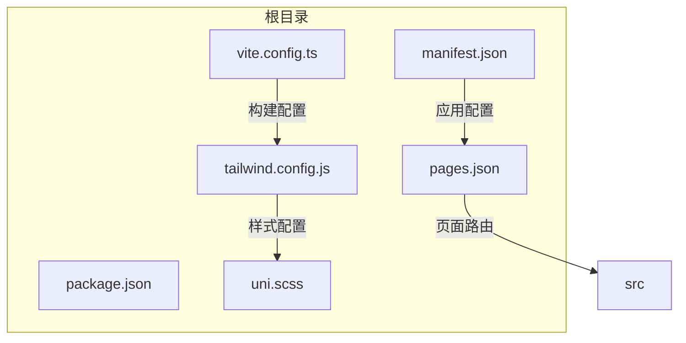
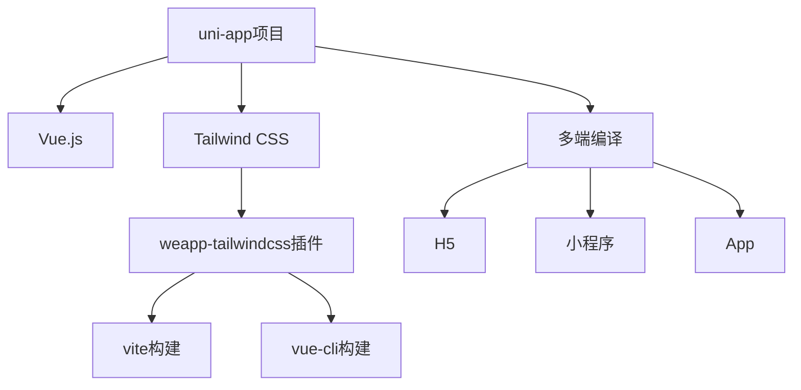
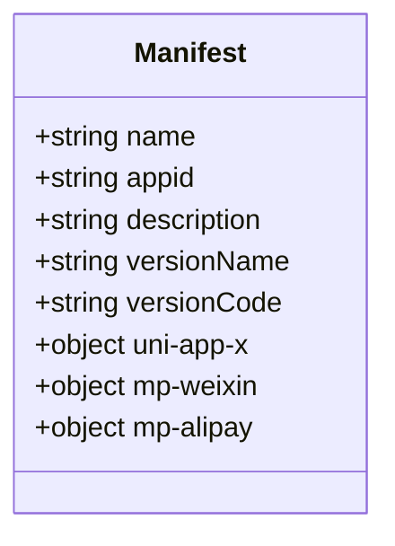
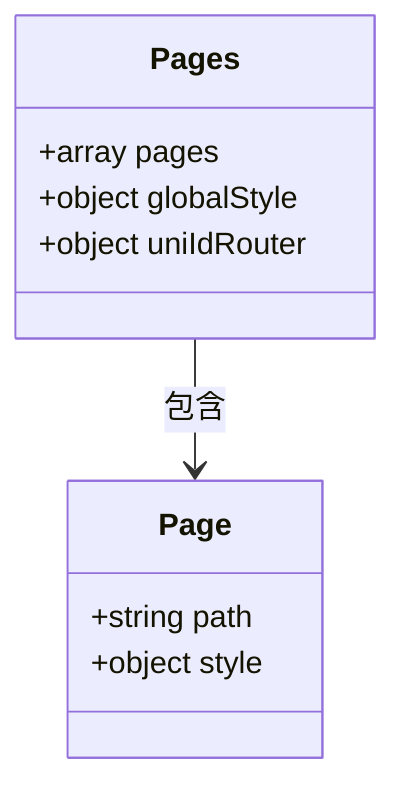
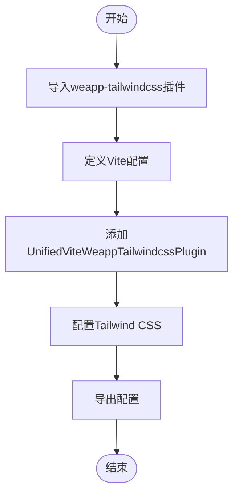

# uni-app框架集成问题

<cite>
**本文档引用的文件**   
- [manifest.json](file://demo/uni-app-x-hbuilderx-tailwindcss3/manifest.json)
- [pages.json](file://demo/uni-app-x-hbuilderx-tailwindcss3/pages.json)
- [vite.config.ts](file://demo/uni-app-x-hbuilderx-tailwindcss3/vite.config.ts)
- [tailwind.config.js](file://demo/uni-app-x-hbuilderx-tailwindcss3/tailwind.config.js)
- [uni.scss](file://demo/uni-app-x-hbuilderx-tailwindcss3/uni.scss)
- [package.json](file://demo/uni-app/package.json)
- [package.json](file://demo/uni-app-tailwindcss-v4/package.json)
- [package.json](file://demo/uni-app-webpack-tailwindcss-v4/package.json)
</cite>

## 目录
1. [简介](#简介)
2. [项目结构](#项目结构)
3. [核心组件](#核心组件)
4. [架构概述](#架构概述)
5. [详细组件分析](#详细组件分析)
6. [依赖分析](#依赖分析)
7. [性能考虑](#性能考虑)
8. [故障排除指南](#故障排除指南)
9. [结论](#结论)

## 简介
本文档旨在为uni-app框架集成问题提供详细的故障排除指南，涵盖HMR热更新失效、组件样式隔离、多端兼容性等问题。文档详细说明了如何在uni-app项目中正确引入和配置weapp-tailwindcss，包括vue-cli和vite构建工具的配置差异。同时提供了uni-app特定的构建插件使用方法和注意事项，以及常见的配置错误及其解决方案。

## 项目结构
uni-app项目结构遵循标准的uni-app目录布局，包含`manifest.json`和`pages.json`等核心配置文件。项目支持多端编译，通过不同的构建脚本实现针对H5、小程序、App等平台的构建。



**图表来源**
- [manifest.json](file://demo/uni-app-x-hbuilderx-tailwindcss3/manifest.json)
- [pages.json](file://demo/uni-app-x-hbuilderx-tailwindcss3/pages.json)
- [vite.config.ts](file://demo/uni-app-x-hbuilderx-tailwindcss3/vite.config.ts)

**章节来源**
- [manifest.json](file://demo/uni-app-x-hbuilderx-tailwindcss3/manifest.json)
- [pages.json](file://demo/uni-app-x-hbuilderx-tailwindcss3/pages.json)

## 核心组件
uni-app的核心组件包括`manifest.json`用于应用配置，`pages.json`用于页面路由配置，以及`vite.config.ts`或`vue.config.js`用于构建配置。这些文件共同定义了应用的基本行为和构建流程。

**章节来源**
- [manifest.json](file://demo/uni-app-x-hbuilderx-tailwindcss3/manifest.json)
- [pages.json](file://demo/uni-app-x-hbuilderx-tailwindcss3/pages.json)
- [vite.config.ts](file://demo/uni-app-x-hbuilderx-tailwindcss3/vite.config.ts)

## 架构概述
uni-app的架构基于Vue.js，支持多端编译。通过weapp-tailwindcss插件，可以实现Tailwind CSS在uni-app项目中的集成，支持vite和vue-cli两种构建方式。



**图表来源**
- [vite.config.ts](file://demo/uni-app-x-hbuilderx-tailwindcss3/vite.config.ts)
- [package.json](file://demo/uni-app/package.json)

## 详细组件分析
### 配置文件分析
#### manifest.json分析
`manifest.json`文件定义了应用的基本信息和平台特定配置。对于uni-app x项目，需要正确配置`uni-app-x`字段以支持多端构建。



**图表来源**
- [manifest.json](file://demo/uni-app-x-hbuilderx-tailwindcss3/manifest.json)

#### pages.json分析
`pages.json`文件定义了应用的页面路由和全局样式。pages数组中的第一项表示应用启动页。



**图表来源**
- [pages.json](file://demo/uni-app-x-hbuilderx-tailwindcss3/pages.json)

#### 构建配置分析
##### Vite构建配置
对于使用vite的uni-app项目，需要在`vite.config.ts`中配置weapp-tailwindcss插件。



**图表来源**
- [vite.config.ts](file://demo/uni-app-x-hbuilderx-tailwindcss3/vite.config.ts)

**章节来源**
- [vite.config.ts](file://demo/uni-app-x-hbuilderx-tailwindcss3/vite.config.ts)

## 依赖分析
uni-app项目依赖于weapp-tailwindcss插件来实现Tailwind CSS的集成。不同版本的uni-app和构建工具需要不同的依赖配置。

```mermaid
graph TD
A[uni-app] --> B[weapp-tailwindcss]
B --> C[tailwindcss]
B --> D[postcss]
A --> E[vue]
A --> F[@dcloudio/uni-*]
```

**图表来源**
- [package.json](file://demo/uni-app/package.json)
- [package.json](file://demo/uni-app-tailwindcss-v4/package.json)

**章节来源**
- [package.json](file://demo/uni-app/package.json)
- [package.json](file://demo/uni-app-tailwindcss-v4/package.json)

## 性能考虑
在uni-app项目中使用weapp-tailwindcss时，需要注意以下性能考虑：
- 合理配置Tailwind CSS的content字段，避免不必要的文件扫描
- 使用rem2rpx转换优化样式性能
- 在生产环境中启用样式压缩

## 故障排除指南
### HMR热更新失效
当HMR热更新失效时，检查以下配置：
- 确保`vite.config.ts`中的watch配置正确
- 检查文件路径是否正确包含在Tailwind CSS的content配置中
- 确认weapp-tailwindcss插件版本与uni-app版本兼容

**章节来源**
- [vite.config.ts](file://demo/uni-app-x-hbuilderx-tailwindcss3/vite.config.ts)
- [tailwind.config.js](file://demo/uni-app-x-hbuilderx-tailwindcss3/tailwind.config.js)

### 组件样式隔离
为实现组件样式隔离，建议：
- 使用scoped CSS
- 避免全局样式冲突
- 在`uni.scss`中定义的变量会全局可用，需谨慎使用

**章节来源**
- [uni.scss](file://demo/uni-app-x-hbuilderx-tailwindcss3/uni.scss)

### 多端兼容性问题
解决多端兼容性问题的方法：
- 在`manifest.json`中正确配置各平台特有设置
- 使用条件编译处理平台差异
- 测试各端构建输出

**章节来源**
- [manifest.json](file://demo/uni-app-x-hbuilderx-tailwindcss3/manifest.json)

### weapp-tailwindcss配置问题
#### vue-cli与vite配置差异
- vue-cli项目使用`vue.config.js`配置
- vite项目使用`vite.config.ts`配置
- 插件API基本一致，但集成方式不同

**章节来源**
- [package.json](file://demo/uni-app/package.json)
- [package.json](file://demo/uni-app-webpack-tailwindcss-v4/package.json)

#### 常见配置错误
- `manifest.json`中缺少平台配置
- `pages.json`中页面路径错误
- `tailwind.config.js`中content路径不正确
- 构建插件未正确注册

**章节来源**
- [manifest.json](file://demo/uni-app-x-hbuilderx-tailwindcss3/manifest.json)
- [pages.json](file://demo/uni-app-x-hbuilderx-tailwindcss3/pages.json)
- [tailwind.config.js](file://demo/uni-app-x-hbuilderx-tailwindcss3/tailwind.config.js)

## 结论
本文档提供了uni-app框架集成weapp-tailwindcss的详细指南，涵盖了配置、构建、故障排除等方面。通过正确配置和使用weapp-tailwindcss插件，可以有效提升uni-app项目的开发效率和样式管理能力。