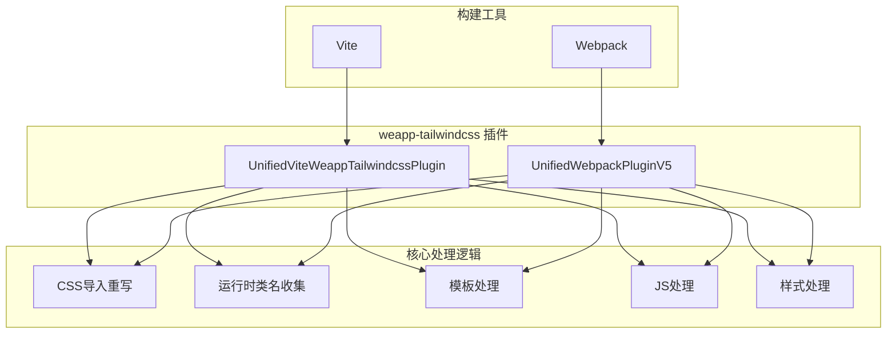
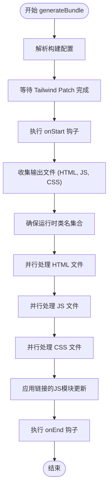
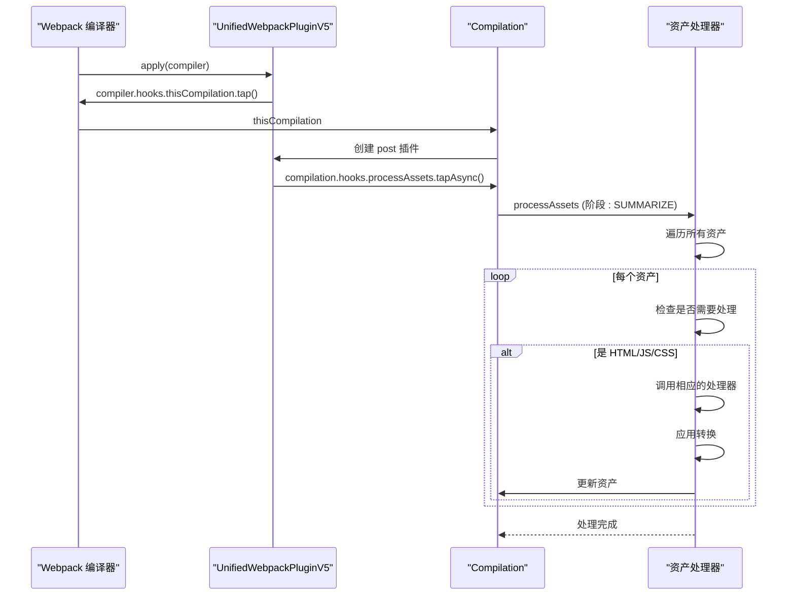

# 构建问题

<cite>
**本文档中引用的文件**  
- [vite.config.ts](file://demo/uni-app-vue3-vite/vite.config.ts)
- [vue.config.js](file://demo/uni-app-webpack-tailwindcss-v4/vue.config.js)
- [index.ts](file://packages/weapp-tailwindcss/src/index.ts)
- [vite.ts](file://packages/weapp-tailwindcss/src/vite.ts)
- [webpack.ts](file://packages/weapp-tailwindcss/src/webpack.ts)
- [index.ts](file://packages/weapp-style-injector/src/index.ts)
- [package.json](file://packages/weapp-tailwindcss/package.json)
- [index.ts](file://packages/weapp-tailwindcss/src/bundlers/vite/index.ts)
- [index.ts](file://packages/weapp-tailwindcss/src/bundlers/webpack/index.ts)
</cite>

## 目录
1. [简介](#简介)
2. [项目结构](#项目结构)
3. [核心组件](#核心组件)
4. [架构概述](#架构概述)
5. [详细组件分析](#详细组件分析)
6. [依赖分析](#依赖分析)
7. [性能考虑](#性能考虑)
8. [故障排除指南](#故障排除指南)
9. [结论](#结论)

## 简介
本文档旨在为uni-app项目中集成weapp-tailwindcss时遇到的构建问题提供详细的指南。重点分析vue-cli（基于webpack）和vite构建工具在处理Tailwind CSS时的差异，特别是HMR热更新失效问题的根本原因和解决方案。文档将深入探讨weapp-tailwindcss在vite和webpack构建管道中的工作原理，包括如何正确配置构建插件以确保样式正确生成和注入。同时，提供针对不同构建工具的具体配置示例，解决构建过程中的常见问题，如样式丢失、构建速度慢、缓存问题等，并包含构建插件的调试技巧和性能优化建议。

## 项目结构
该项目是一个复杂的monorepo，包含多个针对不同框架（如uni-app, taro, react, vue等）的演示应用和核心包。与uni-app和weapp-tailwindcss集成构建问题最相关的部分是`demo`目录下的`uni-app-vue3-vite`和`uni-app-webpack-tailwindcss-v4`，它们分别代表了使用vite和webpack构建工具的uni-app项目。核心功能由`packages/weapp-tailwindcss`包提供，该包为不同的构建系统（vite, webpack, gulp）提供了统一的插件接口。

**Section sources**
- [vite.config.ts](file://demo/uni-app-vue3-vite/vite.config.ts)
- [vue.config.js](file://demo/uni-app-webpack-tailwindcss-v4/vue.config.js)

## 核心组件
`weapp-tailwindcss`包是解决uni-app与Tailwind CSS集成问题的核心。它通过提供`UnifiedViteWeappTailwindcssPlugin`（用于vite）和`UnifiedWebpackPluginV5`（用于webpack）等插件，将Tailwind CSS的功能适配到小程序的构建流程中。这些插件负责处理CSS的导入重写、运行时类名收集、模板和JS文件的转换，以及最终的样式注入。

**Section sources**
- [index.ts](file://packages/weapp-tailwindcss/src/index.ts)
- [vite.ts](file://packages/weapp-tailwindcss/src/vite.ts)
- [webpack.ts](file://packages/weapp-tailwindcss/src/webpack.ts)

## 架构概述
weapp-tailwindcss的架构设计为一个可扩展的插件系统，能够无缝集成到不同的构建工具中。其核心思想是在构建流程的特定阶段（如解析、转换、生成bundle）插入自定义逻辑，以处理Tailwind CSS特有的需求。



**Diagram sources**
- [index.ts](file://packages/weapp-tailwindcss/src/index.ts)
- [vite.ts](file://packages/weapp-tailwindcss/src/vite.ts)
- [webpack.ts](file://packages/weapp-tailwindcss/src/webpack.ts)

## 详细组件分析

### Vite 构建管道分析
在vite构建流程中，`UnifiedViteWeappTailwindcssPlugin`返回一个插件数组。第一个插件（`rewrite-css-imports`）在`enforce: 'pre'`阶段运行，负责将代码中对`tailwindcss`的导入重写为指向`weapp-tailwindcss`的兼容版本。主插件（`post`）在`enforce: 'post'`阶段的`generateBundle`钩子中执行核心逻辑。它会遍历最终的bundle，识别出HTML、JS和CSS文件，并使用缓存机制并行处理这些文件。对于CSS文件，它会调用`styleHandler`进行处理；对于HTML文件，调用`templateHandler`；对于JS文件，调用`jsHandler`。

#### Vite 插件工作流程


**Diagram sources**
- [index.ts](file://packages/weapp-tailwindcss/src/bundlers/vite/index.ts)

**Section sources**
- [index.ts](file://packages/weapp-tailwindcss/src/bundlers/vite/index.ts)
- [vite.config.ts](file://demo/uni-app-vue3-vite/vite.config.ts)

### Webpack 构建管道分析
在webpack构建流程中，`UnifiedWebpackPluginV5`作为一个webpack插件被添加到配置中。它的`apply`方法会在webpack编译器上注册`this-compilation`钩子。当编译开始时，会创建一个`post`插件实例，该实例在`compilation`的`processAssets`阶段（`PROCESS_ASSETS_STAGE_SUMMARIZE`）执行与vite插件类似的逻辑。它会遍历所有资产（assets），识别出需要处理的HTML、JS和CSS文件，并进行相应的转换。

#### Webpack 插件工作流程


**Diagram sources**
- [index.ts](file://packages/weapp-tailwindcss/src/bundlers/webpack/index.ts)

**Section sources**
- [index.ts](file://packages/weapp-tailwindcss/src/bundlers/webpack/index.ts)
- [vue.config.js](file://demo/uni-app-webpack-tailwindcss-v4/vue.config.js)

### HMR 热更新失效问题分析
HMR（热模块替换）失效是vite和webpack集成weapp-tailwindcss时的常见问题。根本原因在于weapp-tailwindcss插件在`generateBundle`阶段对最终的bundle进行修改，而这些修改发生在vite/webpack的HMR系统之后。HMR系统已经为原始的、未修改的模块建立了依赖关系和更新机制。当插件修改了JS或CSS代码后，HMR系统无法感知这些变化，导致更新失效。

**解决方案**:
1.  **确保插件顺序**: 在vite中，确保`UnifiedViteWeappTailwindcssPlugin`在其他可能影响HMR的插件之后执行。
2.  **避免在HMR期间执行耗时操作**: 在开发模式下，可以考虑禁用某些非必要的插件选项（如复杂的缓存策略）以提高HMR速度。
3.  **手动触发全量刷新**: 当检测到HMR失效时，可以通过配置`onUpdate`钩子来触发页面的全量刷新作为备选方案。

**Section sources**
- [index.ts](file://packages/weapp-tailwindcss/src/bundlers/vite/index.ts)
- [index.ts](file://packages/weapp-tailwindcss/src/bundlers/webpack/index.ts)

## 依赖分析
`weapp-tailwindcss`包依赖于多个内部和外部模块来实现其功能。关键的内部依赖包括`@weapp-tailwindcss/postcss`（用于PostCSS处理）、`@weapp-tailwindcss/shared`（共享工具函数）和`weapp-style-injector`（用于样式注入）。外部依赖包括`tailwindcss-patch`（用于兼容性补丁）、`@babel/parser`（用于JS解析）和`magic-string`（用于代码修改）。这些依赖关系确保了插件能够正确解析、转换和生成代码。

```mermaid
graph LR
A[weapp-tailwindcss] --> B[@weapp-tailwindcss/postcss]
A --> C[@weapp-tailwindcss/shared]
A --> D[weapp-style-injector]
A --> E[tailwindcss-patch]
A --> F[@babel/parser]
A --> G[magic-string]
```

**Diagram sources**
- [package.json](file://packages/weapp-tailwindcss/package.json)

**Section sources**
- [package.json](file://packages/weapp-tailwindcss/package.json)

## 性能考虑
为了优化构建性能，`weapp-tailwindcss`插件实现了缓存机制。它使用`processCachedTask`函数来缓存HTML、JS和CSS文件的处理结果。此外，它通过`pushConcurrentTaskFactories`函数将JS文件的处理任务并行化，以充分利用多核CPU。然而，这些优化在开发模式下可能会与HMR产生冲突，需要在性能和开发体验之间进行权衡。

**Section sources**
- [index.ts](file://packages/weapp-tailwindcss/src/bundlers/vite/index.ts)
- [run-tasks.ts](file://packages/weapp-tailwindcss/src/bundlers/shared/run-tasks.ts)

## 故障排除指南
当遇到构建问题时，可以按照以下步骤进行排查：
1.  **检查Node.js版本**: 确保Node.js版本满足`weapp-tailwindcss`的要求（>=18.17.0 或 >=20.5.0）。
2.  **验证插件配置**: 检查`vite.config.ts`或`vue.config.js`中的插件配置是否正确，特别是`disabled`选项。
3.  **查看日志输出**: 启用`debug`模式以获取详细的日志信息，帮助定位问题。
4.  **检查样式注入**: 确认`weapp-style-injector`插件是否已正确配置并启用。
5.  **清理缓存**: 尝试删除`node_modules/.cache`和构建输出目录，然后重新构建。

**Section sources**
- [cli.ts](file://packages/weapp-tailwindcss/src/cli.ts)
- [index.ts](file://packages/weapp-tailwindcss/src/bundlers/vite/index.ts)
- [index.ts](file://packages/weapp-tailwindcss/src/bundlers/webpack/index.ts)

## 结论
本文档详细分析了uni-app项目中与weapp-tailwindcss集成相关的构建问题。通过理解vite和webpack构建管道的差异，以及weapp-tailwindcss插件的内部工作原理，开发者可以更有效地配置和调试其项目。正确配置构建插件，理解HMR失效的根本原因，并利用提供的调试技巧，可以显著提升开发效率和构建性能。