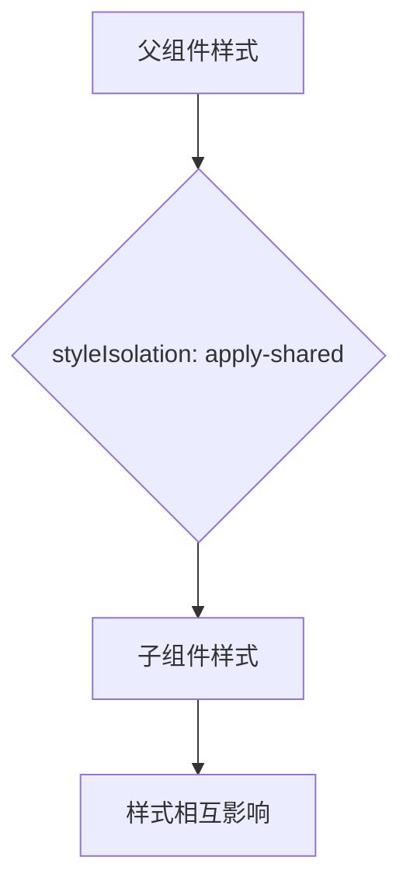
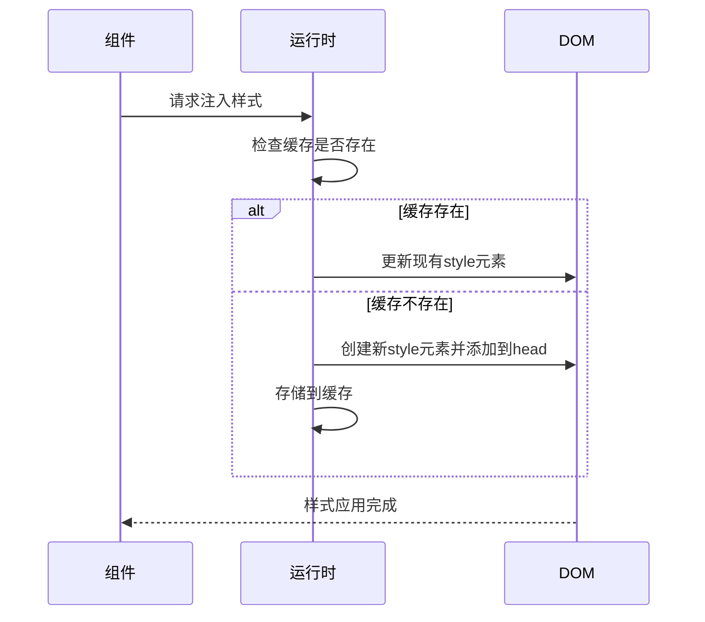

# 运行时问题

<cite>
**本文档引用的文件**
- [options-a2565187.mjs](file://demo/uni-app/weapp-tw-dist/options-a2565187.mjs)
- [vite.config.ts](file://demo/uni-app-tailwindcss-v4/vite.config.ts)
- [navigation-bar.json](file://demo/native-ts/miniprogram/components/navigation-bar/navigation-bar.json)
- [custom-tab-bar.json](file://templates/weapp-native-mina-tailwindcss-template/src/custom-tab-bar/index.json)
- [component.js](file://demo/uni-app/src/wxcomponents/@vant/weapp/common/component.js)
- [component.d.ts](file://demo/uni-app/src/wxcomponents/@vant/weapp/common/component.d.ts)
- [style-handler.ts](file://packages/weapp-tailwindcss/src/lightningcss/style-handler.ts)
- [cssInJsRuntime.ts](file://apps/vue-app/src/lib/cssInJsRuntime.ts)
- [postcss.config.js](file://demo/uni-app-vue3-vite/_postcss.config.js)
- [tailwindcss/style-isolation.md](file://website/build/tailwindcss/style-isolation.md)
</cite>

## 目录
1. [引言](#引言)
2. [组件样式隔离](#组件样式隔离)
3. [多端兼容性处理](#多端兼容性处理)
4. [样式注入时机](#样式注入时机)
5. [第三方组件库集成](#第三方组件库集成)
6. [运行时性能优化](#运行时性能优化)
7. [结论](#结论)

## 引言
本文档详细探讨了在uni-app项目中集成weapp-tailwindcss时遇到的运行时问题。重点解决组件样式隔离、多端兼容性和样式注入时机等关键问题。通过分析weapp-tailwindcss在uni-app运行时环境中的工作原理，提供解决组件样式冲突的具体方案，并包含处理第三方组件库与Tailwind CSS集成的注意事项和解决方案。

## 组件样式隔离
在uni-app中使用weapp-tailwindcss时，组件样式隔离是一个重要问题。小程序原生支持`styleIsolation`配置来控制组件样式的作用范围。通过设置`styleIsolation`为`apply-shared`，可以让父组件的样式影响到子组件，同时子组件的样式也会对父组件生效。



**图示来源**
- [navigation-bar.json](file://demo/native-ts/miniprogram/components/navigation-bar/navigation-bar.json#L3)
- [custom-tab-bar.json](file://templates/weapp-native-mina-tailwindcss-template/src/custom-tab-bar/index.json#L3)

当需要更严格的样式隔离时，可以使用scoped样式或CSS模块。scoped样式通过编译时为模板节点和样式选择器添加唯一标识（如`data-v-xxxx`），使样式仅作用于当前组件渲染的DOM。

**本节来源**
- [tailwindcss/style-isolation.md](file://website/build/tailwindcss/style-isolation.md#L66-L89)

## 多端兼容性处理
在多端开发场景下，不同平台的样式差异需要特别处理。weapp-tailwindcss通过条件编译来实现多端兼容性。例如，在uni-app中可以使用条件编译语法来区分H5和其他平台：

```css
/* #ifdef H5 */
@import "tailwindcss";
/* #endif */
/* #ifndef H5 */
@import "weapp-tailwindcss";
/* #endif */
```

这种做法确保了H5端使用标准的Tailwind CSS预设，而小程序端则使用针对小程序优化的weapp-tailwindcss。weapp-tailwindcss移除了H5专用的preflight类，并且不使用CSS `@layer`特性，因为小程序本身不支持该特性。

**本节来源**
- [postcss.config.js](file://demo/uni-app-vue3-vite/_postcss.config.js#L2-L18)

## 样式注入时机
样式注入的时机对运行时性能有重要影响。weapp-tailwindcss在构建过程中通过PostCSS插件处理样式，将Tailwind的原子类转换为实际的CSS规则。这个过程发生在编译时，而不是运行时，从而避免了运行时的性能开销。

在运行时，通过动态注入CSS的方式来实现主题切换等功能。这种方式通过创建一个唯一的`<style>`元素并将其添加到`<head>`中，当样式变化时更新该元素的内容而不是重新创建。



**图示来源**
- [cssInJsRuntime.ts](file://apps/vue-app/src/lib/cssInJsRuntime.ts#L1-L23)

**本节来源**
- [style-handler.ts](file://packages/weapp-tailwindcss/src/lightningcss/style-handler.ts#L122-L173)

## 第三方组件库集成
集成第三方组件库（如Vant Weapp）与Tailwind CSS时需要注意以下几点：

1. **外部类名支持**：Vant Weapp组件通过`externalClasses`支持外部样式类。在`VantComponent`初始化时，会自动添加`custom-class`到`externalClasses`列表中。

2. **样式覆盖**：由于第三方组件可能有自己的默认样式，需要使用更高的特异性来覆盖。可以通过在Tailwind配置中设置`prefix`或使用`important`变体来提高优先级。

3. **行为兼容**：确保weapp-tailwindcss的行为与第三方组件库的样式处理机制兼容。例如，Vant Weapp使用`basic` mixin来提供基础功能。

```mermaid
classDiagram
class VantComponent {
+data : Data
+properties : Props
+behaviors : string[]
+methods : Methods
+externalClasses : string[]
}
VantComponent --> basic : "使用"
VantComponent --> "wx : //form-field" : "使用"
```

**图示来源**
- [component.js](file://demo/uni-app/src/wxcomponents/@vant/weapp/common/component.js#L9-L44)
- [component.d.ts](file://demo/uni-app/src/wxcomponents/@vant/weapp/common/component.d.ts#L3)

**本节来源**
- [component.js](file://demo/uni-app/src/wxcomponents/@vant/weapp/common/component.js#L1-L45)

## 运行时性能优化
为了优化运行时性能，可以采取以下措施：

1. **减少样式重计算**：通过合理使用`preflight`配置，避免不必要的样式重置。`createInjectPreflight`函数会过滤掉值为`false`的条目，只注入必要的预设样式。

2. **优化样式注入策略**：使用缓存机制避免重复创建`<style>`元素。每次样式更新时，先检查缓存中是否存在对应的元素，如果存在则直接更新内容。

3. **按需加载**：通过`cssEntries`配置指定需要处理的CSS文件，避免处理不必要的文件。这可以显著减少构建时间和包大小。

4. **使用轻量级处理器**：在可能的情况下，使用lightningcss等更高效的CSS处理器来替代PostCSS，以提高构建性能。

**本节来源**
- [style-handler.ts](file://packages/weapp-tailwindcss/src/lightningcss/style-handler.ts#L122-L127)
- [cssInJsRuntime.ts](file://apps/vue-app/src/lib/cssInJsRuntime.ts#L1-L23)

## 结论
本文档详细介绍了在uni-app项目中集成weapp-tailwindcss时遇到的运行时问题及其解决方案。通过合理的组件样式隔离策略、多端兼容性处理、正确的样式注入时机控制以及对第三方组件库的兼容性处理，可以有效解决常见的运行时问题。同时，通过一系列性能优化技巧，可以确保应用在运行时保持良好的性能表现。这些实践对于构建高质量的跨平台小程序应用具有重要的指导意义。