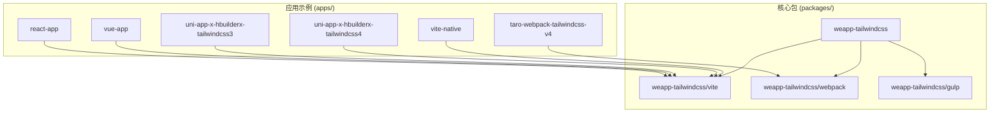
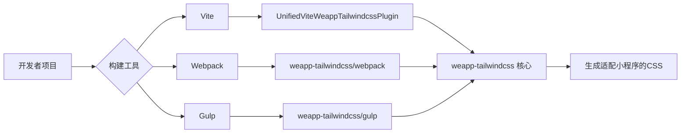
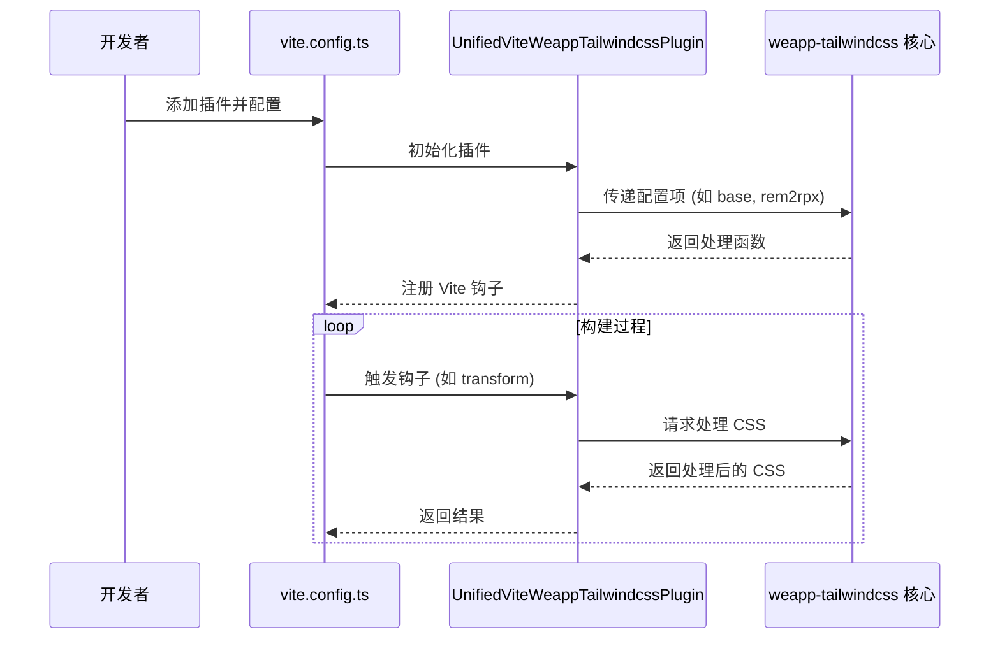
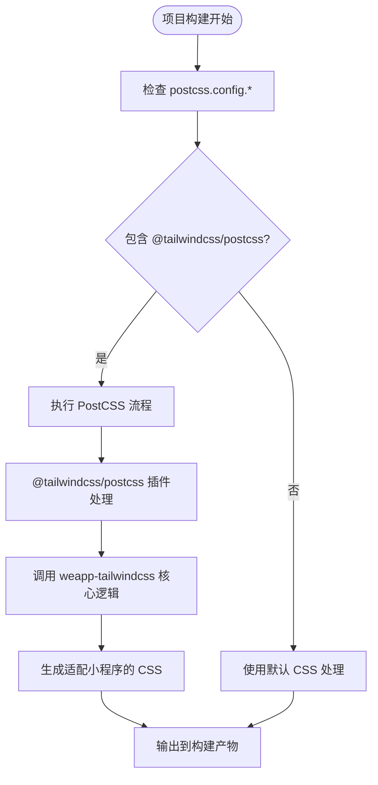

# 框架集成问题

<cite>
**本文档中引用的文件**  
- [vite.config.ts](file://apps/react-app/vite.config.ts)
- [vite.config.ts](file://apps/vue-app/vite.config.ts)
- [vite.config.ts](file://apps/uni-app-x-hbuilderx-tailwindcss4/vite.config.ts)
- [postcss.config.mjs](file://apps/taro-webpack-tailwindcss-v4/postcss.config.mjs)
- [postcss.config.js](file://demo/taro-app-vite/postcss.config.js)
- [tailwind.config.js](file://apps/rsmax-app-ts/tailwind.config.js)
- [tailwind.config.js](file://apps/uni-app-x-hbuilderx-tailwindcss3/tailwind.config.js)
- [tailwind.config.js](file://apps/vite-native/tailwind.config.js)
</cite>

## 目录
1. [简介](#简介)
2. [项目结构](#项目结构)
3. [核心组件](#核心组件)
4. [架构概述](#架构概述)
5. [详细组件分析](#详细组件分析)
6. [依赖分析](#依赖分析)
7. [性能考虑](#性能考虑)
8. [故障排除指南](#故障排除指南)
9. [结论](#结论)
10. [附录](#附录)（如有必要）

## 简介
`weapp-tailwindcss` 是一个为小程序环境提供 Tailwind CSS 全面支持的解决方案，支持包括 Taro、uni-app、React、Vue 等多种主流框架。它通过插件化设计，兼容 webpack、vite、gulp 等构建工具，能够自动识别并处理 Tailwind CSS 工具类，适配小程序的样式和构建需求。本指南旨在解决在不同框架中集成 `weapp-tailwindcss` 时遇到的常见问题，如 HMR 热更新失效、组件样式隔离、多端兼容性等，并提供详细的配置要求和解决方案。

**Section sources**
- [README.md](file://README.md#L1-L101)

## 项目结构
项目结构清晰地展示了多个应用示例，覆盖了从原生小程序到各种主流框架的集成场景。`apps/` 目录下包含了针对不同框架的具体实现，如 `react-app`、`vue-app`、`taro-webpack-tailwindcss-v4`、`uni-app-x-hbuilderx-tailwindcss3/4` 等，这些示例为开发者提供了直接的参考。`packages/` 目录则是核心功能的实现，其中 `weapp-tailwindcss` 包含了针对不同构建工具（vite、webpack、gulp）的导出模块。



**Diagram sources**
- [README.md](file://README.md#L44-L55)
- [project structure](file://project_structure)

**Section sources**
- [README.md](file://README.md#L44-L55)

## 核心组件
`weapp-tailwindcss` 的核心在于其对不同构建工具的适配能力。通过 `packages/weapp-tailwindcss/src/index.ts` 的导出，它统一了 `vite`、`webpack` 和 `gulp` 等插件的入口。每个插件负责在各自的构建流程中注入 Tailwind CSS 处理逻辑，确保生成的 CSS 能够被小程序正确解析和应用。

**Section sources**
- [index.ts](file://packages/weapp-tailwindcss/src/index.ts#L1-L5)

## 架构概述
该解决方案采用插件化架构，核心是 `weapp-tailwindcss` 包，它提供了一套通用的 API 和处理逻辑。针对不同的构建系统（如 Vite 或 Webpack），有专门的插件（如 `UnifiedViteWeappTailwindcssPlugin`）来桥接核心逻辑与构建工具的钩子（hooks）。对于特定框架（如 uni-app x），还提供了预设（presets）来简化配置。



**Diagram sources**
- [index.ts](file://packages/weapp-tailwindcss/src/index.ts#L1-L5)
- [vite.config.ts](file://apps/uni-app-x-hbuilderx-tailwindcss4/vite.config.ts#L7-L26)

## 详细组件分析

### Vite 集成分析
在基于 Vite 的项目中（如 React、Vue、uni-app x），集成 `weapp-tailwindcss` 通常通过在 `vite.config.ts` 中添加插件来完成。例如，在 `react-app` 中，直接使用 `@tailwindcss/vite` 插件；而在更复杂的 `uni-app x` 项目中，则使用 `weapp-tailwindcss/vite` 提供的 `UnifiedViteWeappTailwindcssPlugin`，并结合 `uniAppX` 预设进行深度配置。

#### 对于 API/Service 组件:


**Diagram sources**
- [vite.config.ts](file://apps/react-app/vite.config.ts#L1-L25)
- [vite.config.ts](file://apps/uni-app-x-hbuilderx-tailwindcss4/vite.config.ts#L1-L41)

**Section sources**
- [vite.config.ts](file://apps/react-app/vite.config.ts#L1-L25)
- [vite.config.ts](file://apps/uni-app-x-hbuilderx-tailwindcss4/vite.config.ts#L1-L41)

### Webpack 集成分析
对于使用 Webpack 的框架（如 Taro），集成主要通过 PostCSS 配置完成。在 `taro-webpack-tailwindcss-v4` 示例中，`postcss.config.mjs` 文件直接引入了 `@tailwindcss/postcss` 插件。这表明 `weapp-tailwindcss` 的 Webpack 版本会确保这个 PostCSS 插件在 Webpack 的 CSS 处理流程中被正确调用。

#### 对于复杂逻辑组件:


**Diagram sources**
- [postcss.config.mjs](file://apps/taro-webpack-tailwindcss-v4/postcss.config.mjs#L1-L6)
- [postcss.config.js](file://demo/taro-app-vite/postcss.config.js#L1-L8)

**Section sources**
- [postcss.config.mjs](file://apps/taro-webpack-tailwindcss-v4/postcss.config.mjs#L1-L6)

## 依赖分析
项目依赖清晰，核心包 `weapp-tailwindcss` 依赖于具体的构建工具插件（如 `vite`、`webpack`）。应用示例则根据其框架选择相应的依赖。例如，`uni-app x` 项目依赖 `@dcloudio/vite-plugin-uni` 和 `weapp-tailwindcss/vite`，而 `taro` 项目则依赖其自身的 Webpack 配置和 `@tailwindcss/postcss`。

```mermaid
graph TD
A[weapp-tailwindcss] --> B[vite]
A --> C[webpack]
A --> D[gulp]
E[react-app] --> B
F[vue-app] --> B
G[uni-app-x] --> B
G --> H[@dcloudio/vite-plugin-uni]
I[taro-app] --> C
I --> J[@tailwindcss/postcss]
```

**Diagram sources**
- [package.json](file://apps/react-app/package.json)
- [package.json](file://apps/uni-app-x-hbuilderx-tailwindcss4/package.json)
- [package.json](file://apps/taro-webpack-tailwindcss-v4/package.json)

**Section sources**
- [vite.config.ts](file://apps/react-app/vite.config.ts#L2)
- [vite.config.ts](file://apps/uni-app-x-hbuilderx-tailwindcss4/vite.config.ts#L2)
- [postcss.config.mjs](file://apps/taro-webpack-tailwindcss-v4/postcss.config.mjs#L3)

## 性能考虑
`weapp-tailwindcss` 通过精确处理工具类，避免了生成大量未使用的 CSS，从而优化了小程序包的大小。其插件设计确保了处理过程嵌入到标准的构建流程中，对整体构建性能的影响被最小化。对于大型项目，建议利用其配置项（如 `safelist`）来进一步控制生成的样式范围。

## 故障排除指南
本指南针对 `weapp-tailwindcss` 在不同框架中的集成问题提供解决方案。

### HMR 热更新失效
**问题**: 在开发模式下修改 Tailwind CSS 类名后，页面未自动刷新。
**解决方案**:
1.  **检查插件配置**: 确保 `weapp-tailwindcss` 插件已正确添加到构建配置中（如 `vite.config.ts` 的 `plugins` 数组）。
2.  **检查文件监听**: 确认构建工具（Vite/Webpack）的监听范围包含了所有使用了 Tailwind 类的文件。
3.  **重启开发服务器**: 有时插件初始化状态异常，重启 `dev server` 可解决。

**Section sources**
- [vite.config.ts](file://apps/react-app/vite.config.ts#L7-L14)
- [vite.config.ts](file://apps/uni-app-x-hbuilderx-tailwindcss4/vite.config.ts#L10-L26)

### 组件样式隔离问题
**问题**: Tailwind CSS 样式发生全局污染，影响了其他组件。
**解决方案**:
1.  **使用框架的样式作用域**: Vue 的 `<style scoped>` 或 React 的 CSS Modules。
2.  **配置插件的隔离选项**: 查阅 `weapp-tailwindcss` 文档，看是否支持生成更隔离的 CSS 类名或作用域。
3.  **避免使用全局样式重置**: 确保没有在全局样式文件中意外地应用了 Tailwind 的 `@base` 指令。

### 多端兼容性问题
**问题**: 在 H5 端正常，但在小程序端样式错乱。
**解决方案**:
1.  **检查单位转换**: 小程序常用 `rpx`，而 Web 用 `px`。确认 `weapp-tailwindcss` 的 `rem2rpx` 等配置是否正确启用。
2.  **检查不支持的属性**: 某些 CSS 属性（如 `filter`、`transform` 的某些值）在小程序中支持有限。避免使用或提供降级方案。
3.  **使用 `@apply` 谨慎**: 在组件内部使用 `@apply` 可能导致样式优先级问题，建议在全局样式中定义。

**Section sources**
- [vite.config.ts](file://apps/uni-app-x-hbuilderx-tailwindcss4/vite.config.ts#L15-L16)

### 框架特定配置要求
*   **Taro**: 主要通过 `postcss.config.js` 配置，确保 `@tailwindcss/postcss` 插件在列表中。
*   **uni-app (Vue2/Vue3)**: 在 `vue.config.js` 或 `vite.config.ts` 中，将 `weapp-tailwindcss/vite` 插件添加到 `plugins` 数组。
*   **React (Vite)**: 在 `vite.config.ts` 中，使用 `@tailwindcss/vite` 插件。
*   **uni-app x**: 必须使用 `weapp-tailwindcss/vite` 的 `UnifiedViteWeappTailwindcssPlugin`，并结合 `uniAppX` 预设进行配置，以处理其特殊的构建流程。

### 跨框架迁移兼容性
从旧版本（如 `weapp-tailwindcss@3.x`）迁移时，需注意：
1.  **API 变更**: 检查插件的导入路径和配置项是否发生变化。
2.  **PostCSS 版本**: 确保项目使用的 PostCSS 版本与新 `weapp-tailwindcss` 兼容。
3.  **构建工具升级**: 迁移可能需要同时升级 Vite 或 Webpack 到兼容版本。

**Section sources**
- [README.md](file://README.md#L63-L64)
- [vite.config.ts](file://apps/uni-app-x-hbuilderx-tailwindcss4/vite.config.ts#L7-L26)

## 结论
`weapp-tailwindcss` 为在小程序生态中使用 Tailwind CSS 提供了一个强大且灵活的解决方案。通过分析其在不同框架（Taro、uni-app、React、Vue）中的集成方式，我们可以看到它通过插件化设计，有效地解决了样式适配、构建集成等核心问题。遵循本文档的故障排除指南，可以有效应对 HMR、样式隔离和多端兼容性等常见挑战，确保开发流程的顺畅。

## 附录
- **官方文档**: [https://tw.icebreaker.top](https://tw.icebreaker.top)
- **GitHub 仓库**: [https://github.com/sonofmagic/weapp-tailwindcss](https://github.com/sonofmagic/weapp-tailwindcss)