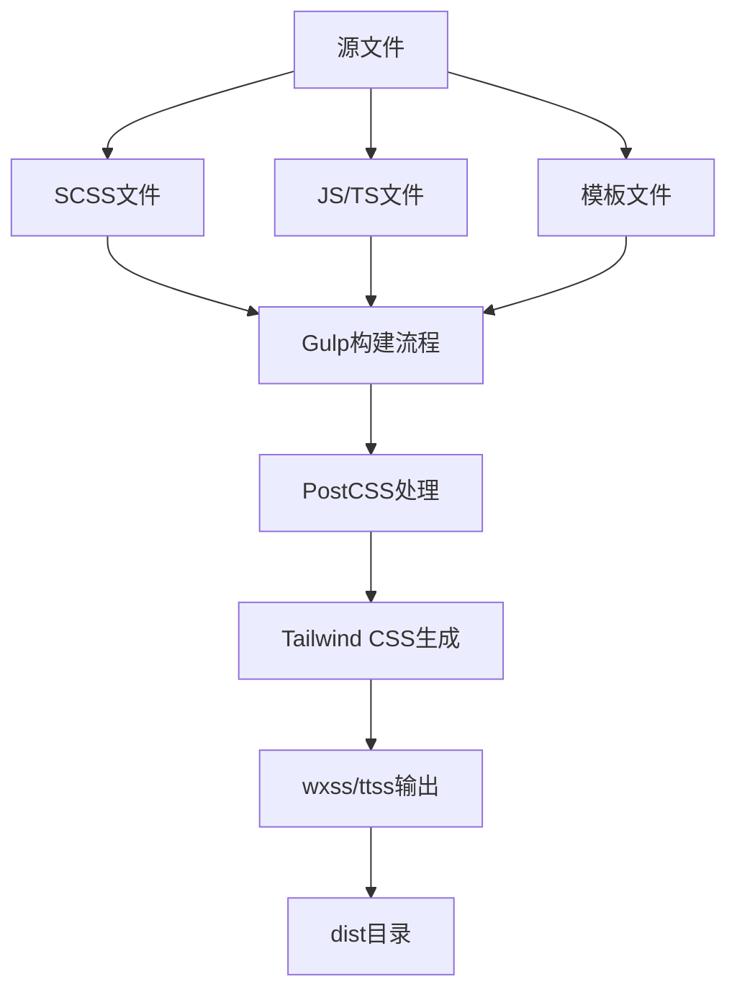
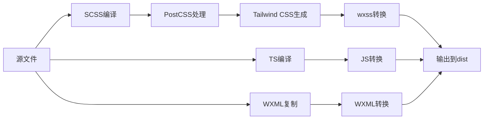
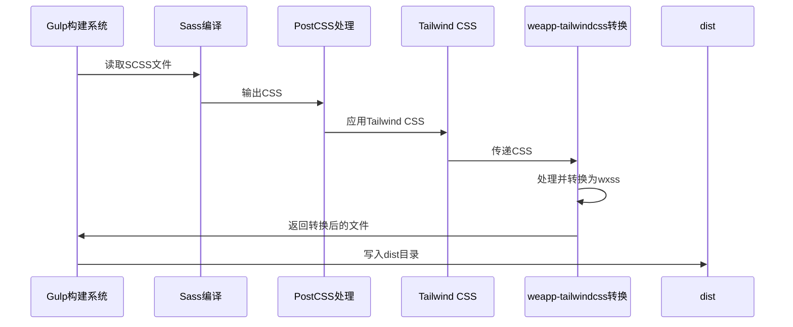
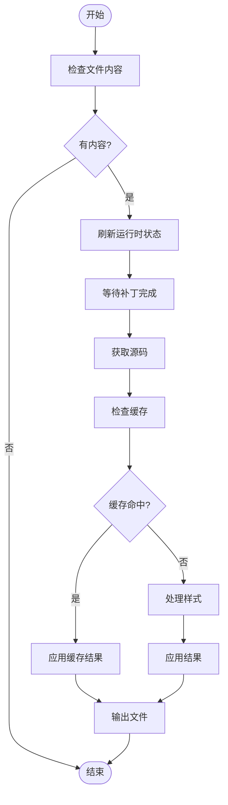
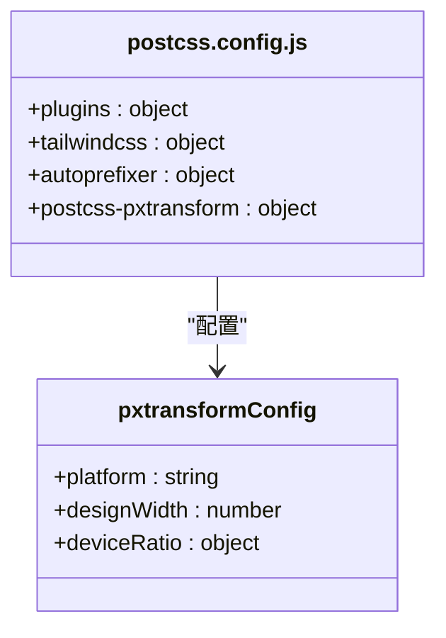

# Gulp集成

<cite>
**本文档引用的文件**
- [gulpfile.ts](file://demo/gulp-app/gulpfile.ts)
- [package.json](file://demo/gulp-app/package.json)
- [tailwind.config.js](file://demo/gulp-app/tailwind.config.js)
- [postcss.config.js](file://demo/gulp-app/postcss.config.js)
- [gulp.ts](file://packages/weapp-tailwindcss/src/gulp.ts)
- [index.ts](file://packages/weapp-tailwindcss/src/bundlers/gulp/index.ts)
</cite>

## 目录
1. [简介](#简介)
2. [项目结构](#项目结构)
3. [核心组件](#核心组件)
4. [架构概述](#架构概述)
5. [详细组件分析](#详细组件分析)
6. [依赖分析](#依赖分析)
7. [性能考虑](#性能考虑)
8. [故障排除指南](#故障排除指南)
9. [结论](#结论)

## 简介
本文档详细说明了如何将weapp-tailwindcss与Gulp构建系统集成。提供了Gulp任务配置的完整示例，展示了如何创建处理Tailwind CSS的工作流，包括源文件监听、PostCSS处理、样式生成和输出。解释了如何在gulpfile.ts中正确配置weapp-tailwindcss的Gulp插件，以及如何与其他Gulp插件（如gulp-postcss）协同工作。提供了构建管道的最佳实践，包括开发模式和生产模式的配置差异、错误处理机制，以及如何集成到现有的Gulp构建流程中。还包含了常见问题如任务执行失败、样式生成不完整、性能瓶颈等问题的解决方案。

## 项目结构
本项目结构展示了Gulp集成的完整配置，包括源文件、构建任务和输出目录。主要包含以下关键目录和文件：

- `demo/gulp-app/`: Gulp应用示例目录
  - `src/`: 源代码目录，包含SCSS、JS/TS和模板文件
  - `dist/`: 构建输出目录
  - `tmp/`: 临时文件目录
  - `gulpfile.ts`: Gulp构建配置文件
  - `package.json`: 项目依赖和脚本配置
  - `tailwind.config.js`: Tailwind CSS配置文件
  - `postcss.config.js`: PostCSS配置文件



**图示来源**
- [gulpfile.ts](file://demo/gulp-app/gulpfile.ts#L79-L104)

**章节来源**
- [gulpfile.ts](file://demo/gulp-app/gulpfile.ts#L79-L104)

## 核心组件
weapp-tailwindcss的Gulp集成核心组件包括三个主要的转换插件：`transformJs`、`transformWxml`和`transformWxss`。这些插件通过`createPlugins`函数创建，并在Gulp构建流程中使用。

`transformWxss`负责处理SCSS文件，将其编译为CSS，通过PostCSS应用Tailwind CSS，然后转换为小程序的wxss格式。`transformJs`处理JavaScript/TypeScript文件，转换其中的类名以支持Tailwind CSS。`transformWxml`处理模板文件，确保其中的类名正确转换。

这些组件协同工作，形成了一个完整的构建管道，从源代码到小程序可执行文件的转换过程。

**章节来源**
- [gulpfile.ts](file://demo/gulp-app/gulpfile.ts#L45-L47)
- [index.ts](file://packages/weapp-tailwindcss/src/bundlers/gulp/index.ts#L23-L249)

## 架构概述
weapp-tailwindcss的Gulp集成架构基于Gulp的流式处理机制，结合PostCSS和Tailwind CSS的处理能力，为小程序开发提供了一套完整的样式解决方案。

架构的核心是`createPlugins`函数，它返回三个转换函数：`transformJs`、`transformWxml`和`transformWxss`。这些函数作为Gulp管道中的处理步骤，分别处理不同类型的文件。

构建流程从源文件开始，SCSS文件通过`sassCompile`任务进行编译，然后通过`postcss()`处理应用Tailwind CSS，最后通过`transformWxss`转换为小程序的wxss格式。JS/TS文件通过`compileTsFiles`任务处理，使用`transformJs`转换类名。WXML模板文件通过`copyWXML`任务处理，使用`transformWxml`进行转换。



**图示来源**
- [gulpfile.ts](file://demo/gulp-app/gulpfile.ts#L119-L135)
- [gulpfile.ts](file://demo/gulp-app/gulpfile.ts#L143-L145)
- [gulpfile.ts](file://demo/gulp-app/gulpfile.ts#L148-L150)

**章节来源**
- [gulpfile.ts](file://demo/gulp-app/gulpfile.ts#L119-L150)

## 详细组件分析
### Gulp插件分析
weapp-tailwindcss的Gulp插件实现位于`packages/weapp-tailwindcss/src/bundlers/gulp/index.ts`文件中。核心函数`createPlugins`创建了三个转换函数，用于处理不同类型的文件。

#### 创建插件函数
```mermaid
classDiagram
class createPlugins {
+options : UserDefinedOptions
+return : { transformWxss, transformWml, transformJs }
}
class transformWxss {
+options : Partial~IStyleHandlerOptions~
+return : TransformStream
}
class transformWxml {
+options : Partial~ITemplateHandlerOptions~
+return : TransformStream
}
class transformJs {
+options : Partial~CreateJsHandlerOptions~
+return : TransformStream
}
createPlugins --> transformWxss : "创建"
createPlugins --> transformWxml : "创建"
createPlugins --> transformJs : "创建"
```

**图示来源**
- [index.ts](file://packages/weapp-tailwindcss/src/bundlers/gulp/index.ts#L23-L249)

#### 构建任务流程


**图示来源**
- [gulpfile.ts](file://demo/gulp-app/gulpfile.ts#L119-L135)

#### 样式处理流程


**图示来源**
- [index.ts](file://packages/weapp-tailwindcss/src/bundlers/gulp/index.ts#L138-L169)

**章节来源**
- [index.ts](file://packages/weapp-tailwindcss/src/bundlers/gulp/index.ts#L138-L169)

### 配置文件分析
#### Tailwind CSS配置
Tailwind CSS配置文件根据平台环境变量动态调整内容匹配规则，支持不同小程序平台的模板文件扩展名。

```mermaid
classDiagram
class tailwind.config.js {
+content : string[]
+theme : object
+plugins : function[]
+corePlugins : object
}
class PlatformConfig {
+weapp : { template : 'wxml', css : 'wxss' }
+tt : { template : 'ttml', css : 'ttss' }
}
tailwind.config.js --> PlatformConfig : "使用"
```

**图示来源**
- [tailwind.config.js](file://demo/gulp-app/tailwind.config.js#L1-L31)

#### PostCSS配置
PostCSS配置集成了Tailwind CSS、Autoprefixer和postcss-pxtransform插件，实现了从px到rpx的自动转换。



**图示来源**
- [postcss.config.js](file://demo/gulp-app/postcss.config.js#L1-L22)

**章节来源**
- [postcss.config.js](file://demo/gulp-app/postcss.config.js#L1-L22)

## 依赖分析
weapp-tailwindcss的Gulp集成依赖于多个关键的npm包，这些包共同构成了完整的构建系统。

```mermaid
graph TD
A[weapp-tailwindcss] --> B[gulp]
A --> C[gulp-postcss]
A --> D[gulp-sass]
A --> E[gulp-typescript]
B --> F[vinyl]
C --> G[postcss]
G --> H[tailwindcss]
G --> I[autoprefixer]
D --> J[sass]
E --> K[typescript]
A --> L[weapp-tailwindcss]
L --> M[tailwindcss-patch]
L --> N[@weapp-tailwindcss/postcss]
style A fill:#f9f,stroke:#333
style H fill:#bbf,stroke:#333
```

**图示来源**
- [package.json](file://demo/gulp-app/package.json#L40-L88)
- [package.json](file://packages/weapp-tailwindcss/package.json#L188-L212)

**章节来源**
- [package.json](file://demo/gulp-app/package.json#L40-L88)

## 性能考虑
weapp-tailwindcss的Gulp集成在性能方面进行了多项优化，以提高构建效率和开发体验。

首先，系统实现了缓存机制，通过`processCachedTask`函数检查文件是否已处理过，避免重复工作。这对于大型项目尤其重要，可以显著减少构建时间。

其次，构建任务被组织为并行执行的管道，利用Gulp的流式处理能力，实现了高效的文件处理。不同的文件类型可以同时处理，而不需要等待前一个任务完全完成。

另外，系统支持增量构建和文件监听模式。通过设置`WATCH=1`环境变量，Gulp可以监听文件变化并只重新构建修改的文件，大大提高了开发效率。

最后，通过合理配置PostCSS插件和Tailwind CSS的`content`选项，可以减少不必要的样式生成，优化最终输出文件的大小。

## 故障排除指南
### 常见问题及解决方案
#### 任务执行失败
当Gulp任务执行失败时，首先检查错误信息中的具体错误类型。常见的原因包括：
- 依赖包未正确安装：运行`pnpm install`重新安装依赖
- 配置文件语法错误：检查`gulpfile.ts`、`tailwind.config.js`等配置文件的语法
- 环境变量未设置：确保必要的环境变量（如`WATCH`、`PLATFORM`）已正确设置

#### 样式生成不完整
如果发现生成的样式不完整或缺少某些类名，可能的原因包括：
- `tailwind.config.js`中的`content`配置不正确：确保包含了所有可能使用Tailwind类名的文件路径
- 缓存问题：尝试清除缓存或重启构建进程
- PostCSS插件顺序问题：检查`postcss.config.js`中插件的顺序是否正确

#### 性能瓶颈
如果构建过程过慢，可以考虑以下优化措施：
- 启用缓存：确保`cache`选项已启用
- 优化`content`配置：只包含必要的文件路径，避免扫描过多文件
- 使用增量构建：在开发模式下使用`WATCH=1`进行增量构建

#### 平台特定问题
对于不同小程序平台（如微信小程序、字节跳动小程序），需要注意：
- 文件扩展名差异：确保`platformMap`配置正确
- 样式单位差异：检查`postcss-pxtransform`的配置是否适合目标平台
- API兼容性：确保使用的Tailwind CSS特性在目标平台得到支持

**章节来源**
- [gulpfile.ts](file://demo/gulp-app/gulpfile.ts#L23-L39)
- [gulpfile.ts](file://demo/gulp-app/gulpfile.ts#L224-L238)

## 结论
weapp-tailwindcss的Gulp集成提供了一套完整的小程序Tailwind CSS解决方案。通过精心设计的Gulp任务和插件系统，实现了从源代码到小程序可执行文件的无缝转换。

该集成方案具有以下优势：
- **灵活性**：支持多种小程序平台，可通过环境变量轻松切换
- **高效性**：利用Gulp的流式处理和缓存机制，提高了构建效率
- **易用性**：提供了清晰的配置文件和构建脚本，便于集成到现有项目中
- **可扩展性**：模块化的设计使得可以轻松添加新的功能或修改现有行为

通过本文档提供的配置示例和最佳实践，开发者可以快速将weapp-tailwindcss集成到自己的Gulp构建系统中，享受Tailwind CSS带来的开发便利。