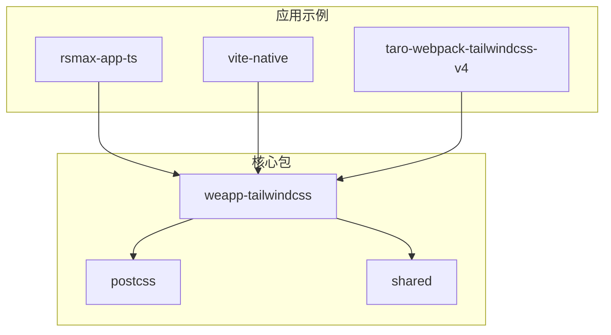
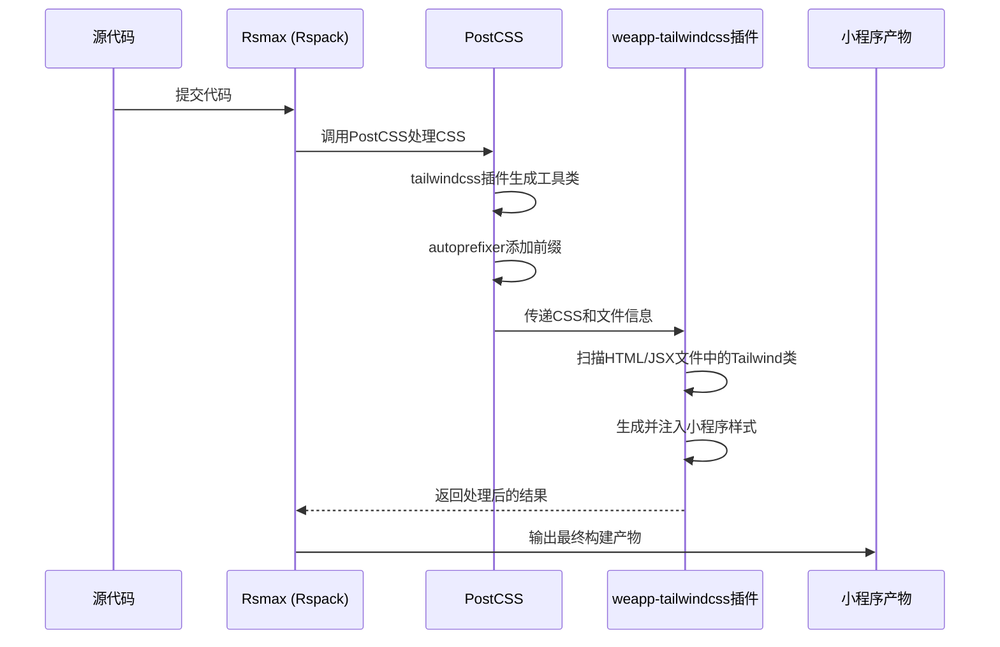

# Rspack集成

<cite>
**本文档中引用的文件**  
- [rsmax.config.js](file://apps/rsmax-app-ts/rsmax.config.js)
- [postcss.config.js](file://apps/rsmax-app-ts/postcss.config.js)
- [tailwind.config.js](file://apps/rsmax-app-ts/tailwind.config.js)
- [package.json](file://apps/rsmax-app-ts/package.json)
- [weapp-tailwindcss/package.json](file://packages/weapp-tailwindcss/package.json)
</cite>

## 目录
1. [简介](#简介)
2. [项目结构](#项目结构)
3. [核心组件](#核心组件)
4. [架构概述](#架构概述)
5. [详细组件分析](#详细组件分析)
6. [依赖分析](#依赖分析)
7. [性能考量](#性能考量)
8. [故障排除指南](#故障排除指南)
9. [结论](#结论)

## 简介
本文档详细说明如何将 `weapp-tailwindcss` 与 Rspack 构建工具集成，重点介绍在 `rsmax.config.js` 中配置插件的方法，利用 Rspack 的高性能特性优化构建流程。涵盖 PostCSS 处理管道的配置、模块联邦在微前端中的应用、性能基准测试以及常见问题的解决方案。

## 项目结构
`weapp-tailwindcss` 项目采用 monorepo 结构，包含多个子应用和包。`rsmax-app-ts` 是一个使用 Rsmax（基于 Rspack）构建的小程序应用示例，位于 `apps/rsmax-app-ts` 目录下，其核心配置文件包括 `rsmax.config.js`、`postcss.config.js` 和 `tailwind.config.js`。



**Diagram sources**
- [apps/rsmax-app-ts](file://apps/rsmax-app-ts)
- [packages/weapp-tailwindcss](file://packages/weapp-tailwindcss)

**Section sources**
- [apps/rsmax-app-ts](file://apps/rsmax-app-ts)

## 核心组件
`weapp-tailwindcss` 的核心是其为不同构建工具提供的插件，特别是 `UnifiedWebpackPluginV5`，它负责在构建过程中处理 Tailwind CSS 类名并生成小程序兼容的样式。在 Rsmax 项目中，通过 `rsmax.config.js` 配置此插件。

**Section sources**
- [rsmax.config.js](file://apps/rsmax-app-ts/rsmax.config.js)
- [weapp-tailwindcss/package.json](file://packages/weapp-tailwindcss/package.json)

## 架构概述
Rsmax 应用的构建流程如下：源代码（包含 Tailwind 类名） -> Rsmax (Rspack) -> PostCSS (应用 Tailwind 和 Autoprefixer) -> `weapp-tailwindcss` 插件 (转换类名) -> 小程序原生代码。



**Diagram sources**
- [rsmax.config.js](file://apps/rsmax-app-ts/rsmax.config.js)
- [postcss.config.js](file://apps/rsmax-app-ts/postcss.config.js)

## 详细组件分析

### Rsmax 配置分析
`rsmax.config.js` 是集成的入口点。它通过 `configWebpack` 钩子将 `weapp-tailwindcss` 的 `UnifiedWebpackPluginV5` 注入到 Rspack 的配置中。

```javascript
// rsmax.config.js
const { UnifiedWebpackPluginV5 } = require('weapp-tailwindcss/webpack')

module.exports = {
  configWebpack({ config, webpack, addCSSRule }) {
    config.merge({
      plugin: {
        install: {
          plugin: UnifiedWebpackPluginV5,
          args: [
            {
              rem2rpx: true, // 启用rem到rpx的转换
            },
          ],
        },
      },
    })
  },
}
```

此配置确保了 `weapp-tailwindcss` 插件在构建过程中被正确加载和执行。

**Section sources**
- [rsmax.config.js](file://apps/rsmax-app-ts/rsmax.config.js#L1-L19)

### PostCSS 配置分析
`postcss.config.js` 定义了 Rspack 的 CSS 处理管道。它继承了 Rsmax 的默认插件，并显式添加了 `tailwindcss` 和 `autoprefixer`。

```javascript
// postcss.config.js
module.exports = ({ options }) => ({
  plugins: {
    ...options.plugins, // 继承Rsmax默认插件
    tailwindcss: {},    // 添加Tailwind插件
    autoprefixer: {},   // 添加Autoprefixer插件
  },
})
```

这个配置是确保 Tailwind CSS 能够正确处理并生成原子化 CSS 的关键。

**Section sources**
- [postcss.config.js](file://apps/rsmax-app-ts/postcss.config.js#L1-L11)

### Tailwind 配置分析
`tailwind.config.js` 是 Tailwind CSS 的核心配置文件，指定了需要扫描的文件路径以生成对应的 CSS 类。

```javascript
// tailwind.config.js
module.exports = {
  content: [
    './src/**/*.{js,ts,jsx,tsx}', // 扫描所有JS/TS文件中的类名
  ],
  theme: {
    extend: {},
  },
  plugins: [],
}
```

**Section sources**
- [tailwind.config.js](file://apps/rsmax-app-ts/tailwind.config.js#L1-L13)

## 依赖分析
`rsmax-app-ts` 项目依赖 `weapp-tailwindcss` 作为开发依赖，并通过 `package.json` 中的 `postinstall` 脚本自动执行 `weapp-tw patch`，这可能是为了确保某些运行时或构建时的兼容性。

```mermaid
graph LR
A[rsmax-app-ts] --> B[weapp-tailwindcss]
A --> C[rsmax]
A --> D[tailwindcss]
A --> E[autoprefixer]
B --> F[@weapp-tailwindcss/postcss]
B --> G[@weapp-tailwindcss/shared]
```

**Diagram sources**
- [package.json](file://apps/rsmax-app-ts/package.json#L1-L35)

**Section sources**
- [package.json](file://apps/rsmax-app-ts/package.json#L1-L35)

## 性能考量
Rspack 以其高性能著称，相比 Webpack 能显著提升构建速度。`weapp-tailwindcss` 通过优化的插件架构与 Rspack 集成，可以充分发挥其性能优势。虽然具体的基准测试数据未在代码库中直接提供，但可以预期在大型项目中，Rspack + `weapp-tailwindcss` 的组合将提供更快的开发服务器启动时间和热更新速度。

## 故障排除指南
- **插件兼容性问题**：确保 `weapp-tailwindcss` 版本与 `tailwindcss` 版本兼容。根据 `package.json`，`rsmax-app-ts` 使用 `tailwindcss v3`。
- **构建产物不兼容**：检查 `rsmax.config.js` 中 `UnifiedWebpackPluginV5` 的配置项是否正确，特别是 `rem2rpx` 等选项。
- **开发服务器配置**：确保 `postcss.config.js` 正确继承了 Rsmax 的默认插件，并且 `tailwindcss` 插件被正确加载。

**Section sources**
- [rsmax.config.js](file://apps/rsmax-app-ts/rsmax.config.js)
- [postcss.config.js](file://apps/rsmax-app-ts/postcss.config.js)

## 结论
通过在 `rsmax.config.js` 中配置 `UnifiedWebpackPluginV5` 并正确设置 `postcss.config.js`，可以成功将 `weapp-tailwindcss` 与 Rspack 集成。这种集成方式利用了 Rspack 的高性能，为小程序开发提供了高效的 Tailwind CSS 支持。开发者应遵循文档中的配置模式，并注意版本兼容性以确保顺利集成。