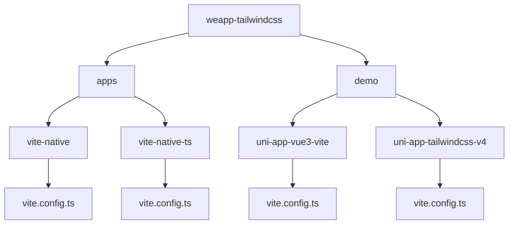
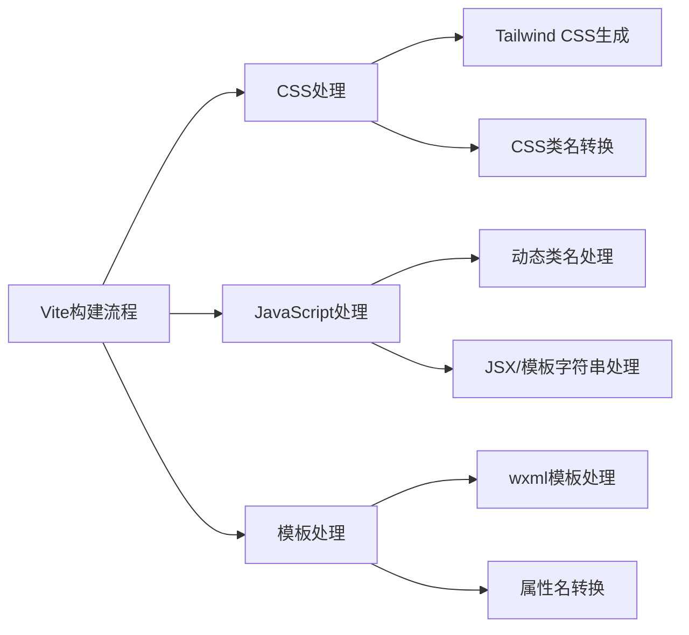
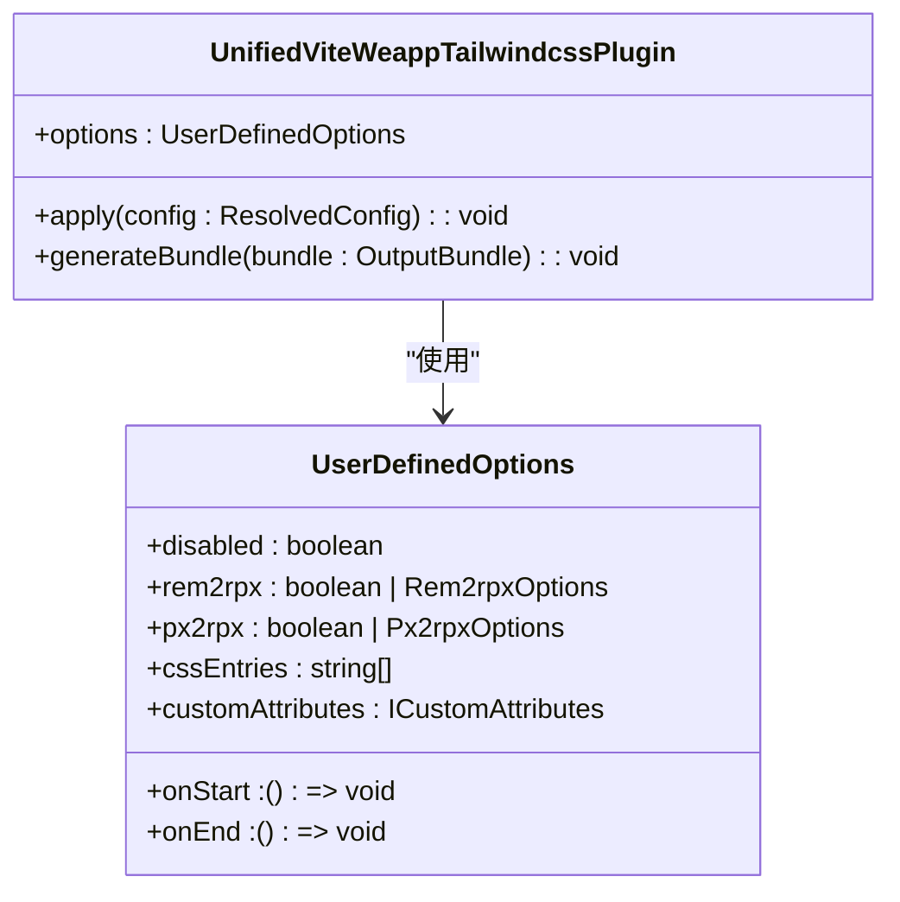
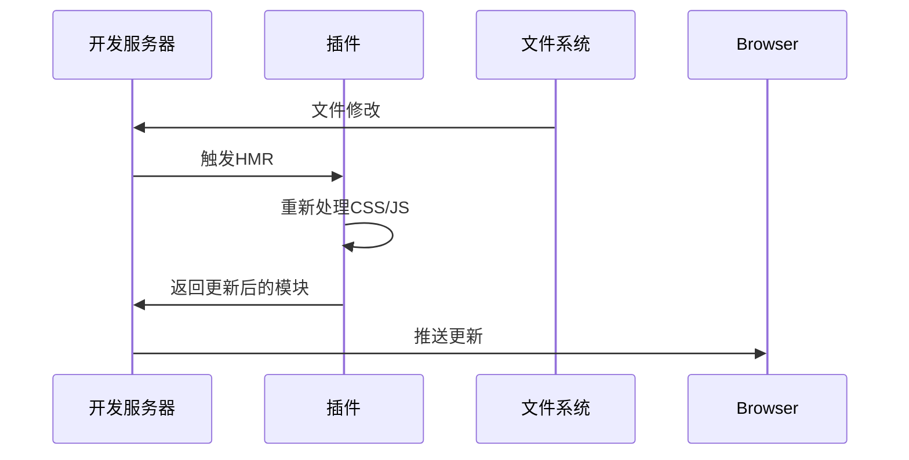
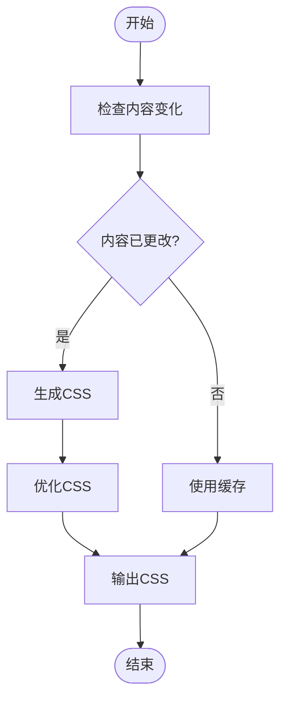
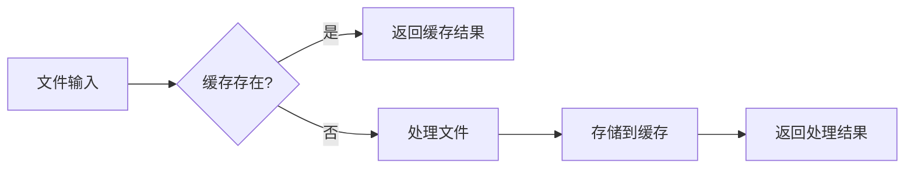
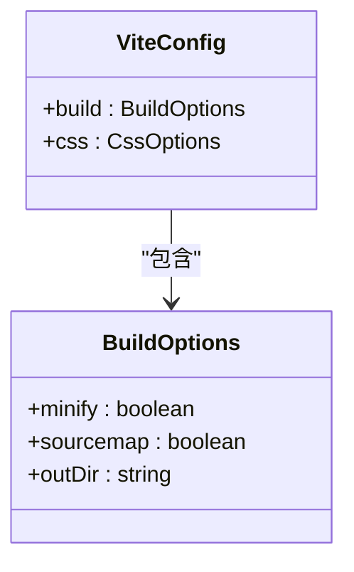
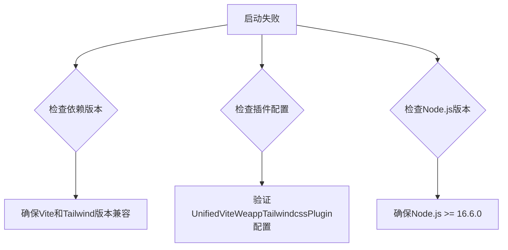
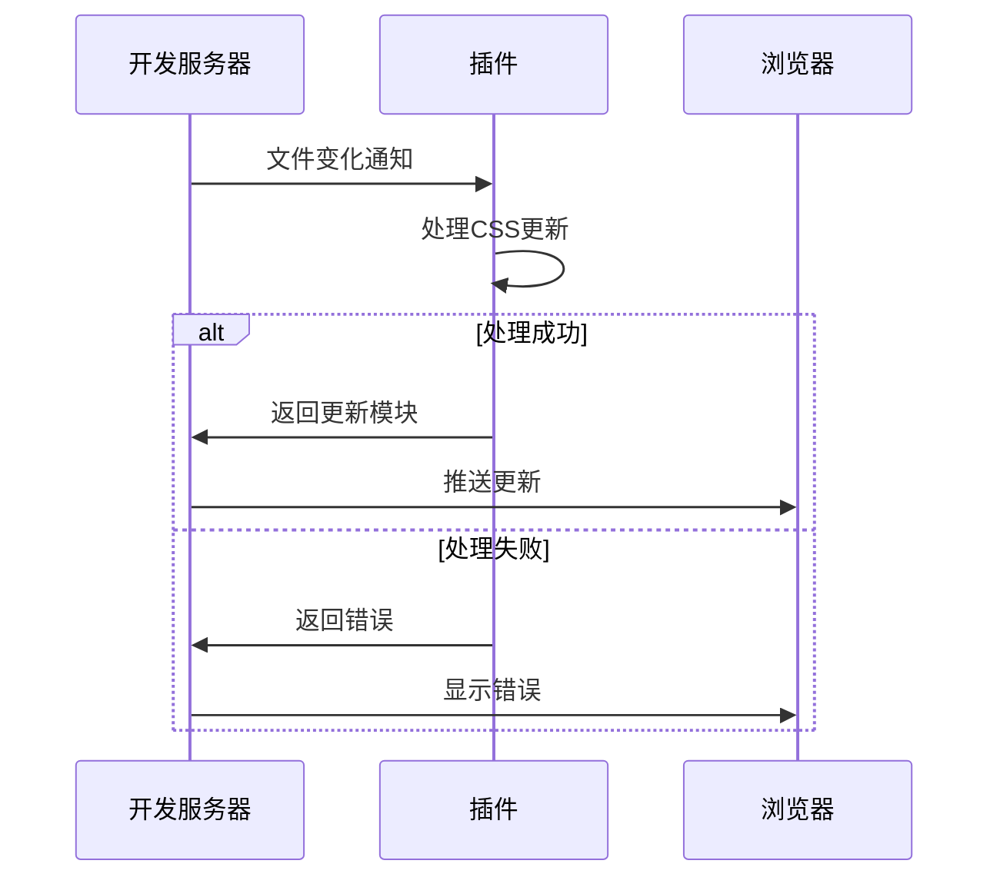

# Vite集成

<cite>
**本文档引用的文件**
- [vite.config.ts](file://apps/vite-native/vite.config.ts)
- [vite.config.ts](file://demo/uni-app-vue3-vite/vite.config.ts)
- [vite.config.ts](file://demo/uni-app-tailwindcss-v4/vite.config.ts)
- [index.ts](file://packages/weapp-tailwindcss/src/bundlers/vite/index.ts)
- [typedoc.export.ts](file://packages/weapp-tailwindcss/src/typedoc.export.ts)
</cite>

## 目录
1. [简介](#简介)
2. [项目结构](#项目结构)
3. [核心组件](#核心组件)
4. [架构概述](#架构概述)
5. [详细组件分析](#详细组件分析)
6. [依赖分析](#依赖分析)
7. [性能考虑](#性能考虑)
8. [故障排除指南](#故障排除指南)
9. [结论](#结论)

## 简介
本文档详细说明了如何将weapp-tailwindcss与Vite构建工具集成。提供了在vite.config.ts中配置插件的完整指南，包括插件导入、选项配置和与其他Vite插件的兼容性处理。重点说明了开发服务器的配置，特别是HMR（热模块替换）在小程序环境中的工作方式和优化技巧。展示了如何处理Vite的按需编译特性与Tailwind CSS JIT模式的协同工作，以及如何配置构建输出以适应小程序平台要求。

## 项目结构
weapp-tailwindcss项目提供了多种框架的集成示例，其中Vite集成主要通过`weapp-tailwindcss/vite`插件实现。项目结构中包含了多个使用Vite构建的小程序应用示例，这些示例展示了不同框架下Vite与weapp-tailwindcss的集成方式。



**图示来源**
- [apps/vite-native](file://apps/vite-native)
- [demo/uni-app-vue3-vite](file://demo/uni-app-vue3-vite)

## 核心组件
weapp-tailwindcss的Vite集成核心是`UnifiedViteWeappTailwindcssPlugin`插件，该插件负责处理Tailwind CSS类名在小程序环境中的转换。插件通过PostCSS处理CSS，并在JavaScript中处理动态类名，确保Tailwind CSS的功能在小程序中正常工作。

**组件来源**
- [index.ts](file://packages/weapp-tailwindcss/src/bundlers/vite/index.ts)
- [vite.config.ts](file://demo/uni-app-vue3-vite/vite.config.ts)

## 架构概述
weapp-tailwindcss的Vite集成架构基于Vite的插件系统，通过多个阶段的处理来实现Tailwind CSS到小程序样式的转换。架构主要包括CSS处理、JavaScript处理和模板处理三个主要部分。



**图示来源**
- [index.ts](file://packages/weapp-tailwindcss/src/bundlers/vite/index.ts)

## 详细组件分析

### 插件配置分析
`UnifiedViteWeappTailwindcssPlugin`插件的配置是Vite集成的关键。插件提供了丰富的配置选项，允许开发者根据具体需求进行定制。

#### 插件导入与基本配置


**图示来源**
- [index.ts](file://packages/weapp-tailwindcss/src/bundlers/vite/index.ts)
- [typedoc.export.ts](file://packages/weapp-tailwindcss/src/typedoc.export.ts)

#### 开发服务器配置
在开发服务器配置中，HMR（热模块替换）是关键特性。插件通过监听文件变化并重新处理相关模块来实现热更新。



**图示来源**
- [index.ts](file://packages/weapp-tailwindcss/src/bundlers/vite/index.ts)

### 按需编译与JIT模式协同
Vite的按需编译特性与Tailwind CSS的JIT模式需要协同工作，以确保样式生成的效率和准确性。



**图示来源**
- [index.ts](file://packages/weapp-tailwindcss/src/bundlers/vite/index.ts)

## 依赖分析
weapp-tailwindcss的Vite集成依赖于多个核心包，这些包共同实现了从Tailwind CSS到小程序样式的转换。

```mermaid
graph TD
A[weapp-tailwindcss/vite] --> B[@weapp-tailwindcss/postcss]
A --> C[tailwindcss]
A --> D[vite]
B --> E[postcss-html-transform]
C --> F[tailwindcss-jit]
D --> G[vite-plugin-inspect]
```

**图示来源**
- [package.json](file://packages/weapp-tailwindcss/package.json)
- [index.ts](file://packages/weapp-tailwindcss/src/bundlers/vite/index.ts)

## 性能考虑
在Vite集成中，性能优化是重要考虑因素。通过缓存、按需编译和构建产物优化等手段，可以显著提升开发和构建效率。

### 缓存配置
插件提供了缓存机制，避免重复处理未更改的文件。



**图示来源**
- [index.ts](file://packages/weapp-tailwindcss/src/bundlers/vite/index.ts)

### 构建产物优化
通过配置构建选项，可以优化最终的构建产物。



**图示来源**
- [vite.config.ts](file://demo/uni-app-vue3-vite/vite.config.ts)

## 故障排除指南
在使用Vite集成时，可能会遇到一些常见问题。以下是一些常见问题及其解决方案。

### 开发服务器启动失败
当开发服务器启动失败时，通常与插件配置或依赖版本有关。



**图示来源**
- [README.md](file://README.md)
- [index.ts](file://packages/weapp-tailwindcss/src/bundlers/vite/index.ts)

### 样式热更新不生效
样式热更新不生效可能是由于HMR配置问题或文件监听问题。



**图示来源**
- [index.ts](file://packages/weapp-tailwindcss/src/bundlers/vite/index.ts)

## 结论
weapp-tailwindcss的Vite集成提供了一套完整的解决方案，使开发者能够在小程序项目中使用Tailwind CSS。通过合理的配置和优化，可以实现高效的开发体验和优质的构建产物。插件的灵活性和可配置性使其能够适应各种不同的项目需求和框架环境。