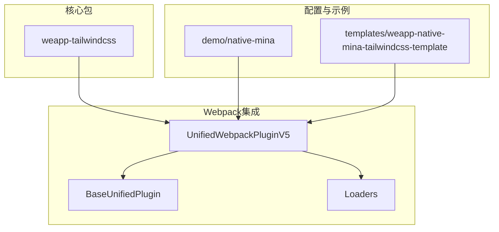
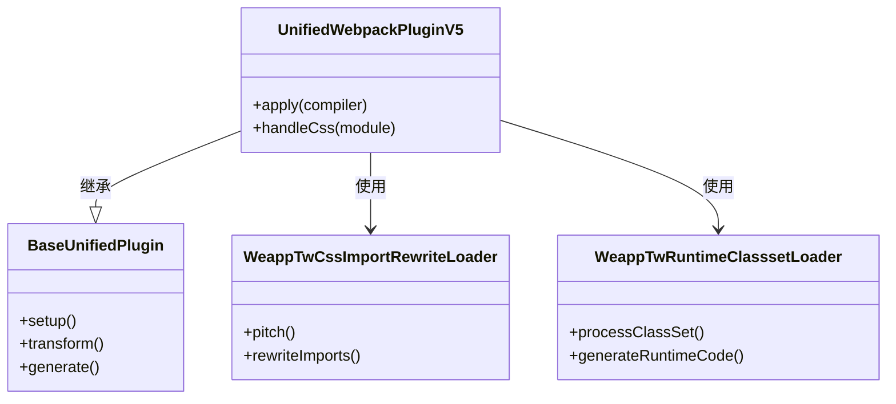
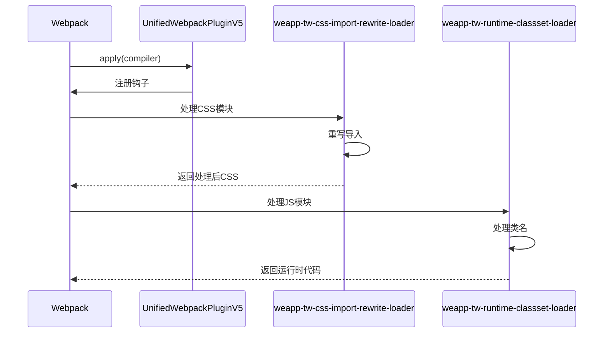

# Webpack集成

<cite>
**本文档中引用的文件**  
- [index.ts](file://packages/weapp-tailwindcss/src/index.ts)
- [webpack.config.js](file://demo/native-mina/webpack.config.js)
- [webpack.config.js](file://templates/weapp-native-mina-tailwindcss-template/webpack.config.js)
- [package.json](file://packages/weapp-tailwindcss/package.json)
- [index.ts](file://packages/weapp-tailwindcss/src/webpack/index.ts)
- [v5.ts](file://packages/weapp-tailwindcss/src/bundlers/webpack/BaseUnifiedPlugin/v5.ts)
- [weapp-tw-css-import-rewrite-loader.ts](file://packages/weapp-tailwindcss/src/bundlers/webpack/loaders/weapp-tw-css-import-rewrite-loader.ts)
- [weapp-tw-runtime-classset-loader.ts](file://packages/weapp-tailwindcss/src/bundlers/webpack/loaders/weapp-tw-runtime-classset-loader.ts)
</cite>

## 目录
1. [介绍](#介绍)
2. [项目结构](#项目结构)
3. [核心组件](#核心组件)
4. [架构概述](#架构概述)
5. [详细组件分析](#详细组件分析)
6. [依赖分析](#依赖分析)
7. [性能考虑](#性能考虑)
8. [故障排除指南](#故障排除指南)
9. [结论](#结论)

## 介绍
本文档详细说明了如何将 `weapp-tailwindcss` 与 Webpack 构建系统集成。重点介绍 `WeappTailwindcssPlugin` 插件的使用方法，包括在 `webpack.config.js` 中注册插件、处理 loader 执行顺序（特别是 `postcss-loader` 的配置）以及如何优化构建性能。文档提供完整的配置示例，涵盖插件选项设置、多环境构建配置以及集成到现有小程序构建流程的方法。同时解释插件的内部工作原理，包括如何拦截和处理 Tailwind CSS 类名，以及如何与 Webpack 模块系统协同工作，并提供常见问题的解决方案。

## 项目结构
`weapp-tailwindcss` 是一个支持多种构建工具（如 Vite、Webpack、Gulp）的工具包，其 Webpack 集成主要通过 `UnifiedWebpackPluginV5` 插件实现。该插件位于 `packages/weapp-tailwindcss/src/bundlers/webpack/` 目录下，包含核心插件逻辑、loader 和共享工具。



**Diagram sources**
- [index.ts](file://packages/weapp-tailwindcss/src/index.ts)
- [webpack.config.js](file://demo/native-mina/webpack.config.js)
- [webpack.config.js](file://templates/weapp-native-mina-tailwindcss-template/webpack.config.js)

**Section sources**
- [index.ts](file://packages/weapp-tailwindcss/src/index.ts)
- [webpack.config.js](file://demo/native-mina/webpack.config.js)

## 核心组件
`weapp-tailwindcss` 的 Webpack 集成核心是 `UnifiedWebpackPluginV5` 插件。该插件继承自 `BaseUnifiedPlugin`，负责在 Webpack 构建过程中注入 Tailwind CSS 支持。插件通过自定义 loader 处理 CSS 文件，重写导入语句，并在运行时处理类名集合。

**Section sources**
- [index.ts](file://packages/weapp-tailwindcss/src/webpack/index.ts)
- [v5.ts](file://packages/weapp-tailwindcss/src/bundlers/webpack/BaseUnifiedPlugin/v5.ts)

## 架构概述
`weapp-tailwindcss` 的 Webpack 插件架构采用分层设计，核心插件负责协调构建流程，而具体的 CSS 处理由专门的 loader 完成。插件通过监听 Webpack 的生命周期钩子，在适当的时机插入处理逻辑。



**Diagram sources**
- [v5.ts](file://packages/weapp-tailwindcss/src/bundlers/webpack/BaseUnifiedPlugin/v5.ts)
- [weapp-tw-css-import-rewrite-loader.ts](file://packages/weapp-tailwindcss/src/bundlers/webpack/loaders/weapp-tw-css-import-rewrite-loader.ts)
- [weapp-tw-runtime-classset-loader.ts](file://packages/weapp-tailwindcss/src/bundlers/webpack/loaders/weapp-tw-runtime-classset-loader.ts)

## 详细组件分析

### 插件注册与配置
要在 Webpack 项目中使用 `weapp-tailwindcss`，需要在 `webpack.config.js` 中注册 `UnifiedWebpackPluginV5` 插件。插件支持多种配置选项，如 `rem2rpx` 用于单位转换，`customAttributes` 用于指定自定义属性等。

```javascript
const { UnifiedWebpackPluginV5 } = require('weapp-tailwindcss/webpack')

module.exports = {
  // ... 其他配置
  plugins: [
    new UnifiedWebpackPluginV5({
      rem2rpx: true,
      customAttributes: {
        't-button': ['t-class', 't-class-icon']
      }
    })
  ]
}
```

**Section sources**
- [webpack.config.js](file://demo/native-mina/webpack.config.js)
- [webpack.config.js](file://templates/weapp-native-mina-tailwindcss-template/webpack.config.js)

### Loader执行顺序
正确的 loader 执行顺序对插件功能至关重要。CSS 文件的处理链应为：`file-loader` → `postcss-loader` → `sass-loader`。`postcss-loader` 负责应用 Tailwind CSS 的 PostCSS 插件，生成最终的 CSS 代码。


**Diagram sources**
- [webpack.config.js](file://demo/native-mina/webpack.config.js)

### 内部工作原理
插件通过 Webpack 的 loader 系统拦截 CSS 模块的处理过程。`weapp-tw-css-import-rewrite-loader` 重写 CSS 导入语句，确保 Tailwind 样式被正确引入。`weapp-tw-runtime-classset-loader` 则在 JavaScript 模块中处理类名集合，生成运行时代码。



**Diagram sources**
- [v5.ts](file://packages/weapp-tailwindcss/src/bundlers/webpack/BaseUnifiedPlugin/v5.ts)
- [weapp-tw-css-import-rewrite-loader.ts](file://packages/weapp-tailwindcss/src/bundlers/webpack/loaders/weapp-tw-css-import-rewrite-loader.ts)
- [weapp-tw-runtime-classset-loader.ts](file://packages/weapp-tailwindcss/src/bundlers/webpack/loaders/weapp-tw-runtime-classset-loader.ts)

## 依赖分析
`weapp-tailwindcss` 依赖于多个核心包，包括 `@weapp-tailwindcss/postcss` 用于 PostCSS 处理，`@weapp-tailwindcss/shared` 提供共享工具，以及 Webpack 相关的依赖如 `webpack-sources`。

```mermaid
graph LR
A[weapp-tailwindcss] --> B[@weapp-tailwindcss/postcss]
A --> C[@weapp-tailwindcss/shared]
A --> D[webpack-sources]
A --> E[tailwindcss-patch]
A --> F[@babel/parser]
```

**Diagram sources**
- [package.json](file://packages/weapp-tailwindcss/package.json)

**Section sources**
- [package.json](file://packages/weapp-tailwindcss/package.json)

## 性能考虑
为优化构建性能，建议启用 Webpack 的文件系统缓存，并合理配置 `splitChunks`。插件本身也提供了性能监控功能，可通过 `onStart` 和 `onEnd` 回调进行构建时间分析。

```javascript
module.exports = {
  cache: {
    type: 'filesystem',
    cacheDirectory: resolve(__dirname, './node_modules/.cache/webpack')
  },
  optimization: {
    splitChunks: {
      chunks: 'all',
      minChunks: 2
    }
  }
}
```

## 故障排除指南
常见问题包括样式未生效、构建速度慢和 HMR 不工作。确保 `postcss-loader` 正确配置并位于 loader 链的适当位置。检查 `tailwind.config.js` 是否正确配置了内容扫描路径。对于 HMR 问题，确认插件是否兼容当前 Webpack 版本。

**Section sources**
- [webpack.config.js](file://demo/native-mina/webpack.config.js)
- [webpack.config.js](file://templates/weapp-native-mina-tailwindcss-template/webpack.config.js)

## 结论
`weapp-tailwindcss` 提供了完整的 Webpack 集成方案，通过 `UnifiedWebpackPluginV5` 插件和自定义 loader 实现了 Tailwind CSS 在小程序环境中的高效应用。正确配置插件和 loader 顺序是成功集成的关键。通过理解插件的内部工作原理，开发者可以更好地优化构建流程并解决潜在问题。