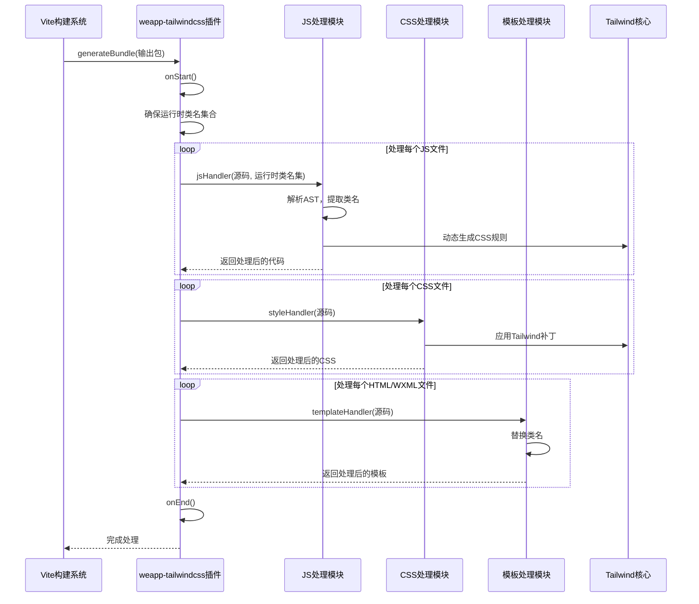
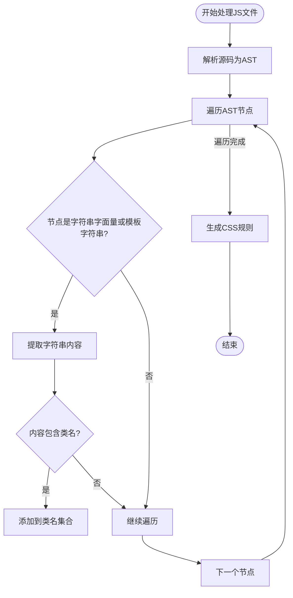

# JIT编译

<cite>
**本文档引用的文件**
- [index.ts](file://packages/weapp-tailwindcss/src/index.ts)
- [vite/index.ts](file://packages/weapp-tailwindcss/src/bundlers/vite/index.ts)
- [cache/index.ts](file://packages/weapp-tailwindcss/src/cache/index.ts)
- [sourceAnalysis.ts](file://packages/weapp-tailwindcss/src/js/sourceAnalysis.ts)
- [tailwindcss.ts](file://packages/weapp-tailwindcss/src/context/tailwindcss.ts)
- [recorder.ts](file://packages/weapp-tailwindcss/src/tailwindcss/recorder.ts)
- [js/index.ts](file://packages/weapp-tailwindcss/src/js/index.ts)
- [wxml/index.ts](file://packages/weapp-tailwindcss/src/wxml/index.ts)
</cite>

## 目录
1. [简介](#简介)
2. [项目结构](#项目结构)
3. [核心组件](#核心组件)
4. [架构概述](#架构概述)
5. [详细组件分析](#详细组件分析)
6. [依赖分析](#依赖分析)
7. [性能考虑](#性能考虑)
8. [故障排除指南](#故障排除指南)
9. [结论](#结论)

## 简介
本文档深入探讨weapp-tailwindcss的JIT（即时）编译机制，详细解释其工作原理。该机制通过实时扫描源代码中的Tailwind类名，动态生成对应的CSS规则，实现高效的开发体验。文档将阐述编译流程的各个阶段，包括源码扫描、类名提取、规则生成和CSS输出，并说明如何通过文件监听系统实现热重载，确保开发过程中的实时反馈。

## 项目结构
weapp-tailwindcss项目采用模块化设计，核心JIT编译功能主要集中在`packages/weapp-tailwindcss/src`目录下。关键模块包括处理不同构建工具（如Vite、Webpack）的适配器、上下文管理、缓存机制、JavaScript和WXML处理逻辑等。

```mermaid
graph TB
subgraph "核心模块"
Context["context/"]
Bundlers["bundlers/"]
Cache["cache/"]
JS["js/"]
WXML["wxml/"]
TailwindCSS["tailwindcss/"]
end
Bundlers --> Context : "获取编译上下文"
Bundlers --> Cache : "使用缓存机制"
Bundlers --> JS : "处理JS/TSX文件"
Bundlers --> WXML : "处理WXML/HTML文件"
Bundlers --> TailwindCSS : "调用Tailwind核心补丁"
JS --> TailwindCSS : "提取类名并生成规则"
WXML --> TailwindCSS : "提取类名并生成规则"
```

**图示来源**
- [index.ts](file://packages/weapp-tailwindcss/src/index.ts)
- [vite/index.ts](file://packages/weapp-tailwindcss/src/bundlers/vite/index.ts)

**本节来源**
- [index.ts](file://packages/weapp-tailwindcss/src/index.ts)

## 核心组件
weapp-tailwindcss的JIT编译机制由多个核心组件协同工作。`UnifiedViteWeappTailwindcssPlugin`是Vite环境下的主要插件入口，负责集成Tailwind的即时编译功能。`createTailwindcssPatcherFromContext`函数根据项目上下文创建Tailwind补丁器，是连接用户配置与编译逻辑的桥梁。缓存系统`initializeCache`确保了重复构建的高效性，而`jsHandler`和`templateHandler`分别负责JavaScript和模板文件中类名的提取与处理。

**本节来源**
- [vite/index.ts](file://packages/weapp-tailwindcss/src/bundlers/vite/index.ts)
- [tailwindcss.ts](file://packages/weapp-tailwindcss/src/context/tailwindcss.ts)
- [cache/index.ts](file://packages/weapp-tailwindcss/src/cache/index.ts)

## 架构概述
weapp-tailwindcss的JIT编译架构是一个基于Vite插件的后处理流程。在Vite完成常规的打包生成后，`generateBundle`钩子被触发，启动weapp-tailwindcss的编译流程。该流程首先收集所有输出文件，然后根据文件类型（JS、CSS、HTML）分组处理。对于JavaScript文件，它会解析AST，提取所有可能包含Tailwind类名的字符串；对于CSS文件，它会应用Tailwind的样式规则；对于HTML/WXML文件，则直接处理其中的类名属性。整个过程利用缓存和运行时状态管理，确保高效和准确。



**图示来源**
- [vite/index.ts](file://packages/weapp-tailwindcss/src/bundlers/vite/index.ts)
- [js/index.ts](file://packages/weapp-tailwindcss/src/js/index.ts)
- [wxml/index.ts](file://packages/weapp-tailwindcss/src/wxml/index.ts)

## 详细组件分析

### JIT编译流程分析
weapp-tailwindcss的JIT编译流程始于Vite的`generateBundle`生命周期钩子。插件首先等待Tailwind核心补丁完成初始化（`runtimeState.patchPromise`），然后获取最新的运行时类名集合（`ensureRuntimeClassSet`）。这个集合包含了所有在项目中实际使用的Tailwind类名。接着，插件遍历所有生成的输出文件，对JavaScript、CSS和HTML/WXML文件分别进行处理。

#### 源码扫描与类名提取
对于JavaScript文件，`jsHandler`会利用Babel解析源码生成AST。通过遍历AST，它能精确地找到所有字符串字面量和模板字符串中可能包含的类名。`sourceAnalysis.ts`模块中的`collectModuleSpecifierReplacementTokens`函数展示了如何系统地收集和替换模块导入路径，这与类名提取的逻辑类似。处理过程中，会忽略被特定标识符包裹的表达式，确保只处理静态的类名字符串。



**图示来源**
- [js/index.ts](file://packages/weapp-tailwindcss/src/js/index.ts)
- [sourceAnalysis.ts](file://packages/weapp-tailwindcss/src/js/sourceAnalysis.ts)

#### 规则生成与CSS输出
类名提取完成后，系统会调用Tailwind的核心功能，根据提取到的类名集合动态生成对应的CSS规则。这些规则会被注入到主CSS文件中。`styleHandler`负责处理CSS文件，它会应用Tailwind的转换插件（如`postcss-html-transform`），确保生成的CSS符合小程序的要求。`recorder.ts`中的`setupPatchRecorder`函数负责管理Tailwind补丁的执行和完成状态，保证CSS生成的时机正确。

**本节来源**
- [vite/index.ts](file://packages/weapp-tailwindcss/src/bundlers/vite/index.ts)
- [recorder.ts](file://packages/weapp-tailwindcss/src/tailwindcss/recorder.ts)

### 热重载与文件监听
weapp-tailwindcss通过集成Vite的热重载机制来实现开发时的实时反馈。当源文件发生变化时，Vite会重新触发构建流程，`generateBundle`钩子再次执行，重新扫描和处理类名。由于使用了LRU缓存（`cache/index.ts`），未更改的文件可以快速从缓存中恢复，大大提升了热重载的速度。`onUpdate`回调函数会在文件内容更新时被调用，通知开发工具进行刷新。

**本节来源**
- [vite/index.ts](file://packages/weapp-tailwindcss/src/bundlers/vite/index.ts)
- [cache/index.ts](file://packages/weapp-tailwindcss/src/cache/index.ts)

### 任意值与动态类名处理
weapp-tailwindcss支持Tailwind的任意值（arbitrary values）语法，如`w-[200px]`。`jsHandler`在处理类名时，会识别这种模式并将其转换为标准的CSS属性。对于动态类名（例如通过模板字符串拼接的类名），编译器会尽力提取所有可能的静态部分，但复杂的动态逻辑可能需要开发者使用`jsPreserveClass`等配置来确保类名不被错误处理。

**本节来源**
- [js/index.ts](file://packages/weapp-tailwindcss/src/js/index.ts)

## 依赖分析
weapp-tailwindcss项目依赖于多个核心库来实现其功能。它依赖`tailwindcss`作为核心的CSS生成引擎，依赖`vite`和`webpack`的API来集成到不同的构建系统中，依赖`@babel/parser`和`@babel/traverse`来解析和操作JavaScript的AST。缓存机制依赖`lru-cache`库。这些依赖关系通过`package.json`文件定义，并在代码中通过模块导入使用。

```mermaid
graph LR
A[weapp-tailwindcss] --> B[tailwindcss]
A --> C[vite]
A --> D[webpack]
A --> E[@babel/parser]
A --> F[lru-cache]
A --> G[postcss]
B --> H[postcss]
```

**图示来源**
- [vite/index.ts](file://packages/weapp-tailwindcss/src/bundlers/vite/index.ts)
- [webpack/index.ts](file://packages/weapp-tailwindcss/src/bundlers/webpack/index.ts)

**本节来源**
- [vite/index.ts](file://packages/weapp-tailwindcss/src/bundlers/vite/index.ts)

## 性能考虑
weapp-tailwindcss通过多种策略优化JIT编译的性能。首要策略是**缓存机制**，`cache/index.ts`实现了基于LRU算法的缓存，对已处理的文件进行缓存，避免重复计算。其次，**增量编译**通过`generateBundle`钩子在Vite完成打包后进行，利用了Vite自身的增量构建能力。此外，**运行时状态管理**（`runtimeState`）确保了Tailwind补丁和类名集合的计算只在必要时进行，避免了不必要的重复工作。这些优化共同保证了即使在大型项目中，JIT编译也能保持流畅的开发体验。

**本节来源**
- [cache/index.ts](file://packages/weapp-tailwindcss/src/cache/index.ts)
- [vite/index.ts](file://packages/weapp-tailwindcss/src/bundlers/vite/index.ts)

## 故障排除指南
如果JIT编译未按预期工作，可以检查以下几点：
1.  **配置文件**：确保`tailwind.config.js`文件存在且配置正确。
2.  **内容源**：检查`content`字段是否正确指向了包含类名的所有文件。
3.  **构建插件**：确认`UnifiedViteWeappTailwindcssPlugin`已在Vite配置中正确注册。
4.  **缓存问题**：尝试清除Vite和weapp-tailwindcss的缓存（通常在`node_modules/.vite`和项目根目录下的缓存文件夹）。
5.  **类名提取失败**：对于复杂的动态类名，检查是否需要使用`jsPreserveClass`配置来保留特定的类名。

**本节来源**
- [tailwind.config.js](file://apps/rsmax-app-ts/tailwind.config.js)
- [vite/index.ts](file://packages/weapp-tailwindcss/src/bundlers/vite/index.ts)

## 结论
weapp-tailwindcss的JIT编译机制是一个强大而高效的系统，它通过深度集成Vite构建流程，实现了对小程序项目的Tailwind CSS即时编译。该机制通过精确的AST分析提取类名，利用缓存和增量编译优化性能，并通过热重载提供实时反馈。理解其内部工作原理有助于开发者更好地配置和使用该工具，充分发挥Tailwind CSS在小程序开发中的优势。