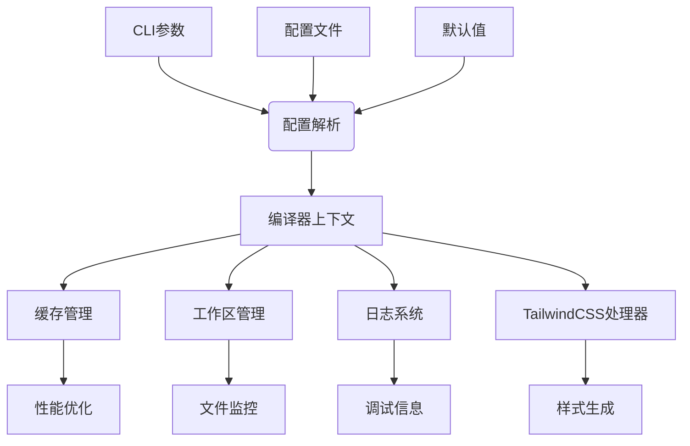
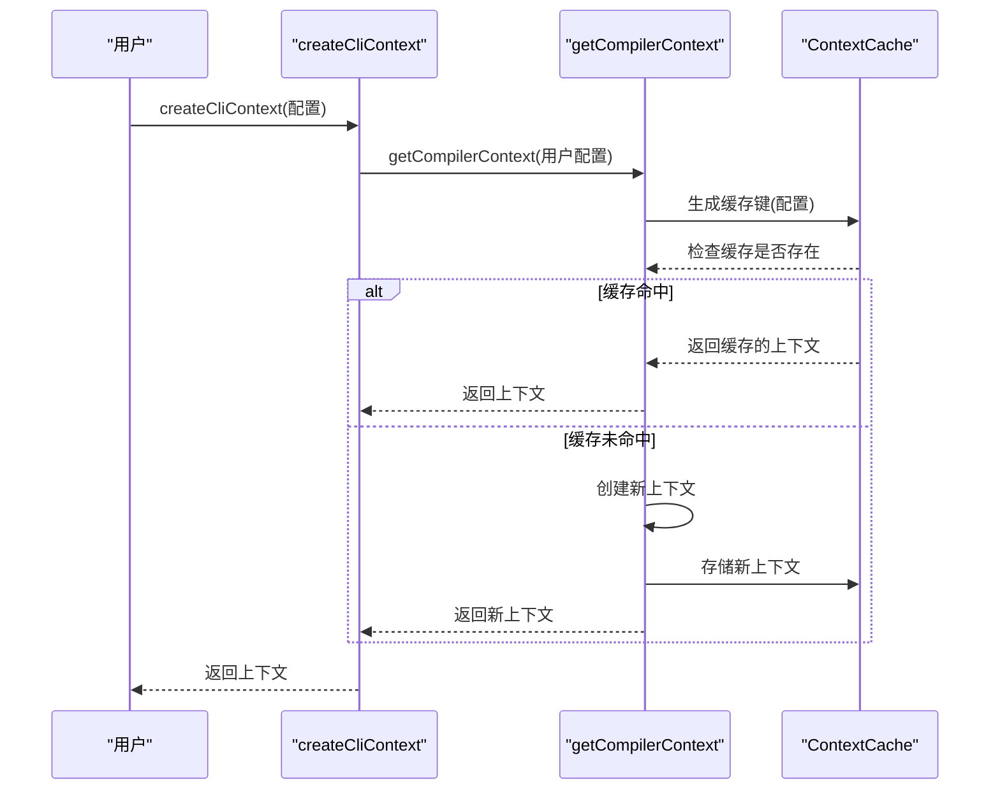
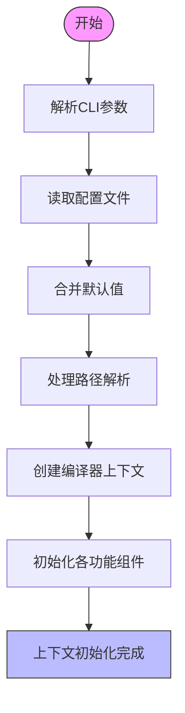
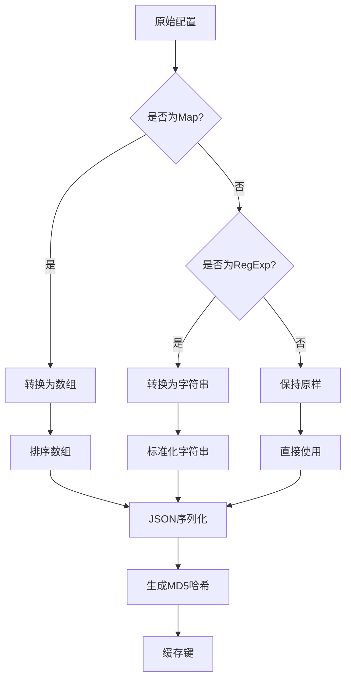
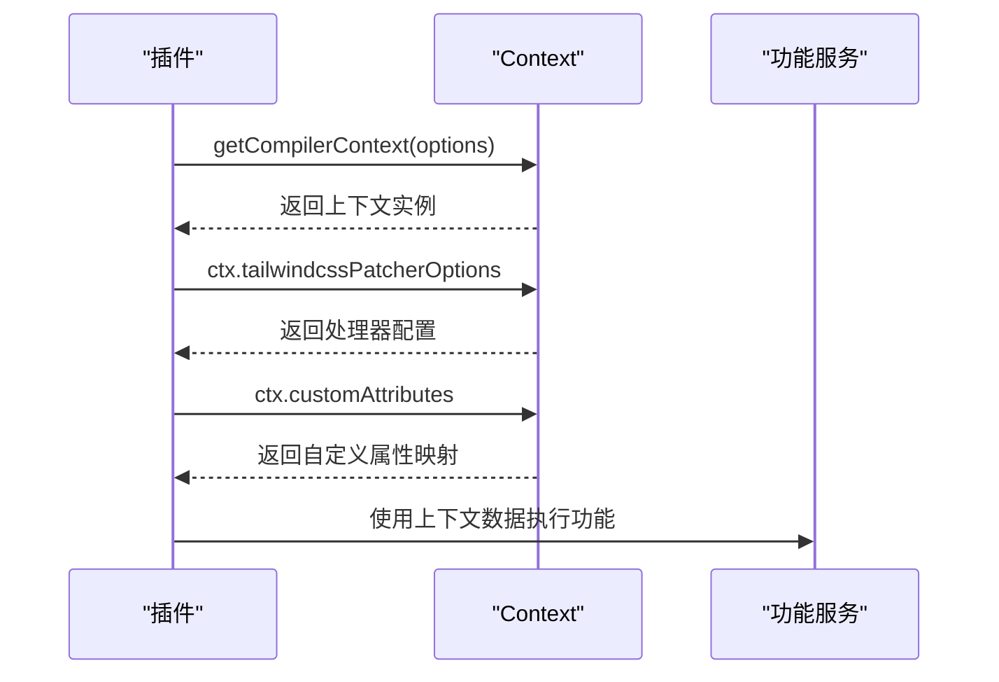
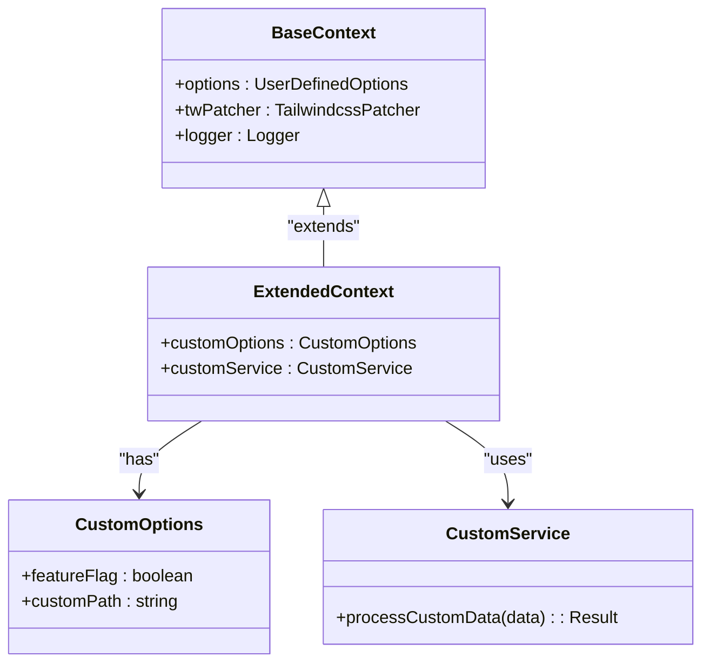

# 上下文系统

<cite>
**本文档中引用的文件**  
- [context.ts](file://packages/weapp-tailwindcss/src/cli/context.ts)
- [types.ts](file://packages/weapp-tailwindcss/src/cli/types.ts)
- [compiler-context-cache.ts](file://packages/weapp-tailwindcss/src/context/compiler-context-cache.ts)
- [index.ts](file://packages/weapp-tailwindcss/src/context/index.ts)
- [context-cache.test.ts](file://packages/weapp-tailwindcss/test/context-cache.test.ts)
</cite>

## 目录
1. [简介](#简介)
2. [上下文系统架构](#上下文系统架构)
3. [核心组件分析](#核心组件分析)
4. [上下文初始化流程](#上下文初始化流程)
5. [缓存机制](#缓存机制)
6. [构建阶段状态管理](#构建阶段状态管理)
7. [插件与工具中的上下文使用](#插件与工具中的上下文使用)
8. [扩展性设计](#扩展性设计)
9. [结论](#结论)

## 简介
weapp-tailwindcss 的上下文系统是整个构建流程的核心枢纽，负责管理项目的配置、状态和共享数据。该系统通过统一的 Context 对象协调不同构建阶段的行为，确保配置的一致性和性能优化。上下文系统整合了命令行参数、配置文件和默认值，为插件和工具提供统一的数据访问接口。

**Section sources**
- [context.ts](file://packages/weapp-tailwindcss/src/cli/context.ts#L1-L85)
- [index.ts](file://packages/weapp-tailwindcss/src/context/index.ts#L1-L20)

## 上下文系统架构
上下文系统采用分层架构设计，将配置解析、状态管理和功能实现分离。核心组件包括配置解析器、编译器上下文缓存、工作区管理器和日志处理器。系统通过依赖注入模式提供服务，确保组件间的松耦合。



**Diagram sources**
- [context.ts](file://packages/weapp-tailwindcss/src/cli/context.ts#L51-L72)
- [index.ts](file://packages/weapp-tailwindcss/src/context/index.ts#L1-L15)

## 核心组件分析

### 配置解析组件
配置解析组件负责整合来自不同来源的配置信息，包括命令行参数、配置文件和默认值。组件采用深度合并策略，确保配置的完整性和一致性。

```mermaid
classDiagram
class UserDefinedOptions {
+cssEntries : string[]
+tailwindcssBasedir : string
+tailwindcssPatcherOptions : TailwindcssPatchOptions
+customAttributes : Map<string | RegExp, (string | RegExp)[]>
}
class PartialUserDefinedOptions {
+cssEntries? : string[]
+tailwindcssBasedir? : string
+tailwindcssPatcherOptions? : Partial<TailwindcssPatchOptions>
}
class TailwindcssPatchOptions {
+cwd : string
+output : OutputOptions
}
class OutputOptions {
+file : string
+format : string
}
UserDefinedOptions <|-- PartialUserDefinedOptions : "extends"
TailwindcssPatchOptions --> OutputOptions : "contains"
```

**Diagram sources**
- [types.ts](file://packages/weapp-tailwindcss/src/cli/types.ts#L1-L50)
- [context.ts](file://packages/weapp-tailwindcss/src/cli/context.ts#L26-L49)

### 编译器上下文缓存
编译器上下文缓存是性能优化的关键组件，通过缓存已创建的上下文实例避免重复初始化。缓存机制基于配置选项的规范化键值进行匹配，确保相同配置返回相同的上下文实例。



**Diagram sources**
- [compiler-context-cache.ts](file://packages/weapp-tailwindcss/src/context/compiler-context-cache.ts#L1-L30)
- [context-cache.test.ts](file://packages/weapp-tailwindcss/test/context-cache.test.ts#L5-L17)

## 上下文初始化流程
上下文初始化过程从多个来源收集配置信息并构建完整的项目上下文。流程首先解析命令行参数和配置文件，然后与默认值合并，最后创建编译器上下文实例。



**Diagram sources**
- [context.ts](file://packages/weapp-tailwindcss/src/cli/context.ts#L51-L72)
- [config.ts](file://packages/weapp-tailwindcss/src/cli/config.ts#L1-L20)

**Section sources**
- [context.ts](file://packages/weapp-tailwindcss/src/cli/context.ts#L1-L85)
- [config.ts](file://packages/weapp-tailwindcss/src/cli/config.ts#L1-L30)

## 缓存机制
上下文系统的缓存机制显著提升了构建性能，特别是在开发模式下频繁重建的场景。缓存系统通过规范化配置选项生成唯一键值，确保相同配置返回相同的上下文实例。

### 缓存键生成策略
缓存键的生成考虑了配置选项的语义等价性而非字面等价性。例如，对象属性的顺序不影响缓存键的生成，正则表达式和Map对象也被正确序列化。



**Diagram sources**
- [compiler-context-cache.ts](file://packages/weapp-tailwindcss/src/context/compiler-context-cache.ts#L15-L40)
- [context-cache.test.ts](file://packages/weapp-tailwindcss/test/context-cache.test.ts#L30-L43)

**Section sources**
- [compiler-context-cache.ts](file://packages/weapp-tailwindcss/src/context/compiler-context-cache.ts#L1-L50)
- [context-cache.test.ts](file://packages/weapp-tailwindcss/test/context-cache.test.ts#L1-L45)

## 构建阶段状态管理
上下文系统在不同构建阶段（开发、生产）中维护不同的状态配置。通过环境感知的配置策略，系统自动调整行为以适应当前构建目标。

### 开发与生产模式差异
| 配置项 | 开发模式 | 生产模式 |
|-------|---------|---------|
| 源码映射 | 启用 | 启用 |
| 代码压缩 | 禁用 | 启用 |
| 缓存策略 | 强缓存 | 弱缓存 |
| 错误处理 | 详细错误 | 简化错误 |
| 日志级别 | 详细 | 错误 |

**Section sources**
- [context.ts](file://packages/weapp-tailwindcss/src/cli/context.ts#L51-L72)
- [types.ts](file://packages/weapp-tailwindcss/src/cli/types.ts#L20-L40)

## 插件与工具中的上下文使用
插件和工具通过上下文对象访问共享数据和配置信息。系统提供统一的API接口，确保各组件能够安全地读取和操作上下文数据。

### 访问上下文数据示例


**Diagram sources**
- [context.ts](file://packages/weapp-tailwindcss/src/cli/context.ts#L71)
- [index.ts](file://packages/weapp-tailwindcss/src/context/index.ts#L10-L25)

## 扩展性设计
上下文系统设计考虑了良好的扩展性，允许安全地添加自定义属性和功能。通过类型安全的扩展机制，开发者可以为特定项目需求定制上下文功能。

### 扩展模式


**Diagram sources**
- [types.ts](file://packages/weapp-tailwindcss/src/cli/types.ts#L1-L20)
- [context.ts](file://packages/weapp-tailwindcss/src/cli/context.ts#L55-L57)

## 结论
weapp-tailwindcss的上下文系统通过精心设计的架构实现了配置管理、状态维护和性能优化的统一。系统的核心优势在于其缓存机制和灵活的配置合并策略，这些特性共同确保了构建过程的高效性和可靠性。通过类型安全的扩展机制，系统既保持了核心稳定性，又提供了足够的灵活性以适应不同的项目需求。