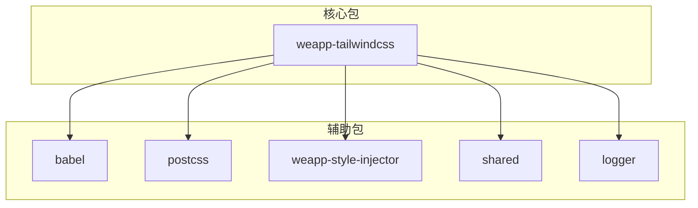
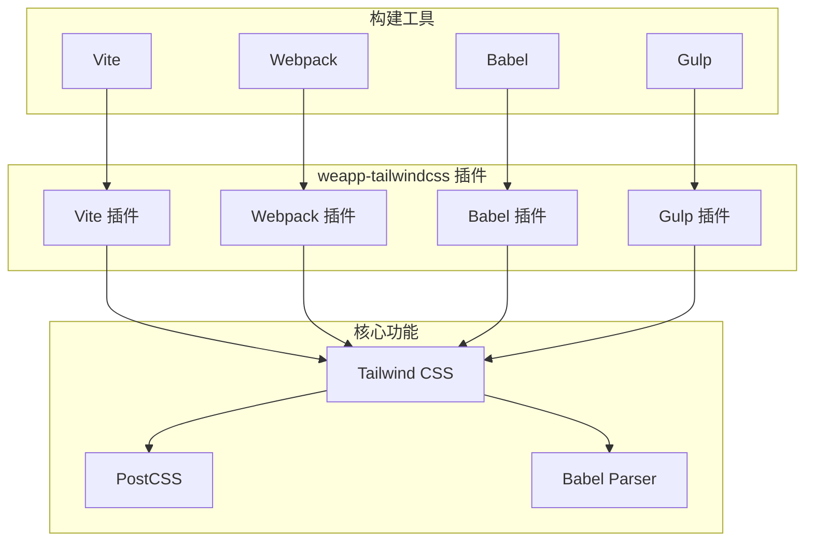
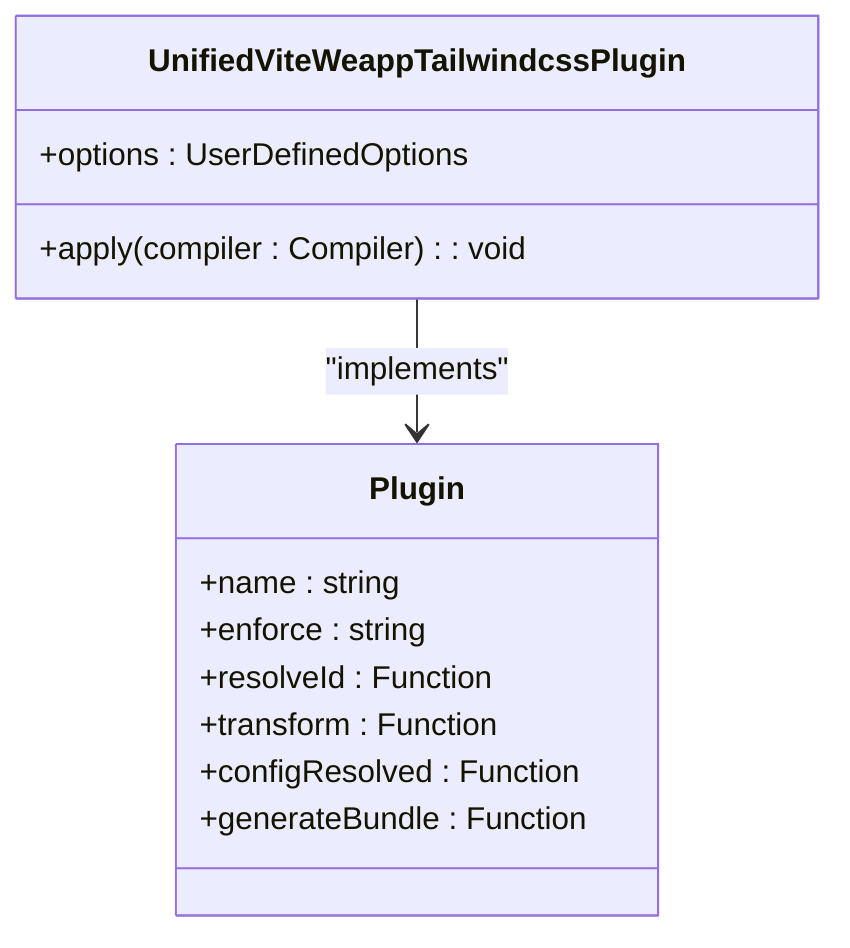
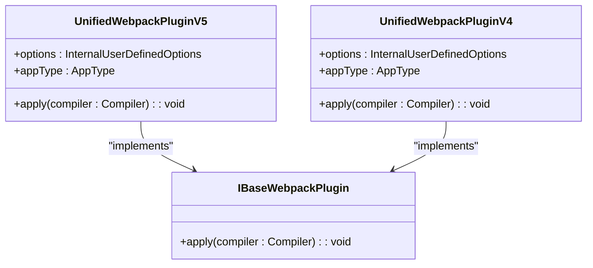

# 插件架构

<cite>
**本文档中引用的文件**  
- [weapp-tailwindcss/package.json](file://packages/weapp-tailwindcss/package.json)
- [weapp-tailwindcss/src/index.ts](file://packages/weapp-tailwindcss/src/index.ts)
- [weapp-tailwindcss/src/vite.ts](file://packages/weapp-tailwindcss/src/vite.ts)
- [weapp-tailwindcss/src/webpack.ts](file://packages/weapp-tailwindcss/src/webpack.ts)
- [weapp-tailwindcss/src/bundlers/vite/index.ts](file://packages/weapp-tailwindcss/src/bundlers/vite/index.ts)
- [weapp-tailwindcss/src/bundlers/webpack/index.ts](file://packages/weapp-tailwindcss/src/bundlers/webpack/index.ts)
- [weapp-tailwindcss/src/bundlers/webpack/BaseUnifiedPlugin/v5.ts](file://packages/weapp-tailwindcss/src/bundlers/webpack/BaseUnifiedPlugin/v5.ts)
- [weapp-tailwindcss/src/bundlers/webpack/BaseUnifiedPlugin/v4.ts](file://packages/weapp-tailwindcss/src/bundlers/webpack/BaseUnifiedPlugin/v4.ts)
- [weapp-tailwindcss/src/bundlers/webpack/loaders/weapp-tw-css-import-rewrite-loader.ts](file://packages/weapp-tailwindcss/src/bundlers/webpack/loaders/weapp-tw-css-import-rewrite-loader.ts)
- [weapp-tailwindcss/src/bundlers/webpack/loaders/weapp-tw-runtime-classset-loader.ts](file://packages/weapp-tailwindcss/src/bundlers/webpack/loaders/weapp-tw-runtime-classset-loader.ts)
- [weapp-tailwindcss/src/context/index.ts](file://packages/weapp-tailwindcss/src/context/index.ts)
- [postcss/src/index.ts](file://packages/postcss/src/index.ts)
- [babel/src/babel.ts](file://packages/babel/src/babel.ts)
</cite>

## 目录
1. [引言](#引言)
2. [项目结构](#项目结构)
3. [核心组件](#核心组件)
4. [架构概述](#架构概述)
5. [详细组件分析](#详细组件分析)
6. [依赖分析](#依赖分析)
7. [性能考虑](#性能考虑)
8. [故障排除指南](#故障排除指南)
9. [结论](#结论)

## 引言

weapp-tailwindcss 是一个为小程序开发者提供 Tailwind CSS 原子化样式能力的工具。它通过插件机制支持多种构建工具和框架，如 Vite、Webpack、Babel 等。本文档将深入探讨其插件系统的设计原理、核心插件的结构和生命周期、自定义插件的开发方法、插件注册与执行、插件间的依赖关系和执行顺序、插件 API 的设计原则和稳定性保证，以及最佳实践。

## 项目结构

weapp-tailwindcss 项目采用 monorepo 结构，包含多个包，每个包负责不同的功能。核心包是 `weapp-tailwindcss`，它提供了主要的插件功能。其他包如 `babel`、`postcss`、`weapp-style-injector` 等提供了辅助功能。



**图源**
- [weapp-tailwindcss/package.json](file://packages/weapp-tailwindcss/package.json)

**本节源**
- [weapp-tailwindcss/package.json](file://packages/weapp-tailwindcss/package.json)

## 核心组件

weapp-tailwindcss 的核心组件包括 Vite 插件、Webpack 插件、Babel 插件和 PostCSS 插件。这些插件通过统一的 API 和配置选项，为不同的构建工具提供 Tailwind CSS 支持。

**本节源**
- [weapp-tailwindcss/src/index.ts](file://packages/weapp-tailwindcss/src/index.ts)
- [weapp-tailwindcss/src/vite.ts](file://packages/weapp-tailwindcss/src/vite.ts)
- [weapp-tailwindcss/src/webpack.ts](file://packages/weapp-tailwindcss/src/webpack.ts)

## 架构概述

weapp-tailwindcss 的架构设计旨在提供灵活、可扩展的插件系统。核心思想是通过插件机制，将 Tailwind CSS 的功能集成到不同的构建工具中。每个插件负责处理特定的构建工具，如 Vite、Webpack 等，并通过统一的 API 和配置选项进行通信。



**图源**
- [weapp-tailwindcss/src/index.ts](file://packages/weapp-tailwindcss/src/index.ts)
- [weapp-tailwindcss/src/vite.ts](file://packages/weapp-tailwindcss/src/vite.ts)
- [weapp-tailwindcss/src/webpack.ts](file://packages/weapp-tailwindcss/src/webpack.ts)

## 详细组件分析

### Vite 插件分析

Vite 插件是 weapp-tailwindcss 的核心组件之一，负责在 Vite 构建过程中集成 Tailwind CSS 功能。它通过 Vite 的插件 API，在构建的不同阶段处理 CSS、JavaScript 和 HTML 文件。

#### Vite 插件实现


**图源**
- [weapp-tailwindcss/src/bundlers/vite/index.ts](file://packages/weapp-tailwindcss/src/bundlers/vite/index.ts)

### Webpack 插件分析

Webpack 插件是 weapp-tailwindcss 的另一个核心组件，负责在 Webpack 构建过程中集成 Tailwind CSS 功能。它通过 Webpack 的插件 API，在构建的不同阶段处理 CSS、JavaScript 和 HTML 文件。

#### Webpack 插件实现


**图源**
- [weapp-tailwindcss/src/bundlers/webpack/BaseUnifiedPlugin/v5.ts](file://packages/weapp-tailwindcss/src/bundlers/webpack/BaseUnifiedPlugin/v5.ts)
- [weapp-tailwindcss/src/bundlers/webpack/BaseUnifiedPlugin/v4.ts](file://packages/weapp-tailwindcss/src/bundlers/webpack/BaseUnifiedPlugin/v4.ts)

### Babel 插件分析

Babel 插件是 weapp-tailwindcss 的辅助组件，负责在 Babel 转译过程中处理 Tailwind CSS 类名。它通过 Babel 的插件 API，在转译的不同阶段处理 JavaScript 文件。

#### Babel 插件实现
```mermaid
classDiagram
class BabelPlugin {
+parse : Function
+parseExpression : Function
+traverse : Function
}
BabelPlugin --> "@babel/parser" : "uses"
BabelPlugin --> "@babel/traverse" : "uses"
```

**图源**
- [babel/src/babel.ts](file://packages/babel/src/babel.ts)

### PostCSS 插件分析

PostCSS 插件是 weapp-tailwindcss 的辅助组件，负责在 PostCSS 处理过程中集成 Tailwind CSS 功能。它通过 PostCSS 的插件 API，在处理 CSS 文件的不同阶段进行转换。

#### PostCSS 插件实现
```mermaid
classDiagram
class PostCSSPlugin {
+handler : Function
+createStylePipeline : Function
+createInjectPreflight : Function
+internalCssSelectorReplacer : Function
}
PostCSSPlugin --> "PostCSS" : "uses"
```

**图源**
- [postcss/src/index.ts](file://packages/postcss/src/index.ts)

**本节源**
- [weapp-tailwindcss/src/bundlers/vite/index.ts](file://packages/weapp-tailwindcss/src/bundlers/vite/index.ts)
- [weapp-tailwindcss/src/bundlers/webpack/BaseUnifiedPlugin/v5.ts](file://packages/weapp-tailwindcss/src/bundlers/webpack/BaseUnifiedPlugin/v5.ts)
- [weapp-tailwindcss/src/bundlers/webpack/BaseUnifiedPlugin/v4.ts](file://packages/weapp-tailwindcss/src/bundlers/webpack/BaseUnifiedPlugin/v4.ts)
- [babel/src/babel.ts](file://packages/babel/src/babel.ts)
- [postcss/src/index.ts](file://packages/postcss/src/index.ts)

## 依赖分析

weapp-tailwindcss 的依赖关系复杂，涉及多个包和外部库。核心包 `weapp-tailwindcss` 依赖于 `babel`、`postcss`、`weapp-style-injector` 等辅助包，以及外部库如 `@babel/parser`、`@babel/traverse`、`tailwindcss-patch` 等。

```mermaid
graph TB
weapp-tailwindcss["weapp-tailwindcss"] --> babel["babel"]
weapp-tailwindcss --> postcss["postcss"]
weapp-tailwindcss --> weapp-style-injector["weapp-style-injector"]
weapp-tailwindcss --> shared["shared"]
weapp-tailwindcss --> logger["logger"]
babel --> "@babel/parser"
babel --> "@babel/traverse"
postcss --> "postcss"
weapp-tailwindcss --> "tailwindcss-patch"
weapp-tailwindcss --> "webpack-sources"
```

**图源**
- [weapp-tailwindcss/package.json](file://packages/weapp-tailwindcss/package.json)

**本节源**
- [weapp-tailwindcss/package.json](file://packages/weapp-tailwindcss/package.json)

## 性能考虑

weapp-tailwindcss 在设计时考虑了性能优化。通过缓存机制、并行任务处理和高效的文件处理，确保在大型项目中也能保持良好的构建性能。此外，插件的按需加载和懒初始化也减少了启动时间。

## 故障排除指南

在使用 weapp-tailwindcss 时，可能会遇到一些常见问题。以下是一些故障排除建议：

- **插件未生效**：检查插件是否正确注册，配置选项是否正确。
- **样式未正确应用**：检查 CSS 文件是否被正确处理，PostCSS 插件是否正确配置。
- **构建性能问题**：检查缓存是否启用，任务是否并行处理。

**本节源**
- [weapp-tailwindcss/src/context/index.ts](file://packages/weapp-tailwindcss/src/context/index.ts)

## 结论

weapp-tailwindcss 通过灵活的插件机制，成功地将 Tailwind CSS 的功能集成到多种构建工具和框架中。其设计原理、核心组件、插件 API 和最佳实践为开发者提供了强大的工具，使他们能够更高效地开发小程序。通过深入理解其架构和实现，开发者可以更好地利用这一工具，提升开发效率和代码质量。