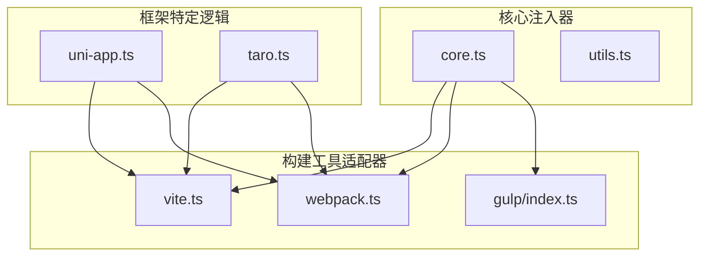
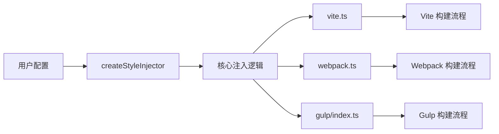
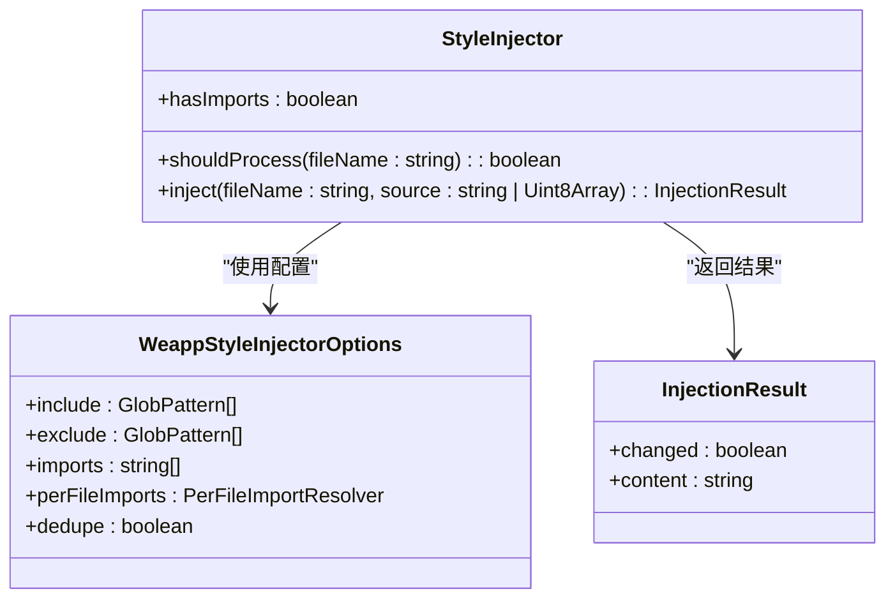
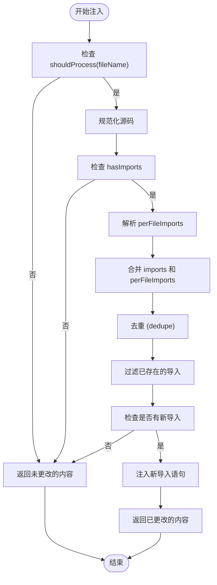
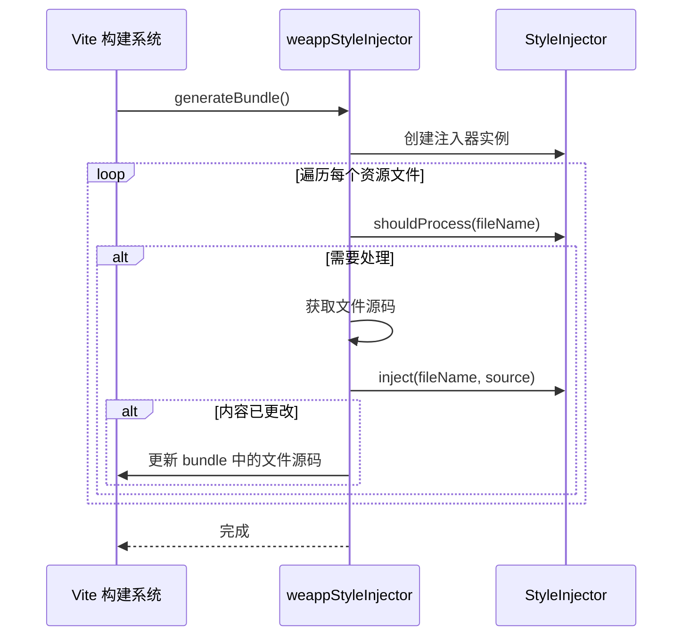
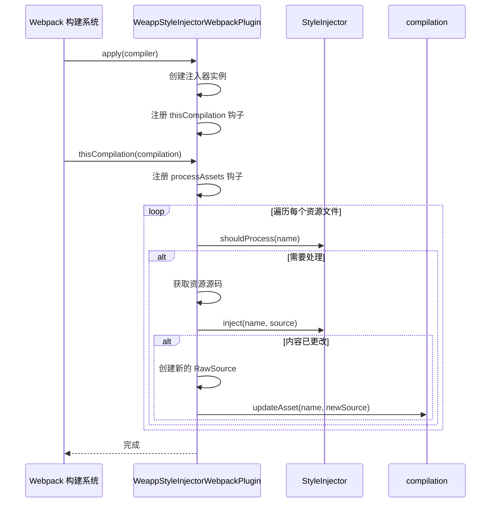
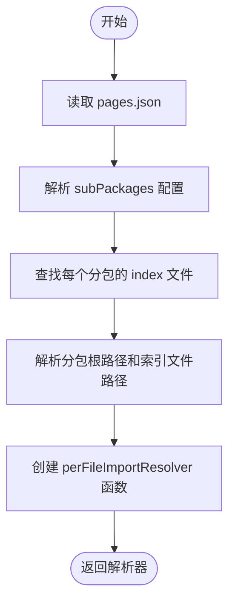

# 样式注入

<cite>
**本文档引用的文件**
- [index.ts](file://packages/weapp-style-injector/src/index.ts)
- [core.ts](file://packages/weapp-style-injector/src/core.ts)
- [vite.ts](file://packages/weapp-style-injector/src/vite.ts)
- [webpack.ts](file://packages/weapp-style-injector/src/webpack.ts)
- [uni-app.ts](file://packages/weapp-style-injector/src/uni-app.ts)
- [utils.ts](file://packages/weapp-style-injector/src/utils.ts)
- [index.ts](file://packages/weapp-tailwindcss/src/bundlers/gulp/index.ts)
</cite>

## 目录
1. [简介](#简介)
2. [项目结构](#项目结构)
3. [核心组件](#核心组件)
4. [架构概述](#架构概述)
5. [详细组件分析](#详细组件分析)
6. [依赖分析](#依赖分析)
7. [性能考虑](#性能考虑)
8. [故障排除指南](#故障排除指南)
9. [结论](#结论)

## 简介
本文档详细阐述了 `weapp-tailwindcss` 项目中样式注入机制的实现原理。重点分析 `weapp-style-injector` 模块如何将生成的 CSS 样式安全、高效地注入到微信小程序（WeApp）环境中。文档将解释其在不同构建工具（如 Vite 和 Webpack）下的注入策略与实现差异，说明如何处理样式隔离和作用域问题以避免冲突，并描述注入过程中的错误处理和回退机制。此外，还将讨论性能影响和优化技巧，以及如何通过配置自定义注入行为。

## 项目结构
`weapp-tailwindcss` 是一个用于在小程序中集成 Tailwind CSS 的工具链。其样式注入功能主要由 `packages/weapp-style-injector` 包实现，该包为不同的构建系统（Vite、Webpack、Gulp）提供了统一的样式注入接口。



**图示来源**
- [core.ts](file://packages/weapp-style-injector/src/core.ts)
- [vite.ts](file://packages/weapp-style-injector/src/vite.ts)
- [webpack.ts](file://packages/weapp-style-injector/src/webpack.ts)
- [uni-app.ts](file://packages/weapp-style-injector/src/uni-app.ts)
- [index.ts](file://packages/weapp-tailwindcss/src/bundlers/gulp/index.ts)

**本节来源**
- [core.ts](file://packages/weapp-style-injector/src/core.ts)
- [vite.ts](file://packages/weapp-style-injector/src/vite.ts)
- [webpack.ts](file://packages/weapp-style-injector/src/webpack.ts)

## 核心组件
`weapp-style-injector` 的核心功能由 `core.ts` 文件中的 `createStyleInjector` 函数提供。该函数根据配置选项创建一个 `StyleInjector` 实例，该实例负责判断文件是否需要处理，并执行实际的样式注入逻辑。注入器通过在目标样式文件（如 `.wxss` 或 `.css`）的开头添加 `@import` 语句来引入 Tailwind CSS 生成的全局样式。

**本节来源**
- [core.ts](file://packages/weapp-style-injector/src/core.ts)

## 架构概述
样式注入机制的总体架构围绕一个核心注入器和多个构建工具适配器展开。核心注入器负责定义通用的注入逻辑和配置，而适配器则负责将此逻辑集成到特定的构建流程中。



**图示来源**
- [core.ts](file://packages/weapp-style-injector/src/core.ts)
- [vite.ts](file://packages/weapp-style-injector/src/vite.ts)
- [webpack.ts](file://packages/weapp-style-injector/src/webpack.ts)
- [index.ts](file://packages/weapp-tailwindcss/src/bundlers/gulp/index.ts)

## 详细组件分析

### 核心注入逻辑分析
`createStyleInjector` 函数是整个机制的核心。它接收 `WeappStyleInjectorOptions` 配置，创建一个包含 `shouldProcess` 和 `inject` 方法的 `StyleInjector` 对象。

#### 核心类图


**图示来源**
- [core.ts](file://packages/weapp-style-injector/src/core.ts)

#### 注入流程分析
注入过程遵循一个清晰的流程：首先判断文件是否匹配包含/排除模式，然后检查是否需要注入新的 `@import` 语句，最后将新的导入语句添加到文件内容的开头。



**图示来源**
- [core.ts](file://packages/weapp-style-injector/src/core.ts)

**本节来源**
- [core.ts](file://packages/weapp-style-injector/src/core.ts)

### Vite 构建工具适配分析
Vite 适配器通过实现 Vite 插件接口，在构建的 `generateBundle` 阶段对生成的资源文件进行处理。它利用核心注入器来判断和修改 `.wxss` 或 `.css` 文件。

#### Vite 插件流程


**图示来源**
- [vite.ts](file://packages/weapp-style-injector/src/vite.ts)
- [core.ts](file://packages/weapp-style-injector/src/core.ts)

**本节来源**
- [vite.ts](file://packages/weapp-style-injector/src/vite.ts)

### Webpack 构建工具适配分析
Webpack 适配器通过实现 Webpack 插件接口，在 `thisCompilation` 钩子中注册 `processAssets` 钩子来处理编译后的资源。它兼容 Webpack 4 和 Webpack 5 的 API。

#### Webpack 插件流程


**图示来源**
- [webpack.ts](file://packages/weapp-style-injector/src/webpack.ts)
- [core.ts](file://packages/weapp-style-injector/src/core.ts)

**本节来源**
- [webpack.ts](file://packages/weapp-style-injector/src/webpack.ts)

### UniApp 框架特定逻辑分析
`uni-app.ts` 文件提供了针对 UniApp 框架的特殊逻辑，特别是处理分包（sub-packages）和手动样式作用域（manual style scopes）的导入解析器。

#### UniApp 分包导入解析流程


**图示来源**
- [uni-app.ts](file://packages/weapp-style-injector/src/uni-app.ts)

**本节来源**
- [uni-app.ts](file://packages/weapp-style-injector/src/uni-app.ts)

## 依赖分析
`weapp-style-injector` 包的依赖关系清晰，核心逻辑独立，通过适配器模式与外部构建系统解耦。

```mermaid
graph TD
micromatch[micromatch] --> core[core.ts]
core --> vite[vite.ts]
core --> webpack[webpack.ts]
core --> utils[utils.ts]
utils --> core
utils --> uniapp[uni-app.ts]
uniapp --> core
webpack --> webpack_sources[webpack.sources] : "可选"
vite --> vite_plugin[Vite Plugin API]
```

**图示来源**
- [core.ts](file://packages/weapp-style-injector/src/core.ts)
- [vite.ts](file://packages/weapp-style-injector/src/vite.ts)
- [webpack.ts](file://packages/weapp-style-injector/src/webpack.ts)
- [uni-app.ts](file://packages/weapp-style-injector/src/uni-app.ts)
- [utils.ts](file://packages/weapp-style-injector/src/utils.ts)

**本节来源**
- [core.ts](file://packages/weapp-style-injector/src/core.ts)
- [vite.ts](file://packages/weapp-style-injector/src/vite.ts)
- [webpack.ts](file://packages/weapp-style-injector/src/webpack.ts)
- [uni-app.ts](file://packages/weapp-style-injector/src/uni-app.ts)
- [utils.ts](file://packages/weapp-style-injector/src/utils.ts)

## 性能考虑
样式注入机制在设计上考虑了性能：
1.  **缓存机制**：`perFileImports` 的解析结果会被缓存，避免重复计算。
2.  **惰性处理**：只有在构建阶段才会执行注入操作，不影响开发服务器的启动速度。
3.  **高效匹配**：使用 `micromatch` 库进行高效的文件路径模式匹配。
4.  **去重优化**：通过 `dedupe` 选项避免重复注入相同的样式文件。
5.  **按需注入**：通过 `include` 和 `exclude` 选项精确控制哪些文件需要被处理。

## 故障排除指南
在使用样式注入功能时，可能遇到以下问题：

**问题：样式未生效**
- **检查**：确认 `weapp-style-injector` 插件已正确配置并加载。
- **检查**：确认目标文件（如 `.wxss`）的路径匹配 `include` 模式。
- **检查**：确认生成的全局样式文件（如 `weapp-tw.wxss`）路径正确且可被 `@import`。

**问题：出现重复的 `@import` 语句**
- **检查**：确保 `dedupe` 选项为 `true`（默认值）。
- **检查**：确认没有在多个地方重复配置相同的 `imports`。

**问题：UniApp 分包样式未正确注入**
- **检查**：确认 `uniAppSubPackages` 配置中的 `pagesJsonPath` 路径正确。
- **检查**：确认分包目录下存在 `index.wxss` 或 `index.css` 文件。

**问题：构建时报错找不到文件**
- **检查**：检查 `imports` 或 `uniAppSubPackages` 中配置的文件路径是否相对于项目根目录正确。

**本节来源**
- [core.ts](file://packages/weapp-style-injector/src/core.ts)
- [vite.ts](file://packages/weapp-style-injector/src/vite.ts)
- [webpack.ts](file://packages/weapp-style-injector/src/webpack.ts)
- [uni-app.ts](file://packages/weapp-style-injector/src/uni-app.ts)

## 结论
`weapp-style-injector` 模块为 `weapp-tailwindcss` 提供了一个强大、灵活且高效的样式注入解决方案。它通过一个清晰的核心逻辑和针对不同构建工具的适配器，实现了跨平台的兼容性。其设计充分考虑了性能、可配置性和错误处理，能够安全地将 Tailwind CSS 生成的样式注入到小程序的构建流程中。通过 `include`/`exclude` 模式、`perFileImports` 解析器以及对 UniApp 等框架的特殊支持，开发者可以精确控制注入行为，确保样式正确加载且不发生冲突。