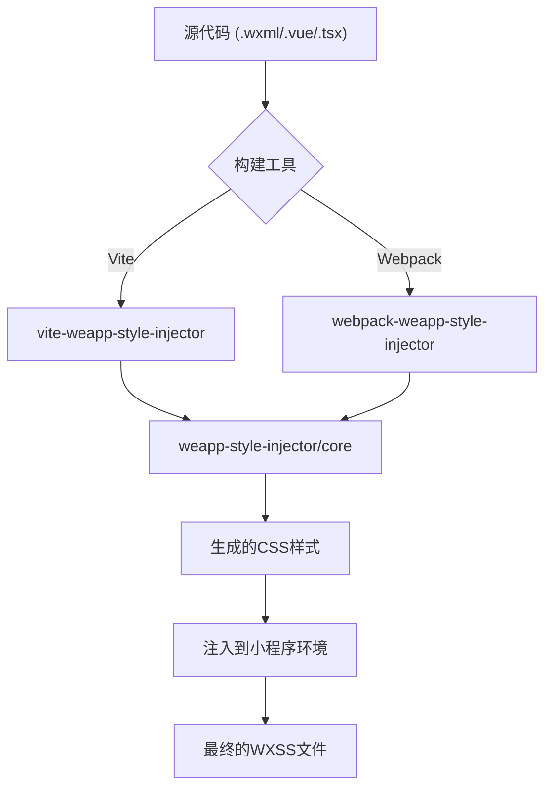
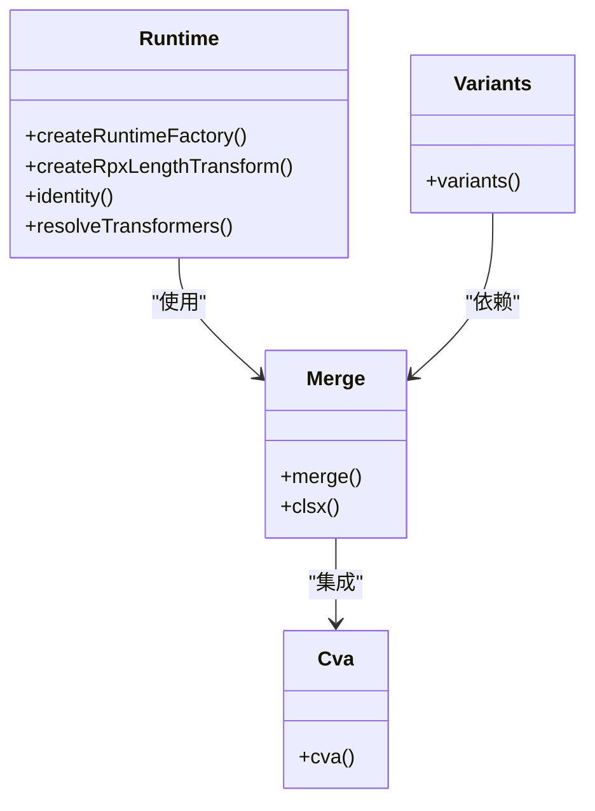
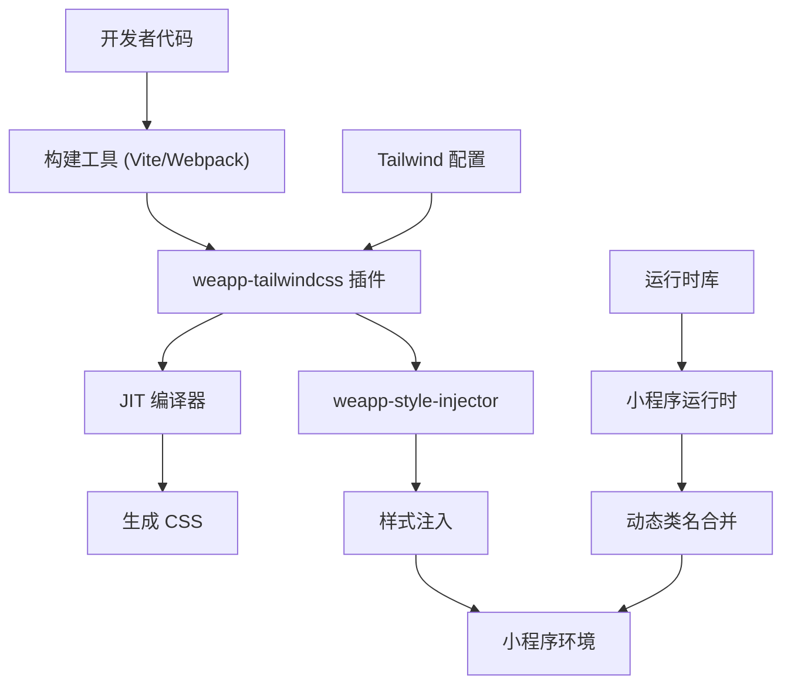

# 核心概念

<cite>
**本文档中引用的文件**  
- [index.ts](file://packages/weapp-tailwindcss/src/index.ts)
- [weapp-style-injector/src/index.ts](file://packages/weapp-style-injector/src/index.ts)
- [runtime/src/index.ts](file://packages-runtime/runtime/src/index.ts)
- [create-runtime.ts](file://packages-runtime/runtime/src/create-runtime.ts)
- [vite.ts](file://packages/weapp-tailwindcss/src/vite.ts)
- [webpack.ts](file://packages/weapp-tailwindcss/src/webpack.ts)
- [core.ts](file://packages/weapp-style-injector/src/core.ts)
- [taro.ts](file://packages/weapp-style-injector/src/taro.ts)
- [uni-app.ts](file://packages/weapp-style-injector/src/uni-app.ts)
</cite>

## 目录
1. [简介](#简介)
2. [JIT编译机制](#jit编译机制)
3. [样式注入机制](#样式注入机制)
4. [类名解析与处理流程](#类名解析与处理流程)
5. [上下文系统](#上下文系统)
6. [运行时库](#运行时库)
7. [插件架构](#插件架构)
8. [组件交互与数据流](#组件交互与数据流)

## 简介
weapp-tailwindcss 是一个专为微信小程序及其他类小程序环境设计的 Tailwind CSS 集成解决方案。它通过 JIT（即时）编译、动态样式注入、类名解析和运行时合并等机制，实现了在小程序环境中高效使用 Tailwind CSS 的能力。本文档深入解析其核心概念与内部工作原理。

## JIT编译机制

weapp-tailwindcss 采用 JIT（Just-In-Time）编译模式，在开发过程中动态生成所需的 CSS 样式。与传统的全量构建不同，JIT 模式仅在检测到源代码中使用了特定的 Tailwind 类名时，才生成对应的 CSS 规则。这种按需生成的方式显著减少了最终样式文件的体积，并提升了开发时的构建性能。

该机制通过监听项目文件的变化，实时分析模板中的类名使用情况，并调用 Tailwind CSS 的核心引擎生成精确的样式规则。生成的 CSS 被直接注入到小程序的样式系统中，确保开发过程中样式能够即时生效。

**Section sources**
- [vite.ts](file://packages/weapp-tailwindcss/src/vite.ts)
- [webpack.ts](file://packages/weapp-tailwindcss/src/webpack.ts)

## 样式注入机制

weapp-style-injector 是负责将生成的 CSS 样式安全注入到小程序环境的核心模块。它通过 Vite 或 Webpack 插件的形式集成到构建流程中，在编译阶段将动态生成的样式代码插入到适当的位置。

注入过程确保了生成的样式不会与小程序原有的 WXSS 文件产生冲突，并且能够正确地作用于对应的 WXML 元素。该模块提供了多种配置选项，支持对不同小程序框架（如 Taro、UniApp）的子包进行样式注入，并能处理复杂的路径解析和依赖关系。

**Diagram sources**
- [weapp-style-injector/src/index.ts](file://packages/weapp-style-injector/src/index.ts)
- [weapp-style-injector/src/core.ts](file://packages/weapp-style-injector/src/core.ts)
- [weapp-style-injector/src/vite.ts](file://packages/weapp-style-injector/src/vite.ts)
- [weapp-style-injector/src/webpack.ts](file://packages/weapp-style-injector/src/webpack.ts)

**Section sources**
- [weapp-style-injector/src/index.ts](file://packages/weapp-style-injector/src/index.ts)
- [weapp-style-injector/src/core.ts](file://packages/weapp-style-injector/src/core.ts)

## 类名解析与处理流程

从源代码中的 Tailwind 类名到最终生成的 WXML 和 WXSS，经历了一个复杂的解析和处理流程。首先，构建工具会扫描所有模板文件，提取出所有的类名字符串。然后，weapp-tailwindcss 会分析这些类名，识别出哪些是 Tailwind 的实用类（utility classes）。

对于识别出的 Tailwind 类名，系统会触发 JIT 编译流程，生成对应的 CSS 规则。同时，原始的类名会被保留并直接输出到 WXML 文件中。在运行时，通过 `tailwind-merge` 等工具库，可以对这些类名进行智能合并和冲突解决，确保最终应用的样式是正确且最优的。

**Section sources**
- [weapp-tailwindcss/src/index.ts](file://packages/weapp-tailwindcss/src/index.ts)
- [weapp-style-injector/src/index.ts](file://packages/weapp-style-injector/src/index.ts)

## 上下文系统

上下文（Context）系统是 weapp-tailwindcss 用来管理项目配置和状态的核心机制。它贯穿于整个构建流程，存储了诸如项目根目录、配置文件路径、目标小程序框架类型、子包配置等关键信息。

这个上下文对象在各个插件和处理器之间传递，确保了配置的一致性和状态的同步。例如，`weapp-style-injector` 在执行样式注入时，会依赖上下文中的路径信息来确定正确的注入位置；而 JIT 编译器则会使用上下文中的配置来决定生成样式的具体行为。

**Section sources**
- [weapp-tailwindcss/src/types.ts](file://packages/weapp-tailwindcss/src/types.ts)
- [weapp-style-injector/src/core.ts](file://packages/weapp-style-injector/src/core.ts)

## 运行时库

运行时（Runtime）库提供了一系列在小程序运行时使用的实用函数，是 weapp-tailwindcss 功能的重要组成部分。核心功能包括：

- **cva**: 用于创建可变的类名组合，支持基于条件动态生成样式。
- **merge**: 基于 `tailwind-merge` 库，用于智能合并多个类名字符串，自动解决样式冲突，确保后定义的样式优先级更高。
- **variants**: 支持创建具有不同状态变体的样式组合。

这些函数通过 `packages-runtime` 目录下的独立包提供，可以在小程序的 JavaScript/TypeScript 代码中直接导入使用，极大地增强了样式的灵活性和可维护性。

**Diagram sources**
- [runtime/src/index.ts](file://packages-runtime/runtime/src/index.ts)
- [cva/src/index.ts](file://packages-runtime/cva/src/index.ts)
- [merge/src/index.ts](file://packages-runtime/merge/src/index.ts)
- [variants/src/index.ts](file://packages-runtime/variants/src/index.ts)

**Section sources**
- [runtime/src/index.ts](file://packages-runtime/runtime/src/index.ts)
- [runtime/src/create-runtime.ts](file://packages-runtime/runtime/src/create-runtime.ts)

## 插件架构

weapp-tailwindcss 采用了灵活的插件架构，允许通过插件扩展其核心功能。主要插件包括：

- **Vite 插件**: 为使用 Vite 构建的小程序项目提供集成支持。
- **Webpack 插件**: 为使用 Webpack 构建的项目（如 Taro）提供支持。
- **框架特定插件**: 针对 Taro 和 UniApp 等框架提供了专门的导入解析器和配置处理逻辑。

这种架构使得 weapp-tailwindcss 能够适应多种不同的构建环境和项目结构，通过插件机制轻松集成到现有的开发流程中。

**Section sources**
- [weapp-tailwindcss/src/vite.ts](file://packages/weapp-tailwindcss/src/vite.ts)
- [weapp-tailwindcss/src/webpack.ts](file://packages/weapp-tailwindcss/src/webpack.ts)
- [weapp-style-injector/src/taro.ts](file://packages/weapp-style-injector/src/taro.ts)
- [weapp-style-injector/src/uni-app.ts](file://packages/weapp-style-injector/src/uni-app.ts)

## 组件交互与数据流

**Diagram sources**
- [weapp-tailwindcss/src/index.ts](file://packages/weapp-tailwindcss/src/index.ts)
- [weapp-style-injector/src/index.ts](file://packages/weapp-style-injector/src/index.ts)
- [runtime/src/index.ts](file://packages-runtime/runtime/src/index.ts)

**Section sources**
- [weapp-tailwindcss/src/index.ts](file://packages/weapp-tailwindcss/src/index.ts)
- [weapp-style-injector/src/index.ts](file://packages/weapp-style-injector/src/index.ts)
- [runtime/src/index.ts](file://packages-runtime/runtime/src/index.ts)