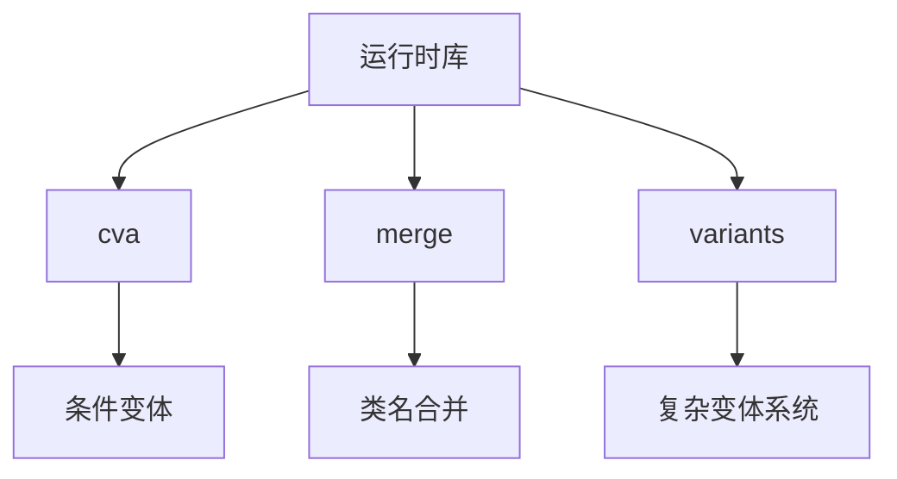
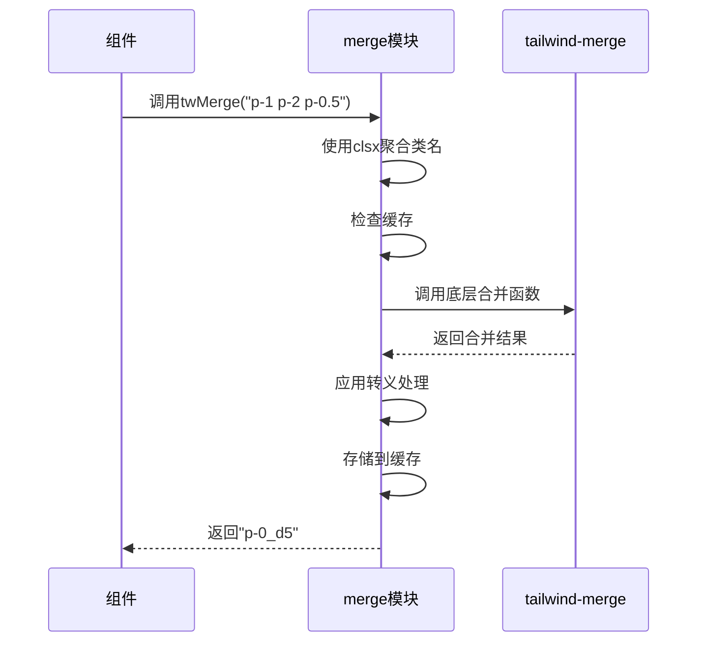
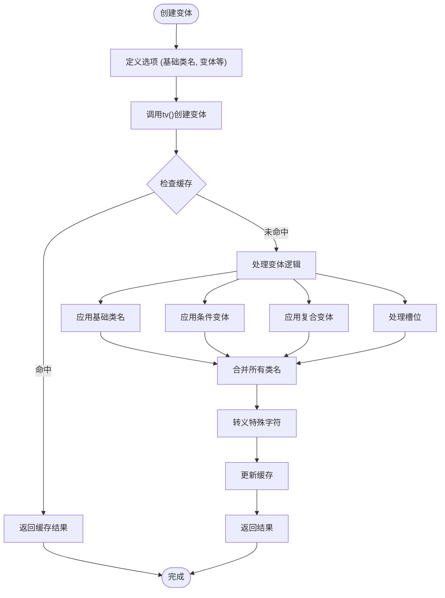
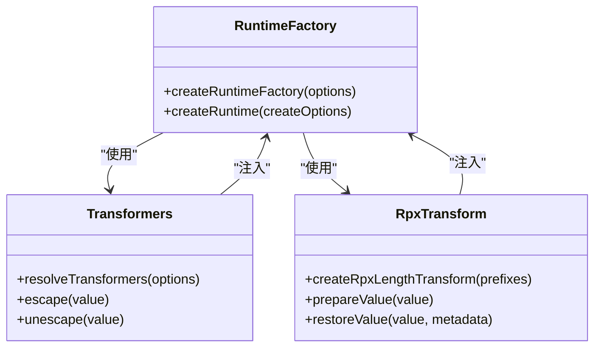
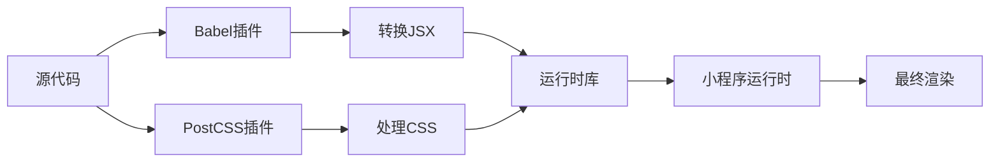
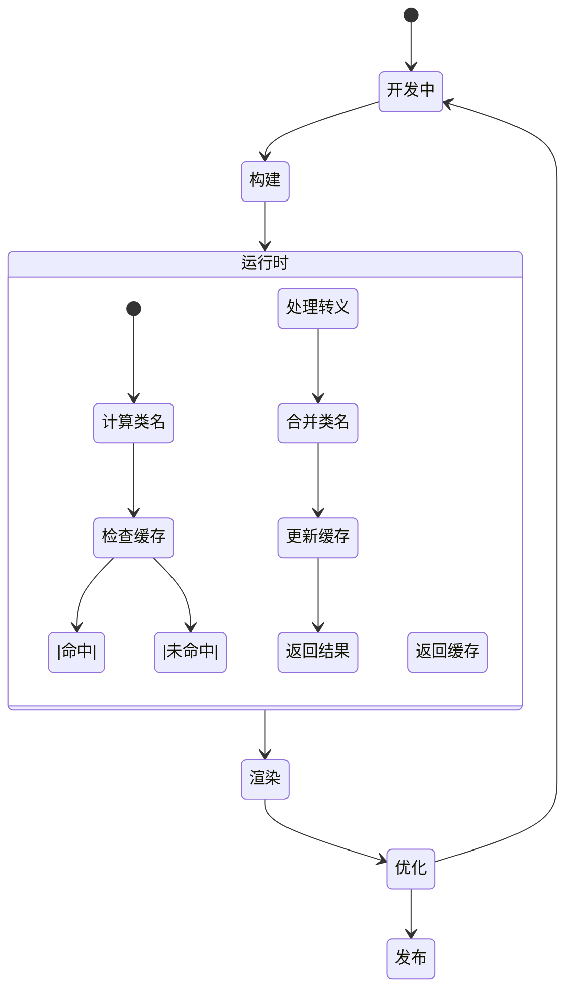

# 运行时库

<cite>
**本文档中引用的文件**  
- [runtime/src/index.ts](file://packages-runtime/runtime/src/index.ts)
- [runtime/src/create-runtime.ts](file://packages-runtime/runtime/src/create-runtime.ts)
- [runtime/src/rpx-length.ts](file://packages-runtime/runtime/src/rpx-length.ts)
- [runtime/src/transformers.ts](file://packages-runtime/runtime/src/transformers.ts)
- [runtime/src/types.ts](file://packages-runtime/runtime/src/types.ts)
- [cva/src/index.ts](file://packages-runtime/cva/src/index.ts)
- [cva/src/types.ts](file://packages-runtime/cva/src/types.ts)
- [merge/src/index.ts](file://packages-runtime/merge/src/index.ts)
- [variants/src/index.ts](file://packages-runtime/variants/src/index.ts)
- [tailwind-variant-v3/src/index.ts](file://packages-runtime/tailwind-variant-v3/src/index.ts)
- [tailwind-variant-v3/src/merge.ts](file://packages-runtime/tailwind-variant-v3/src/merge.ts)
- [tailwind-variant-v3/src/tv.ts](file://packages-runtime/tailwind-variant-v3/src/tv.ts)
</cite>

## 目录
1. [简介](#简介)
2. [核心功能概览](#核心功能概览)
3. [cva（条件变体助手）](#cva条件变体助手)
4. [merge（类名合并）](#merge类名合并)
5. [variants（变体系统）](#variants变体系统)
6. [运行时处理机制](#运行时处理机制)
7. [与构建时工具的协作](#与构建时工具的协作)
8. [性能考虑与最佳实践](#性能考虑与最佳实践)
9. [总结](#总结)

## 简介

weapp-tailwindcss 运行时库为小程序环境提供了强大的 Tailwind CSS 功能支持，允许在运行时动态处理类名和样式。该库通过一系列实用函数（如 `cva`、`merge` 和 `variants`）实现了复杂的 UI 逻辑处理，同时确保与小程序的兼容性。运行时库的核心目标是在不牺牲性能的前提下，提供灵活的样式组合和条件变体功能。

**Section sources**
- [runtime/src/index.ts](file://packages-runtime/runtime/src/index.ts#L1-L23)

## 核心功能概览

weapp-tailwindcss 运行时库提供了三个主要的实用函数：`cva` 用于创建条件变体，`merge` 用于合并和优化类名，`variants` 用于定义复杂的变体系统。这些函数共同构成了一个完整的运行时样式处理解决方案，支持动态类名生成、条件渲染和样式冲突解决。



**Diagram sources**
- [cva/src/index.ts](file://packages-runtime/cva/src/index.ts#L1-L66)
- [merge/src/index.ts](file://packages-runtime/merge/src/index.ts#L1-L56)
- [variants/src/index.ts](file://packages-runtime/variants/src/index.ts#L1-L227)

## cva（条件变体助手）

`cva` 函数是条件变体助手（Conditional Variants Assistant）的核心实现，允许开发者基于不同的条件组合生成相应的类名。它通过缓存机制优化性能，避免重复计算。

### API 接口

`cva` 提供了以下主要接口：

- `create(options?: CreateOptions)`: 创建一个带有自定义选项的 cva 实例
- `cva(base?: ClassValue, config?: Config<T>)`: 创建条件变体函数

### 参数说明

- `base`: 基础类名，可以是字符串、数组或对象
- `config`: 配置对象，包含变体定义、默认变体和复合变体
- `options`: 创建选项，用于配置转义和反转义行为

### 返回值

返回一个函数，该函数接受属性对象作为参数，并返回计算后的类名字符串。

```mermaid
classDiagram
class cva {
+create(options : CreateOptions) : { cva : Function }
+cva(base : ClassValue, config : Config) : (props : Props) => string
}
class CreateOptions {
+escape : EscapeConfig
+unescape : UnescapeConfig
}
class Config {
+variants : ConfigSchema
+defaultVariants : ConfigVariants
+compoundVariants : Array<ConfigVariants & ClassProp>
}
cva --> CreateOptions : "使用"
cva --> Config : "使用"
```

**Diagram sources**
- [cva/src/index.ts](file://packages-runtime/cva/src/index.ts#L6-L49)
- [cva/src/types.ts](file://packages-runtime/cva/src/types.ts#L1-L60)

**Section sources**
- [cva/src/index.ts](file://packages-runtime/cva/src/index.ts#L1-L66)
- [cva/src/types.ts](file://packages-runtime/cva/src/types.ts#L1-L60)

## merge（类名合并）

`merge` 模块提供了类名合并功能，通过 `twMerge` 和 `twJoin` 函数实现智能的类名处理。它能够自动解决类名冲突，并支持自定义合并配置。

### API 接口

- `twMerge(...inputs: ClassValue[])`: 合并类名并解决冲突
- `twJoin(...inputs: ClassValue[])`: 简单连接类名
- `createTailwindMerge(config)`: 创建自定义的合并函数
- `extendTailwindMerge(config)`: 扩展现有的合并配置

### 参数说明

- `inputs`: 类名输入，可以是字符串、数组、对象或混合类型
- `config`: 合并配置，用于自定义合并行为

### 返回值

返回处理后的类名字符串，已解决可能的样式冲突。



**Diagram sources**
- [merge/src/index.ts](file://packages-runtime/merge/src/index.ts#L1-L56)
- [runtime/src/create-runtime.ts](file://packages-runtime/runtime/src/create-runtime.ts#L1-L148)

**Section sources**
- [merge/src/index.ts](file://packages-runtime/merge/src/index.ts#L1-L56)
- [runtime/src/create-runtime.ts](file://packages-runtime/runtime/src/create-runtime.ts#L1-L148)

## variants（变体系统）

`variants` 模块提供了完整的变体系统，支持复杂的 UI 组件设计。它允许定义多个变体维度，并通过复合变体实现精细的样式控制。

### API 接口

- `tv(options, config)`: 创建变体组件
- `cn(...classes)`: 创建类名合并函数
- `createTV(config)`: 创建自定义的变体工厂

### 参数说明

- `options`: 变体选项，包含基础类名、槽位、变体定义等
- `config`: 配置对象，包含合并配置、响应式变体设置等

### 返回值

返回一个函数，该函数可以根据传入的属性生成相应的类名或槽位函数。



**Diagram sources**
- [variants/src/index.ts](file://packages-runtime/variants/src/index.ts#L1-L227)
- [tailwind-variant-v3/src/tv.ts](file://packages-runtime/tailwind-variant-v3/src/tv.ts#L1-L223)

**Section sources**
- [variants/src/index.ts](file://packages-runtime/variants/src/index.ts#L1-L227)
- [tailwind-variant-v3/src/tv.ts](file://packages-runtime/tailwind-variant-v3/src/tv.ts#L1-L223)

## 运行时处理机制

weapp-tailwindcss 运行时库通过一系列精心设计的机制在运行时动态处理类名和样式。这些机制确保了高性能和良好的用户体验。

### 缓存机制

运行时库广泛使用缓存来避免不必要的重新计算。每个主要函数都维护一个大小为 256 的 LRU 缓存，存储最近的计算结果。

### 转义处理

为了兼容小程序环境，运行时库实现了特殊的转义处理机制。它将 CSS 类名中的特殊字符转换为小程序可接受的格式，同时保持样式的语义完整性。

### rpx 单位处理

运行时库特别处理了 rpx 单位，通过 `createRpxLengthTransform` 函数将任意长度的 rpx 值进行转换，确保在不同设备上的正确显示。



**Diagram sources**
- [runtime/src/create-runtime.ts](file://packages-runtime/runtime/src/create-runtime.ts#L1-L148)
- [runtime/src/transformers.ts](file://packages-runtime/runtime/src/transformers.ts#L1-L95)
- [runtime/src/rpx-length.ts](file://packages-runtime/runtime/src/rpx-length.ts#L1-L85)

**Section sources**
- [runtime/src/create-runtime.ts](file://packages-runtime/runtime/src/create-runtime.ts#L1-L148)
- [runtime/src/transformers.ts](file://packages-runtime/runtime/src/transformers.ts#L1-L95)
- [runtime/src/rpx-length.ts](file://packages-runtime/runtime/src/rpx-length.ts#L1-L85)

## 与构建时工具的协作

weapp-tailwindcss 运行时库与构建时工具紧密协作，形成完整的开发工作流。构建时工具负责生成原子 CSS 类，而运行时库则负责在运行时动态组合这些类。

### 协作流程

1. 构建时：Tailwind CSS 生成所有可能的原子类
2. 构建时：预处理器将 JSX/模板中的类名转换为运行时函数调用
3. 运行时：根据组件状态动态计算最终的类名
4. 运行时：应用转义和合并逻辑，生成小程序可识别的类名

### 集成方式

运行时库通过以下方式与构建工具集成：
- Babel 插件：转换 JSX 中的类名属性
- PostCSS 插件：处理 CSS 文件中的特殊语法
- Vite 插件：提供开发服务器支持



**Diagram sources**
- [runtime/src/index.ts](file://packages-runtime/runtime/src/index.ts#L1-L23)
- [merge/src/index.ts](file://packages-runtime/merge/src/index.ts#L1-L56)

## 性能考虑与最佳实践

为了确保最佳性能，weapp-tailwindcss 运行时库实现了一系列优化策略，并建议开发者遵循特定的最佳实践。

### 性能优化

- **缓存机制**：所有主要函数都使用 LRU 缓存，避免重复计算
- **惰性计算**：只有在需要时才进行类名合并和转义处理
- **批量处理**：尽可能批量处理类名，减少函数调用次数

### 最佳实践

1. **避免不必要的重新计算**：将静态类名与动态类名分离
2. **合理使用缓存**：理解缓存机制，避免缓存击穿
3. **优化变体定义**：尽量减少变体组合的数量
4. **谨慎使用任意值**：过多的任意值可能导致性能下降

### 常见问题与解决方案

- **问题**：类名合并性能低下
  - **解决方案**：检查是否有大量重复计算，利用缓存机制

- **问题**：rpx 单位显示异常
  - **解决方案**：确保正确配置 rpx 转换规则

- **问题**：特殊字符转义错误
  - **解决方案**：检查转义配置，确保映射表正确



**Diagram sources**
- [runtime/src/create-runtime.ts](file://packages-runtime/runtime/src/create-runtime.ts#L1-L148)
- [cva/src/index.ts](file://packages-runtime/cva/src/index.ts#L1-L66)

**Section sources**
- [runtime/src/create-runtime.ts](file://packages-runtime/runtime/src/create-runtime.ts#L1-L148)
- [cva/src/index.ts](file://packages-runtime/cva/src/index.ts#L1-L66)

## 总结

weapp-tailwindcss 运行时库为小程序开发提供了强大的样式处理能力。通过 `cva`、`merge` 和 `variants` 等实用函数，开发者可以轻松实现复杂的 UI 逻辑，同时保持代码的可维护性和性能。运行时库与构建时工具的紧密协作，确保了从开发到生产的完整工作流。通过遵循最佳实践，开发者可以充分发挥运行时库的优势，构建高性能的小程序应用。