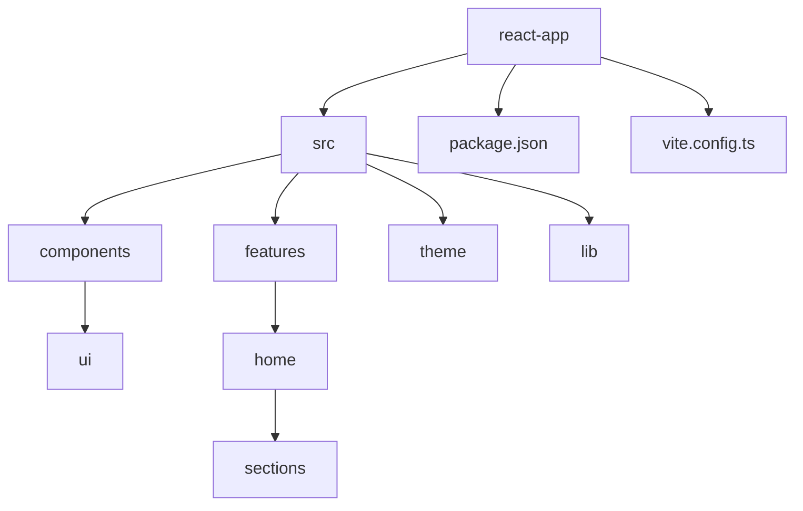
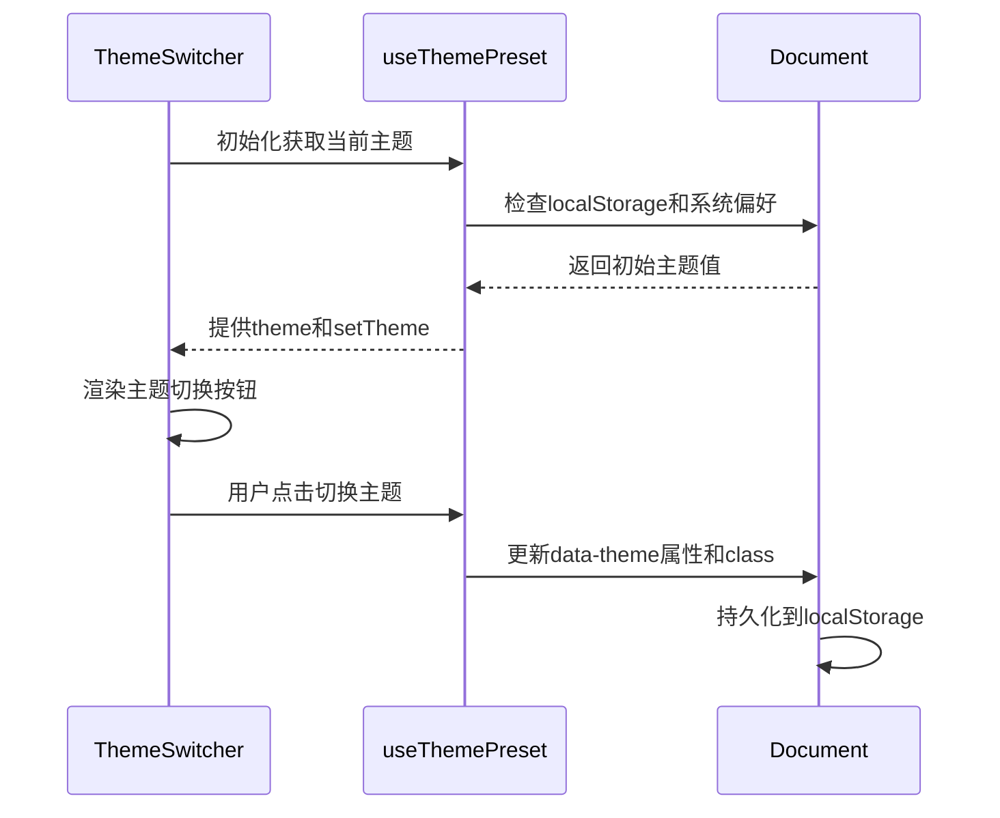
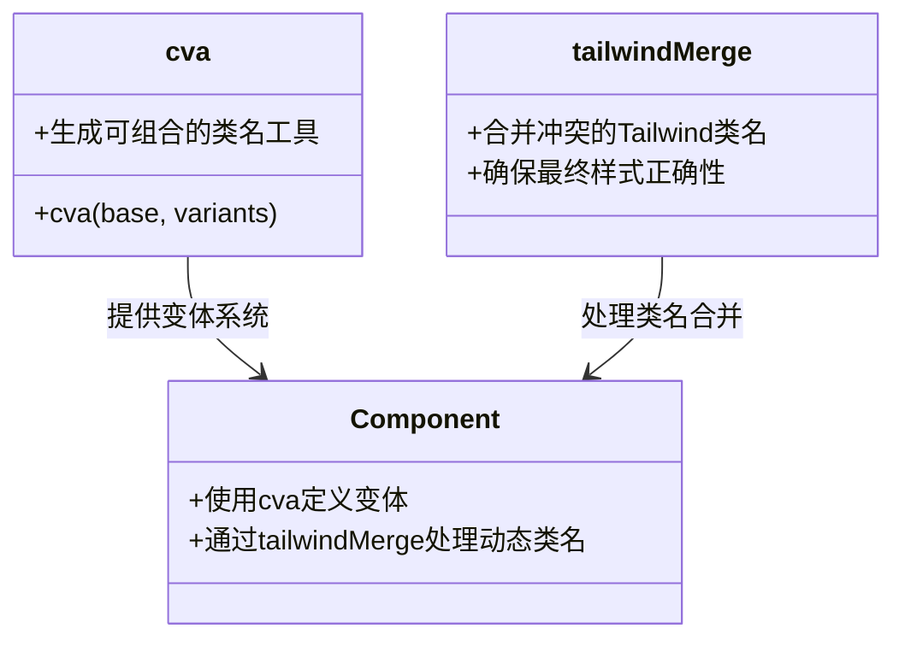

# React框架集成

<cite>
**本文档中引用的文件**  
- [package.json](file://apps/react-app/package.json)
- [vite.config.ts](file://apps/react-app/vite.config.ts)
- [App.tsx](file://apps/react-app/src/App.tsx)
- [github-link.tsx](file://apps/react-app/src/components/github-link.tsx)
- [badge.tsx](file://apps/react-app/src/components/ui/badge.tsx)
- [OverviewGrid.tsx](file://apps/react-app/src/features/home/sections/OverviewGrid.tsx)
- [use-theme-preset.ts](file://apps/react-app/src/theme/use-theme-preset.ts)
- [ThemeSwitcher.tsx](file://apps/react-app/src/theme/ThemeSwitcher.tsx)
</cite>

## 目录
1. [项目结构](#项目结构)
2. [核心组件](#核心组件)
3. [状态管理与Tailwind动态样式组合](#状态管理与tailwind动态样式组合)
4. [PostCSS插件链配置](#postcss插件链配置)
5. [React的CSS-in-JS与Tailwind兼容性](#react的css-in-js与tailwind兼容性)

## 项目结构

该项目使用Vite作为构建工具，为React小程序提供Tailwind CSS集成方案。项目结构遵循现代前端最佳实践，采用模块化组织方式。



**Diagram sources**  
- [package.json](file://apps/react-app/package.json)
- [vite.config.ts](file://apps/react-app/vite.config.ts)

**Section sources**  
- [package.json](file://apps/react-app/package.json#L1-L42)
- [vite.config.ts](file://apps/react-app/vite.config.ts#L1-L25)

## 核心组件

项目中的核心组件展示了如何在React中结合Tailwind CSS类名进行开发。通过JSX语法与Tailwind实用类的结合，实现了高度可复用且样式灵活的UI组件。

**Section sources**  
- [App.tsx](file://apps/react-app/src/App.tsx#L1-L39)
- [github-link.tsx](file://apps/react-app/src/components/github-link.tsx#L1-L19)
- [badge.tsx](file://apps/react-app/src/components/ui/badge.tsx#L1-L40)

## 状态管理与Tailwind动态样式组合

项目展示了React状态管理与Tailwind样式的动态组合。通过`useThemePreset`自定义Hook管理主题状态，并根据状态动态应用Tailwind类名实现主题切换功能。



**Diagram sources**  
- [use-theme-preset.ts](file://apps/react-app/src/theme/use-theme-preset.ts#L1-L32)
- [ThemeSwitcher.tsx](file://apps/react-app/src/theme/ThemeSwitcher.tsx#L1-L46)

**Section sources**  
- [use-theme-preset.ts](file://apps/react-app/src/theme/use-theme-preset.ts#L1-L32)
- [ThemeSwitcher.tsx](file://apps/react-app/src/theme/ThemeSwitcher.tsx#L1-L46)

## PostCSS插件链配置

项目通过Vite插件系统集成Tailwind CSS。在`vite.config.ts`中配置了`@tailwindcss/vite`插件，确保Tailwind生成的CSS能被正确处理和注入小程序环境。

```mermaid
flowchart TD
A[源代码] --> B{包含Tailwind类名}
B --> C[Vite构建]
C --> D[@tailwindcss/vite插件]
D --> E[Tailwind CSS处理]
E --> F[生成小程序兼容CSS]
F --> G[注入小程序]
G --> H[最终产物]
```

**Diagram sources**  
- [vite.config.ts](file://apps/react-app/vite.config.ts#L1-L25)

**Section sources**  
- [vite.config.ts](file://apps/react-app/vite.config.ts#L1-L25)

## React的CSS-in-JS与Tailwind兼容性

本项目采用Tailwind实用类而非CSS-in-JS方案。通过`class-variance-authority`（cva）和`tailwind-merge`等工具库，实现了类似CSS-in-JS的变体系统，同时保持了与Tailwind的完全兼容性。



**Diagram sources**  
- [badge.tsx](file://apps/react-app/src/components/ui/badge.tsx#L1-L40)
- [package.json](file://apps/react-app/package.json#L1-L42)

**Section sources**  
- [badge.tsx](file://apps/react-app/src/components/ui/badge.tsx#L1-L40)
- [package.json](file://apps/react-app/package.json#L14-L15)