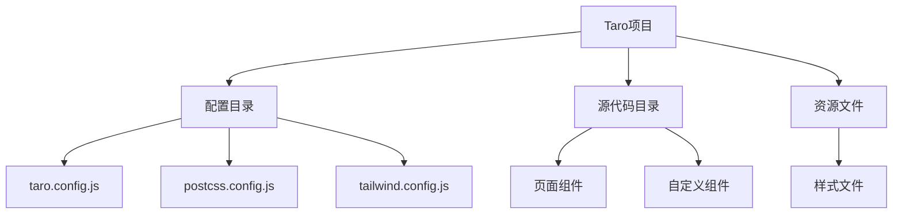
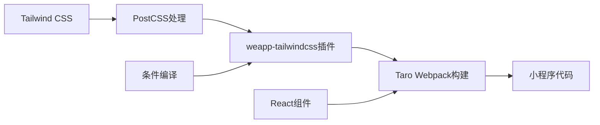
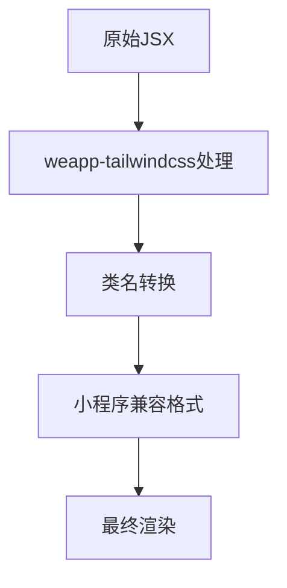
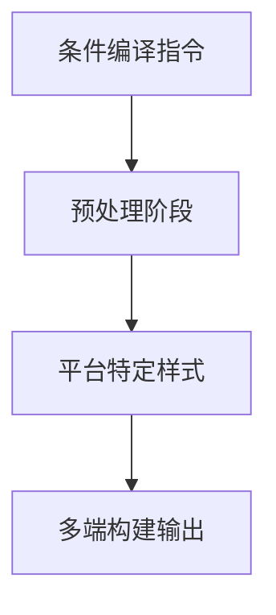
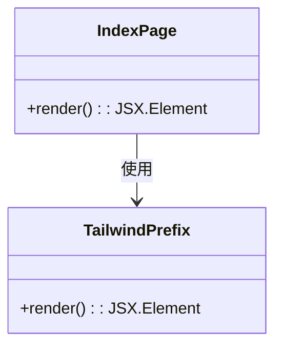

# Taro框架集成

<cite>
**本文档中引用的文件**  
- [taro-app/package.json](file://demo/taro-app/package.json)
- [taro-app/tailwind.config.js](file://demo/taro-app/tailwind.config.js)
- [taro-app/postcss.config.js](file://demo/taro-app/postcss.config.js)
- [taro-app/config/index.js](file://demo/taro-app/config/index.js)
- [taro-app/src/pages/index/index.tsx](file://demo/taro-app/src/pages/index/index.tsx)
- [taro-app/src/components/TailwindPrefix.tsx](file://demo/taro-app/src/components/TailwindPrefix.tsx)
- [taro-app/src/pages/debug/index.tsx](file://demo/taro-app/src/pages/debug/index.tsx)
- [taro-webpack-tailwindcss-v4/package.json](file://apps/taro-webpack-tailwindcss-v4/package.json)
- [weapp-tailwindcss/src/index.ts](file://packages/weapp-tailwindcss/src/index.ts)
</cite>

## 目录
1. [简介](#简介)
2. [项目结构](#项目结构)
3. [核心组件](#核心组件)
4. [架构概述](#架构概述)
5. [详细组件分析](#详细组件分析)
6. [依赖分析](#依赖分析)
7. [性能考虑](#性能考虑)
8. [故障排除指南](#故障排除指南)
9. [结论](#结论)

## 简介
本文档详细说明了如何在Taro项目中集成和使用weapp-tailwindcss。涵盖了从项目初始化、依赖安装、配置设置到多端构建的完整流程，并提供了实际代码示例和最佳实践。

## 项目结构
Taro项目结构遵循标准的Taro框架布局，包含配置文件、源代码和资源文件。



**图示来源**
- [taro-app/config/index.js](file://demo/taro-app/config/index.js#L1-L157)
- [taro-app/src/pages/index/index.tsx](file://demo/taro-app/src/pages/index/index.tsx#L1-L72)

**节来源**
- [taro-app/config/index.js](file://demo/taro-app/config/index.js#L1-L157)
- [taro-app/src/pages/index/index.tsx](file://demo/taro-app/src/pages/index/index.tsx#L1-L72)

## 核心组件
本节分析Taro项目中与weapp-tailwindcss集成的核心组件，包括配置文件和主要页面组件。

**节来源**
- [taro-app/package.json](file://demo/taro-app/package.json#L1-L107)
- [taro-app/tailwind.config.js](file://demo/taro-app/tailwind.config.js#L1-L35)
- [taro-app/postcss.config.js](file://demo/taro-app/postcss.config.js#L1-L45)

## 架构概述
Taro框架通过webpack插件机制与weapp-tailwindcss集成，实现Tailwind CSS在小程序环境中的完整支持。



**图示来源**
- [taro-app/config/index.js](file://demo/taro-app/config/index.js#L63-L130)
- [weapp-tailwindcss/src/index.ts](file://packages/weapp-tailwindcss/src/index.ts#L1-L5)

## 详细组件分析
本节深入分析关键组件的实现细节和配置方式。

### 页面组件分析
分析Taro页面组件如何使用Tailwind类名和处理JSX语法兼容性。

#### JSX语法兼容性


**图示来源**
- [taro-app/src/pages/index/index.tsx](file://demo/taro-app/src/pages/index/index.tsx#L1-L72)
- [taro-app/src/pages/debug/index.tsx](file://demo/taro-app/src/pages/debug/index.tsx#L1-L20)

#### 条件编译处理


**图示来源**
- [taro-app/config/index.js](file://demo/taro-app/config/index.js#L83-L111)
- [taro-app/src/pages/index/index.tsx](file://demo/taro-app/src/pages/index/index.tsx#L30-L31)

### 自定义组件分析
分析自定义组件中Tailwind类名的应用和传递。



**图示来源**
- [taro-app/src/components/TailwindPrefix.tsx](file://demo/taro-app/src/components/TailwindPrefix.tsx#L1-L8)
- [taro-app/src/pages/index/index.tsx](file://demo/taro-app/src/pages/index/index.tsx#L8)

**节来源**
- [taro-app/src/components/TailwindPrefix.tsx](file://demo/taro-app/src/components/TailwindPrefix.tsx#L1-L8)
- [taro-app/src/pages/index/index.tsx](file://demo/taro-app/src/pages/index/index.tsx#L1-L72)

## 依赖分析
分析项目中的关键依赖关系和版本配置。

```mermaid
dependencyGraph
"weapp-tailwindcss" --> "tailwindcss"
"weapp-tailwindcss" --> "postcss"
"taro" --> "weapp-tailwindcss"
"tailwindcss" --> "autoprefixer"
```

**图示来源**
- [taro-app/package.json](file://demo/taro-app/package.json#L40-L94)
- [taro-webpack-tailwindcss-v4/package.json](file://apps/taro-webpack-tailwindcss-v4/package.json#L49-L94)

**节来源**
- [taro-app/package.json](file://demo/taro-app/package.json#L1-L107)
- [taro-webpack-tailwindcss-v4/package.json](file://apps/taro-webpack-tailwindcss-v4/package.json#L1-L96)

## 性能考虑
在Taro项目中使用weapp-tailwindcss时，需要注意以下性能优化点：
- 合理配置content扫描范围，避免不必要的文件处理
- 使用rem2rpx转换优化小程序样式渲染
- 在生产环境中启用代码压缩和优化
- 避免在条件编译中重复定义相同的样式规则

## 故障排除指南
本节提供常见问题的解决方案。

**节来源**
- [taro-app/config/index.js](file://demo/taro-app/config/index.js#L63-L130)
- [taro-app/tailwind.config.js](file://demo/taro-app/tailwind.config.js#L1-L35)

### 样式不生效
- 检查tailwind.config.js中的content配置是否包含正确的文件路径
- 确认postcss.config.js正确引入了tailwindcss插件
- 验证类名是否符合小程序的命名规范

### 构建失败
- 检查weapp-tailwindcss插件是否正确安装和配置
- 确认Taro CLI版本与插件兼容
- 查看webpackChain配置是否正确应用了插件

## 结论
通过本文档的指导，开发者可以成功在Taro项目中集成weapp-tailwindcss，实现高效的样式开发和多端构建。关键在于正确配置插件、理解JSX语法兼容性处理以及合理使用条件编译功能。