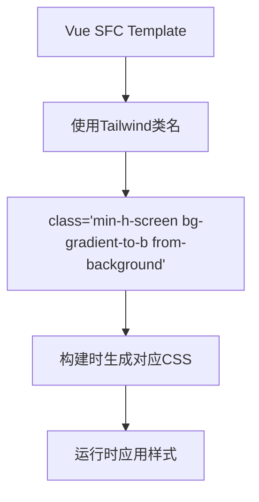
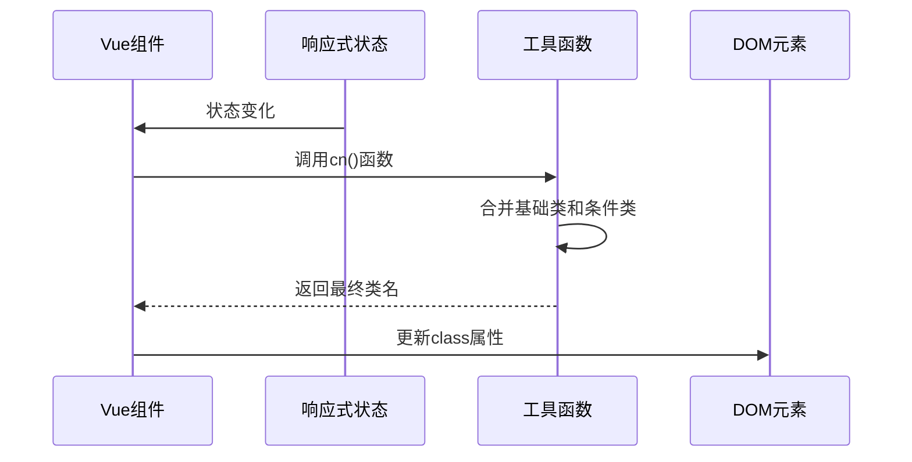

# Vue框架集成

<cite>
**本文档中引用的文件**  
- [package.json](file://apps/vue-app/package.json)
- [vite.config.ts](file://apps/vue-app/vite.config.ts)
- [postcss.config.mjs](file://apps/vue-app/postcss.config.mjs)
- [App.vue](file://apps/vue-app/src/App.vue)
- [Button.vue](file://apps/vue-app/src/components/ui/button/Button.vue)
- [UtilityFirstDemo.vue](file://apps/vue-app/src/features/history/UtilityFirstDemo.vue)
- [utils.ts](file://apps/vue-app/src/lib/utils.ts)
- [useThemePreset.ts](file://apps/vue-app/src/features/home/useThemePreset.ts)
- [weapp-tailwindcss/package.json](file://packages/weapp-tailwindcss/package.json)
</cite>

## 目录
1. [项目初始化](#项目初始化)
2. [依赖安装](#依赖安装)
3. [Vite插件配置](#vite插件配置)
4. [PostCSS配置](#postcss配置)
5. [Tailwind配置](#tailwind配置)
6. [在Vue单文件组件中使用Tailwind](#在vue单文件组件中使用tailwind)
7. [响应式类名切换](#响应式类名切换)
8. [样式隔离与共存策略](#样式隔离与共存策略)
9. [构建优化与JIT编译](#构建优化与jit编译)

## 项目初始化

使用Vite创建Vue 3项目是集成weapp-tailwindcss的基础步骤。通过Vite的模板系统可以快速搭建支持TypeScript的Vue项目结构，为后续的Tailwind集成提供标准的开发环境。

**Section sources**
- [package.json](file://apps/vue-app/package.json#L1-L33)

## 依赖安装

在Vue项目中集成weapp-tailwindcss需要安装核心的Tailwind相关依赖。项目通过`package.json`定义了必要的开发依赖，包括Tailwind CSS本身、PostCSS处理工具以及Vite的Vue插件。这些依赖共同构成了原子化CSS的工作基础。

**Section sources**
- [package.json](file://apps/vue-app/package.json#L1-L33)

## Vite插件配置

Vite配置文件`vite.config.ts`定义了项目的基本构建行为。该配置通过`@vitejs/plugin-vue`插件支持Vue单文件组件，并设置了路径别名`@`指向源码目录，便于模块导入。虽然当前配置未直接包含weapp-tailwindcss插件，但其基础结构为后续集成提供了必要的扩展点。

**Section sources**
- [vite.config.ts](file://apps/vue-app/vite.config.ts#L1-L18)

## PostCSS配置

PostCSS配置文件`postcss.config.mjs`指定了CSS处理管道，其中关键地引入了`@tailwindcss/postcss`插件。此配置确保了Tailwind的CSS处理能力被正确集成到构建流程中，使原子类名能够被正确解析和生成。

**Section sources**
- [postcss.config.mjs](file://apps/vue-app/postcss.config.mjs#L1-L6)

## Tailwind配置

虽然当前项目中未找到`tailwind.config.js`文件，但根据weapp-tailwindcss包的结构，Tailwind配置应包含内容扫描路径、主题定制和插件扩展等关键设置。典型的配置需要指定Vue模板文件作为内容源，以确保JIT编译器能正确识别和生成所需的原子类名。

## 在Vue单文件组件中使用Tailwind

Vue单文件组件(SFC)中可以无缝使用Tailwind类名。在`App.vue`等组件中，开发者可以直接在template的class属性中使用Tailwind的实用类，如`bg-gradient-to-b`、`text-foreground`等，实现快速的样式布局。这种模式充分利用了Tailwind的原子化特性，使样式定义更加直观和可维护。

**Diagram sources**
- [App.vue](file://apps/vue-app/src/App.vue#L1-L40)

**Section sources**
- [App.vue](file://apps/vue-app/src/App.vue#L1-L40)
- [StageDemos.vue](file://apps/vue-app/src/features/history/StageDemos.vue#L1-L55)
- [StyleComparisonSection.vue](file://apps/vue-app/src/features/home/StyleComparisonSection.vue#L1-L35)

## 响应式类名切换

在Vue的响应式系统中，可以通过计算属性和动态绑定实现Tailwind类名的动态切换。`UtilityFirstDemo.vue`展示了如何结合`cva`（Class Variant Authority）和`tailwind-merge`来创建可变体的UI组件。通过`computed`属性和`cn`工具函数，可以根据组件状态智能合并和切换类名，实现复杂的响应式设计。

**Diagram sources**
- [UtilityFirstDemo.vue](file://apps/vue-app/src/features/history/UtilityFirstDemo.vue#L1-L120)
- [utils.ts](file://apps/vue-app/src/lib/utils.ts#L1-L8)

**Section sources**
- [UtilityFirstDemo.vue](file://apps/vue-app/src/features/history/UtilityFirstDemo.vue#L1-L120)
- [utils.ts](file://apps/vue-app/src/lib/utils.ts#L1-L8)
- [Button.vue](file://apps/vue-app/src/components/ui/button/Button.vue#L1-L30)

## 样式隔离与共存策略

Vue的scoped样式与Tailwind的全局样式需要妥善处理以避免冲突。项目通过`reka-ui`等UI库组件和`cn`工具函数实现了样式隔离。`cn`函数结合`clsx`和`tailwind-merge`，确保即使在scoped样式环境下，Tailwind的原子类也能正确应用并优先级管理，避免样式覆盖问题。

**Section sources**
- [Button.vue](file://apps/vue-app/src/components/ui/button/Button.vue#L1-L30)
- [utils.ts](file://apps/vue-app/src/lib/utils.ts#L1-L8)

## 构建优化与JIT编译

weapp-tailwindcss包的配置支持JIT（即时编译）模式，通过精确的内容扫描和按需生成原子类名来优化构建性能。`package.json`中的依赖配置确保了Tailwind的核心功能被正确引入，而Vite的HMR（热模块替换）特性则与JIT编译协同工作，提供快速的开发体验。

**Section sources**
- [weapp-tailwindcss/package.json](file://packages/weapp-tailwindcss/package.json#L1-L215)
- [vite.config.ts](file://apps/vue-app/vite.config.ts#L1-L18)