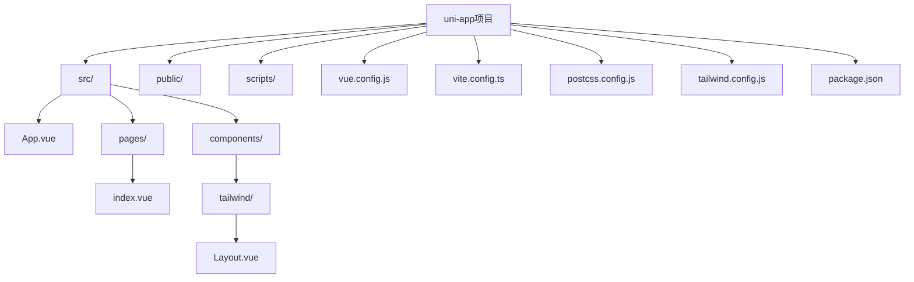
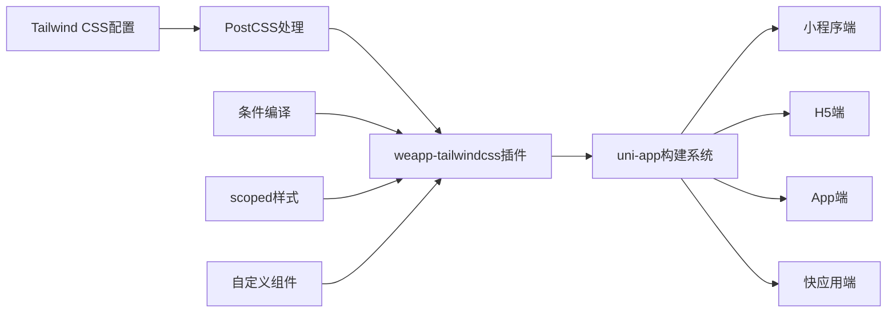
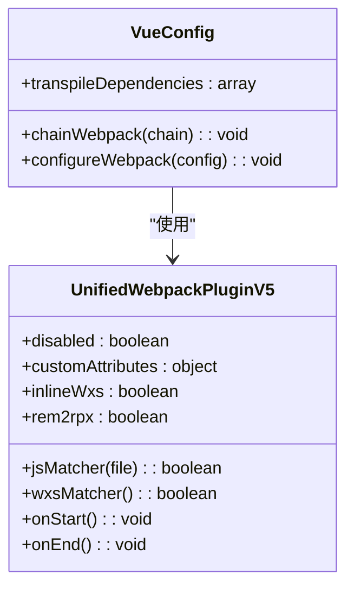
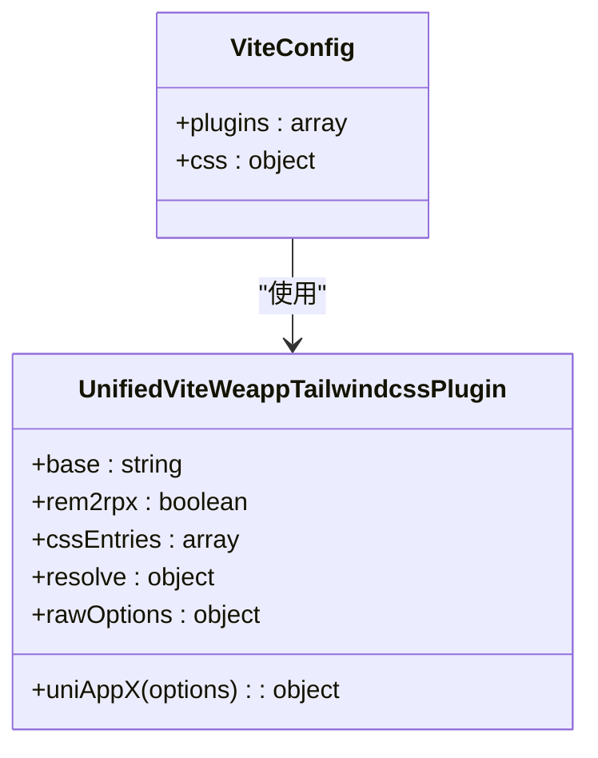
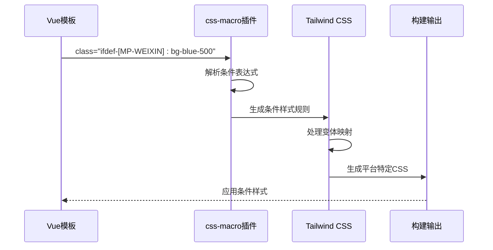

# uni-app框架集成

<cite>
**本文档引用的文件**   
- [vue.config.js](file://demo/uni-app/vue.config.js)
- [postcss.config.js](file://demo/uni-app/postcss.config.js)
- [tailwind.config.js](file://demo/uni-app/tailwind.config.js)
- [package.json](file://demo/uni-app/package.json)
- [vite.config.ts](file://apps/uni-app-x-hbuilderx-tailwindcss3/vite.config.ts)
- [vite.config.ts](file://apps/uni-app-x-hbuilderx-tailwindcss4/vite.config.ts)
- [App.vue](file://demo/uni-app/src/App.vue)
- [index.vue](file://demo/uni-app/src/pages/index/index.vue)
- [platform.js](file://demo/uni-app/platform.js)
- [Layout.vue](file://demo/uni-app/src/components/tailwind/Layout.vue)
</cite>

## 目录
1. [简介](#简介)
2. [项目结构](#项目结构)
3. [核心组件](#核心组件)
4. [架构概述](#架构概述)
5. [详细组件分析](#详细组件分析)
6. [依赖分析](#依赖分析)
7. [性能考虑](#性能考虑)
8. [故障排除指南](#故障排除指南)
9. [结论](#结论)

## 简介
本文档为uni-app框架提供详细的weapp-tailwindcss集成指南。文档涵盖uni-app项目中配置Tailwind CSS的完整流程，包括项目初始化、依赖安装、构建配置、多端适配以及在Vue单文件组件中使用Tailwind类名的最佳实践。通过分析`demo/uni-app/`和`apps/uni-app/`中的实际配置示例，本文档将指导开发者如何在不同构建环境下正确集成Tailwind CSS，并解决scoped样式与全局样式的交互问题。

## 项目结构
uni-app项目结构遵循标准的Vue CLI项目布局，包含源代码目录、配置文件和构建脚本。项目通过不同的配置文件支持多种构建工具（Webpack和Vite）以及不同的Tailwind CSS版本（v3和v4）。



**图示来源**
- [vue.config.js](file://demo/uni-app/vue.config.js#L1-L62)
- [vite.config.ts](file://apps/uni-app-x-hbuilderx-tailwindcss3/vite.config.ts#L1-L40)
- [App.vue](file://demo/uni-app/src/App.vue#L1-L32)

**本节来源**
- [demo/uni-app/](file://demo/uni-app/)
- [apps/uni-app-x-hbuilderx-tailwindcss3/](file://apps/uni-app-x-hbuilderx-tailwindcss3/)

## 核心组件
uni-app集成weapp-tailwindcss的核心组件包括构建配置插件、PostCSS处理管道和Tailwind CSS配置。这些组件协同工作，确保Tailwind CSS能够在uni-app的多端构建环境中正确生成和应用样式。

**本节来源**
- [vue.config.js](file://demo/uni-app/vue.config.js#L1-L62)
- [postcss.config.js](file://demo/uni-app/postcss.config.js#L1-L39)
- [tailwind.config.js](file://demo/uni-app/tailwind.config.js#L1-L37)

## 架构概述
uni-app与weapp-tailwindcss的集成架构基于插件化设计，通过Webpack或Vite插件在构建过程中处理Tailwind CSS。架构支持多端构建，能够根据不同的目标平台（小程序、H5、App等）生成相应的样式代码。



**图示来源**
- [vue.config.js](file://demo/uni-app/vue.config.js#L21-L58)
- [vite.config.ts](file://apps/uni-app-x-hbuilderx-tailwindcss3/vite.config.ts#L10-L29)
- [postcss.config.js](file://demo/uni-app/postcss.config.js#L6-L33)

## 详细组件分析

### Webpack配置分析
在基于Webpack的uni-app项目中，通过`vue.config.js`配置文件集成weapp-tailwindcss插件。配置包括插件注册、JS文件匹配规则、自定义属性定义和构建生命周期钩子。



**图示来源**
- [vue.config.js](file://demo/uni-app/vue.config.js#L11-L58)
- [package.json](file://demo/uni-app/package.json#L127)

**本节来源**
- [vue.config.js](file://demo/uni-app/vue.config.js#L1-L62)
- [platform.js](file://demo/uni-app/platform.js#L1-L11)

### Vite配置分析
在基于Vite的uni-app项目中，通过`vite.config.ts`配置文件集成weapp-tailwindcss插件。配置包括插件注册、预设配置、CSS入口文件定义和PostCSS插件链。



**图示来源**
- [vite.config.ts](file://apps/uni-app-x-hbuilderx-tailwindcss3/vite.config.ts#L10-L25)
- [vite.config.ts](file://apps/uni-app-x-hbuilderx-tailwindcss4/vite.config.ts#L12-L24)

**本节来源**
- [vite.config.ts](file://apps/uni-app-x-hbuilderx-tailwindcss3/vite.config.ts#L1-L40)
- [vite.config.ts](file://apps/uni-app-x-hbuilderx-tailwindcss4/vite.config.ts#L1-L41)

### Tailwind CSS配置分析
Tailwind CSS配置文件定义了内容扫描范围、暗色模式策略、主题扩展、插件和核心功能。配置支持条件编译变体映射，允许在不同平台使用不同的样式规则。

```mermaid
flowchart TD
A[配置文件] --> B[内容扫描]
B --> C[./src/**/*.{vue,js,ts,jsx,tsx,wxml}]
A --> D[暗色模式]
D --> E[media]
A --> F[插件]
F --> G[iconsPlugin]
F --> H[cssMacro]
G --> I[图标集合]
H --> J[变体映射]
J --> K[wx: MP-WEIXIN]
J --> L[-wx: {value: MP-WEIXIN, negative: true}]
J --> M[mv: H5 || MP-WEIXIN]
A --> N[核心功能]
N --> O[preflight: false]
```

**图示来源**
- [tailwind.config.js](file://demo/uni-app/tailwind.config.js#L4-L36)
- [postcss.config.js](file://demo/uni-app/postcss.config.js#L19-L28)

**本节来源**
- [tailwind.config.js](file://demo/uni-app/tailwind.config.js#L1-L37)
- [postcss.config.js](file://demo/uni-app/postcss.config.js#L1-L39)

### 条件编译与Tailwind兼容性
uni-app的条件编译与Tailwind CSS的兼容性通过css-macro插件实现。插件支持ifdef、ifndef以及自定义变体前缀，允许开发者根据不同的平台条件应用样式。



**图示来源**
- [tailwind.config.js](file://demo/uni-app/tailwind.config.js#L16-L31)
- [index.vue](file://demo/uni-app/src/pages/index/index.vue#L3-L11)

**本节来源**
- [tailwind.config.js](file://demo/uni-app/tailwind.config.js#L1-L37)
- [index.vue](file://demo/uni-app/src/pages/index/index.vue#L1-L75)

### scoped样式与全局样式交互
uni-app的scoped样式与Tailwind全局样式的交互通过在App.vue中导入Tailwind基础样式来解决。这种方法确保全局样式优先于scoped样式，同时允许组件内使用Tailwind类名。

```mermaid
flowchart LR
A[App.vue] --> B[@import 'tailwindcss/base']
A --> C[@import 'tailwindcss/components']
A --> D[@import 'tailwindcss/utilities']
B --> E[重置样式]
C --> F[组件样式]
D --> G[工具类样式]
E --> H[全局样式作用域]
F --> H
G --> H
H --> I[组件scoped样式]
I --> J[最终渲染]
```

**图示来源**
- [App.vue](file://demo/uni-app/src/App.vue#L26-L28)
- [Layout.vue](file://demo/uni-app/src/components/tailwind/Layout.vue#L117-L119)

**本节来源**
- [App.vue](file://demo/uni-app/src/App.vue#L1-L32)
- [Layout.vue](file://demo/uni-app/src/components/tailwind/Layout.vue#L1-L122)

## 依赖分析
uni-app项目依赖weapp-tailwindcss及其相关插件来实现Tailwind CSS集成。依赖关系包括核心插件、PostCSS处理器、Webpack/Vite适配器和辅助工具。

```mermaid
graph TD
A[uni-app项目] --> B[weapp-tailwindcss]
A --> C[weapp-style-injector]
A --> D[tailwindcss]
A --> E[autoprefixer]
A --> F[postcss-import]
B --> G[UnifiedWebpackPluginV5]
B --> H[UnifiedViteWeappTailwindcssPlugin]
B --> I[css-macro]
G --> J[Webpack]
H --> K[Vite]
F --> L[路径解析]
L --> M[@/别名]
L --> N[~@/别名]
```

**图示来源**
- [package.json](file://demo/uni-app/package.json#L127-L128)
- [vue.config.js](file://demo/uni-app/vue.config.js#L3-L4)
- [vite.config.ts](file://apps/uni-app-x-hbuilderx-tailwindcss3/vite.config.ts#L6-L7)

**本节来源**
- [package.json](file://demo/uni-app/package.json#L1-L147)
- [vue.config.js](file://demo/uni-app/vue.config.js#L1-L62)

## 性能考虑
在uni-app中集成weapp-tailwindcss时，需要考虑构建性能和运行时性能。通过合理配置内容扫描范围、禁用不必要的插件功能和优化构建流程，可以显著提升开发体验和应用性能。

建议在H5和App平台禁用weapp-tailwindcss插件，以避免不必要的处理开销。同时，通过配置`rem2rpx`选项，可以实现像素单位的自动转换，提高开发效率。

## 故障排除指南
当遇到weapp-tailwindcss集成问题时，可以参考以下常见问题的解决方案：

1. **样式未生效**：检查`tailwind.config.js`中的`content`配置是否包含正确的文件路径。
2. **条件编译失效**：确认`css-macro`插件已正确配置变体映射。
3. **构建性能低下**：检查是否在H5或App平台错误地启用了weapp-tailwindcss插件。
4. **scoped样式冲突**：确保在App.vue中正确导入了Tailwind的基础、组件和工具类样式。

**本节来源**
- [tailwind.config.js](file://demo/uni-app/tailwind.config.js#L5)
- [platform.js](file://demo/uni-app/platform.js#L4)
- [App.vue](file://demo/uni-app/src/App.vue#L26-L28)

## 结论
通过本文档的指导，开发者可以成功在uni-app项目中集成weapp-tailwindcss，实现高效的跨平台样式开发。关键要点包括正确配置构建工具插件、合理设置Tailwind CSS配置、处理scoped样式与全局样式的交互，以及利用条件编译实现平台特定的样式定制。这些实践将帮助开发者构建出既美观又高效的跨平台应用。